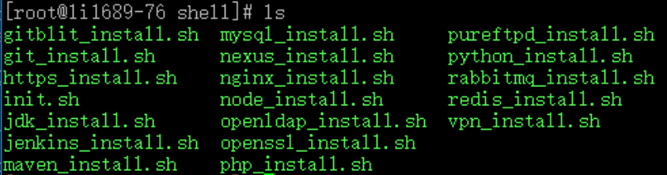

​



每次配置新服务器都是一件枯燥痛苦的事情，要记住各种命令。懒人总有懒法子，下面把常用的工具安装过程都写成自动化脚本，只要复制粘贴，剩下的就是和咖啡的时间了。

前提：下面所有脚本都基于centos7，其他发行版的linux没有经过测试，不一定成功。首先得执行环境初始化脚本，默认会创建一个isp用户，所有工具将会安装在/home/isp/apps目录下。

用法：直接将脚本复制并在shell任意路径上执行即可。

1、环境初始化

```shell
bash <(curl -s -S -L http://install.chcbz.net/shell/init.sh)
```

2、升级openssl

```shell
bash <(curl -s -S -L http://install.chcbz.net/shell/openssl_install.sh)
```

3、安装nginx

```shell
bash <(curl -s -S -L http://install.chcbz.net/shell/nginx_install.sh)
```

4、安装mysql

```shell
bash <(curl -s -S -L http://install.chcbz.net/shell/mysql_install.sh)
```

5、安装rabbitmq

```shell
bash <(curl -s -S -L http://install.chcbz.net/shell/rabbitmq_install.sh)
```

6、安装JDK

```shell
bash <(curl -s -S -L http://install.chcbz.net/shell/jdk_install.sh)
```

7、安装maven

```shell
bash <(curl -s -S -L http://install.chcbz.net/shell/maven_install.sh)
```

8、安装redis

```shell
bash <(curl -s -S -L http://install.chcbz.net/shell/redis_install.sh)
```

9、安装git

```shell
bash <(curl -s -S -L http://install.chcbz.net/shell/git_install.sh)
```

10、安装jenkins

```shell
bash <(curl -s -S -L http://install.chcbz.net/shell/jenkins_install.sh)
```

11、安装pureftpd

```shell
bash <(curl -s -S -L http://install.chcbz.net/shell/pureftpd_install.sh)
```

12、安装gitblit

```shell
bash <(curl -s -S -L http://install.chcbz.net/shell/gitblit_install.sh)
```

13、安装php

```shell
bash <(curl -s -S -L http://install.chcbz.net/shell/php_install.sh)
```

14、安装openldap

```shell
bash <(curl -s -S -L http://install.chcbz.net/shell/openldap_install.sh)
```

15、安装node

```shell
bash <(curl -s -S -L http://install.chcbz.net/shell/node_install.sh)
```

16、安装python

```shell
bash <(curl -s -S -L http://install.chcbz.net/shell/python_install.sh)
```

17、安装nexus

```shell
bash <(curl -s -S -L http://install.chcbz.net/shell/nexus_install.sh)
```
