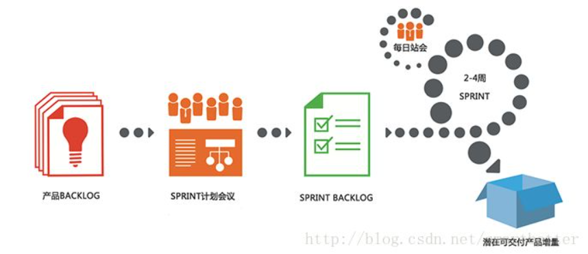
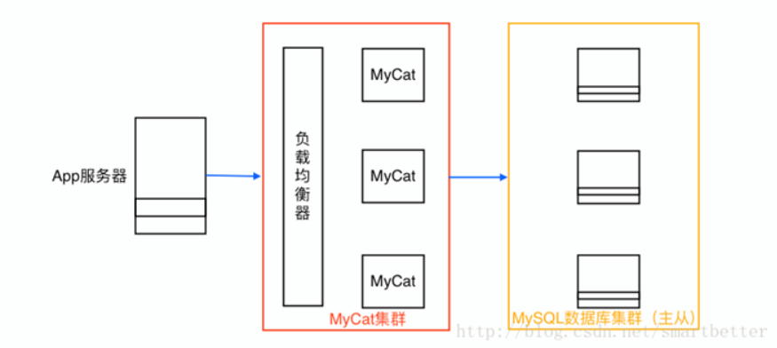
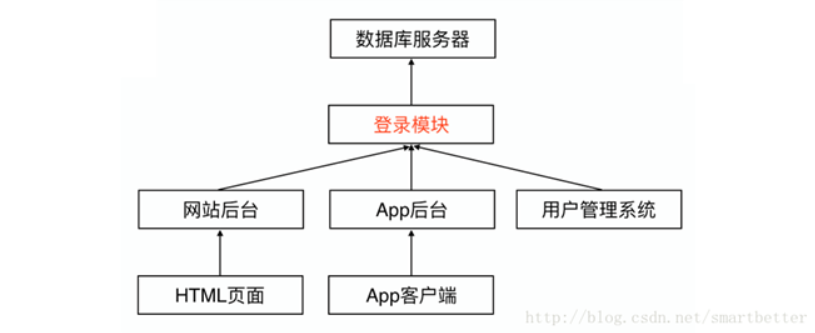

​

## 前言

说起架构，我们先看一下何为架构，百度百科是这样说的：架构，又名软件架构，是有关软件整体结构与组件的抽象描述，用于指导大型软件系统各个方面的设计。那么我们也可以看出，架构是和业务紧密相关的，是由业务驱动的。

由于App客户端的特性，因此App后台对技术实现和一般的Web后台是有区别的。首先看一个适合App开发的开发模式：

## 敏捷开发模式

这里推荐Scrum这个敏捷开发框架，具体可以查看Scrum官网学习使用，这里只是引入。

Scrum流程如下图：

## 选择合适的数据库产品和服务器系统

数据库产品众多，这里我就针对Redis、MongoDB、MySQL还有MySQL的分支MariaDB展开说明：

### 1. 数据库产品

数据库 | 数据存放位置 | 查找数据的区别
--- | --- | ---
Redis | 内存 | 基于键值对存储，读写速度快
MongoDB | 同时使用了硬盘和内存 | 每个数据有一个id（索引），知道id（索引）查询速度快，不知道id（索引）效率低
MySQL（MongoDB） | 硬盘 | 每个数据有一个id（索引），知道id（索引）查询速度快，不知道id（索引）效率低

然后根据不同的产品需求选择恰当的数据库产品，如果没有特殊的需求，Redis做缓存系统，MySQL 或 MariaDB 做数据库（常见的设置是数据库默认字符集utf8，默认排序utf8_general_ci）将会是很好的选择。

软件优化：

- 正确使用MyISAM和InnoDB存储引擎
- 正确使用索引
- 避免使用 select *
- 字段尽可能的设置非NULL

硬件优化：

- 增加物理内存
- 增加应用缓存
- 使用SSD硬盘

架构优化：

- 分表
- 读写分离

- 分库（把一张表的数据分别存储在不同的数据库，可用MyCat实现，MyCat，关系型数据库分布式处理软件）。

MyCat以代理服务器的形式位于App服务器和后台数据库之间，对外开放的接口是MySQL通信协议，将App服务器传过来的sql语句按照路由的规则拆解转发到不同的后台数据库，并把结果汇总返回。

MyCat部署模型如下：

### 2. 服务器系统

CentOS 则是一个不错的选择。关于服务器的部署，我在之前已经介绍过了，地址如下：

[Nginx + Tomcat 反向代理负载均衡集群部署指南](http://blog.csdn.net/smartbetter/article/details/53535435)  
[Nginx + Tomcat 反向代理如何在高效的在一台服务器部署多个站点](http://blog.csdn.net/smartbetter/article/details/53615313)

下面补充两个常见的Linux命令：

top           显示系统资源情况  
netstat       查看网络相关信息

## 选择合适的消息队列软件

当后台系统发现完成某些小任务需要花费很多时间，而且迟点晚成也不影响整个任务的完成进度时，就会把这些小任务交给消息队列。例如发送邮件、短信、推送消息等任务都非常适合在消息队列中处理。

把这些任务放在消息队列中，可加快App后台请求都响应时间。同时消息队列也能把大量的并发请求变成串行的请求，来减轻服务器的负担。

 常见的消息队列软件有：

消息队列软件 | 说明
--- | ---
RabbitMQ | 重量级，适合企业级的开发，自带Web监控界面，方便监控队列的情况
Redis | 轻量级，是一个key-value系统，但是也支持消息队列这种数据结构，App后台中Redis被广泛使用
ZeroMQ | 号称最快，尤其针对大吞吐量的需求场景
ActiveMQ | Apache的一个子项目，能够以代理人和点对点的技术实现队列

## 使用分布式服务实现业务的复用

随着业务不断增加，后台系统由一个单一应用膨胀为一个巨无霸系统，系统中聚合了大量的应用和服务，各个模块之间有很多功能重复实现（例如登录模块），造成了开发、运维、部署的麻烦。

大量应用中的重复模块会带来大量的访问，而每个应用与数据库的连接，一般是使用数据库的连接池，这个连接池的资源一般是不释放且一直保留着。假设连接池中有10个连接，中一个数百的服务器集群中，就占用了数据库1000个连接。数据库中的每个连接都是十分珍贵的资源，在资源有限的情况下，这里被占用了，其他能用的资源就少了。

解决这些问题的方法就是把重复实现的模块独立部署为远程服务，新增的业务调用远程服务所提供的功能实现相关的业务，不依赖于里面具体的代码实现。

实现远程服务可以参考 REST设计原则和 RPC远程调用协议。

开源的RPC库有：

开源的RPC库 | 说明
--- | ---
Hprose | 轻量级、跨语言、跨平台、无侵入式、高性能动态远程对象调用引擎库
Dubbo | 分布式服务框架，致力于提供高性能和透明化的RPC远程调用服务和SOA服务治理方案

## 用户验证方案最佳实践

App操作中经常涉及用户登录操作，登录就需要使用到用户名和密码，为了安全起见，在登录过程中暴漏密码的次数越少越好。

### 1. 使用HTTPS协议

HTTPS协议是 HTTP协议和 SSL／TLS协议的组合。其是一个安全通信通道，基于HTTP开发，用于在客户计算机和App后台之间交换信息。其使用安全套接字层（SSL）进行信息交换，简单来说就是HTTP的安全版。

HTTPS实际上应用了安全套接字层（SSL）作为HTTP应用层的子层。

HTTPS的模型：

| HTTP |
| :-: |
| SSL／TLS（安全套接字层／传输层安全协议） |
| TCP |
| IP |
| 网络传输 |

避免信息的泄漏，最基本的方案是所有涉及安全性的API请求都必须使用HTTPS协议。

### 2. 选择JSON作为数据交换格式

JSON是一种轻量级的数据交换格式，采用完全独立于语言的文本格式，易于编写，也易于机器解析和生成，而且对比XML更省流量，这些特性使得JSON成为理想的数据交换语言。

### 3. 基本的用户验证方案

传统Web网站使用Cookie+Session保持用户的登录状态，App后台则使用token进行验证，流程如下：

此时App已经获取到了token值，为了安全，我们不在网络上传输token，而使用签名校验（这里使用URL签名）的方式，API请求加上URL签名sign和用户id后如下：

`test.com/user/update?uid=2&sign=3f1e736bc4ae958ae7e8500b45aefdbb&age=22`

这样，token就不需要附在URL上了。App后台签名校验流程如下：

还有的童鞋喜欢设置时间戳，这样时间一长，URL就失效了，也是一种不错的进一步的优化方案。

*建议：为了保障数据安全，这里建议**同时使用 HTTPS 和签名校验。***

## App后台架构的演进原则

App后台的架构是由业务规模驱动而演进的，App后台是为业务服务的，App后台的价值在于能为业务提供其所需要的功能，不应过度设计。

从项目的角度，当App访问量不大时，应该快速搭建App后台，让App尽快上线给用户提供服务，验证商业模式的正确性，同时快速迭代产品。

当App访问量不断上升，这时要在保证快速迭代的前提下，同时兼顾高性能和高可用。

当App访问量达到一定阶段后，增长曲线就会放缓，但业务变得更加复杂，对高性能和高可用的要求也更高，性能问题、模块间的耦合、代码的复杂性会更加突出和明显，这时要使用业务拆分、分布式服务调用，甚至是技术转型等问题。

### 1. 项目启动时——单机部署

我们看一个App后台极简化的架构：

一开始就使用Redis的好处：

既能用作缓存，又能充当队列服务，而且并发性能高，能在长时间内应对业务压力，非常适合初期的项目。

这里使用Redis验证用户信息，充当消息队列。

而文件服务初期可以选择文件云存储服务，或者自己搭建一个资源服务器。

### 2. 项目一定规模时——分布式部署

我们看一个百万级到千万级的架构：

这里新增了专门用于连接内部服务器的SSH服务的外网通道，保证SSH操作随时可用，同时加入了服务器集群，提供负载能力。

随着业务的发展，某些数据表的规模会以几何级增长，当数据达到一定规模时，查询读取性能就下降的厉害，数据库主从的架构不能应对业务上的读写压力，这时架构上要考虑分表（水平拆分／垂直拆分）。

当业务继续不断发展，数据库分表后的读写性能也可能没法满足业务上的需求，这时只能采用进一步的拆分策略——分库。用 Cobar 或者 MyCat 等关系型数据等分布式处理系统后，分库后的架构如下：

下来看一个真实社交App项目所采用的后台架构方案。

## 社交 App 后台架构设计方案分享

场景：类似微博，用户与用户之间存在关注／粉丝两种关系，一个用户发表了新内容，关注他的用户也能在个人主页上收到最新的动态。类似微博这种场景：

社交核心功能是 Feed（指用户通过关注，聚合了被关注用户的最新的内容，也包含自己的内容，以供自己浏览的信息服务）。

### 1. Feed 基本表结构

常见的 Feed 架构是把数据存储在 MySQL，热点数据存储（一般最近3天）在缓存（Redis／Memcached），保证绝大多数请求通过缓存直接返回，只有少量请求穿透缓存落到数据库。

下面看一下最简单的 Feed 表结构：

- send_content：发送内容表，存储用户发表的内容：

  字段 | 说明
  --- | ---
  feed_id | 发表的feed的id，主键自增
  author_id | 发表该feed的用户id
  content | feed的内容

- reveive_content：接收内容表，用于推模式时存储用户接收的内容：

  字段 | 说明
  --- | ---
  feed_id | 发表的feed的id，主键自增
  author_id | 发表该feed的用户id
  reveive_id | 接收该feed的用户id
  content | feed的内容

- followings：关注表，存储用户关注的人：

  字段 | 说明
  --- | ---
  id | 主键自增
  uid | 用户id
  following_id | 该用户关注的其他用户id

- followers：粉丝表，存储用户的粉丝：

  字段 | 说明
  --- | ---
  id | 主键自增
  uid | 用户id
  follower_id | 关注该用户的用户id

### 2. Feed 推拉模式——推模式用户发表一条内容的流程

- uid为1的用户发表一条内容 “HelloWorld” 信息。
- 这条内容写入发送内容表 “send_content” 后内容如下：

  feed_id | author_id | content
  --- | --- | ---
  1 | 1 | HelloWorld

- 在粉丝表 “followers” 查找uid为1用户的粉丝，粉丝表 “followers” 的内容如下：

  id | uid | follower_id
  --- | --- | ---
  1 | 1 | 2

  可知，id为1用户的粉丝是id为2的用户。

- 因为id为2的用户的feed中需要显示这条内容，因此把内容写入接收内容表 “reveive_content”，写入后接受内容表 “reveive_content” 内容如下：

  feed_id | author_id | reveive_id | content
  --- | --- | --- | ---
  1 | 1 | 2 | HelloWorld

- 当id为2的用户显示feed时，通过sql语句 “select * from reveive_content where reveive_id=2” 就能查询该用户需要显示的数据了。

推模式的缺点是：

推送人数过大会出现延时，而且浪费存储空间；

更新操作成本大，不但变更 “send_content” 表，而且需要同步变更 “reveive_content” 表。

### 3. Feed 推拉模式——拉模式用户发表一条内容的流程

- uid为5的用户发表一条内容 “Thinks” 信息。
- 这条内容写入发送内容表 “send_content” 后内容如下：

  feed_id | author_id | content
  --- | --- | ---
  1 | 1 | HelloWorld
  2 | 5 | Thinks

- 当uid为10的用户显示feed时，在关注表 “followings” 查找uid为10所关注的用户，关注表如下：

  id | uid | following_id
  --- | --- | ---
  1 | 10 | 5

  可知，uid为10的用户关注了uid为5的用户，因此需要获取uid为5的用户发表的内容。

- uid为5的用户通过sql语句 “select * from send_content where author_id in (5)” 查询所以需要显示的内容。

由上述可知，拉模式采用了时间换空间的策略，用户推送内容时效率很高，但当用户显示feed时，需要花费大量的时间在聚合运算上。

 总结：

- | 发表内容 | 显示feed | 变更通知
--- | --- | --- | ---
推模式 | 推送给所有粉丝 | 一个sql语句就能完成 | 变更成本高
拉模式 | 不推送 | 需要大量的聚合运算 | 无变更成本

像 “微博” 中公开的微博采用拉模式，私密性的微博采用推模式。

拉模式最大的问题就是大量的聚合运算，请求的响应时间可能较长，可以通过缓存策略让大部分的请求的响应时间达到2到3毫秒。

## 其他的一些经验

### 1. 高效更新数据——内容的推拉

平常App设计中，如果App需要知道首页是否有内容更新，通过一个轮询机制访问获取数据API，从API是否返回更新的数据得知是否有内容更新，轮询上很典型的拉模式，但是耗电、耗流量。

怎么减少轮询呢？这里给出解决方案是推模式，如下图：

当然不能只用推模式，因为手机环境的复杂性，不能保证数据更新的通知一定能够到达App，所以也要采用轮询的方式定期拉数据，时间间隔设置可以相对长一点，通过这种推拉结合的模式，就能大大减少App访问App后台的频率和传输的数据量。

### 2. 处理表情的一些技巧

表情在MySQL的存储，表情UTF-8编码有的是3个字节，有的是4个字节，所以一般的UTF编码（3个字节）是无法存储表情数据的，常用的解决方案是：

把MySQL升级到5.5以上，然后把字符编码改为utf8mb4_general_ci。

### 3. 可供选择的成熟稳定的开源软件

功能 | 可供选择的开源软件
--- | ---
项目管理软件 | Mantis、BugFree
代码管理软件 | SVN、Git
编程语言 | Java、PHP、Python等
服务器系统 | CentOS、Ubuntu
HTTP／HTTPS服务器 | Nginx、Tomcat、Apache
负载均衡 | Nginx、LVS、HAProxy
邮件服务 | Postfix、Sendmail
消息队列 | RabbitMQ、ZeroMQ、Redis
文件系统 | Fastdfs、mogileFS、TFS
Android推送 | Androidpn、gopush
IOS推送 | Javapns、Pyapns
地理位置查询LBS | MongoDB
聊天 | Openfire、ejobberd
监控 | ngiOS、zabbix
缓存 | Memcache、Redis
关系型数据库 | MySQL、MariaDB、PostgreSQL
NoSQL数据库 | Redis、MongoDB、Cassandra
搜索 | Coreseek、Solr、ElasticSearch
图片处理 | GraphicsMagick、ImageMagick
分布式访问服务 | dubbo、dubbox

### 3. 可供选择的成熟可靠的云服务

对于初创公司还是建议尽可能的使用成熟可靠的云服务和开源软件，自身只专注于业务逻辑。

功能 | 可供选择的云服务
--- | ---
项目管理工具 | Teambition、Tower
代码托管平台 | GitHub、Gitlab、Bitbucket、CSDN CODE、Coding
负载均衡 | 阿里云SLB、腾讯云CLB
邮件服务 | SendCloud、MailGun
消息队列 | 阿里云MNS、腾讯云CMQ
文件系统、图片处理 | 七牛云、阿里云对象存储OSS、腾讯云对象存储COS
Android推送 | 极光、个推、百度推送
IOS推送 | 极光、个推、百度推送
聊天 | 融云、环信
监控 | 监控宝、云服务器自带的监控服务
缓存 | 阿里云缓存服务、腾讯云弹性缓存
关系型数据库 | 阿里云RDS、腾讯云CDB
NoSQL数据库 | 阿里云NoSQL产品、腾讯云NoSQL产品
搜索 | 阿里云开放搜索、腾讯云搜TCS
分布式访问服务 | 阿里云EDAS
防火墙 | 阿里云云盾、腾讯云安全
短信发送 | shareSDK、bmob、Luosimao
社交登录分享 | shareSDK

最后，在移动互联网项目中，产品的研发讲求小步快走，快速迭代。架构的设计也可以遵循同样的思路，喜欢本文的记得顶一下哦！
