​

## 前言

我保证本文是最详尽的 Kubernetes 技术文档，从我在后台排版了这么漫长的时间就能看出来。废话不多说——牢牢占据容器技术统治地位的 Kubernetes，其重要性想必不言而喻。


以下为译文：

为什么银行肯花大价钱雇我做 Kubernetes 如此简单的工作？——我一直很奇怪这一点，因为我觉得任何人都可以在 3 个小时内学会这项技术。

如果你怀疑我说的，就来挑战一下吧！**读完本文，你绝对可以学会如何在 Kubernetes 集群上运行基于微服务的应用程序。**我保证你可以做到，因为我就是这样向我的客户介绍 Kubernetes 的。

本文的教程与其他资源有何不同？有很大不同。大多数的教程都从最简单的内容讲起：Kubernetes 的概念和 kubectl 的命令。本文则是基于读者了解应用程序的开发、微服务和 Docker 容器等基础之上。

本文中，我们会涉及的内容包括：

- 在计算机上运行基于微服务的应用程序；

- 为微服务应用程序的每个服务建立容器映像；

- Kubernetes 的基本介绍；

- 在 Kubernetes 管理的集群内部署基于微服务的应用程序。

通过一步步深入学习，让大家能够领会 Kubernetes 的简单易用。只有你了解它的使用环境时，才能轻松掌握 Kubernetes。废话不多说，我们开始吧。

## 应用程序示范

如下应用程序有一个功能：每次输入接受一个句子；使用文本分析，计算句子所表达的情绪。


从技术的角度看来，这个应用程序包含 3 个微服务，每个都包含特定功能：

- SA-Frontend：前端， Nginx 网络服务器，提供 ReactJS 静态文件；

- SA-WebAp：网络应用， Java 网络应用程序，处理来自前端的请求；

- SA-Logic：逻辑处理， Python 应用程序，执行情感分析。

你需要知道微服务是无法独立工作的，它们引入了“关注点分离”（separation of concerns），但是它们之间依然需要交互。


我们可以通过微服务之间的数据流来描述这种交互：

- 客户端应用程序请求初始页面 index.html（index.html 页面会反过来加载 ReactJS 应用程序的脚本）；

- 用户与应用程序的交互触发到 Spring 网络应用的请求；

- Spring 网络应用将请求发送给 Python 应用做情感分析；

- Python 应用计算情感值，并返回结果；

- Spring 网络应用将结果返回给 React 应用（然后由 React 应用将结果显示给用户）。

点击此处下载这些应用程序的代码：`https://github.com/rinormaloku/k8s-mastery`。现在就可以克隆这个代码仓库，接下来我们要做更加精彩的东西。

## 在计算机上运行基于微服务的应用程序

我们需要启动所需的 3 个服务。让我们从最有意思的部分——前端应用程序开始。

### 设置 React 的本地部署

为了运行 React 应用程序，首先你需要在计算机上安装 NodeJS 和 NPM。安装好这些后，在终端中进入目录 sa-frontend。然后运行如下命令：

```shell
npm install
```

该命令会将 React 应用程序的所有 Javascript 依赖都下载到文件夹 node_modules 中（package.json 文件中定义了所有依赖）。在所有依赖都解决后，运行如下命令：

```shell
npm start
```

这样就可以了！我们运行了 React 应用程序，现在可以通过默认端口 localhost:3000 访问该应用程序了。你可以自由修改代码，并从浏览器中观察即时效果。这里用到了热模块替换（即在运行时用替换模块来减少页面刷新次数）技术，可以减轻前端开发的工作。

### 准备好 React 应用的产品环境

为了搭建产品环境，我们需要建立应用程序的静态网页，并通过网络服务器提供服务。

为了搭建 React 应用程序，首先在终端中进入目录 sa-frontend。然后运行如下命令：

```shell
npm run build
```

该命令会在项目的文件目录中生成一个名叫“build”的文件夹。该文件夹内包含了 ReactJS 应用程序所需的所有静态文件。

### 利用 Nginx 提供静态文件

首先安装并启动 Nginx 网络服务器。然后将 sa-frontend/build 目录内的文件移动到 [nginx安装目录]/html。

如此一来，我们就可以通过 [nginx安装目录]/html/index.html 来访问 index.html 文件了，而它是 Nginx 服务的默认文件。

默认情况下，Nginx 网络服务器会监听端口 80。你可以通过修改 [nginx安装目录]/conf/nginx.conf 文件中的 server.listen 字段来指定不同的端口。

打开浏览器，并访问端口 80，可以看到 ReactJS 应用程序加载成功。

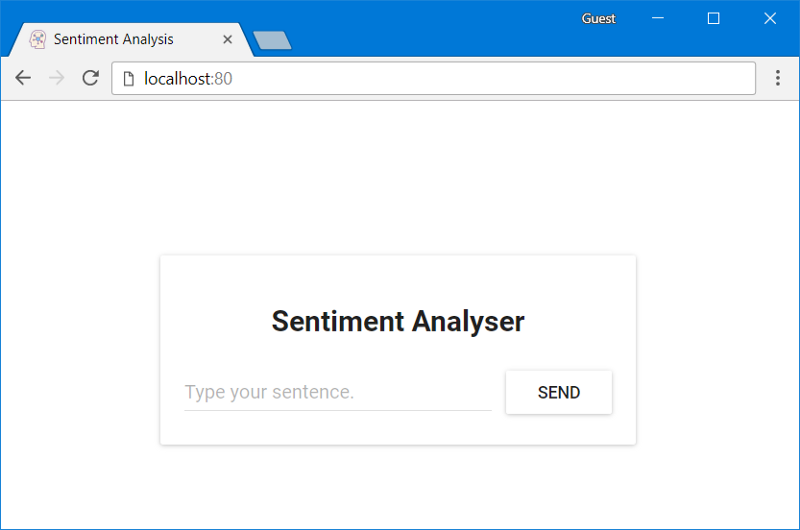

在输入框“Type your sentence”（输入句子）中输入句子，然后点击 SEND（发送）按钮，但是页面会返回错误 404（你可以检查浏览器的控制台）。为什么？让我们检查一下代码。

### 检查代码

我们可以在 App.js 文件中看到，点击“SEND”按钮会触发 analyzeSentence。该方法的代码如下所示（我们对每一段代码进行了编号“#号码”，具体解释如下所示）：

```JavaScript
analyzeSentence() {
    fetch('http://localhost:8080/sentiment', {  // #1
        method: 'POST',
        headers: {
            'Content-Type': 'application/json'
        },
        body: JSON.stringify({
                       sentence: this.textField.getValue()})// #2
    })
        .then(response => response.json())
        .then(data => this.setState(data));  // #3
}
```

> #1：POST 方法调用的 URL（应用程序应该在该 URL 上监听访问）；
> #2：发送到应用程序的请求主体如下所示：

```txt
{
    sentence: “I like yogobella!”
}
```

> #3：返回值将更新该组件的状态，而状态的变更将重新渲染这个组件。如果我们收到数据（即包含用户输入的句子和极性的 JSON 对象），那么我们会显示组件 polarityComponent，因为满足条件而且我们可以如下定义该组件：

```JavaScript
const polarityComponent = this.state.polarity !== undefined ?
    <Polarity sentence={this.state.sentence} 
              polarity={this.state.polarity}/> :
    null;
```

一切看起来都很好。但是我们还差什么呢？你可能已经发现我们没有在 localhost:8080 上设置任何东西！我们必须启动 Spring 网络应用程序监听这个端口！

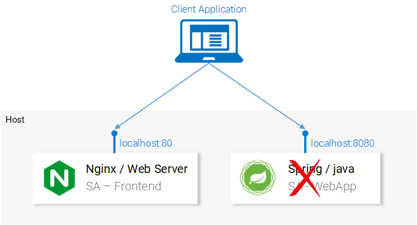

## 建立 Spring 网络应用程序

为了设置 Spring 网络应用程序，你必须安装 JDK8 和 Maven，并设置它们的环境变量。设置好后，我们继续下个部分。

### 将应用程序打包成 Jar 文件

在终端中进入 sa-webapp 目录，并运行如下命令：

```shell
mvn install
```

该命令会在目录 sa-webapp 中生成一个名叫 target 的文件夹。target 文件夹内有打包好的 Java 应用程序包：’sentiment-analysis-web-0.0.1-SNAPSHOT.jar’。

### 启动应用程序

进入 target 目录，并通过如下命令启动应用程序：

```shell
java -jar sentiment-analysis-web-0.0.1-SNAPSHOT.jar
```

等等……出错了。应用程序启动失败，我们可以看到如下异常信息：

> Error creating bean with name 'sentimentController': Injection of autowired dependencies failed; nested exception is java.lang.IllegalArgumentException: Could not resolve placeholder 'sa.logic.api.url' in value "${sa.logic.api.url}"

这里显示的重要信息是 SentimentController 中的 sa.logic.api.url。我们检查一下这段代码。

### 检查错误代码

```Java
@CrossOrigin(origins = "*")
@RestController
public class SentimentController {
@Value("${sa.logic.api.url}")    // #1
    private String saLogicApiUrl;
@PostMapping("/sentiment")
    public SentimentDto sentimentAnalysis(
                            @RequestBody SentenceDto sentenceDto) {
        RestTemplate restTemplate = new RestTemplate();
return restTemplate.postForEntity(
                saLogicApiUrl + "/analyse/sentiment",    // #2
                sentenceDto, SentimentDto.class)
                .getBody();
    }
}
```

> #1：SentimentController 有一个名叫 saLogicApiUrl 的字段。这个字段的赋值是由 sa.logic.api.url 属性定义的。
> #2：saLogicApiUrl 与值“/analyse/sentiment”连接在一起，共同构成了 Sentiment Analysis 请求的 URL。

### 定义属性

在 Spring 中默认的属性资源是 application.properties（具体位置在 sa-webapp/src/main/resources 中）。但是这不是定义属性的唯一方式，我们可以通过之前的命令完成属性定义：

```shell
java -jar sentiment-analysis-web-0.0.1-SNAPSHOT.jar 
     --sa.logic.api.url=WHAT.IS.THE.SA.LOGIC.API.URL
```

应该由 Python 应用程序运行时定义的值初始化该属性，如此一来 Spring 网络应用程序就可以知道在运行时把信息传递到哪里了。

为了简单起见，我们假设在 localhost:5000 上运行 Python 应用程序。请记得哦！

运行如下命令，然后我们来看看最后一个服务：Python 应用程序。

```shell
java -jar sentiment-analysis-web-0.0.1-SNAPSHOT.jar 
     --sa.logic.api.url=http://localhost:5000
```

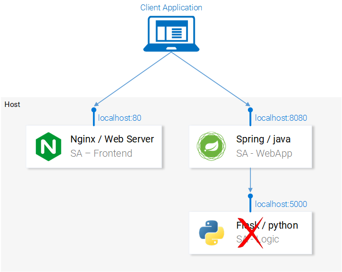

## 建立 Python 应用程序

为了启动 Python 应用程序，首先我们需要安装 Python3 和 Pip，以及设置它们的环境变量。

### 安装依赖

在终端中进入 sa-logic/sa (代码库)，然后运行如下命令：

```shell
python -m pip install -r requirements.txt
python -m textblob.download_corpora
```

### 启动应用

在利用 Pip 安装好依赖后，我们就可以通过运行如下命令启动应用程序了：

```shell
python sentiment_analysis.py
* Running on http://0.0.0.0:5000/ (Press CTRL+C to quit)
```

这意味着应用程序已经启动，并在 localhost 的端口 5000 上监听 HTTP 请求了。

### 检查 python 代码

让我们检查代码，看看处理逻辑部分的 Python 应用程序在干什么：

```python
from textblob import TextBlob
from flask import Flask, request, jsonify
app = Flask(__name__)                                   #1
@app.route("/analyse/sentiment", methods=['POST'])      #2
def analyse_sentiment():
    sentence = request.get_json()['sentence']           #3
    polarity = TextBlob(sentence).sentences[0].polarity #4
    return jsonify(                                     #5
        sentence=sentence,
        polarity=polarity
    )
if __name__ == '__main__':
    app.run(host='0.0.0.0', port=5000)                #6
```

> #1：实例化一个 Flask 对象；
> #2：定义 POST 请求访问的路径；
> #3：从请求主体内抽出“sentence”属性；
> #4：初始化匿名 TextBlob 对象，并从第一个句子（我们只有一个）中获取极性；
> #5：在相应体内返回句子和极性；
> #6：运行 flask 对象应用来监听 localhost:5000 上的请求。

所有的服务都设置好，可以互相交流了。试试看重开前端的 localhost:80。

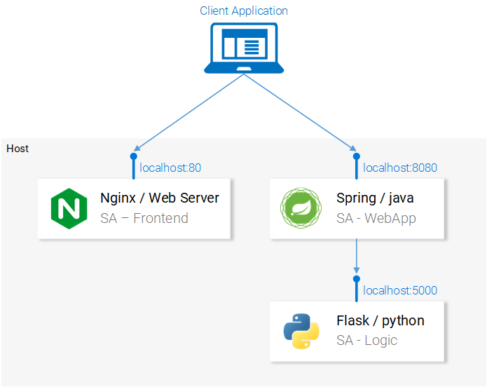

在下面一节中，我们将介绍如何在 Docker 容器内启动这些服务，因为这是在 Kubernetes 集群内运行这些服务的前提条件。

## 为每个服务创建容器映像

Kubernetes 是容器管理平台。可想而知我们需要容器去管理它们。但是容器是什么？Docker 官方文档的最佳答案如下：

> 容器映像是轻量级的、独立的、可执行软件包，包含所有可运行的东西：代码、运行时、系统工具、系统库、设置。对于基于 Linux 和 Windows 的应用，不论环境如何，容器化的软件都可以照常运行。

这意味着容器可以在任何计算机上运行，甚至是在产品服务器上，都没有任何差别。

为了更形象地描述，让我们来对比一下 React 应用程序在虚拟机上和容器内运行的情况。

### 通过虚拟机提供 React 静态文件

使用虚拟机的缺点包括：

- 资源效率低下，每个虚拟机都需要一个完全成熟的操作系统；

- 对平台有依赖性。本地机器上运行得很好的功能未必能在产品服务器上正常工作；

- 与容器相比，更重而且规模伸缩较慢。

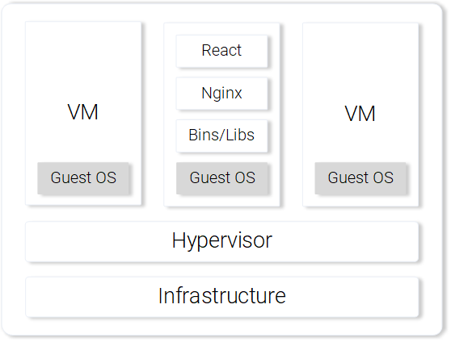

### 通过容器提供 React 静态文件

使用容器的优点包括：

- 资源效率很高，在 Docker 的帮助下使用主机操作系统；

- 对平台没有依赖性。可以在本地机器上运行的容器可以在任何机器上正常工作；

- 通过映像层提供轻量级服务。


以上是使用容器最突出的特色和优势。更多信息，请参阅 Docker 官方文档：`https://www.docker.com/what-container`。

### 为 React 应用建立容器映像（Docker 简介）

Docker 容器最基本的组件是 .dockerfile。该 Dockerfile 文件最基本的组成是容器镜像，我们将通过下列一系列说明，介绍如何创建一个符合应用程序需求的容器镜像。

在开始定义 Dockerfile 之前，让我们先回想一下使用 Nginx 服务 React 静态文件的步骤：

- 创建静态文件（npm run build）；

- 启动 Nginx 服务器；

- 将前端项目的 build 文件夹的内容复制到 nginx/html 目录中。

在下一节中，你会注意到创建容器与建立本地 React 的过程非常相似。

### 为前端定义 Dockerfile

前端 Dockerfile 的建立只有两个步骤。这是因为 Nginx 团队为我们提供了基本的 Nginx 映像，我们可以直接利用。这两个步骤如下：

- 启动基本的 Nginx 映像；

- 将 sa-frontend/build 目录复制到容器的 nginx/html 中。

转换成的Dockerfile如下所示：

```docker
FROM nginx
COPY build /usr/share/nginx/html
```

很惊讶吧？这个文件是可读的，我们可以概括为：

从 Nginx 映像开始（不管里面是什么）。将 build 目录复制到映像的 nginx/html 目录中。然后就好了！

你可能在想，我该从哪儿复制 build 文件呢？例如：/usr/share/nginx/html。非常简单：在 Docker Hub 的 Nginx 映像文档中有记载。

### 建立并推送容器

在推送映像之前，我们需要一个容器注册来托管映像。Docker Hub 是一个免费的云容器服务，我们将使用它来做演示。接下来有 3 个任务需要完成：

- 安装 Docker CE；

- 注册 Docker Hub；

- 在终端中运行如下命令登录：

```shell
docker login -u="$DOCKER_USERNAME" -p="$DOCKER_PASSWORD"
```

在完成上述任何后，请进入目录 sa-frontend。然后运行如下命令（请用你的 docker hub 用户名替换 $DOCKER 用户名，例如：rinormaloku/sentiment-analysis-frontend）。

```shell
docker build -f Dockerfile -t $DOCKER_USER_ID/sentiment-analysis-frontend .
```

现在我们可以删掉 -f Dockerfile 了，因为我们已经在包含 Dockerfile 的目录中了。

我们可以使用 docker push 命令来推送映像：

```shell
docker push $DOCKER_USER_ID/sentiment-analysis-frontend
```

请确认映像已成功地被推送到 docker hub 代码库。

### 运行容器

现在任何人都可以获取 $DOCKER_USER_ID/sentiment-analysis-frontend 中的映像并运行：

```shell
docker pull $DOCKER_USER_ID/sentiment-analysis-frontend
docker run -d -p 80:80 $DOCKER_USER_ID/sentiment-analysis-frontend
```

Docker 容器已经处于运行状态了！

在进行下一步之前，让我们先来讲解一下 80:80，很多人对此比较不解：

- 第一个 80 是主机的端口号（例如：我的计算机）；

- 第二个 80 是容器的端口号，请求都会被转送到这里。


这是从<主机端口>匹配到<容器端口>的。也就是说每个发往主机 80 端口的请求都会被匹配到容器的 80 端口，如图 9 所示。

因为在主机上（你的计算机）80 端口上运行的端口可以访问 localhost:80。如果本地不支持 Docker，那么你可以在 <docker机器ip>:80 上打开应用程序。运行 docker-machine ip 命令可以找到 Docker 机器的 IP。

试试看！你现在应该可以访问 React 应用程序了。

### Dockerignore 文件

刚才我们看到建立 SA-Frontend 的映像非常慢，不好意思，应该是超级慢。这是因为我们必须将建立过程中的环境文件发送给 Docker 服务。更具体地来说，建立过程中的环境文件指的是在建立映像的时候，所有会用到的 Dockerfile 目录中的数据。

以我们的例子来说，SA-Frontend 文件包括如下文件夹：

```folder
sa-frontend:
|   .dockerignore
|   Dockerfile
|   package.json
|   README.md
+---build
+---node_modules
+---public
\---src
```

但是我们只需要 build 文件夹。上传其他的文件会浪费时间。我们可以通过删除其他目录来节约时间。这就需要用到 .dockerignore。你可能觉得这与 .gitignore 很相似，例如你可以所有想要忽略的目录都添加到 .dockerignore，如下所示：

```txt
node_modules
src
public
```

这个 .dockerignore 文件应该与 Dockerfile 在同一文件夹中。现在建立映像文件只需要几秒钟了。

让我们继续看看 Java 应用程序。

### 为 Java 应用程序建立容器映像

你知道吗？你已经差不多学习了所有关于创建容器映像的知识！这就是为什么这一小节这么短的原因。

在 sa-webapp 中打开 Dockerfile，你会看到只有两个新的关键字：

```txt
ENV SA_LOGIC_API_URL http://localhost:5000
…
EXPOSE 8080
```

关键字 ENV 在 Docker 容器内声明了环境变量。这可以让我们在启动容器的时候为情感分析 API 提供 URL。

另外，关键字 EXPOSE 提供了一个端口，供我们以后访问。但是等等，我们在 SA-Frontend 的时候没有做这一步，说得很对！这个端口仅用于文档，换句话说就是这个端口是用来向阅读 Dockerfile 的人提供信息的。

你应该已经掌握了创建和推送容器映像。如果遇到任何困难，可以阅读 sa-webapp中的README.md 文件。

### 为 Python 应用程序创建容器映像

sa-logic 的 Dockerfile 中没有新的关键字。现在你已经是 Docker 达人了。

关于如何建立和推送容器映像，请阅读 sa-logic 目录中的 README.md 文件。

## 测试容器化的应用程序

你能相信没有测试过的东西吗？我也不信。所以我们来测试一下这些容器吧。

1.运行 sa-logic 容器，并配置监听端口 5050：

```shell
docker run -d -p 5050:5000 $DOCKER_USER_ID/sentiment-analysis-logic
```

2.运行 sa-webapp 容器，并配置监听端口 8080（因为我们改变了 Python 应用监听的端口，所以我们需要重写环境变量 SA_LOGIC_API_URL）：

```shell
docker run -d -p 8080:8080 -e SA_LOGIC_API_URL='http://<container_ip or docker machine ip>:5000' $DOCKER_USER_ID/sentiment-analysis-web-app
```

3.运行 sa-frontend 容器：

```shell
docker run -d -p 80:80 $DOCKER_USER_ID/sentiment-analysis-frontend
```

然后就可以了。在浏览器中打开 localhost:80。

请注意：如果你改变 sa-webapp 的端口，或使用 Docker 机器的 IP，那么你需要更新 sa-frontend 中的 App.js，让 analyzeSentence 从新的 IP 或端口获取 URL。然后你需要建立并使用更新后的映像。

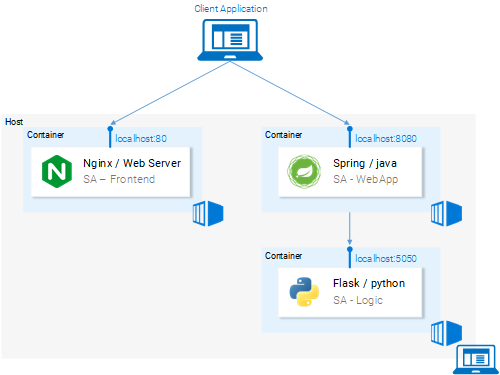

### 智力问答题——为什么使用 Kubernetes？

本节中，我们学习了 Dockerfile，如何使用它创建映像，以及推送映像到 Docker注册目录的命令。另外，我们探讨了如何通过忽略没用的文件，减少需要发送的建立过程中的环境文件。最后我们从容器上运行了应用程序。

接下来，我们介绍为什么要使用 Kubernetes？我们将在下面深入介绍 Kubernetes，这里我想给你留个智力问答题。

如果我们的情感分析网络应用完成得很好，突然间访问量暴涨到每分钟数百万的请求，那么我们的 sa-webapp 和 sa-logic 将面临巨大的负荷压力。请问，我们如何才能扩大容器的规模？

## Kubernetes 简介

我向你保证我没有夸大其词，读完本文你会问“为什么我们不称它为 Supernetes？”


### Kubernetes 是什么？

从容器启动微服务后，我们有一个问题，让我们通过如下问答的形式具体描述这个问题：

> 问：我们怎么扩大或缩小容器？
> 答：我们启动另外一个容器。
> 问：我们如何在容器间分摊负荷？如果当前服务器的负荷达到最大，那我们是否需要另外一个服务器？我们如何最大化硬件使用率？
> 答：唔......呃......（让我搜一下）
> 问：如果在打更新补丁的时候，不影响到所有的服务？如果服务出了问题，如何才能返回之前能正常工作的版本？

Kubernetes 可以解决以上所有问题（以及更多问题！）。我可以用一句话总结 Kubernetes：“Kubernetes 是容器控制平台，可以抽象所有的底层基础设施（容器运行用到的基础设施）。”

我们对容器控制平台有个模糊的概念。在本文后续部分，我们将看看它的实际应用，但是这是第一次我们提到“底层基础设施的抽象”，所以我们来详细看看这个概念。

### 底层基础设施的抽象

Kubernetes 通过一个简单的 API 提供底层基础设施的抽象，我们可以向该 API 发送请求。这些请求可以让 Kubernetes 尽最大能力应对。例如，可以简单地要求“Kubernetes 添加映像 x 的 4 个容器。”然后 Kubernetes 会找出使用中的节点，并在内添加新的容器（如图 12 所示）。


这对开发人员来说意味着什么？意味着开发人员不需要在意节点的数目，也不需要在意从哪里运行容器以及如何与它们交流。开发人员不需要管理硬件优化，或担心节点关闭（它们将遵循墨菲法则），因为新的节点会添加到 Kubernetes 集群。同时 Kubernetes 会在其他运行的节点中添加容器。Kubernetes 会发挥最大的作用。

在图 2 中我们看到了一些新东西：

- API服务器：与集群交互的唯一方式。负责启动或停止另外一个容器，或检查当前状态，日志等；

- Kubelet：监视节点内的容器，并与主节点交流；

- Pod：初始阶段我们可以把 pod 当成容器。

就介绍这么多，跟深入的介绍会导致我们分心，我们可以等到后面一点再介绍，有一些有用的资源，比如官方文档，或者阅读 Marko Lukša 的著作《Kubernetes in Action》，以及 Sébastien Goasguen & Michael Hausenblas 的《Kubernetes Cookbook》。

### 标准化的云服务提供商

Kubernetes 另外一个深入人心的点是：它标准化了云服务提供商。这是一个很大胆的宣言，我们通过如下例子来具体看一看：

比如，有一个 Azure、Google 云平台或其他云服务提供商的专家，他担任了一个搭建在全新的云服务提供商的项目。这可能引起很多后果，比如说：他可能无法在截止期限内完成；公司可能需要招聘更多相关的人员，等等。

相对的，Kubernetes 就没有这个问题。因为不论是哪家云服务提供商，你都可以在上面运行相同的命令。你可以以既定的方式向 API 服务器发送请求。Kubernetes 会负责抽象，并实装这家云服务商。

停一秒钟仔细想一下，这是极其强有力的功能。对公司来说，这意味着他们不需要绑定到一家云服务商。他们可以计算别家云服务商的开销，然后转移到别家。他们依旧可以保留原来的专家，保留原来的人员，他们还可以花更少的钱。

说了这么多，在下一节中让我们来实际使用 Kubernetes。

## Kubernetes 实践——Pod

我们建立了微服务在容器上运行，虽然颇为坎坷，但还是可以工作的。我们还提到这种解决方案不具有伸缩性和弹性，而 Kubernetes 可以解决这些问题。在本文的后续章节，我们会将各个服务转移到由 Kubernetes 管理的容器中，如图 13 所示。

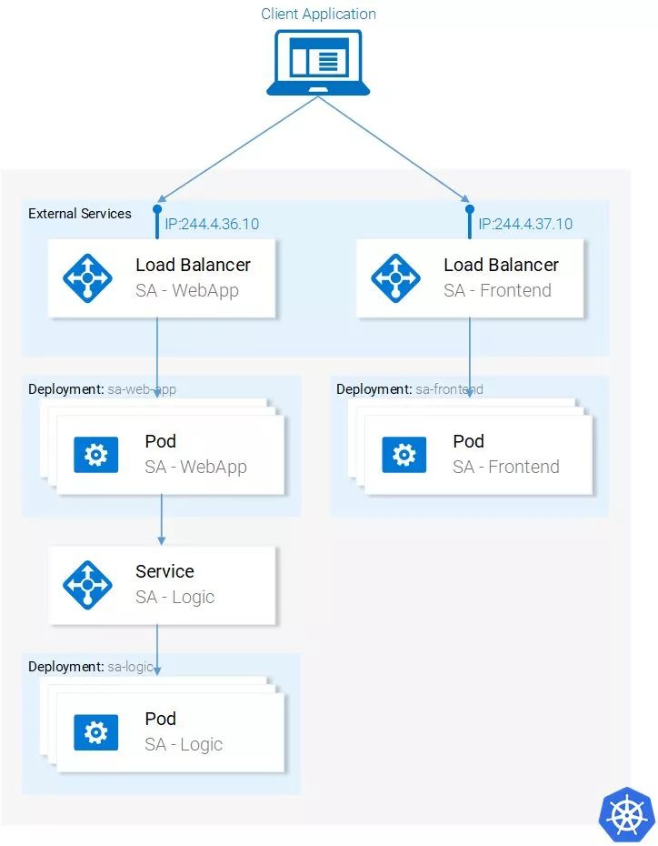

在本文中，我们将使用 Minikube 进行本地调试，尽管所有东西都是运行在 Azure 和 Google 云平台中的。

### 安装和启动 Minikube

请参阅安装 Minikube 的官方文档：

> `https://kubernetes.io/docs/tasks/tools/install-minikube/`

在安装 Minikube 的同时，你可以捎带着安装 Kubectl。Kubectl 是向 Kubernetes API 服务器发送请求的客户端。

可以通过运行 minikube start 命令启动 Minikube，在启动后，运行 kubectl get nodes 命令可以得到如下结果：

```shell
kubectl get nodes
NAME       STATUS    ROLES     AGE       VERSION
minikube   Ready     <none>    11m       v1.9.0
```

Minikube 提供给我们的 Kubernetes 集群只有一个节点，但是记住我们并不在乎有多少个节点，Kubernetes 会负责抽象，对我们来说深入掌握 Kubernetes 并不重要。

在下一节中，我们将介绍 Kubernetes 的第一个资源：Pod。

### Pod

我大爱容器，相信现在你也很喜欢容器。那为什么 Kubernetes 给我们最小的可部署计算单元 Pod 呢？Pod是干什么的？由一个或一组容器组成的 Pod 可以共享相同的运行环境。

但是我们真的需要在一个 Pod 内运行两个容器吗？呃……一般来说，只会运行一个容器，我们的例子中也是这样的。但是有些情况下，比如两个容器需要共享卷，或它们之间是通过跨进程的交流方式交流的，又或者它们被绑到一起，那么就可以使用 Pod。Pod 的另一个特征是：如果我们希望使用其他 Rke 等技术的话，我们可以做到不依赖 Docker 容器。

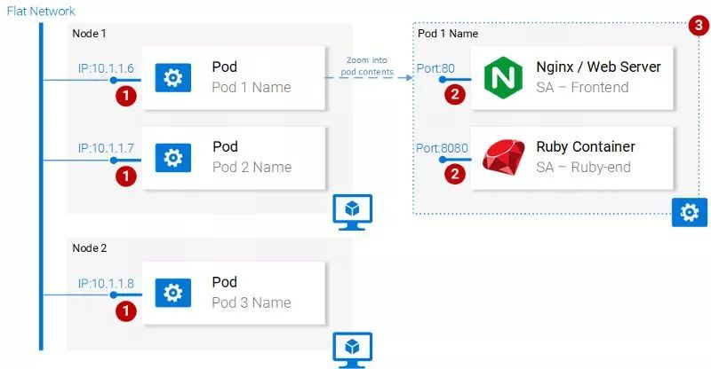

总的来说，Pod 的主要属性包括（如图 14 所示）：

- 每个 Pod 可以在 Kubernetes 集群内拥有唯一的 IP 地址；

- Pod 可以拥有多个容器。这些容器共享同一个端口空间，所以他们可以通过 localhost 交流（可想而知它们无法使用相同的端口），与其他 Pod 内容器的交流可以通过结合 Pod 的 IP 完成；

- 一个 Pod 内的容器共享同一个卷、同一个 IP、端口空间、IPC 命名空间。

注：容器有个自己独立的文件系统，尽管他们可以通过 Kubernetes 的资源卷共享数据。

更多详细内容，请参阅相关的官方文档：

> `https://kubernetes.io/docs/concepts/workloads/pods/pod/`

### Pod 的定义

如下是我们的第一个 pod sa-frontend 的清单文件，我们会对文件内容进行逐一解释。

```shell
apiVersion: v1
kind: Pod                                            # 1
metadata:
  name: sa-frontend                                  # 2
spec:                                                # 3
  containers:
    - image: rinormaloku/sentiment-analysis-frontend # 4
      name: sa-frontend                              # 5
      ports:
        - containerPort: 80                          # 6
```

> #1 kind：指定我们想创建的 Kubernetes 资源的类型。这里是 Pod。
> #2 name：定义该资源的名字。我们在这里命名为 sa-frontend。
> #3 spec：该对象定义了资源应有的状态。Pod Spec 中最重要的属性是容器的数组。
> #4 image：是指我们希望在本 Pod 中启动的容器的映像。
> #5 name：Pod 中容器中唯一的名字。
> #6 containerPort：是指容器监听的端口号。这只是为了提供文档信息（即便没有这个端口也不会影响访问）。

### 创建 SA Frontend 的 Pod

你可以在 resource-manifests/sa-frontend-pod.yaml 中找到上述 Pod 的定义。你可以在终端中进入该文件夹，或在命令行输入完整的路径。然后执行如下命令：

```shell
kubectl create -f sa-frontend-pod.yaml
pod "sa-frontend" created
```

可以通过如下命令确认 Pod：

```shell
kubectl get pods
NAME                          READY     STATUS    RESTARTS   AGE
sa-frontend                   1/1       Running   0          7s
```

如果该 Pod 还处于容器生成中的状态的话，你可以在运行命令的时候加入参数 --watch，当 Pod 进入运行状态的时候，终端会显示信息。

### 从外部访问应用程序

为了从外部访问应用程序，我们需要创建服务类型的Kubernetes资源，具体内容我们将在后续章节讲解，虽然通过服务类型的资源支持外部访问是更合适的做法，但是此处为了快速调试，我们还有另外一个办法，即转发端口：

```shell
kubectl port-forward sa-frontend-pod 88:80
Forwarding from 127.0.0.1:88 -> 80
```

在浏览器中访问 127.0.0.1:88，即可打开 React 应用程序。

### 扩大规模的错误方法

我们说过 Kubernetes 的主要特色之一就是伸缩性，为了证明这一点，让我们运行另外一个 Pod。我们通过如下定义创建另外一个 Pod 资源：

```shell
apiVersion: v1
kind: Pod                                            
metadata:
  name: sa-frontend2      # The only change
spec:                                                
  containers:
    - image: rinormaloku/sentiment-analysis-frontend 
      name: sa-frontend                              
      ports:
        - containerPort: 80
```

然后，通过如下命令创建新的 Pod：

```shell
kubectl create -f sa-frontend-pod2.yaml
pod "sa-frontend2" created
```

可以通过如下命令确认第二个 Pod：

```shell
kubectl get pods
NAME                          READY     STATUS    RESTARTS   AGE
sa-frontend                   1/1       Running   0          7s
sa-frontend2                  1/1       Running   0          7s
```

现在我们有两个运行中的 Pod。

请注意：这不是最终的解决方案，还有很多缺陷。我们将在另一个 Kubernetes 资源的部署一节中改善这个方案。

### 总结 Pod

提供静态文件的 Nginx 网络服务器在另个不同的 Pod 内运行。现在我们有两个问题：

- 怎样对外开放这些服务，让用户通过 URL 来访问它们？

- 怎样平衡 Pod 之间的负荷？


Kubernetes 提供了服务类型的资源。在下一节中我们将详细介绍。

## Kubernetes 实践——服务

Kubernetes 服务资源可以作为一组提供相同服务的 Pod 的入口。这个资源肩负发现服务和平衡 Pod 之间负荷的重任，如图 16 所示。

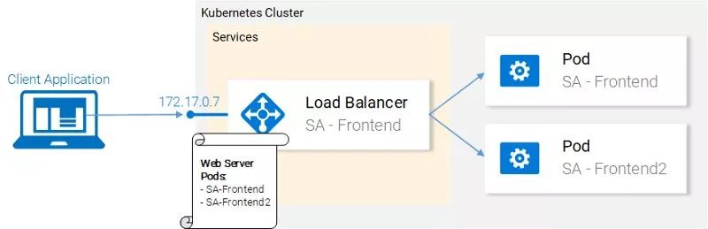

在 Kubernetes 集群内，我们拥有提供不同服务的 Pod（前端、Spring 网络应用和 Flask Python 应用程序）。所以这里的问题是：服务如何知道该处理哪个 Pod？例如：它如何生成这些 Pod 的终端列表？

这个问题可以用标签来解决，具体分两个步骤：

- 给所有服务处理的对象 Pod 贴上标签；

- 在服务中使用一个选择器，该选择器定义了所有贴有标签的对象 Pod。

下列视图看起来更清晰：

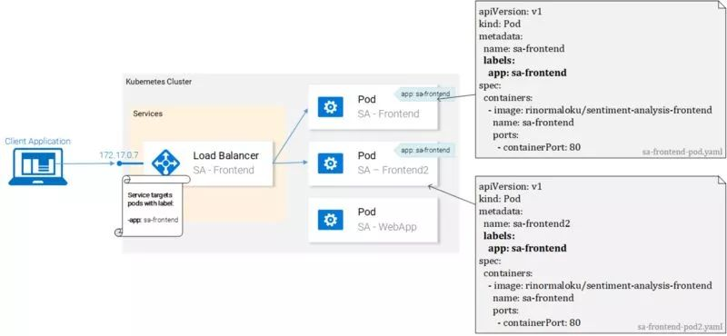

我们可以看到 Pod 都贴着标签“app: sa-frontend”，服务用这个标签找到目标 Pod。

### 标签

标签提供了一种简单的方法用于管理Kubernetes资源。它们有一对键值表示，且可以用于所有资源。按照图17中的例子，修改清单文件。

在修改完毕后保存文件，并通过如下命令应用这些变更：

```shell
kubectl apply -f sa-frontend-pod.yaml
Warning: kubectl apply should be used on resource created by either kubectl create --save-config or kubectl apply
pod "sa-frontend" configured
kubectl apply -f sa-frontend-pod2.yaml 
Warning: kubectl apply should be used on resource created by either kubectl create --save-config or kubectl apply
pod "sa-frontend2" configured
```

我们看到了一个警告（在应用的时候，而非创建，明白了）。在第二行我们看到部署了 pod “sa-frontend”和 “sa-frontend2”。我们可以过滤想要查看的 Pod：

```shell
kubectl get pod -l app=sa-frontend
NAME           READY     STATUS    RESTARTS   AGE
sa-frontend    1/1       Running   0          2h
sa-frontend2   1/1       Running   0          2h
```

验证带有标签的 Pod 的另一种方法是在上述命令中加入标志符 --show-labels，那么结果中会显示每个 Pod 的所有标签。

很好！Pod 已经贴上了标签，我们准备好通过服务找到它们了。让我们定义 LoadBalancer 类型的服务，如图 18 所示。

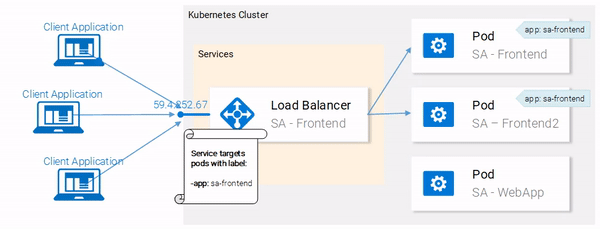

### 服务的定义

LoadBalancer 服务的 YAML 定义如下所示：

```shell
apiVersion: v1
kind: Service              # 1
metadata:
  name: sa-frontend-lb
spec:
  type: LoadBalancer       # 2
  ports:
  - port: 80               # 3
    protocol: TCP          # 4
    targetPort: 80         # 5
  selector:                # 6
    app: sa-frontend       # 7
```

> #1 kind：服务；
> #2 type：指定类型，我们选择 LoadBalancer，因为我们想平衡 Pod 之间的负荷；
> #3 ports：指定服务获取请求的端口；
> #4 protocol：定义交流；
> #5 targetPort：可以将来访的请求转发到这个端口；
> #6 selector：包含选择pod属性的对象；
> #7 app：sa-frontend定义了哪个是目标 Pod，只有拥有标签“app: sa-frontend”的才是目标 Pod。

通过运行如下命令创建服务：

```shell
kubectl create -f service-sa-frontend-lb.yaml
service "sa-frontend-lb" created
```

可以通过运行如下命令检查的服务的状态：

```shell
kubectl get svc
NAME             TYPE           CLUSTER-IP      EXTERNAL-IP   PORT(S)        AGE
sa-frontend-lb   LoadBalancer   10.101.244.40   <pending>     80:30708/TCP   7m
```

External-IP 处于 pending 状态（不用再等了，这个状态不会变的）。这是因为我们使用的是 Minikube。如果我们在 Azure 或 Google 云服务上运行，那么我们可以得到一个公开的 IP，那么全世界都可以访问我们的服务了。

尽管如此，Minikube 也不会置我们于不顾，它提供一个非常有用的本地调试命令，如下所示：

```shell
minikube service sa-frontend-lb
Opening kubernetes service default/sa-frontend-lb in default browser...
```

这可以在浏览器中打开指向该服务的 IP。服务受到请求后，会将请求转发给其中一个 Pod（不用理会是哪个）。通过利用服务作为访问入口，这种抽象可以让我们看到并将多个 Pod 当成一个来交互。

### 服务的总结

在本节中，我们介绍了给资源贴标签，在服务中使用标签作为选择器，我们还定义并创建了一个 LoadBalancer 的服务。这满足了我们希望伸缩应用程序规模的需求（只需加入新的贴了标签的 Pod），并通过将服务作为访问入口在 Pod 之间做负载均衡。

## Kubernetes 实践——部署

Kubernetes 部署可以帮助每一个应用程序的生命都保持相同的一点：那就是变化。此外，只有挂掉的应用程序才会一尘不变，否则，新的需求会源源不断地涌现，更多代码会被开发出来、打包以及部署。这个过程中的每一步都有可能出错。

部署资源可以自动化应用程序从一版本升迁到另一版本的过程，并保证服务不间断，如果有意外发生，它可以让我们迅速回滚到前一个版本。

### 部署实践

现在我们有两个 Pod 和一个服务开放，而且它们之间有负载均衡（如图 19 所示）。我们提到过现有的 Pod 还远远不够完美。需要分开管理每一个 Pod（创建、更新、删除和监视他们的情况）。快速更新和迅速回滚根本不可能！这样是不行的，部署 Kubernetes 资源可以解决这里的每个问题。

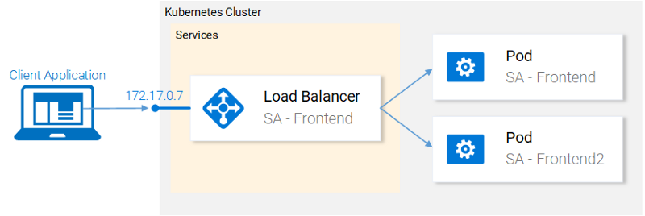

在继续下面的内容之前，让我们复述下我们的目标，通过概述可以让我们更好的理解部署资源的清单文件的定义。我们想要的是：

- 映像 rinormaloku/sentiment-analysis-frontend 的两个 Pod；

- 部署期间服务不间断；

- Pod 贴有标签 app: sa-frontend，所以我们可以通过 sa-frontend-lb 服务找到各个服务。

在下一节中，我们可以将这些需求反映到部署的定义中。

### 部署的定义

如下资源定义的YAML文件可以达成以上所有提到的点：

```shell
apiVersion: extensions/v1beta1
kind: Deployment                                          # 1
metadata:
  name: sa-frontend
spec:
  replicas: 2                                             # 2
  minReadySeconds: 15
  strategy:
    type: RollingUpdate                                   # 3
    rollingUpdate: 
      maxUnavailable: 1                                   # 4
      maxSurge: 1                                         # 5
  template:                                               # 6
    metadata:
      labels:
        app: sa-frontend                                  # 7
    spec:
      containers:
        - image: rinormaloku/sentiment-analysis-frontend
          imagePullPolicy: Always                         # 8
          name: sa-frontend
          ports:
            - containerPort: 80
```

> #1 kind：部署；
> #2 replicas：是部署 Spec 对象的一个属性，定义了我们想运行多少的 Pod。所以是 2；
> #3 type：指定从当前版本升迁到下个版本的时候，部署使用的策略。此处的策略 RollingUpdate 可以保证部署期间服务不间断；
> #4 maxUnavailable：是 RollingUpdate 对象的一个属性，定义了在升级的时候，最大允许停止的 Pod 数量（与希望的状态相比）。对我们的部署来说，我们有 2 个副本，这意味着在一个 Pod 停止后，我们还会有另外一个 Pod 运行，所以可以保证应用程序可访问；
> #5 maxSurge：是 RollingUpdate 对象的另一个属性，定义了添加到部署的最大 Pod 数量（与希望的状态相比）。对我们的部署来说，这意味着在向新版本迁移的时候，我们可以加一个 Pod，那么我们可以同时拥有个 3 个 Pod；
> #6 template：指定 Pod 的模板，部署在创建新 Pod 的时候，会用到该模板。很可能这个非常相似的 Pod 会立即吸引你；
> #7 app: sa-frontend：根据模板创建的 Pod 将被贴上该标签；
> #8 imagePullPolicy：当设置成 Always 的时候，每一次新部署都会重新获取容器映像。

坦白来说，这一堆的文本让我更糊涂了，所以还是让我们来看个例子：

```shell
kubectl apply -f sa-frontend-deployment.yaml
deployment "sa-frontend" created
```

照例让我们确认是否一切如约履行了：

```shell
kubectl get pods
NAME                           READY     STATUS    RESTARTS   AGE
sa-frontend                    1/1       Running   0          2d
sa-frontend-5d5987746c-ml6m4   1/1       Running   0          1m
sa-frontend-5d5987746c-mzsgg   1/1       Running   0          1m
sa-frontend2                   1/1       Running   0          2d
```

现在我们有 4 个运行中的 Pod，两个是由部署创建的，而另外两个是我们手动创建的。通过 kubectl delete pod `<pod-name>` 命令删除其中一个手动创建的 Pod。

练习：删除其中一个部署创建的 Pod，看看结果怎样。在阅读如下的解释前，请先想想原因。

解释：删除一个 Pod 后，部署注意到当前的状态（只有 1 个 Pod 在运行）与希望的状态（2 个 Pod 处于运行状态），所以它会再启动一个 Pod。

那么，除了保持希望的状态外，使用部署还有什么好处？让我们先来看看好处。

### 好处 1：采用零停机时间部署(Zero-downtime)

产品经理带着新的需求来找我们，说客户想要在前端加一个绿色的按钮。开发者写好了代码后，只需提供给我们一样必须的东西，容器映像 rinormaloku/sentiment-analysis-frontend:green。然后就该我们了，我们需要采用零停机时间部署，这项工作很难吗？让我们试试看！

编辑 deploy-frontend-pods.yaml 文件，将容器映像改为新的映像：rinormaloku/sentiment-analysis-frontend:green。保存变更，并运行如下命令：

```shell
kubectl apply -f deploy-frontend-green-pods.yaml --record
deployment "sa-frontend" configured
```

让我们通过如下命令检查下上线的状态：

```shell
kubectl rollout status deployment sa-frontend
Waiting for rollout to finish: 1 old replicas are pending termination...
Waiting for rollout to finish: 1 old replicas are pending termination...
Waiting for rollout to finish: 1 old replicas are pending termination...
Waiting for rollout to finish: 1 old replicas are pending termination...
Waiting for rollout to finish: 1 old replicas are pending termination...
Waiting for rollout to finish: 1 of 2 updated replicas are available...
deployment "sa-frontend" successfully rolled out
```

从部署上看来，上线已经成功。在这个过程中副本被逐个替换。意味着应用程序始终在线。在继续下面的内容前，先让我们来确认一下更新确实有效。

### 确认部署

让我们在浏览器中确认更新的结果。运行我们之前用到过的命令 minikube service sa-frontend-lb，它会打开浏览器。我们可以看到按钮 SEND 已更新了。


### “RollingUpdate”背后的情况

在我们应用了新的部署后，Kubernetes 会将新状态与旧的相比。在我们的例子中，新状态需要两个 rinormaloku/sentiment-analysis-frontend:green 映像的 Pod。这与当前的运行状态不同，所以 Kubernetes 会执行 RollingUpdate。


这里的 RollingUpdate 会根据我们指定的规格执行，也就是“maxUnavailable: 1″和“maxSurge: 1″。这意味着部署需要终止一个 Pod，并且仅可以运行一个新的 Pod。这个过程会不断重复，一直到所有的 Pod被替换（如图 21 所示）。

我们继续介绍第二个好处。

声明：出于娱乐的目的，下面的部分我按照小说的形式来书写。

### 好处2：回滚到前一个状态

> 产品经理跑进办公室说，他遇到一个大麻烦！
> 产品经理大喊道：“产品环境中的应用程序有一个很关键的 bug！！需要马上回滚到前一个版本”。
> 你冷静地看着他，眼睛都没有眨一下，就转向了心爱的终端，然后开始敲：

```shell
kubectl rollout history deployment sa-frontend
deployments "sa-frontend"
REVISION  CHANGE-CAUSE
1         <none>         
2         kubectl.exe apply --filename=sa-frontend-deployment-green.yaml --record=true
```

> 你看了一眼前一个部署，然后问产品经理：“上个版本很多 bug，那前一个版本运行得很完美吗？”
> 产品经理吼道：“是啊，你没听见我说嘛？！”
> 你没理他，你知道该如何处理，于是你开始敲：

```shell
kubectl rollout undo deployment sa-frontend --to-revision=1
deployment "sa-frontend" rolled back
```

> 然后，你轻轻地刷新了页面，之前的修改全都不见了！
> 产品经理瞠目结舌地看着你。
> 你拯救了大家！
> 完

我知道……这是个很无聊的故事。在 Kubernetes 出现之前，这个故事挺好的，更加戏剧化，让人高度紧张，而且这种状态持续了很长时间。那段旧时光还是很美好的！

大多数的命令都自带说明，只是有一些细节你需要自己搞清楚。为什么第一个版本中字段 CHANGE-CAUSE 的值为 `<none>`，而同时第二次改版的时候，CHANGE-CAUSE 的值为“kubectl.exe apply –filename=sa-frontend-deployment-green.yaml –record=true”。

你应该可以发现这是因为在应用新的映像的时候，我们用到了标志符 --record。

在下一节中，我们将使用之前所有的概念，完成整个架构。

## Kubernetes 和其他一切的实战应用

现在我们学习了完成架构的所有必须的资源，因此这一节会非常快。图 22 中灰色的部分是需要做的事情。让我们从底部开始：部署 sa-logic 的部署。

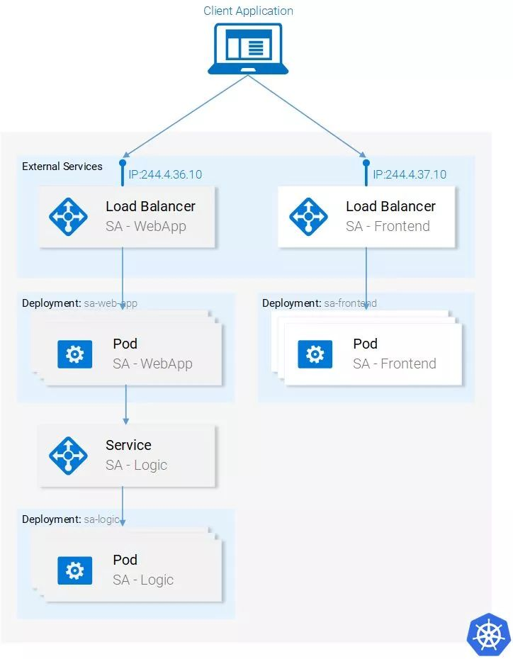

### 部署 SA-Logic

在终端中进入资源清单文件所在的目录，然后运行如下命令：

```shell
kubectl apply -f sa-logic-deployment.yaml --record
deployment "sa-logic" created
```

SA-Logic 的部署会创建三个 Pod（Pod 上运行着我们的 Python 应用）。该命令还会给Pod 贴上 app: sa-logic 的标签。有了这个标签，我们就能从 SA-Logic 服务中利用选择器来选择这些 Pod。请花点时间打开 sa-logic-deployment.yaml，查看其内容。

这里的概念都是一样的，因此我们可以直接讲解下一个资源：SA-Logic 服务。

### SA Logic 服务

首先来解释下为什么需要该服务。我们的 Java 应用（在 SA-WebApp 部署的 Pod 中运行）依赖于 Python 应用提供的情感分析。但现在，与我们在本地运行一切服务时的状况不同，我们并没有一个单一的 Python 应用监听着某个端口，我们只有两个 Pod，如果需要，我们可以有更多的 Pod。

这就是为什么需要“服务”为一组提供相同功能的 Pod 提供访问入口。这就是说，我们可以利用 SA-Logic 服务作为所有 SA-Logic Pod 的访问入口。

运行如下命令：

```shell
kubectl apply -f service-sa-logic.yaml
service "sa-logic" created
```

更新后的应用程序状态：现在我们有两个 Pod 在运行（包含 Python 应用程序），并且 SA-Logic 服务提供了访问入口，该访问入口将在 SA-WebApp 的 Pod 中使用。


现在需要部署 SA-WebApp Pod，我们需要用到部署资源。

### SA-WebApp 部署

我们已经学过了部署，尽管这个部署会用到更多的特性。打开 sa-web-app-deployment.yaml 文件，会发现以下的新内容：

```shell
- image: rinormaloku/sentiment-analysis-web-app
  imagePullPolicy: Always
  name: sa-web-app
  env:
    - name: SA_LOGIC_API_URL
      value: "http://sa-logic"
  ports:
    - containerPort: 8080
```

我们感兴趣的第一件事就是 env 属性。我们猜测它定义了环境变量 SA_LOGIC_API_URl，值为在 Pod 内的值为 `http://sa-logic`。但为什么要初始化成 `http://sa-logic`，`sa-logic` 究竟是什么？

我们先来介绍下 kube-dns。

### KUBE-DNS

Kubernetes 有个特殊的 Pod 叫做 kube-dns。默认情况下，所有 Pod 都用它作为 DNS 服务器。kube-dns 的一个重要属性就是它为每个建立的访问都创建一条 DNS 记录。

这就是说当我们创建 sa-logic 服务时，它会获得一个 IP 地址。它的名字会加入到 kube-dns 中（和它的 IP 地址一起）。这样所有 Pod 都能够把 sa-logic 翻译成 SA-Logic 服务的 IP 地址。

好，现在可以继续了：

### SA WebApp 部署（续）

运行以下命令：

```shell
kubectl apply -f sa-web-app-deployment.yaml --record
deployment "sa-web-app" created
```

完了。剩下的工作就是通过 LoadBalancer 服务将 SA-WebApp Pod 暴露到外部。LoadBalancer 服务提供了 SA-WebApp Pod 的访问入口，这样 React 应用程序就能发送 HTTP 请求了。

### SA-WebApp 服务

打开 service-sa-web-app-lb.yaml 文件，可以看到内容还是挺熟悉的。

所以我们可以运行如下命令：

```shell
kubectl apply -f service-sa-web-app-lb.yaml
service "sa-web-app-lb" created
```

这样架构就完成了。但还有一点不完美的地方。在部署 SA-Frontend Pod 之后，容器映像指向了 `http://localhost:8080/sentiment` 处的 SA-WebApp。但现在我们需要将其更新为 SA-WebApp LoadBalancer 的 IP 地址（其作用是 SA-WebApp Pod 的访问入口）。

修补该不完美是个快速复习一切的绝佳机会（如果能不参照以下的指南独立完成更好）。下面我们开始：

- 执行下列命令获取 SA-WebApp LoadBalancer 的 IP：

  ```shell
  minikube service list
  |-------------|----------------------|-----------------------------|
  |  NAMESPACE  |         NAME         |             URL             |
  |-------------|----------------------|-----------------------------|
  | default     | kubernetes           | No node port                |
  | default     | sa-frontend-lb       | http://192.168.99.100:30708 |
  | default     | sa-logic             | No node port                |
  | default     | sa-web-app-lb        | http://192.168.99.100:31691 |
  | kube-system | kube-dns             | No node port                |
  | kube-system | kubernetes-dashboard | http://192.168.99.100:30000 |
  |-------------|----------------------|-----------------------------|
  ```

- 在 sa-frontend/src/App.js 中使用 SA-WebApp LoadBalancer 的 IP，如下：

  ```shell
  analyzeSentence() {
          fetch('http://192.168.99.100:31691/sentiment', { /* shortened for brevity */})
              .then(response => response.json())
              .then(data => this.setState(data));
      }
  ```

  构建静态文件 npm build （需要先切换到 sa-front-end 目录）；

  构建容器映像：

  ```shell
  docker build -f Dockerfile -t $DOCKER_USER_ID/sentiment-analysis-frontend:minikube .
  ```

- 将映像推送到 Docker hub：

  ```shell
  docker push $DOCKER_USER_ID/sentiment-analysis-frontend:minikube
  ```

- 编辑 sa-frontend-deployment.yaml 并使用新的映像；

- 执行 kubectl apply -f sa-frontend-deployment.yaml 命令。

刷新浏览器（如果你关闭了浏览器，则执行 minikube service sa-frontend-lb）。敲个句子试试看！


## 全文总结

Kubernetes 对团队、项目都很有好处，它能简化部署，提供伸缩性、灵活性，可以让我们使用任何底层基础设施。以后我们叫它 Supernetes 吧！

### 本文中覆盖的内容

- /打包/运行 ReactJS、Java 和 Python 应用程序；

- Docker容器，如何利用 Dockerfile 定义并构建容器；

- 容器注册目录，我们采用 Docker Hub 作为容器的代码库；

- 介绍了 Kubernetes 的最重要的内容；

- Pod；

- 服务；

- 部署；

- 新概念，如零停机时间部署；

- 创建可伸缩的应用；

- 流程上，我们将整个微服务应用程序转成了 Kubernetes 集群。

本文为你提供了坚实的基础供你在实际的项目中使用，并且帮你更容易地学习更多新概念。

---
本文作者：Rinor Maloku，译者：弯月，责编：郭芮，转载仅为自学。  
原文链接：<https://medium.freecodecamp.org/learn-kubernetes-in-under-3-hours-a-detailed-guide-to-orchestrating-containers-114ff420e882>
