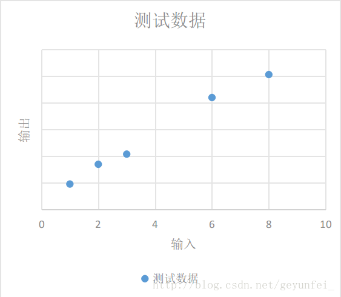

​

## 前言

本文主要通过一个简单的 Demo 介绍 TensorFlow 初级 API 的使用方法，因为自己也是初学者，因此本文的目的主要是引导刚接触 TensorFlow 或者 机器学习的同学，能够从第一步开始学习 TensorFlow。阅读本文先确认具备以下基础技能：

- 会使用 Python 编程（初级就OK，其实 TensorFlow 也支持 Java、C++、Go）

- 一些数组相关的知识（线性代数没忘干净就行）

- 最好再懂点机器学习相关的知识（临时百度、Google也来得及）

## 基础知识

### 张量（Tensor）

TensorFlow 内部的计算都是基于张量的，因此我们有必要先对张量有个认识。张量是在我们熟悉的标量、向量之上定义的，详细的定义比较复杂，我们可以先简单的将它理解为一个多维数组：

```txt
3                                       # 这个 0 阶张量就是标量，shape=[]
[1., 2., 3.]                            # 这个 1 阶张量就是向量，shape=[3]
[[1., 2., 3.], [4., 5., 6.]]            # 这个 2 阶张量就是二维数组，shape=[2, 3]
[[[1., 2., 3.]], [[7., 8., 9.]]]        # 这个 3 阶张量就是三维数组，shape=[2, 1, 3]
```

TensorFlow 内部使用 `tf.Tensor` 类的实例来表示张量，每个 `tf.Tensor` 有两个属性：

- *dtype* Tensor 存储的数据的类型，可以为`tf.float32`、`tf.int32`、`tf.string`…

- *shape* Tensor 存储的多维数组中每个维度的数组中元素的个数，如上面例子中的shape

我们现在可以敲几行代码看一下 Tensor 。在命令终端输入 python 或者 python3 启动一个 Python 会话，然后输入下面的代码：

```python
# 引入 tensorflow 模块
import tensorflow as tf

# 创建一个整型常量，即 0 阶 Tensor
t0 = tf.constant(3, dtype=tf.int32)

# 创建一个浮点数的一维数组，即 1 阶 Tensor
t1 = tf.constant([3., 4.1, 5.2], dtype=tf.float32)

# 创建一个字符串的2x2数组，即 2 阶 Tensor
t2 = tf.constant([['Apple', 'Orange'], ['Potato', 'Tomato']], dtype=tf.string)

# 创建一个 2x3x1 数组，即 3 阶张量，数据类型默认为整型
t3 = tf.constant([[[5], [6], [7]], [[4], [3], [2]]])

# 打印上面创建的几个 Tensor
print(t0)
print(t1)
print(t2)
print(t3)
```

上面代码的输出为，注意`shape`的类型：

```python
>>> print(t0)
Tensor("Const:0", shape=(), dtype=int32)
>>> print(t1)
Tensor("Const_1:0", shape=(3,), dtype=float32)
>>> print(t2)
Tensor("Const_2:0", shape=(2, 2), dtype=string)
>>> print(t3)
Tensor("Const_3:0", shape=(2, 3, 1), dtype=int32)
```

print 一个 Tensor 只能打印出它的属性定义，并不能打印出它的值，要想查看一个 Tensor 中的值还需要经过Session 运行一下：

```python
>>> sess = tf.Session()
>>> print(sess.run(t0))
3
>>> print(sess.run(t1))
[ 3.          4.0999999   5.19999981]
>>> print(sess.run(t2))
[[b'Apple' b'Orange']
 [b'Potato' b'Tomato']]
>>> print(sess.run(t3))
[[[5]
  [6]
  [7]]
 
 [[4]
  [3]
  [2]]]
>>>
```

### 数据流图(Dataflow Graph)

数据流是一种常用的并行计算编程模型，数据流图是由`节点(nodes)`和`线(edges)`构成的有向图：

- **节点(nodes)** 表示计算单元，也可以是输入的起点或者输出的终点

- **线(edges)** 表示节点之间的输入/输出关系

在 TensorFlow 中，每个节点都是用`tf.Tensor`的实例来表示的，即每个节点的输入、输出都是 Tensor，如下图中 Tensor 在 Graph 中的流动，形象的展示 TensorFlow 名字的由来


TensorFlow 中的数据流图有以下几个优点：

- **可并行** 计算节点之间有明确的线进行连接，系统可以很容易的判断出哪些计算操作可以并行执行

- **可分发** 图中的各个节点可以分布在不同的计算单元(CPU、 GPU、 TPU等)或者不同的机器中，每个节点产生的数据可以通过明确的线发送的下一个节点中

- **可优化** TensorFlow 中的 XLA 编译器可以根据数据流图进行代码优化，加快运行速度

- **可移植** 数据流图的信息可以不依赖代码进行保存，如使用Python创建的图，经过保存后可以在C++或Java中使用

### Sesssion

我们在Python中需要做一些计算操作时一般会使用NumPy，NumPy在做矩阵操作等复杂的计算的时候会使用其他语言(C/C++)来实现这些计算逻辑，来保证计算的高效性。但是频繁的在多个编程语言间切换也会有一定的耗时，如果只是单机操作这些耗时可能会忽略不计，但是如果在分布式并行计算中，计算操作可能分布在不同的CPU、GPU甚至不同的机器中，这些耗时可能会比较严重。  
TensorFlow 底层是使用C++实现，这样可以保证计算效率，并使用`tf.Session`类来连接客户端程序与C++运行时。上层的Python、Java等代码用来设计、定义模型，构建的Graph，最后通过`tf.Session.run()`方法传递给底层执行。

### 构建计算图

上面介绍的是 TensorFlow 和 Graph 的概念，下面介绍怎么用 Tensor 构建 Graph。  
Tensor 即可以表示输入、输出的端点，还可以表示计算单元，如下的代码创建了对两个 Tensor 执行 + 操作的 Tensor：

```python
import tensorflow as tf

# 创建两个常量节点
node1 = tf.constant(3.2)
node2 = tf.constant(4.8)

# 创建一个 adder 节点，对上面两个节点执行 + 操作
adder = node1 + node2

# 打印一下 adder 节点
print(adder)

# 打印 adder 运行后的结果
sess = tf.Session()
print(sess.run(adder))
```

上面`print`的输出为：

> Tensor("add:0", shape=(), dtype=float32)
> 8.0

上面使用`tf.constant()`创建的 Tensor 都是常量，一旦创建后其中的值就不能改变了。有时我们还会需要从外部输入数据，这时可以用`tf.placeholder`创建占位 Tensor，占位 Tensor 的值可以在运行的时候输入。如下就是创建占位 Tensor 的例子：

```python
import tensorflow as tf

# 创建两个占位 Tensor 节点
a = tf.placeholder(tf.float32)
b = tf.placeholder(tf.float32)

# 创建一个 adder 节点，对上面两个节点执行 + 操作
adder_node = a + b

# 打印三个节点
print(a)
print(b)
print(adder)

# 运行一下，后面的 dict 参数是为占位 Tensor 提供输入数据
sess = tf.Session()
print(sess.run(adder, {a: 3, b: 4.5}))
print(sess.run(adder, {a: [1, 3], b: [2, 4]}))
```

上面代码的输出为：

> Tensor("Placeholder:0", dtype=float32)
> Tensor("Placeholder_1:0", dtype=float32)
> Tensor("add:0", dtype=float32)
> 7.5
> [ 3.  7.]

我们还可以添加其他操作构建复杂的 Graph

```python
# 添加×操作
add_and_triple = adder * 3.
print(sess.run(add_and_triple, {a: 3, b: 4.5}))
```

上面的输出为

> 22.5

## TensorFlow 应用实例

上面介绍了 TensorFlow 中的一些基本概念，下面我们通过一个小例子来了解一下怎么使用 TensorFlow 进行机器学习。

### 建立模型(Model)

如下为我们进行某项实验获得的一些实验数据：

输入 | 输出
--- | ---
1 | 4.8
2 | 8.5
3 | 10.4
6 | 21
8 | 25.3

我们将这些数据放到一个二维图上可以看的更直观一些，如下，这些数据在图中表现为一些离散的点：  



我们需要根据现有的这些数据归纳出一个通用模型，通过这个模型我们可以预测其他的输入值产生的输出值。  
如下图，我们选择的模型既可以是红线表示的鬼都看不懂的曲线模型，也可以是蓝线表示的线性模型，在概率统计理论的分析中，这两种模型符合真实模型的概率是一样的。  


根据**奥卡姆剃刀原则-若有多个假设与观察一致，则选最简单的那个**，蓝线表示的线性模型更符合我们的直观预期。  
如果用x表示输入，y表示输出，线性模型可以用下面的方程表示：  

> $y = W \times x + b$

即使我们选择了直线模型，可以选择的模型也会有很多，如下图的三条直线都像是一种比较合理的模型，只是和参数不同。这时我们需要设计一个损失模型(loss model)，来评估一下哪个模型更合理一些，并找到一个最准确的模型。  


如下图每条黄线代表线性模型计算出来的值与实际输出值之间的差值:  


我们用$y\prime$表示实验得到的实际输出，用下面的方程表示我们的损失模型：

> $loss=\displaystyle\sum_{n=1}^N(y_n−y\prime_n)^2$

显然，损失模型里得到的越小，说明我们的线性模型越准确。

### 使用 TensorFlow 实现模型

上面我们根据实验数据建立了一个线性模型，并为这个线性模型设计了一个损失模型，下面介绍的是怎么在 TensorFlow 中实现我们设计的模型。  
在我们的线性模型 $y = W \times x + b$ 中，输入$x$可以用占位 Tensor 表示，输出$y$可以用线性模型的输出表示，我们需要不断的改变$W$和$b$的值，来找到一个使最小的值。这里$W$和$b$可以用变量 Tensor 表示。使用`tf.Variable()`可以创建一个变量 Tensor，如下就是我们模型的实现代码：

```python
import tensorflow as tf

# 创建变量 W 和 b 节点，并设置初始值
W = tf.Variable([.1], dtype=tf.float32)
b = tf.Variable([-.1], dtype=tf.float32)

# 创建 x 节点，用来输入实验中的输入数据
x = tf.placeholder(tf.float32)

# 创建线性模型
linear_model = W*x + b

# 创建 y 节点，用来输入实验中得到的输出数据，用于损失模型计算
y = tf.placeholder(tf.float32)

# 创建损失模型
loss = tf.reduce_sum(tf.square(linear_model - y))

# 创建 Session 用来计算模型
sess = tf.Session()
```

通过`tf.Variable()`创建变量 Tensor 时需要设置一个初始值，但这个初始值并不能立即使用，例如上面的代码中，我们使用`print(sess.run(W))`尝试打印`W`的值会得到下面提示未初始化的异常

> tensorflow.python.framework.errors_impl.FailedPreconditionError: Attempting to use uninitialized value Variable

变量 Tensor 需要经过下面的 `init` 过程后才能使用：

```python
# 初始化变量
init = tf.global_variables_initializer()
sess.run(init)
```

这之后再使用`print(sess.run(W))`打印就可以看到我们之前赋的初始值：

> [ 0.1]

变量初始化完之后，我们可以先用上面对`W`和`b`设置的初始值`0.1`和`-0.1`运行一下我们的线性模型看看结果：

```python
print(sess.run(linear_model, {x: [1, 2, 3, 6, 8]}))
```

输出结果为：

> [ 0.          0.1         0.20000002  0.5         0.69999999]

貌似与我们实验的实际输出差距很大，我们再运行一下损失模型：

```python
print(sess.run(loss, {x: [1, 2, 3, 6, 8], y: [4.8, 8.5, 10.4, 21.0, 25.3]}))
```

得到的损失值也很大

> 1223.05

我们可以用`tf.assign()`对`W`和`b`变量重新赋值再检验一下：

```python
# 给 W 和 b 赋新值
fixW = tf.assign(W, [2.])
fixb = tf.assign(b, [1.])

# run 之后新值才会生效
sess.run([fixW, fixb])

# 重新验证损失值
print(sess.run(loss, {x: [1, 2, 3, 6, 8], y: [4.8, 8.5, 10.4, 21.0, 25.3]}))
```

输出的损失值比之前的小了很多：

> 159.94

我们需要不断调整变量`W`和`b`的值，找到使损失值最小的`W`和`b`。这肯定是一个very boring的过程，因此 TensorFlow 提供了训练模型的方法，自动帮我们进行这些繁琐的训练工作。

### 使用 TensorFlow 训练模型

TensorFlow 提供了很多优化算法来帮助我们训练模型。最简单的优化算法是**梯度下降(Gradient Descent)**算法，它通过不断的改变模型中变量的值，来找到最小损失值。  
如下的代码就是使用梯度下降优化算法帮助我们训练模型：

```python
# 创建一个梯度下降优化器，学习率为0.001
optimizer = tf.train.GradientDescentOptimizer(0.001)
train = optimizer.minimize(loss)

# 用两个数组保存训练数据
x_train = [1, 2, 3, 6, 8]
y_train = [4.8, 8.5, 10.4, 21.0, 25.3]

# 训练10000次
for i in range(10000):
    sess.run(train, {x: x_train, y: y_train})

# 打印一下训练后的结果
print('W: %s b: %s loss: %s' % (sess.run(W), sess.run(b), sess.run(loss, {x: x_train , y: y_train})))
```

打印出来的训练结果如下，可以看到损失值已经很小了：

> W: [ 2.98236108] b: [ 2.07054377] loss: 2.12941

我们整理一下前面的代码，完整的demo代码如下，将下面的代码保存在一个demo.py文件里，通过`python3 demo.py`执行一下就可以看到训练结果了：

```python
import tensorflow as tf

# 创建变量 W 和 b 节点，并设置初始值
W = tf.Variable([.1], dtype=tf.float32)
b = tf.Variable([-.1], dtype=tf.float32)

# 创建 x 节点，用来输入实验中的输入数据
x = tf.placeholder(tf.float32)

# 创建线性模型
linear_model = W * x + b

# 创建 y 节点，用来输入实验中得到的输出数据，用于损失模型计算
y = tf.placeholder(tf.float32)

# 创建损失模型
loss = tf.reduce_sum(tf.square(linear_model - y))

# 创建 Session 用来计算模型
sess = tf.Session()

# 初始化变量
init = tf.global_variables_initializer()
sess.run(init)

# 创建一个梯度下降优化器，学习率为0.001
optimizer = tf.train.GradientDescentOptimizer(0.001)
train = optimizer.minimize(loss)

# 用两个数组保存训练数据
x_train = [1, 2, 3, 6, 8]
y_train = [4.8, 8.5, 10.4, 21.0, 25.3]

# 训练10000次
for i in range(10000):
    sess.run(train, {x: x_train, y: y_train})

# 打印一下训练后的结果
print('W: %s b: %s loss: %s' % (sess.run(W), sess.run(
    b), sess.run(loss, {x: x_train, y: y_train})))
```

## TensorFlow 高级训练模型

`tf.estimator`是TensorFlow提供的高级库，提供了很多常用的训练模型，可以简化机器学习中的很多训练过程，如：

- 运行训练循环

- 运行评估循环

- 管理训练数据集

### 评估模型

前面的demo中我们构建了一个线性模型，通过使用一组实验数据训练我们的线性模型，我们得到了一个自认为损失最小的最优模型，根据训练结果我们的最优模型可以表示为下面的方程：

> $y=2.98x+2.07$

但是这个我们自认为的最优模型是否会一直是最优的？我们需要通过一些新的实验数据来**评估(evaluation)**模型的**泛化性能(generalization performance)**，如果新的实验数据应用到到这个模型中损失值越小，那么这个模型的泛化性能就越好，反之就越差。下面的demo中我们也会看到怎么评估模型。

### 使用LinearRegressor

前面我们构建了一个线性模型，通过训练得到一个线性回归方程。`tf.estimator`中也提供了线性回归的训练模型`tf.estimator.LinearRegressor`，下面的代码就是使用`LinearRegressor`训练并评估模型的方法：

```python
# 我们会用到NumPy来处理各种训练数据
import numpy as np
import tensorflow as tf

# 创建一个特征向量列表，该特征列表里只有一个特征向量，
# 该特征向量为实数向量，只有一个元素的数组，且该元素名称为 x，
# 我们还可以创建其他更加复杂的特征列表
feature_columns = [tf.feature_column.numeric_column("x", shape=[1])]

# 创建一个LinearRegressor训练器，并传入特征向量列表
estimator = tf.estimator.LinearRegressor(feature_columns=feature_columns)

# 保存训练用的数据
x_train = np.array([1., 2., 3., 6., 8.])
y_train = np.array([4.8, 8.5, 10.4, 21.0, 25.3])

# 保存评估用的数据
x_eavl = np.array([2., 5., 7., 9.])
y_eavl = np.array([7.6, 17.2, 23.6, 28.8])

# 用训练数据创建一个输入模型，用来进行后面的模型训练
# 第一个参数用来作为线性回归模型的输入数据
# 第二个参数用来作为线性回归模型损失模型的输入
# 第三个参数batch_size表示每批训练数据的个数
# 第四个参数num_epochs为epoch的次数，将训练集的所有数据都训练一遍为1次epoch
# 低五个参数shuffle为取训练数据是顺序取还是随机取
train_input_fn = tf.estimator.inputs.numpy_input_fn(
    {"x": x_train}, y_train, batch_size=2, num_epochs=None, shuffle=True)

# 再用训练数据创建一个输入模型，用来进行后面的模型评估
train_input_fn_2 = tf.estimator.inputs.numpy_input_fn(
    {"x": x_train}, y_train, batch_size=2, num_epochs=1000, shuffle=False)

# 用评估数据创建一个输入模型，用来进行后面的模型评估
eval_input_fn = tf.estimator.inputs.numpy_input_fn(
    {"x": x_eavl}, y_eavl, batch_size=2, num_epochs=1000, shuffle=False)

# 使用训练数据训练1000次
estimator.train(input_fn=train_input_fn, steps=1000)

# 使用原来训练数据评估一下模型，目的是查看训练的结果
train_metrics = estimator.evaluate(input_fn=train_input_fn_2)
print("train metrics: %r" % train_metrics)

# 使用评估数据评估一下模型，目的是验证模型的泛化性能
eval_metrics = estimator.evaluate(input_fn=eval_input_fn)
print("eval metrics: %s" % eval_metrics)
```

运行上面的代码输出为：

> train metrics: \{'loss': 1.0493528, 'average_loss': 0.52467638, 'global_step': 1000\}
> eval metrics: \{'loss': 0.72186172, 'average_loss': 0.36093086, 'global_step': 1000\}

评估数据的loss比训练数据还要小，说明我们的模型泛化性能很好。

### 自定义Estimator模型

`tf.estimator`库中提供了很多预定义的训练模型，但是有可能这些训练模型不能满足我们的需求，我们需要使用自己构建的模型。  
我们可以通过实现`tf.estimator.Estimator`的子类来构建我们自己的训练模型，`LinearRegressor`就是`Estimator`的一个子类。另外我们也可以只给`Estimator`基类提供一个`model_fn`的实现，定义我们自己的模型训练、评估方法以及计算损失的方法。  
下面的代码就是使用我们最开始构建的线性模型实现自定义`Estimator`的实例。

```python
import numpy as np
import tensorflow as tf

# 定义模型训练函数，同时也定义了特征向量
def model_fn(features, labels, mode):
    # 构建线性模型
    W = tf.get_variable("W", [1], dtype=tf.float64)
    b = tf.get_variable("b", [1], dtype=tf.float64)
    y = W * features['x'] + b
    # 构建损失模型
    loss = tf.reduce_sum(tf.square(y - labels))
    # 训练模型子图
    global_step = tf.train.get_global_step()
    optimizer = tf.train.GradientDescentOptimizer(0.01)
    train = tf.group(optimizer.minimize(loss),
                     tf.assign_add(global_step, 1))
    # 通过EstimatorSpec指定我们的训练子图积极损失模型
    return tf.estimator.EstimatorSpec(
        mode=mode,
        predictions=y,
        loss=loss,
        train_op=train)
    
# 创建自定义的训练模型
estimator = tf.estimator.Estimator(model_fn=model_fn)

# 后面的训练逻辑与使用LinearRegressor一样
x_train = np.array([1., 2., 3., 6., 8.])
y_train = np.array([4.8, 8.5, 10.4, 21.0, 25.3])

x_eavl = np.array([2., 5., 7., 9.])
y_eavl = np.array([7.6, 17.2, 23.6, 28.8])

train_input_fn = tf.estimator.inputs.numpy_input_fn(
    {"x": x_train}, y_train, batch_size=2, num_epochs=None, shuffle=True)

train_input_fn_2 = tf.estimator.inputs.numpy_input_fn(
    {"x": x_train}, y_train, batch_size=2, num_epochs=1000, shuffle=False)

eval_input_fn = tf.estimator.inputs.numpy_input_fn(
    {"x": x_eavl}, y_eavl, batch_size=2, num_epochs=1000, shuffle=False)

estimator.train(input_fn=train_input_fn, steps=1000)

train_metrics = estimator.evaluate(input_fn=train_input_fn_2)
print("train metrics: %r" % train_metrics)

eval_metrics = estimator.evaluate(input_fn=eval_input_fn)
print("eval metrics: %s" % eval_metrics)
```

上面代码的输出为

> train metrics: \{'loss': 0.8984344, 'global_step': 1000\}
> eval metrics: \{'loss': 0.48776609, 'global_step': 1000\}

### TensorBoard

为了更方便 TensorFlow 的建模和调优，Google 还为 TensorFlow 开发了一款可视化的工具：TensorBoard，将我们第一个Demo的代码稍微改造一下，就可以使用 TensorBoard更加直观的理解 TensorFlow 的训练过程。

```python
import tensorflow as tf

# 创建节点时设置name，方便在图中识别
W = tf.Variable([0], dtype=tf.float32, name='W')
b = tf.Variable([0], dtype=tf.float32, name='b')

# 创建节点时设置name，方便在图中识别
x = tf.placeholder(tf.float32, name='x')
y = tf.placeholder(tf.float32, name='y')

# 线性模型
linear_model = W * x + b

# 损失模型隐藏到loss-model模块
with tf.name_scope("loss-model"):
    loss = tf.reduce_sum(tf.square(linear_model - y))
    # 给损失模型的输出添加scalar，用来观察loss的收敛曲线
    tf.summary.scalar("loss", loss)

optmizer = tf.train.GradientDescentOptimizer(0.001)

train = optmizer.minimize(loss)

x_train = [1, 2, 3, 6, 8]
y_train = [4.8, 8.5, 10.4, 21.0, 25.3]

sess = tf.Session()
init = tf.global_variables_initializer()
sess.run(init)

# 调用 merge_all() 收集所有的操作数据
merged = tf.summary.merge_all()

# 模型运行产生的所有数据保存到 /tmp/tensorflow 文件夹供 TensorBoard 使用
writer = tf.summary.FileWriter('/tmp/tensorflow', sess.graph)

# 训练10000次
for i in range(10000):
    # 训练时传入merge
    summary, _ = sess.run([merged, train], {x: x_train, y: y_train})
    # 收集每次训练产生的数据
    writer.add_summary(summary, i)

curr_W, curr_b, curr_loss = sess.run(
    [W, b, loss], {x: x_train, y: y_train})

print("After train W: %s b %s loss: %s" % (curr_W, curr_b, curr_loss))
```

运行完上面的代码后，训练过程产生的数据就保存在 /tmp/tensorflow 文件夹了，我们可以在命令行终端运行下面的命令启动 TensorBoard：

```shell
# 通过 --logdir 参数设置我们存放训练数据的目录
$ tensorboard --logdir /tmp/tensorflow
```

然后在浏览器中打开 `http://localhost:6006` 页面就可以看到我们的模型数据了。  
首先在 **SCALARS** 页面我们可以看到我们通过 `tf.summary.scalar("loss", loss)`设置的loss收敛曲线，从曲线图中可以看出在训练了大概2000次的时候loss就已经收敛的差不多了。  


在 **GRAPHS** 页面可以看到我们构建的模型的数据流图：  


其中损失模型折叠到loss-model模块里了，双击该模块可以展开损失模型的内容：


– end –

如上即为本人初学 TensorFlow 时的入门 demo，如果想对 TensorFlow 有更深的了解可以参考如下网站：

- [官方网站](https://www.tensorflow.org/)

- [官方中文网站](https://tensorflow.google.cn/)

- [国内爱好者翻译的中文文档](http://wiki.jikexueyuan.com/project/tensorflow-zh/)

---
本文为CSDN博主「戈云飞」的原创文章，转载仅为自学。  
原文链接：<https://blog.csdn.net/geyunfei_/article/details/78782804>
