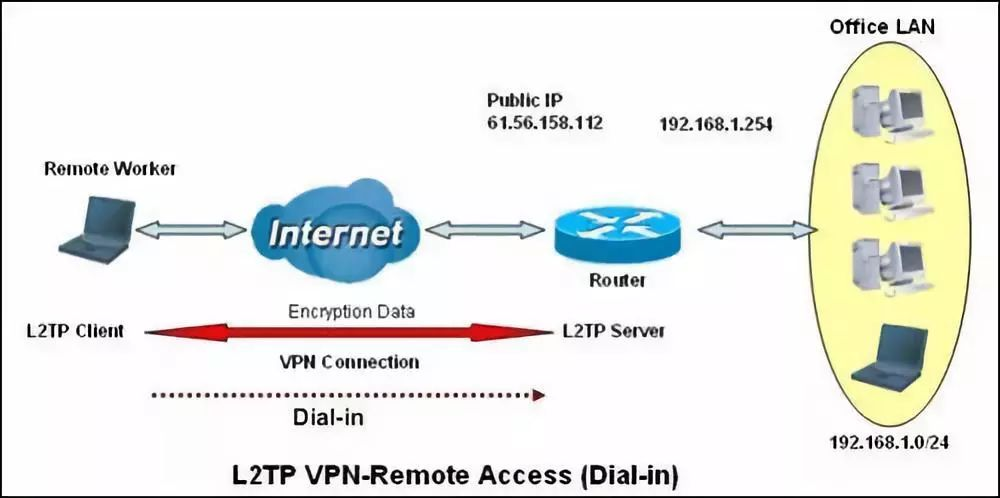

​

很早就在linode的日本机房买了vps，并在服务器上搭建了l2tp方式的vpn服务，用手机连接一切正常，但是win10死活连接不上。

在网上百度了一圈，各种设置，还是没能连上，后来就搁置了。今天Chrome提示要升级，又想起了这件事，还是不死心，又找了一轮，终于试出来了，其实特别简单，步骤如下：

1. 单击“开始”，单击“运行”，键入“regedit”，然后单击“确定”

2. 找到下面的注册表子项，然后单击它：HKEY_LOCAL_MACHINE\System\CurrentControlSet\Services\Rasman\Parameters

3. 在“编辑”菜单上，单击“新建”->“DWORD值”

4. 在“名称”框中，键入“ProhibitIpSec”

5. 在“数值数据”框中，键入“1”，然后单击“确定”

   

6. 找到下面的注册表子项，然后单击它：HKEY_LOCAL_MACHINE\SYSTEM\CurrentControlSet\Services\PolicyAgent

7. 在“编辑”菜单上，单击“新建”->“DWORD值”

8. 在“名称”框中，键入“AssumeUDPEncapsulationContextOnSendRule”

9. 在“数值数据”框中，键入“2”，然后单击“确定”

   

10. 退出注册表编辑器，然后重新启动计算

**注：只是本机测试通过，不保证对所有人有效，祝大家好运！**

下面顺便普及一下VPN知识（主要是字数太少申请不了原创）

- VPN：虚拟专用网是一种通过Internet 与机构网络之间建立安全通信隧道的方法。BiPAC 6402R3支持三种类型VPN：IPSec、PPTP和L2TP。

- IPSec VPN是指采用IPSec协议来实现远程接入的一种VPN技术，IPSec是由Internet Engineering Task Force (IETF) 定义的安全标准框架，用以提供公用和专用网络的端对端加密和验证服务。IPsec协议不是一个单独的协议，它给出了应用于IP层上网络数据安全的一整套体系结构，包括网络认证协议AH、ESP、IKE和用于网络认证及加密的一些算法等。

- PPTP是指将PPP（Point-to-Point Protocol）帧封装进IP数据包中，并通过IP网络，如Internet或其他企业专用Intranet等发送。PPTP协议假定在PPTP两个对端之间存在连通且可用的IP网络，也就是说PPTP VPN是一种建立的基础网络之上的功能性网络。如果PPTP客户机本身已经是某IP网络的组成部分，那么即可通过该IP网络与PPTP服务器取得连接。

- L2TP（Layer Two Tunneling Protocol，第二层通道协议）是VPDN（虚拟专用拨号网络）技术的一种，专门用来进行第二层数据的通道传送，即将第二层数据帧，如点到点协议（PPP）数据帧，封装在IP或UDP载荷内，以顺利通过包交换网络（如Internet），抵达目的地，从而将两个分离的物理网络在逻辑上实现直接联通。
