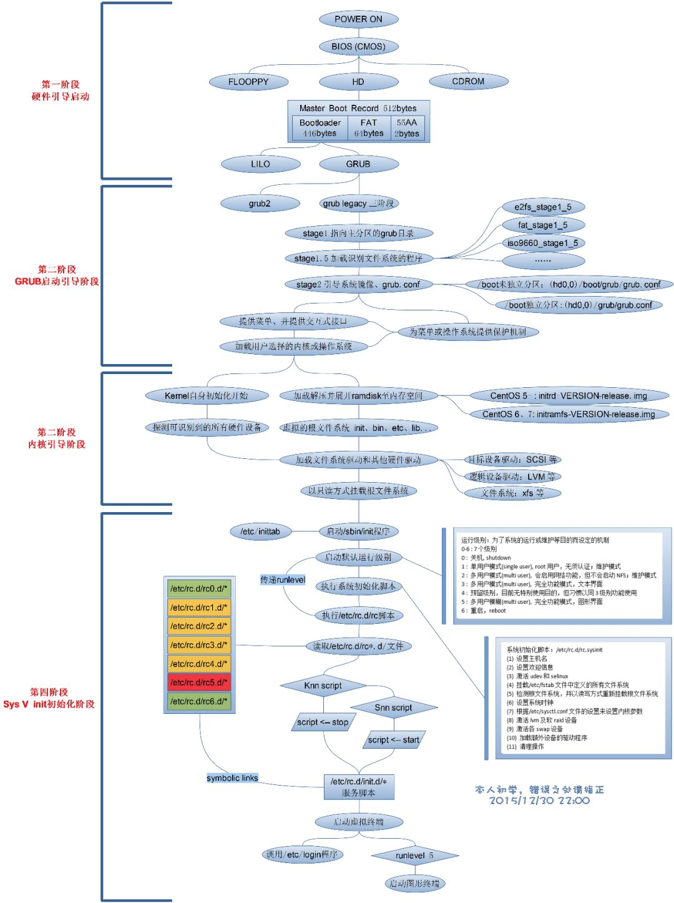

​



Centos开机启动主要过程如下:

1. 找到系统引导分区，执行引导程序，加载内核

2. 执行init程序

   a. /etc/rc.d/rc.sysinit # 由init执行的第一个脚本

   b. /etc/rc.d/rc \$RUNLEVEL # $RUNLEVEL为缺省的运行模式 ，服务器的运行级别为3

   c. /etc/rc.d/rc.local     #相应级别服务启动之后、再执行该文件（其实也可以把需要执行的命令写到该文件中）

   d. /sbin/mingetty # 等待用户登录

在Redhat/Centos中，/etc/rc.d/rc.sysinit主要做在各个运行模式中相同的初始化工作，包括：

- 调入keymap以及系统字体

- 启动swapping

- 设置主机名

- 设置NIS域名

- 检查（fsck）并mount文件系统

- 打开quota

- 装载声卡模块，设置系统时钟等等。

/etc/rc.d/rc则根据其参数指定的运行模式(运行级别，你在inittab文件中可以设置)来执行相应目录下的脚本。凡是以Kxx开头的，都以stop为参数来调用；凡是以Sxx开头的，都以start为参数来调用。调用的顺序按xx 从小到大来执行。(其中xx是数字、表示的是启动顺序)例如，假设缺省的运行模式是3，/etc/rc.d/rc就会按上述方式调用 /etc/rc.d/rc3.d/下的脚本。

值得一提的是，Redhat/Centos中的运行模式2、3、5都把/etc/rc.d/rc.local做为初始化脚本中的最后一个，所以用户可以自己在这个文件中添加一些需要在其他初始化工作之后，登录之前执行的命令。（对此提出了疑问，见后面的：rc.local不一定是最后执行的脚本）

> rwxrwxrwx 1 root root 11 Apr 12 14:26 S99local -> ../rc.local

init在等待/etc/rc.d/rc执行完毕之后（因为在/etc/inittab中/etc/rc.d/rc的action是wait），将在指定的各个虚拟终端上运行/sbin/mingetty，等待用户的登录。 至此，LINUX的启动结束。

Linux系统有7个运行级别，他们各自的含义是：

- 第0级  关闭系统

- 第1级  单用户模式

- 第2级  没有网络多用户模式

- 第3级  有网络多用户模式

- 第4级  系统保留

- 第5级  有网络和图形的多用户模式

- 第6级  重启系统

在centos中，rc.local不应是最后一个启动脚本。

centos运行级别为3，在/etc/rc3.d中存在S99local和S99smartd 这两个文件。

```shell
lrwxrwxrwx 1 root root 11 Apr 12 14:26 S99local -> ../rc.local
lrwxrwxrwx 1 root root 16 Apr 12 14:26 S99smartd -> ../init.d/smartd
```

根据启动规则（启动的先后与文件名S之后的数字有关，数字越大，启动的顺序越靠后），rc.local比smartd先执行，为了验证这个猜想，在这两个脚本中分别添加下面的两个语句

```shell
echo "rc.local"`date` >> /test
echo "smartd"`date`>> /test
```

/test结果为：

```shell
smartdThu Jun 20 17:43:56 CST 2013
rc.localThu Jun 20 17:45:21 CST 2013
smartdThu Jun 20 17:45:21 CST 2013
```

可以发现smartd执行了两次，一次是在关机的时候，一次是在rc.local执行之后。rc.local不一定是最后一个执行的脚本，虽让rc.local中给出了如下注释：

```shell
#!/bin/sh

#
# This script will be executed *after* all the other init scripts.
# You can put your own initialization stuff in here if you don't
# want to do the full Sys V style init stuff.

touch /var/lock/subsys/local
```

 rc3.d中文件名为S开头时，传入的启动参数为start；rc3.d中文件名为S开头时，传入的启动参数为stop。系统先执行Kill脚本（以S开头），后执行start脚本（以S开始）。
