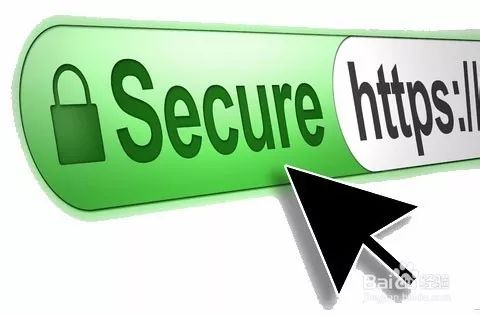
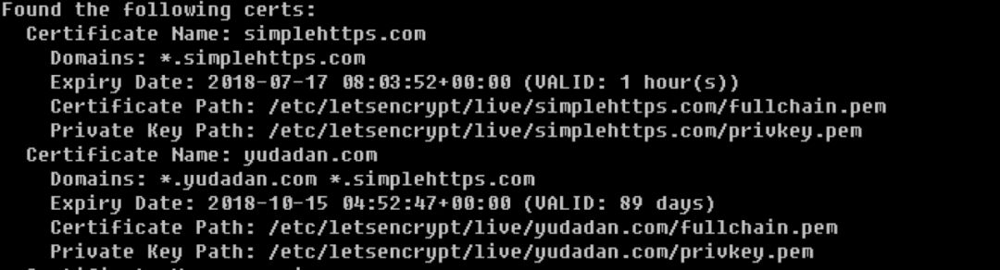

​



## 前言

### HTTP/HTTPS 是什么?

简单来说，HTTP 是一个传输网页内容的协议，比如我们浏览一个网页，网页上的文字、图片、 CSS 、 JS 等文件都是通过 HTTP 协议传输到我们的浏览器，然后被我们看到。因为 HTTP 是明文传输的，通过 HTTP 协议传输的内容很容易被偷看和篡改，为了安全（你肯定不想被人偷看或者篡改网页内容吧，比如网站银行密码什么的。）就为 HTTP 协议再加上了一层 SSL/TLS 安全协议，所以就有了 HTTPS 。

### SSL/TLS 是什么？

SSL 是指安全套接字层（Secure Sockets Layer），内心纯洁的同学也可以理解为「带安全套的 HTTP」，因为带了安全套，所以当然会比较安全。TLS 是 传输层安全协议（Transport Layer Security），SSL 和 TLS 是同一个东西的不同阶段，理解为同一个东西也行，都是安全协议就对了。

### 为什么要部署 HTTPS？

说到底，就是 HTTPS 更安全。甚至为了安全，一个专业可靠的网站， HTTPS 是必须的。 Firefox 和 Chrome 都计划将没有配置 SSL 加密的 HTTP 网站标记为不安全，目前它们也正在联合其他相关的基金会与公司推动整个互联网 HTTPS 化，现在大家访问的一些主要的网站。如 Google 多年前就已经全部启用 HTTPS ，国内的淘宝、搜狗、知乎、百度等等也全面 HTTPS 了。甚至 Google 和百度的搜索结果也正在给予 HTTPS 的网站更高的排名和优先收录权。

### 怎么部署 HTTPS 呢？

你只需要有一张被信任的 CA （ Certificate Authority ）也就是证书授权中心颁发的 SSL 安全证书，并且将它部署到你的网站服务器上。一旦部署成功后，当用户访问你的网站时，浏览器会在显示的网址前加一把小绿锁，表明这个网站是安全的，当然同时你也会看到网址前的前缀变成了 HTTPS ，不再是 HTTP 了。

### 怎么获得 SSL 安全证书呢？

理论上，我们自己也可以签发 SSL 安全证书，但是我们自己签发的安全证书不会被主流的浏览器信任，所以我们需要被信任的证书授权中心（ CA ）签发的安全证书。而一般的 SSL 安全证书签发服务都比较贵，比如 Godaddy 、 GlobalSign 等机构签发的证书一般都需要20美金一年甚至更贵，不过为了加快推广 HTTPS 的普及， EEF 电子前哨基金会、 Mozilla 基金会和美国密歇根大学成立了一个公益组织叫 ISRG （ Internet Security Research Group ），这个组织从 2015 年开始推出了 Let’s Encrypt 免费证书。这个免费证书不仅免费，而且还相当好用，所以我们就可以利用 Let’s Encrypt 提供的免费证书部署 HTTPS 了。

### Let’s Encrypt 简介

前面已经介绍过， Let’s Encrypt 是 一个叫 ISRG （ Internet Security Research Group ，互联网安全研究小组）的组织推出的免费安全证书计划。参与这个计划的组织和公司可以说是互联网顶顶重要的先驱，除了前文提到的三个牛气哄哄的发起单位外，后来又有思科（全球网络设备制造商执牛耳者）、 Akamai 加入，甚至连 Linux 基金会也加入了合作，这些大牌组织的加入保证了这个项目的可信度和可持续性。

### Certbot 简介

ISRG 的发起者 EFF （电子前哨基金会）为 Let’s Encrypt 项目发布了一个官方的客户端 Certbot ，利用它可以完全自动化的获取、部署和更新安全证书。虽然第三方工具也可以使用，但是官方工具更权威，风险也更小，而且遇到问题也更容易解决，毕竟有官方的支持。

## 弱交互申请流程

按照常规的的certbot申请流程，需要填写邮箱地址，还需要根据流程提示去DNS服务器设置相应的TXT，虽然并不复杂，可是懒人多做一步都觉得繁琐。度娘了一下，发现已经有高手解决了这个问题，果然是比你懒的人比你还聪明。

具体步骤如下：（来源于：<https://github.com/ywdblog/certbot-letencrypt-wildcardcertificates-alydns-au）>

### 1.下载

```shell
git clone https://github.com/ywdblog/certbot-letencrypt-wildcardcertificates-alydns-au

cd certbot-letencrypt-wildcardcertificates-alydns-au

chmod 0777 au.sh 
```

### 2.配置

#### 2.1. DNS API 密钥

这个 API 密钥什么意思呢？由于需要通过 API 操作阿里云 DNS 或腾讯云 DNS 的记录，所以需要去域名服务商哪儿获取 API 密钥，然后配置在 au.sh 文件中:

- ALY_KEY 和 ALY_TOKEN：阿里云 API key 和 Secrec 官方申请文档。

- TXY_KEY 和 TXY_TOKEN：腾讯云 API 密钥官方申请文档。

- GODADDY_KEY 和 GODADDY_TOKEN：GoDaddy API 密钥官方申请文档。

#### 2.2 选择运行环境

目前该工具支持五种运行环境和场景，通过 hook 文件和参数来调用：

- PHP(>4以上版本均可)

  - `au.sh php aly add/clean`：表示选择PHP命令行，操作阿里云DNS，增加/清空DNS。

  - `au.sh php txy add/clean`：表示选择PHP命令行，操作腾讯云DNS，增加/清空DNS。

  - `au.sh php godaddy add/clean`：表示选择PHP命令行，操作GoDaddy DNS，增加/清空DNS。

- Python(支持2.7和3.7版本)

  - `au.sh python aly add/clean`：表示选择Python命令行，操作阿里云DNS，增加/清空DNS。

  - `au.sh python txy add/clean`：表示选择Python命令行，操作腾讯云DNS，增加/清空DNS。(需要安装第三方库，pip install requests 或 pip3 install requests，后续我会优化使用python内建库)

根据自己服务器环境和域名服务商选择任意一个 hook shell（包含相应参数），具体使用见下面。

#### 2.3 申请证书

测试是否有错误：

```shell
./certbot-auto certonly  -d *.example.com --manual --preferred-challenges dns --dry-run  --manual-auth-hook "/脚本目录/au.sh php aly add" --manual-cleanup-hook "/脚本目录/au.sh php aly clean" 
```

**Debug**： 操作 DNS API 可能会遇到一系列问题，比如 API token 权限不足，遇到相关问题，可以查看 /var/log/certd.log。

**重要解释**： --manual-auth-hook 和 --manual-cleanup-hook 有三个参数：

- 第一个代表你要选择那种语言(php/python)

- 第二个参数代表你的DNS厂商(aly/txy)

- 第三个参数是固定的(--manual-auth-hook中用add，--manual-clean-hook中用clean)

比如你要选择Python环境，可以将 --manual-auth-hook 输入修改为 "/脚本目录/au.sh python aly add"，--manual-cleanup-hook 输入修改为 "/脚本目录/au.sh python aly clean"

确认无误后，实际运行（去除 --dry-run 参数）：

```shell
# 实际申请
./certbot-auto certonly  -d *.example.com --manual --preferred-challenges dns --manual-auth-hook "/脚本目录/au.sh php aly add" --manual-cleanup-hook "/脚本目录/au.sh php aly clean"   
```

参数解释（可以不用关心）：

- **certonly**：表示采用验证模式，只会获取证书，不会为web服务器配置证书

- **--manual**：表示插件

- **--preferred-challenges dns**：表示采用DNS验证申请者合法性（是不是域名的管理者）

- **--dry-run**：在实际申请/更新证书前进行测试，强烈推荐

- **-d**：表示需要为那个域名申请证书，可以有多个。

- **--manual-auth-hook**：在执行命令的时候调用一个 hook 文件

- **--manual-cleanup-hook**：清除 DNS 添加的记录

如果你想为多个域名申请通配符证书（合并在一张证书中，也叫做 **SAN 通配符证书**），直接输入多个 -d 参数即可，比如：

```shell
./certbot-auto certonly  -d *.example.com -d *.example.org -d www.example.cn  --manual --preferred-challenges dns  --dry-run --manual-auth-hook "/脚本目录/au.sh php aly add" --manual-cleanup-hook "/脚本目录/au.sh php aly clean" 
```

### 续期证书

#### 1. 对机器上所有证书 renew

```shell
./certbot-auto renew  --manual --preferred-challenges dns --manual-auth-hook "/脚本目录/au.sh php aly add" --manual-cleanup-hook "/脚本目录/au.sh php aly clean"  
```

#### 2. 对某一张证书进行续期

先看看机器上有多少证书：

```shell
./certbot-auto certificates
```

可以看到很多证书，如图：



记住证书名，比如 simplehttps.com，然后运行下列命令 renew：

```shell
./certbot-auto renew --cert-name simplehttps.com  --manual-auth-hook "/脚本目录/au.sh php aly add" --manual-cleanup-hook "/脚本目录/au.sh php aly clean" 
```

### 加入 crontab

编辑文件 /etc/crontab :

```shell
#证书有效期<30天才会renew，所以crontab可以配置为1天或1周
1 1 */1 * * root certbot-auto renew --manual --preferred-challenges dns  --manual-auth-hook "/脚本目录/au.sh php aly add" --manual-cleanup-hook "/脚本目录/au.sh php aly clean" 
```

如果是certbot 机器和运行web服务（比如 nginx，apache）的机器是同一台，那么成功renew证书后，可以启动对应的web 服务器，运行下列crontab :

```shell
# 注意只有成功renew证书，才会重新启动nginx
1 1 */1 * * root certbot-auto renew --manual --preferred-challenges dns -deploy-hook  "service nginx restart" --manual-auth-hook "/脚本目录/au.sh php aly add" --manual-cleanup-hook "/脚本目录/au.sh php aly clean" 
```

**注意：只有单机建议这样运行，如果要将证书同步到多台web服务器，需要有别的方案。**

## 无交互申请流程

虽然已经能省去了去DNS服务器修改TXT记录的操作步骤了，大大地偷懒了一回，可是，还是得输入个邮箱，还得回答几个根本不关心的问题，实在是鸡肋。后来查了下certbot的官方文档，其实人家已经做得非常完善了，绝对支持这种操作，只要增加--non-interactive --agree-tos --register-unsafely-without-email三个参数即可实现全自动化。最后优化了脚本，并放到服务器上，只要执行一下命令，即可全自动注册HTTPS证书。

```shell
curl -s -S -L https://install.wydiy.com/shell/https_install.sh | bash -s "mydomain.com" aly apikey apitoken
```

其中mydomain.com是域名，aly是云平台，还包括txy和gdd，apikey和apitoken自己在云平台找。
