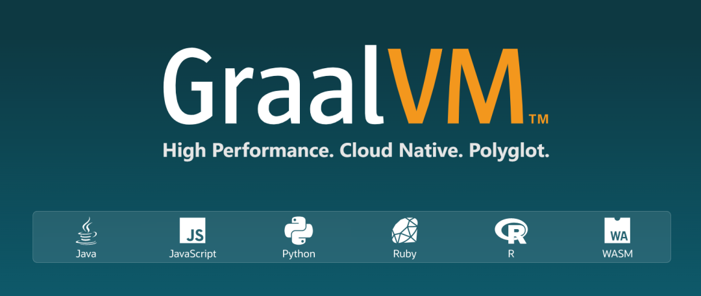
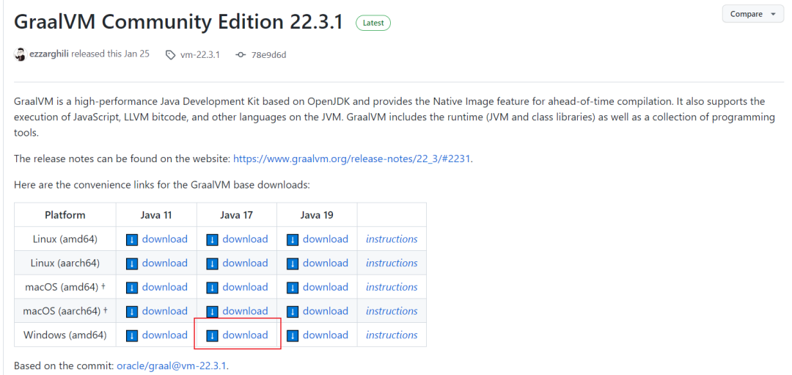
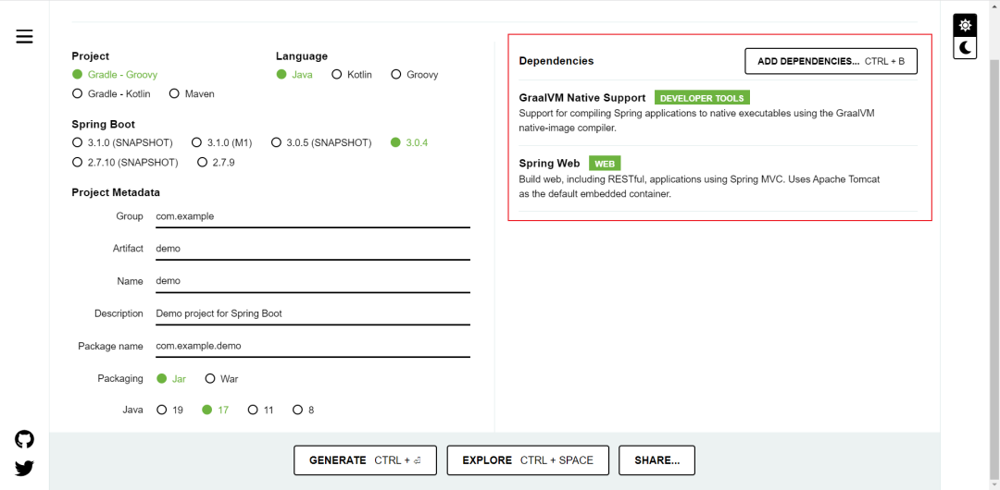
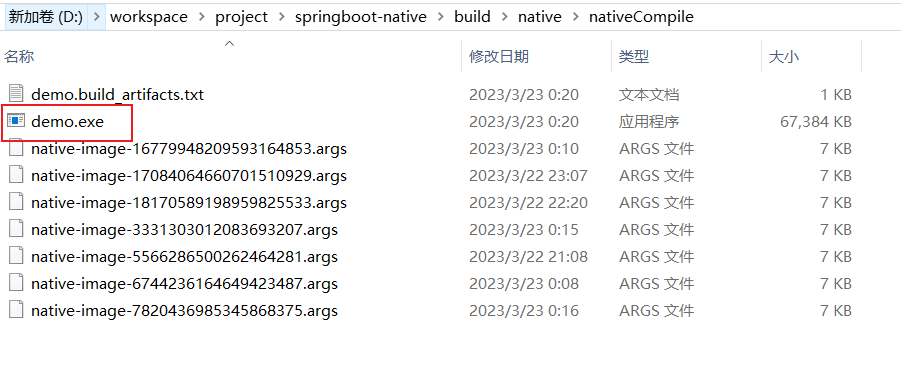
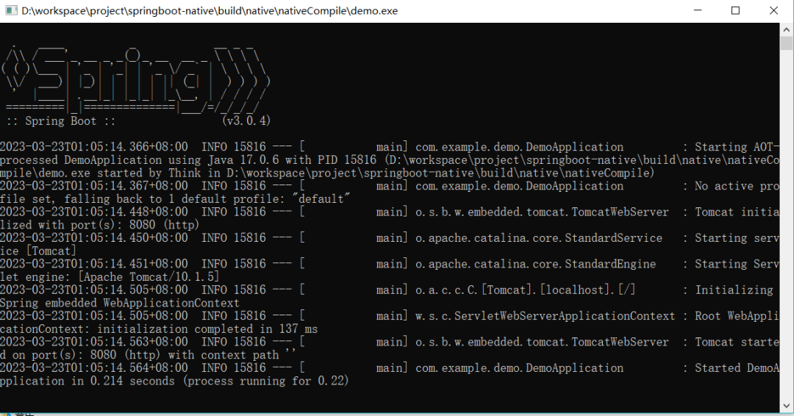

​



## 一、下载安装GraalVM

<https://github.com/graalvm/graalvm-ce-builds/releases/tag/vm-22.3.1>



我下载的是当前最新的GraalVM Community Edition 22.3.1，选择的是Java 17。

下载好之后解压到本地随便一个目录（比如：D:\software\Java\graalvm-ce-java17-22.3.1），并配置环境变量Path。

打开命令提示符，进入到jdk的bin目录，通过gu命令安装native-image。

```cmd
C:\Users\Think>D:

D:\>cd software\Java\graalvm-ce-java17-22.3.1\bin

D:\software\Java\graalvm-ce-java17-22.3.1\bin>gu install native-image
```

安装完之后可以通过gu list命令查看是否成功安装

```cmd
D:\software\Java\graalvm-ce-java17-22.3.1\bin>gu list
ComponentId              Version             Component name                Stability                     Origin
---------------------------------------------------------------------------------------------------------------------------------

graalvm                  22.3.1              GraalVM Core                  Supported
native-image             22.3.1              Native Image                  Early adopter                 github.com
```

## 二、安装Microsoft Visual Studio

windows系统上要正常运行native-image，必须安装MSVC，否则会报以下错误。

> Default native-compiler executable 'cl.exe' not found via environment variab

或者以下错误

> Error compiling query code (in C:\Users\xxx\AppData\Local\Temp\SVM-8246985

我安装的是2019版的，下载地址是

<https://my.visualstudio.com/Downloads?q=visual%20studio%202019&wt.mc_id=o~msft~vscom~older-downloads>


选择社区版即可，下载完之后就可以安装了，有些教程是说仅仅安装MSVC单组件即可，但是我贪方便，直接安装了C++桌面开发。


安装完之后提示要重启系统，不知道不重启会怎样，反正我是重启了。

接着需要配置三个环境变量

```txt
Path=C:\Program Files (x86)\Microsoft Visual Studio\2019\Community\VC\Tools\MSVC\14.29.30133\bin\Hostx64\x64
```

（这个是解决`cl.exe' not found`错误的）

```txt
LIB=C:\Program Files (x86)\Windows Kits\10\Lib\10.0.19041.0\um\x64;C:\Program Files (x86)\Windows Kits\10\Lib\10.0.19041.0\ucrt\x64;C:\Program Files (x86)\Microsoft Visual Studio\2019\Community\VC\Tools\MSVC\14.29.30133\lib\x64;
INCLUDE=C:\Program Files (x86)\Windows Kits\10\Include\10.0.19041.0\ucrt;C:\Program Files (x86)\Windows Kits\10\Include\10.0.19041.0\um;C:\Program Files (x86)\Windows Kits\10\Include\10.0.19041.0\shared;C:\Program Files (x86)\Microsoft Visual Studio\2019\Community\VC\Tools\MSVC\14.29.30133\include;
```

（这是解决`Error compiling query code`错误的）

要注意的是，**这些文件路径带有版本号，以实际为准**。

## 三、运行springboot示例代码

如果自己已经有springboot项目，可以直接修改，为了直观，直接用springboot示例代码，比较直观，有问题也能快速排查。

从spring官网可以根据要求定制示例代码。

<https://start.spring.io/>



我只选择了GraalVM Native Support和Spring Web，只要能跑起来就可以。选完之后按"GENERATE"按钮即可下载。

下载后解压到本地随意目录（比如：D:\workspace\project\springboot-native）。

打开命令提示符，进到项目目录，敲上以下命令就可以直接构建springboot可直接运行文件。

```cmd
D:\software\Java\graalvm-ce-java17-22.3.1\bin>cd D:\workspace\project\springboot-native
D:\workspace\project\springboot-native>gradlew nativeCompile
```

顺便把结果贴一下，以便参考

```cmd
> Task :nativeCompile
[native-image-plugin] GraalVM Toolchain detection is disabled
[native-image-plugin] GraalVM location read from environment variable: JAVA_HOME
[native-image-plugin] Native Image executable path: D:\software\Java\graalvm-ce-java17-22.3.1\bin\native-image.cmd
=======================================================================================================================
GraalVM Native Image: Generating 'demo' (executable)...
========================================================================================================================
[1/7] Initializing...                                                                                   (17.6s @ 0.19GB
 Version info: 'GraalVM 22.3.1 Java 17 CE'
 Java version info: '17.0.6+10-jvmci-22.3-b13'
 C compiler: cl.exe (microsoft, x64, 19.29.30148)
 Garbage collector: Serial GC
 1 user-specific feature(s)

- org.springframework.aot.nativex.feature.PreComputeFieldFeature
Field org.apache.commons.logging.LogAdapter#log4jSpiPresent set to true at build time
Field org.apache.commons.logging.LogAdapter#log4jSlf4jProviderPresent set to true at build time
Field org.apache.commons.logging.LogAdapter#slf4jSpiPresent set to true at build time
Field org.apache.commons.logging.LogAdapter#slf4jApiPresent set to true at build time
Field org.springframework.core.NativeDetector#imageCode set to true at build time
Field org.springframework.format.support.DefaultFormattingConversionService#jsr354Present set to false at build time
Field org.springframework.core.KotlinDetector#kotlinPresent set to false at build time
Field org.springframework.core.KotlinDetector#kotlinReflectPresent set to false at build time
Field org.springframework.cglib.core.AbstractClassGenerator#imageCode set to true at build time
Field org.springframework.boot.logging.log4j2.Log4J2LoggingSystem$Factory#PRESENT set to false at build time
Field org.springframework.boot.logging.logback.LogbackLoggingSystem$Factory#PRESENT set to true at build time
Field org.springframework.boot.logging.java.JavaLoggingSystem$Factory#PRESENT set to true at build time
Field org.springframework.web.servlet.config.annotation.WebMvcConfigurationSupport#romePresent set to false at build time
Field org.springframework.web.servlet.config.annotation.WebMvcConfigurationSupport#jaxb2Present set to false at build time
Field org.springframework.web.servlet.config.annotation.WebMvcConfigurationSupport#jackson2Present set to true at build time
Field org.springframework.web.servlet.config.annotation.WebMvcConfigurationSupport#jackson2XmlPresent set to false at build time
Field org.springframework.web.servlet.config.annotation.WebMvcConfigurationSupport#jackson2SmilePresent set to false at build time
Field org.springframework.web.servlet.config.annotation.WebMvcConfigurationSupport#jackson2CborPresent set to false at build time
Field org.springframework.web.servlet.config.annotation.WebMvcConfigurationSupport#gsonPresent set to false at build time
Field org.springframework.web.servlet.config.annotation.WebMvcConfigurationSupport#jsonbPresent set to false at build time
Field org.springframework.web.servlet.config.annotation.WebMvcConfigurationSupport#kotlinSerializationCborPresent set to false at build time
Field org.springframework.web.servlet.config.annotation.WebMvcConfigurationSupport#kotlinSerializationJsonPresent set to false at build time
Field org.springframework.web.servlet.config.annotation.WebMvcConfigurationSupport#kotlinSerializationProtobufPresent set to false at build time
Field org.springframework.web.context.request.RequestContextHolder#jsfPresent set to false at build timed time
Field org.springframework.web.servlet.view.InternalResourceViewResolver#jstlPresent set to false at build time
Field org.springframework.http.converter.json.Jackson2ObjectMapperBuilder#jackson2XmlPresent set to false at build time
Field org.springframework.boot.logging.logback.LogbackLoggingSystemProperties#JBOSS_LOGGING_PRESENT set to false at build time
Field org.springframework.boot.autoconfigure.web.format.WebConversionService#JSR_354_PRESENT set to false at build time
Field org.springframework.http.converter.support.AllEncompassingFormHttpMessageConverter#jaxb2Present set to false at build time
Field org.springframework.http.converter.support.AllEncompassingFormHttpMessageConverter#jackson2Present set to true at build time
Field org.springframework.http.converter.support.AllEncompassingFormHttpMessageConverter#jackson2XmlPresent set to false at build time
Field org.springframework.http.converter.support.AllEncompassingFormHttpMessageConverter#jackson2SmilePresent set to false at build time
Field org.springframework.http.converter.support.AllEncompassingFormHttpMessageConverter#gsonPresent set to false at build time
Field org.springframework.http.converter.support.AllEncompassingFormHttpMessageConverter#jsonbPresent set to false at build time
Field org.springframework.http.converter.support.AllEncompassingFormHttpMessageConverter#kotlinSerializationCborPresent set to false at build time
Field org.springframework.http.converter.support.AllEncompassingFormHttpMessageConverter#kotlinSerializationJsonPresent set to false at build time
Field org.springframework.http.converter.support.AllEncompassingFormHttpMessageConverter#kotlinSerializationProtobufPresent set to false at build time
Field org.springframework.context.event.ApplicationListenerMethodAdapter#reactiveStreamsPresent set to false at build time
Field org.springframework.web.client.RestTemplate#romePresent set to false at build time
Field org.springframework.web.client.RestTemplate#jaxb2Present set to false at build time
Field org.springframework.web.client.RestTemplate#jackson2Present set to true at build time
Field org.springframework.web.client.RestTemplate#jackson2XmlPresent set to false at build time
Field org.springframework.web.client.RestTemplate#jackson2SmilePresent set to false at build time
Field org.springframework.web.client.RestTemplate#jackson2CborPresent set to false at build time
Field org.springframework.web.client.RestTemplate#gsonPresent set to false at build time
Field org.springframework.web.client.RestTemplate#jsonbPresent set to false at build time
Field org.springframework.web.client.RestTemplate#kotlinSerializationCborPresent set to false at build time
Field org.springframework.web.client.RestTemplate#kotlinSerializationJsonPresent set to false at build time
Field org.springframework.web.client.RestTemplate#kotlinSerializationProtobufPresent set to false at build time
Field org.springframework.core.ReactiveAdapterRegistry#reactorPresent set to false at build time
Field org.springframework.core.ReactiveAdapterRegistry#rxjava3Present set to false at build time
Field org.springframework.core.ReactiveAdapterRegistry#kotlinCoroutinesPresent set to false at build time
Field org.springframework.core.ReactiveAdapterRegistry#mutinyPresent set to false at build time
SLF4J: No SLF4J providers were found.
SLF4J: Defaulting to no-operation (NOP) logger implementation
SLF4J: See <https://www.slf4j.org/codes.html#noProviders> for further details.
Field org.springframework.web.servlet.mvc.method.annotation.ReactiveTypeHandler#isContextPropagationPresent set to false at build time
Field org.springframework.web.servlet.support.RequestContext#jstlPresent set to false at build time
[2/7] Performing analysis...  [*********]                                                              (106.1s @ 2.23GB
  15,266 (92.64%) of 16,478 classes reachable
  24,944 (67.69%) of 36,848 fields reachable
  73,664 (62.39%) of 118,077 methods reachable
     798 classes,   242 fields, and 3,537 methods registered for reflection
      83 classes,    78 fields, and    68 methods registered for JNI access
       5 native libraries: crypt32, ncrypt, psapi, version, winhttp
[3/7] Building universe...                                                                              (14.3s @ 1.62GB
[4/7] Parsing methods...      [***]                                                                      (9.1s @ 2.81GB
[5/7] Inlining methods...     [***]                                                                      (5.4s @ 1.76GB
[6/7] Compiling methods...    [********]                                                                (74.8s @ 1.67GB)
[7/7] Creating image...                                                                                 (10.8s @ 3.69GB
  34.48MB (52.40%) for code area:    48,251 compilation units
  30.89MB (46.94%) for image heap:  352,399 objects and 120 resources
 441.67KB ( 0.66%) for other data
  65.80MB in total

------------------------------------------------------------------------------------------------------------------------

Top 10 packages in code area:                               Top 10 object types in image heap
   1.64MB sun.security.ssl                                     7.34MB byte[] for code metadata
   1.05MB java.util                                            3.63MB java.lang.Class
 842.84KB java.lang.invoke                                     3.40MB java.lang.String
 725.07KB com.sun.crypto.provider                              2.84MB byte[] for general heap data
 563.66KB org.apache.catalina.core                             2.80MB byte[] for java.lang.String
 521.32KB org.apache.tomcat.util.net                           1.28MB com.oracle.svm.core.hub.DynamicHubCompanion
 496.14KB org.apache.coyote.http2                              1.02MB byte[] for embedded resources
 477.32KB java.lang                                          821.19KB byte[] for reflection metadata
 470.10KB c.s.org.apache.xerces.internal.impl.xs.traversers  660.87KB java.lang.String[]
 467.51KB java.util.concurrent                               616.78KB java.util.HashMap$Node
  26.98MB for 622 more packages                                5.63MB for 3062 more object types
-----------------------------------------------------------------------------------------------------------------------

                        8.9s (3.5% of total time) in 38 GCs | Peak RSS: 5.83GB | CPU load: 5.40
------------------------------------------------------------------------------------------------------------------------

Produced artifacts
 D:\workspace\project\springboot-native\build\native\nativeCompile\demo.build_artifacts.txt (txt)
 D:\workspace\project\springboot-native\build\native\nativeCompile\demo.exe (executable)
========================================================================================================================

Finished generating 'demo' in 4m 12s.
[native-image-plugin] Native Image written to: D:\workspace\project\springboot-native\build\native\nativeCompile

BUILD SUCCESSFUL in 4m 21s
9 actionable tasks: 1 executed, 8 up-to-date
```

成功之后，就可以在build\native\nativeCompile目录看到可执行文件



直接双击demo.exe即可运行



全篇就到此结束了。。。。

当然，还有另外一种方式，先构建jar包，然后再用native-image命令编译成可执行文件。

```cmd
D:\workspace\project\springboot-native>gradlew build
D:\workspace\project\springboot-native>cd build\libs
D:\workspace\project\springboot-native\build\libs>native-image -jar demo-0.0.1-SNAPSHOT.jar
```

这样也是可以的。

最终打出来的exe文件有65M，也不小，jar包的话也就18M，不过exe不需要jvm环境，并且启动后占用60M内存，而直接启动jar文件占用109M内存，相对来说还是有优势。
