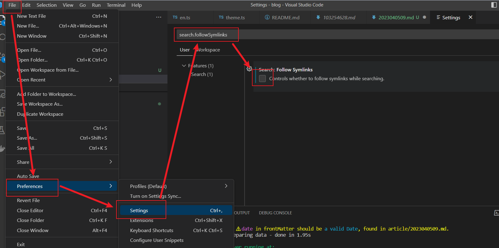

​​

最近在用 vuepress 制作自己的博客，打开了尘封很久的 vscode，但是发现一个问题，每次切换到其他应用再切回到 vscode，都会卡顿几秒钟，大大降低了使用感受。
打开任务管理器看了一下，发现 CPU 占用率达到了 100%。本来还以为是笔记本电脑 CPU 太低了，打算看看我的 ThinkPad T480 能不能升级 CPU，但是网上说 T480 的 CPU 是刀锋设计，一般人换不下来。
然后我 baidu 了一下 vscode 慢的原因，第一个搜索结果里说是插件装太多了导致慢，但是这个就不好排查了。
接着看第二个搜索结果，[vscode运行卡顿解决方案](https://blog.csdn.net/weixin_43599212/article/details/129175936)，真的解决问题了，具体操作如下：

> 文件->首选项->设置->搜索“search.followSymlinks”取消勾选即可。

