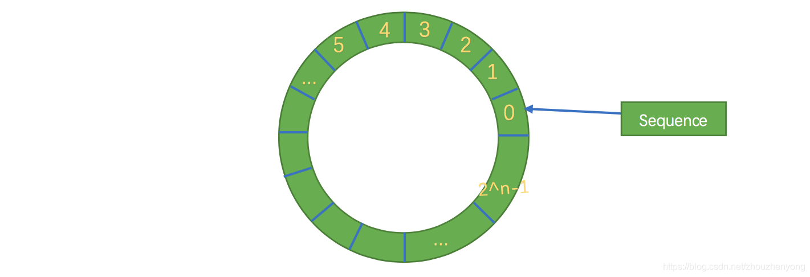

​

## 一、背景

### 1.来源

Disruptor是英国外汇交易公司LMAX开发的一个高性能队列，研发的初衷是解决内部的内存队列的延迟问题，而不是分布式队列。基于Disruptor开发的系统单线程能支撑每秒600万订单，2010年在QCon演讲后，获得了业界关注。

### 2.应用背景和介绍

据目前资料显示：应用Disruptor的知名项目有如下的一些：Storm, Camel, Log4j2,还有目前的美团点评技术团队也有很多不少的应用，或者说有一些借鉴了它的设计机制。  
Disruptor是一个高性能的线程间异步通信的框架，即在同一个JVM进程中的多线程间消息传递。

## 二、传统队列问题

首先这里说的队列也仅限于Java内部的消息队列

队列 | 有界性 | 锁 | 结构 | 队列类型
--- | --- | --- | --- | ---
ArrayBlockingQueue | 有界 | 加锁 | 数组 | 阻塞
LinkedBlockingQueue | 可选 | 加锁 | 链表 | 阻塞
ConcurrentLinkedQueue | 无界 | 无锁 | 链表 | 非阻塞
LinkedTransferQueue | 无界 | 无锁 | 链表 | 阻塞
PriorityBlockingQueue | 无界 | 加锁 | 堆 | 阻塞
DelayQueue | 无界 | 加锁 | 堆 | 阻塞

队列的底层数据结构一般分成三种：数组、链表和堆。其中，堆这里是为了实现带有优先级特性的队列，暂且不考虑。  
在稳定性和性能要求特别高的系统中，为了防止生产者速度过快，导致内存溢出，只能选择有界队列；同时，为了减少Java的垃圾回收对系统性能的影响，会尽量选择array/heap格式的数据结构。这样筛选下来，符合条件的队列就只有ArrayBlockingQueue。但是ArrayBlockingQueue是通过加锁的方式保证线程安全，而且ArrayBlockingQueue还存在伪共享问题，这两个问题严重影响了性能。  
其中对于影响性能的两种方式：加锁和伪共享我们这里首先介绍下。加锁方式和不加锁的CAS方式这里不再进行介绍，我们这里首先对其中的伪共享问题讲解下。

### 1.伪共享概念

#### 共享

计算机早就支持多核，软件也越来越多的支持多核运行，其实也可以叫做多处理运行。一个处理器对应一个物理插槽。其中一个插槽对应一个L3 Cache，一个槽包含多个cpu。一个cpu包含寄存器、L1 Cache、L2 Cache，如下图所示：


其中越靠近cpu则，速度越快，容量则越小。其中L1和L2是只能给一个cpu进行共享，但是L3是可以给同一个槽内的cpu共享，而主内存，是可以给所有的cpu共享，这就是内存的共享。  
其中cpu执行运算的流程是这样：首先回去L1里面查找对应数据，如果没有则去L2、L3，如果都没有，则就会去主内存中去拿，走的路越长，则耗费时间越久，性能就会越低。  
需要注意的是，当线程之间进行共享数据的，需要将数据写回到主内存中，而另一个线程通过访问主内存获得新的数据。  
有人就会问了，多个线程之间不是会有一些非主内存的缓存进行共享么，那么另外一个线程会不会直接访问到修改之前的内存呢。答案是会的，但是有一点，就是这种数据我们可以通过设置缓存失效策略来进行保证缓存的最新，这个方式其实在cpu这里进行设置的，叫内存屏障（其实就是在cpu这里设置一条指令，这个指令就是禁止cpu重排序，这个屏障之前的不能出现在屏障之后，屏障之后的处理不能出现屏障之前，也就是屏障之后获取到的数据是最新的），对应到应用层面就是一个关键字volatile，下面会有一些进行介绍。

#### 缓存行

刚刚说的缓存失效其实指的是Cache line的失效，也就是缓存行，Cache是由很多个Cache line 组成的，每个缓存行大小是32~128字节（通常是64字节）。我们这里假设缓存行是64字节，而java的一个Long类型是8字节，这样的话一个缓存行就可以存8个Long类型的变量，如下图所示：


cpu 每次从主内存中获取数据的时候都会将相邻的数据存入到同一个缓存行中。假设我们访问一个Long内存对应的数组的时候，如果其中一个被加载到内存中，那么对应的后面的7个数据也会被加载到对应的缓存行中，这样就会非常快的访问数据。

#### 伪共享

刚我们说了缓存的失效其实就是缓存行的失效，缓存行失效的原理是什么，这里又涉及到一个MESI协议（缓存一致性协议），我们这里不介绍这个，我们只需知道这个会在一个缓存中的数据变化的时候会将其他所有存储该缓存的缓存（其实是缓存行）都失效，感兴趣的可以看下附录部分，首先我们用Disruptor中很经典的讲解伪共享的图来讲解下：


上图中显示的是一个槽的情况，里面是多个cpu， 如果cpu1上面的线程更新了变量X，根据MESI协议，那么变量X对应的所有缓存行都会失效（注意：虽然改的是X，但是X和Y被放到了一个缓存行，就一起失效了），这个时候如果cpu2中的线程进行读取变量Y，发现缓存行失效，想获取Y就会按照缓存查找策略，往上查找，如果期间cpu1对应的线程更新X后没有访问X（也就是没有刷新缓存行），cpu2的线程就只能从主内存中获取数据，对性能就会造成很大的影响，这就是伪共享。  
表面上 X 和 Y 都是被独立线程操作的，而且两操作之间也没有任何关系。只不过它们共享了一个缓存行，但所有竞争冲突都是来源于共享。

### 2.ArrayBlockingQueue 的伪共享问题

刚我们已经讲了伪共享的问题，那么ArrayBlockingQueue的这个伪共享问题存在于哪里呢，分析下核心的部分源码

```java
public void put(E e) throws InterruptedException {
    checkNotNull(e);
    final ReentrantLock lock = this.lock;
    //获取当前对象锁
    lock.lockInterruptibly();
    try {
        while (count == items.length)
            //阻塞并释放锁，等待notFull.signal()通知
            notFull.await();
        //将数据放入数组
        enqueue(e);
    } finally {
        lock.unlock();
    }
}
```

```java
private void enqueue(E x) {
    final Object[] items = this.items;
    //putIndex 就是入队的下标
    items[putIndex] = x;
    if (++putIndex == items.length)
        putIndex = 0;
    count++;
    notEmpty.signal();
}
```

```java
public E take() throws InterruptedException {
    final ReentrantLock lock = this.lock;
    //加锁
    lock.lockInterruptibly();
    try {
        while (count == 0)
            //阻塞并释放对象锁，并等待notEmpty.signal()通知
            notEmpty.await();
        //在数据不为空的情况下
        return dequeue();
    } finally {
        lock.unlock();
    }
}
```

```java
private E dequeue() {
    final Object[] items = this.items;
    //takeIndex 是出队的下标
    E x = (E) items[takeIndex];
    items[takeIndex] = null;
    if (++takeIndex == items.length)
        takeIndex = 0;
    count--;
    if (itrs != null)
        itrs.elementDequeued();
    notFull.signal();
    return x;
}
```

其中最核心的三个成员变量为

- **putIndex**：入队下标
- **takeIndex**：出队下标
- **count**：队列中元素的数量

而三个成员的位置如下：


这三个变量很容易放到同一个缓存行中，为此专门用一个伪共享检测工具进行检测，目前检测伪共享的工具只有Intel的Intel Vtune 目前刚发现有mac os 版本，但是经过测试发现，该工具无法分析macOs 的处理器配置，用的时候发现如下错误“无法检测到支持的处理器配置”，这个可以遗留给其他同学，工具的安装和使用方式，可以查看附录中的另外的一个连接。

## 三、高性能原理

刚说了上面队列的两个性能问题：一个是加锁，一个是伪共享，那么disruptor是怎么解决这两个问题的，以及除了解决这两个问题之外，还引入了其他什么先进的东西提升性能的。
这里简单列举下：

- **引入环形的数组结构**：数组元素不会被回收，避免频繁的GC，
- **无锁的设计**：采用CAS无锁方式，保证线程的安全性
- **属性填充**：通过添加额外的无用信息，避免伪共享问题
- **元素位置的定位**：采用跟一致性哈希一样的方式，一个索引，进行自增

### 1.环形数组结构

环形数组结构是整个Disruptor的核心所在。  
首先因为是数组，所以要比链表快，而且根据我们对上面缓存行的解释知道，数组中的一个元素加载，相邻的数组元素也是会被预加载的，因此在这样的结构中，cpu无需时不时去主存加载数组中的下一个元素。而且，你可以为数组预先分配内存，使得数组对象一直存在（除非程序终止）。这就意味着不需要花大量的时间用于垃圾回收。此外，不像链表那样，需要为每一个添加到其上面的对象创造节点对象—对应的，当删除节点时，需要执行相应的内存清理操作。环形数组中的元素采用覆盖方式，避免了jvm的GC。  
其次结构作为环形，数组的大小为2的n次方，这样元素定位可以通过位运算效率会更高，这个跟一致性哈希中的环形策略有点像。在disruptor中，这个牛逼的环形结构就是RingBuffer，既然是数组，那么就有大小，而且这个大小必须是2的n次方，结构如下：



其实质只是一个普通的数组，只是当放置数据填充满队列（即到达2^n-1位置）之后，再填充数据，就会从0开始，覆盖之前的数据，于是就相当于一个环。

### 2.生产和消费模式

根据上面的环形结构，我们来具体分析一下Disruptor的工作原理。
Disruptor 不像传统的队列，分为一个队头指针和一个队尾指针，而是只有一个角标（上面的seq），那么这个是如何保证生产的消息不会覆盖没有消费掉的消息呢。  
在Disruptor中生产者分为单生产者和多生产者，而消费者并没有区分。单生产者情况下，就是普通的生产者向RingBuffer中放置数据，消费者获取最大可消费的位置，并进行消费。而多生产者时候，又多出了一个跟RingBuffer同样大小的Buffer，称为AvailableBuffer。在多生产者中，每个生产者首先通过CAS竞争获取可以写的空间，然后再进行慢慢往里放数据，如果正好这个时候消费者要消费数据，那么每个消费者都需要获取最大可消费的下标，这个下标是在AvailableBuffer进行获取得到的最长连续的序列下标。

#### 多生产者——生产

假设现在又两个生产者，开始写数据，通过CAS竞争，w1得到的34的空间，w2得到了78的空间，其中6是代表已被写入或者没有被消费的数据。


绿色代表已经写OK的数据

#### 多生产者——消费

假设三个生产者在写中，还没有置位AvailableBuffer，那么消费者可获取的消费下标只能获取到6，然后等生产者都写OK后，通知到消费者，消费者继续重复上面的步骤。如下图


#### 消费者常见的等待

- **BusySpinWaitStrategy**： 自旋等待，类似Linux Kernel使用的自旋锁。低延迟但同时对CPU资源的占用也多。
- BlockingWaitStrategy： 使用锁和条件变量。CPU资源的占用少，延迟大，默认等待策略。
- **SleepingWaitStrategy**： 在多次循环尝试不成功后，选择让出CPU，等待下次调度，多次调度后仍不成功，尝试前睡眠一个纳秒级别的时间再尝试。这种策略平衡了延迟和CPU资源占用，但延迟不均匀。
- **YieldingWaitStrategy**： 在多次循环尝试不成功后，选择让出CPU，等待下次调。平衡了延迟和CPU资源占用，但延迟也比较均匀。
- **PhasedBackoffWaitStrategy**： 上面多种策略的综合，CPU资源的占用少，延迟大

### 3.牛逼的下标指针

RingBuffer的指针（Sequence）属于一个volatile变量，同时也是我们能够不用锁操作就能实现Disruptor的原因之一，而且通过缓存行补充，避免伪共享问题。 该所谓指针是通过一直自增的方式来获取下一个可写或者可读数据，该数据是Long类型，不用担心会爆掉。有人计算过： [long的范围最大可以达到9223372036854775807，一年365 *24* 60 * 60 = 31536000秒，每秒产生1W条数据，也可以使用292年](https://link.jianshu.com/?t=https://github.com/LMAX-Exchange/disruptor/issues/154#event-671348970)。

```java
class LhsPadding{
    //缓存行补齐， 提升cache缓存命中率
    protected long p1, p2, p3, p4, p5, p6, p7;
}

class Value extends LhsPadding{
    protected volatile long value;
}

class RhsPadding extends Value{
    //缓存行补齐， 提升cache缓存命中率
    protected long p9, p10, p11, p12, p13, p14, p15;
}

public class Sequence extends RhsPadding{
    ...
}
```

## 四、用法

用法很简单，一共三个角色：生产者，消费者，disruptor对象

### 1.简单用法

#### disruptor对象

disruptor 就两个构造方法

```java
public Disruptor(
        final EventFactory<T> eventFactory,    // 数据实体构造工厂
        final int ringBufferSize,              // 队列大小，必须是2的次方
        final ThreadFactory threadFactory,     // 线程工厂
        final ProducerType producerType,       // 生产者类型，单个生产者还是多个
        final WaitStrategy waitStrategy){      // 消费者等待策略
    ...
}

public Disruptor(
    final EventFactory<T> eventFactory,
    final int ringBufferSize,
    final ThreadFactory threadFactory){
    ...
}
```

#### 生产处理

生产者这里没有固定的对象，只是需要获取放置数据的位置，然后进行publish

```java
public void send(String data){
    RingBuffer<MsgEvent> ringBuffer = this.disruptor.getRingBuffer();
    //获取下一个放置数据的位置
    long next = ringBuffer.next();
    try{
        MsgEvent event = ringBuffer.get(next);
        event.setValue(data);
    }finally {
        //发布事件
        ringBuffer.publish(next);
    }
}
```

#### 消费处理

消费处理可以有如下几种

```java
public EventHandlerGroup<T> handleEventsWith(final EventHandler<? super T>... handlers){
    ...
}
public EventHandlerGroup<T> handleEventsWith(final EventProcessor... processors){
    ...
}
public EventHandlerGroup<T> handleEventsWith(final EventProcessorFactory<T>... eventProcessorFactories){
    ...
}
public EventHandlerGroup<T> handleEventsWithWorkerPool(final WorkHandler<T>... workHandlers){
    ...
}
```

#### 简单用例

```java
//消费者
public class MsgConsumer implements EventHandler<MsgEvent>{
    private String name;
    public MsgConsumer(String name){
        this.name = name;
    }
    @Override
    public void onEvent(MsgEvent msgEvent, long l, boolean b) throws Exception {
        System.out.println(this.name+" -> 接收到信息： "+msgEvent.getValue());
    }
}

//生产者处理
public class MsgProducer {
    private Disruptor disruptor;
    public MsgProducer(Disruptor disruptor){
        this.disruptor = disruptor;
    }

    public void send(String data){
        RingBuffer<MsgEvent> ringBuffer = this.disruptor.getRingBuffer();
        long next = ringBuffer.next();
        try{
            MsgEvent event = ringBuffer.get(next);
            event.setValue(data);
        }finally {
            ringBuffer.publish(next);
        }
    }

    public void send(List<String> dataList){
        dataList.stream().forEach(data -> this.send(data));
    }
}

//触发测试
public class DisruptorDemo {
    @Test
    public void test(){
        Disruptor<MsgEvent> disruptor = new Disruptor<>(MsgEvent::new, 1024, Executors.defaultThreadFactory());

        //定义消费者
        MsgConsumer msg1 = new MsgConsumer("1");
        MsgConsumer msg2 = new MsgConsumer("2");
        MsgConsumer msg3 = new MsgConsumer("3");

        //绑定配置关系
        disruptor.handleEventsWith(msg1, msg2, msg3);
        disruptor.start();

        // 定义要发送的数据
        MsgProducer msgProducer = new MsgProducer(disruptor);
        msgProducer.send(Arrays.asList("nihao","hah"));
    }
}
```

输出（消费没有固定顺序）：

```java
1 -> 接收到信息： nihao
3 -> 接收到信息： nihao
3 -> 接收到信息： hah
2 -> 接收到信息： nihao
2 -> 接收到信息： hah
1 -> 接收到信息： hah
```

### 2.其他用法

上面主要介绍了多消费统一消费，但是在生产者模型中是有很多种，如下，一对一，一对多，多对多，多对一


1.单生产者生产数据，单消费者消费数据，一般用在后台处理的业务逻辑中。
2.单生产者生产数据，多个消费者消费数据（这里面有两种情况：同一个消息，可以被多个消费者分别消费。或者多个消费者组成一个组，一个消费者消费一个数据）。
3.多个生产者生产数据，单个消费者消费数据，可以用在限流或者排队等候单一资源处理的场景中。
4.多个生产者分别生产数据，多个消费者消费数据（这里面有两种情况：同一个消息，可以被多个消费者分别消费。或者多个消费者组成一个组，一个消费者消费一个数据）。

#### 生产者配置

其中生产模式中的单生产者模式和多生产模式，这里主要是通过一个枚举：ProduceType来区分，建议，多个生产者用多生产者模式，性能会好点。

#### 消费者配置

消费者模式这里分为两种：

- **统一消费**：每个消费者都消费一份生产者生产的数据
- **分组消费**：每个生产这生产的数据只被消费一次

统一消费像上面简单用法中运用即可，对于分组消费，用函数 handleEventsWithWorkerPool 即可

```java
/**
 * 分组处理 handleEventWithWorkerPool
 */
@Test
public void test1(){
    Disruptor<MsgEvent> disruptor = new Disruptor(MsgEvent::new, 1024, Executors.defaultThreadFactory());
    disruptor.handleEventsWithWorkerPool(new MyWorkHandler("work1"), new MyWorkHandler("work2"));

    disruptor.start();

    MsgProducer msgProducer = new MsgProducer(disruptor);
    msgProducer.send(Arrays.asList("aaa","bbb"));
}
```

输出：

```java
work1 : MsgEvent(value=bbb)
work2 : MsgEvent(value=aaa)
work1 : MsgEvent(value=cc)
work2 : MsgEvent(value=dd)
```

#### 消费顺序配置

在消费配置中，这里可以有很多种消费方式，比如：

##### 1.消费者的顺序消费

```java
/**
 * 测试顺序消费
 * 每一条消息的消费者1和3消费完毕后，消费者2再进行消费
 */
@Test
public void test2(){
    MsgConsumer msg1 = new MsgConsumer("1");
    MsgConsumer msg2 = new MsgConsumer("2");
    MsgConsumer msg3 = new MsgConsumer("3");

    Disruptor<MsgEvent> disruptor = new Disruptor(MsgEvent::new, 1024, Executors.defaultThreadFactory());
    disruptor.handleEventsWith(msg1, msg3).then(msg2);
    disruptor.start();

    MsgProducer msgProducer = new MsgProducer(disruptor);
    msgProducer.send(Arrays.asList("aaa", "bbb", "ccc", "ddd"));
}
```

输出（里面的是根据每一条消息的消费者顺序）：

```java
1 -> 接收到信息： aaa
3 -> 接收到信息： aaa
1 -> 接收到信息： bbb
1 -> 接收到信息： ccc
2 -> 接收到信息： aaa
3 -> 接收到信息： bbb
3 -> 接收到信息： ccc
3 -> 接收到信息： ddd
1 -> 接收到信息： ddd
2 -> 接收到信息： bbb
2 -> 接收到信息： ccc
2 -> 接收到信息： ddd
```

##### 2.消费分为多个支线，而且也有消费顺序问题

```java
/**
 * 测试多支线消费
 * 消费者1和消费者3一个支线，消费者2和消费者4一个支线，消费者3和消费者4消费完毕后，消费者5再进行消费
 */
@Test
public void test3(){
    MsgConsumer msg1 = new MsgConsumer("1");
    MsgConsumer msg2 = new MsgConsumer("2");
    MsgConsumer msg3 = new MsgConsumer("3");
    MsgConsumer msg4 = new MsgConsumer("4");
    MsgConsumer msg5 = new MsgConsumer("5");

    //支线：消费者1和消费者3
    disruptor.handleEventsWith(msg1, msg3);
    //支线：消费者2和消费者4
    disruptor.handleEventsWith(msg2, msg4);
    //消费者3和消费者4执行完之后，指向消费者5
    disruptor.after(msg3, msg4).handleEventsWith(msg5);
    disruptor.start();

    MsgProducer msgProducer = new MsgProducer(disruptor);
    msgProducer.send(Arrays.asList("aaa", "bbb", "ccc", "ddd"));
}
```

```java
1 -> 接收到信息： aaa
2 -> 接收到信息： aaa
2 -> 接收到信息： bbb
3 -> 接收到信息： aaa
3 -> 接收到信息： bbb
4 -> 接收到信息： aaa
4 -> 接收到信息： bbb
5 -> 接收到信息： aaa
1 -> 接收到信息： bbb
5 -> 接收到信息： bbb
```

## 五、常见问题

下面介绍下一些常见问题。

**1.disruptor应该如何用才能发挥最大功效？**

disruptor原本就是事件驱动的设计，其整个架构跟普通的多线程很不一样。比如一种用法，将disruptor作为业务处理，中间带I/O处理，这种玩法比多线程还慢；相反，如果将disruptor做业务处理，需要I/O时采用nio异步调用，不阻塞disruptor消费者线程，等到I/O异步调用回来后在回调方法中将后续处理重新塞到disruptor队列中，可以看出来，这是典型的事件处理架构，确实能在时间上占据优势，加上ringBuffer固有的几项性能优化，能让disruptor发挥最大功效。

**2.如果buffer常常是满的怎么办？**

一种是把buffer变大，另一种是从源头解决producer和consumer速度差异太大问题，比如试着把producer分流，或者用多个disruptor，使每个disruptor的load变小。

**3.什么时候使用disruptor？**

如果对延迟的需求很高，可以考虑使用。

## 六、参考

官方git
<https://github.com/LMAX-Exchange/disruptor>
<https://lmax-exchange.github.io/disruptor/>
伪共享：
<https://mechanical-sympathy.blogspot.com/2011/07/false-sharing.html>
内存屏障：
<http://in355hz.iteye.com/blog/1797829>
MESI（缓存一致性协议）
<https://www.cnblogs.com/cyfonly/p/5800758.html>
ArrayBlockingQueue 伪共享问题
<https://www.jianshu.com/p/71c9bc3bfe1a>
jdk 本身针对伪共享做的处理
<https://www.cnblogs.com/Binhua-Liu/p/5620339.html>
intel vtune 分析伪共享案例
<https://software.intel.com/zh-cn/vtune-amplifier-cookbook-false-sharing>
RingBuffer工作原理
<https://www.jianshu.com/p/71c9bc3bfe1a>
<http://wiki.jikexueyuan.com/project/disruptor-getting-started/the-framework.html>
<https://www.jianshu.com/p/d6375295fad4>
<http://colobu.com/2014/12/22/why-is-disruptor-faster-than-ArrayBlockingQueue/>
<https://blog.csdn.net/kobejayandy/article/details/18329583>
<https://blog.csdn.net/u014313492/article/details/42556341>
Disruptor 是如何工作的
<http://in355hz.iteye.com/blog/1797829>
队列的各种场景
<http://www.uml.org.cn/zjjs/2016060310.asp>
消费顺序
<http://357029540.iteye.com/blog/2395677>

---
本文为CSDN博主「老柿子」的原创文章，转载仅为自学。  
原文链接：<https://blog.csdn.net/zhouzhenyong/article/details/81303011>
