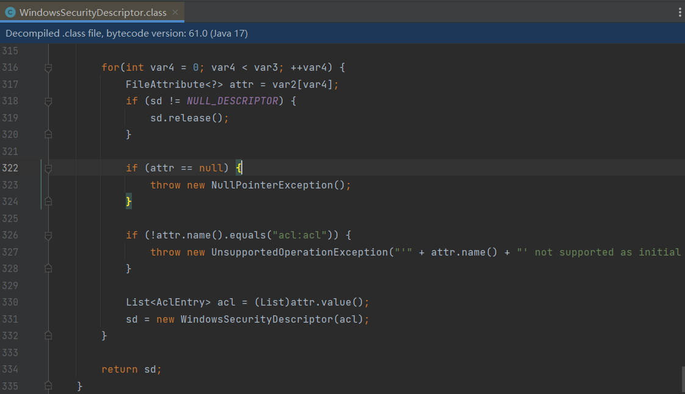
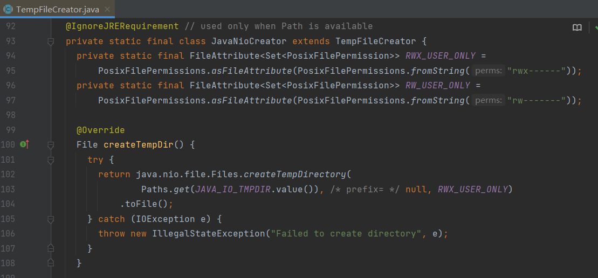
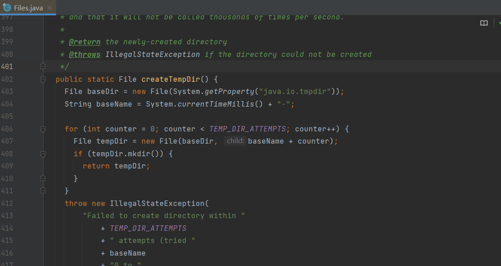
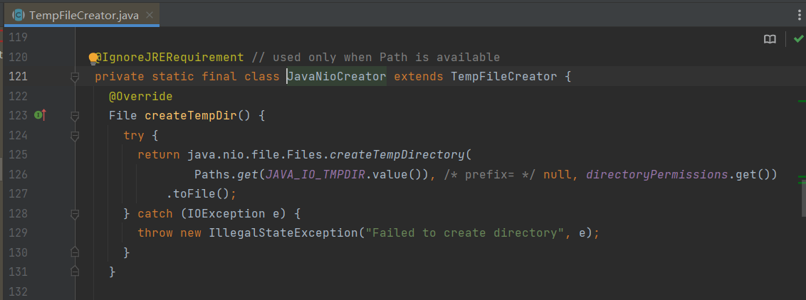
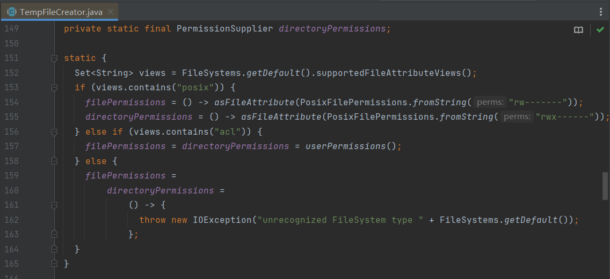

​

## 背景

最近在做项目架构升级，并顺便升级了下基础组件。升级完之后，跑 UT 报一下异常：

```java
Caused by: java.lang.UnsupportedOperationException: 'posix:permissions' not supported as initial attribute
  at java.base/sun.nio.fs.WindowsSecurityDescriptor.fromAttribute(WindowsSecurityDescriptor.java:358)
  at java.base/sun.nio.fs.WindowsFileSystemProvider.createDirectory(WindowsFileSystemProvider.java:509)
  at java.base/java.nio.file.Files.createDirectory(Files.java:700)
  at java.base/java.nio.file.TempFileHelper.create(TempFileHelper.java:134)
  at java.base/java.nio.file.TempFileHelper.createTempDirectory(TempFileHelper.java:171)
  at java.base/java.nio.file.Files.createTempDirectory(Files.java:976)
  at com.google.common.io.TempFileCreator$JavaNioCreator.createTempDir(TempFileCreator.java:102)
  at com.google.common.io.Files.createTempDir(Files.java:439)
  at redis.embedded.util.JarUtil.extractExecutableFromJar(JarUtil.java:13)
  at redis.embedded.RedisExecProvider.get(RedisExecProvider.java:56)
  at redis.embedded.RedisServerBuilder.resolveConfAndExec(RedisServerBuilder.java:105)
  ... 141 more
```

从异常栈信息里大概可以看出来，是在创建临时目录的时候进行权限校验，但不支持 'posix:permissions' 这个属性。

## 分析过程

要分析原因，首先从源码入手。



Windows 只支持 'acl:acl' 这种格式，并不支持 'posix:permissions' 这种格式。那为什么这样呢？难道没做好系统的判断？



再往上溯源，定位到了 guava 的 JavaNioCreator.createTempDir 方法，确实是没有做系统的判断，直接使用了 PosixFilePermission 作为权限属性，但这个只适用于 posix 类型的系统。

Guava 是很出名的开源组件，不至于犯这种低级错误吧？不过升级以前是没这个问题的，查一下以前版本的源码应该能找到原因。



这是 guava:21.0 的 com.google.common.io.Files#createTempDir 方法，可以看到以前版本只用 io 的方法创建临时目录，根本没有使用 nio 的方式。那就是说 guava:32.0.0-jre 才增加 nio 方法，且默认使用 nio 的方式。

既然 guava:32.0.0-jre 有问题，那不如看看最新版本，是否依然存在问题。





通过最新版本 guava:32.1.3-jre 的源码可以看出，最新版本增加了系统判断，分别支持了 'posix:permissions' 和 'acl:acl' 两种属性。

所以，最后是**升级 guava:32.1.3-jre 版本**后解决问题。

就算是 Google 出品的东西也存在漏洞啊，不过很快就被修复了，只是我很不凑巧地被升级到 guava:32.0.0-jre 这个有漏洞的版本。
