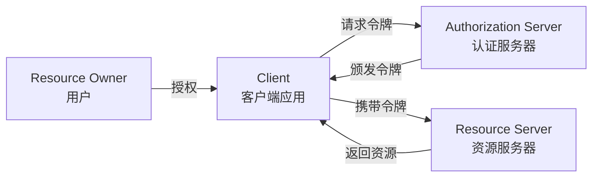
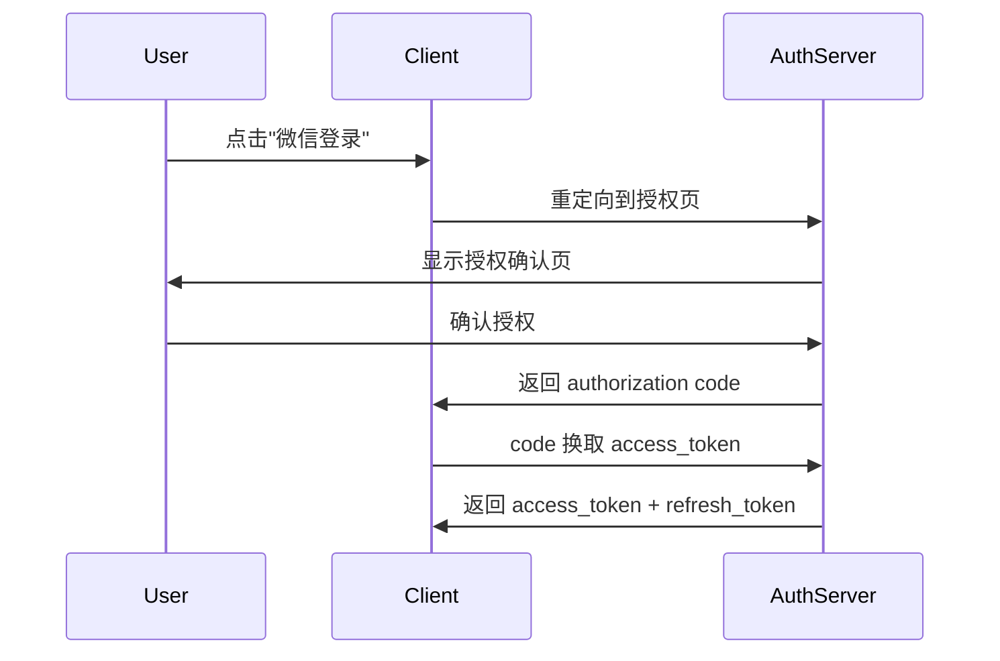

---
title: Spring Security OAuth2 认证授权实战——从原理到落地
author: 布衣云水客
date: 2024-08-03 00:00:00
category:
  - 文章
tag:
  - Spring Security
  - OAuth2
  - 认证授权
  - Java
  - 安全
star: true
---

## 概要

在微服务架构中，认证和授权是绕不开的基础设施。Spring Security OAuth2 是 Java 生态中的事实标准，但也因为配置繁琐、概念众多劝退了不少开发者。

本文从实际项目经验出发，梳理 OAuth2 的核心概念、常见授权模式，以及在 Spring 生态中的落地实践。

## OAuth2 核心概念速览

OAuth2 本质上是一套**委托授权协议**——让用户在不暴露密码的情况下，授权第三方应用访问自己的资源。

四个核心角色：



| 角色 | 职责 | 示例 |
|------|------|------|
| **Resource Owner** | 拥有资源的用户 | 张三 |
| **Client** | 请求访问资源的应用 | 微信公众号后台 |
| **Authorization Server** | 认证并颁发令牌 | 统一认证中心 |
| **Resource Server** | 存储并保护资源 | 订单服务、用户服务 |

## 四种授权模式

OAuth2 定义了四种标准授权流程，选择哪种取决于客户端类型和安全级别：

### 1. Authorization Code（授权码模式）——最安全



适用场景：**有后端服务的 Web 应用**。code 通过后端转发，不经过浏览器，安全性最高。

### 2. PKCE（授权码 + 挑战码）——安全且无需 client_secret

PKCE 是 Authorization Code 的增强版，通过 `code_verifier` / `code_challenge` 机制防止授权码截获攻击。

```java
// 客户端生成 code_verifier 和 code_challenge
String codeVerifier = generateRandomString();
String codeChallenge = sha256(codeVerifier);

// 授权请求带上 code_challenge
// 换取 token 时带上 code_verifier，服务器验证
```

适用场景：**SPA 单页应用、移动端 App**——这些场景无法安全存储 client_secret。

### 3. Client Credentials（客户端凭证模式）

```
Client -> AuthServer: {client_id, client_secret}
AuthServer -> Client: {access_token}
```

适用场景：**服务间调用**，没有用户参与。比如订单服务调用用户服务查询用户信息。

### 4. Refresh Token（刷新令牌）

```json
{
  "access_token": "eyJhbG...",
  "refresh_token": "tGzv3J...",
  "expires_in": 3600
}
```

access_token 有过期时间（通常 1 小时），refresh_token 用于续期（有效期更长，如 30 天）。

## Spring Security OAuth2 架构

Spring 生态中 OAuth2 的实现分两块：

| 组件 | 职责 | Maven 坐标 |
|------|------|-----------|
| **Authorization Server** | 颁发令牌 | `spring-security-oauth2-authorization-server` |
| **Resource Server** | 验证令牌 | `spring-boot-starter-oauth2-resource-server` |

### Authorization Server 配置

```java
@Configuration
@EnableWebSecurity
public class AuthorizationServerConfig {

    @Bean
    @Order(1)
    public SecurityFilterChain authorizationServerFilter(HttpSecurity http) {
        OAuth2AuthorizationServerConfiguration.applyDefaultSecurity(http);
        return http.build();
    }

    @Bean
    public RegisteredClientRepository registeredClientRepository() {
        RegisteredClient client = RegisteredClient.withId(UUID.randomUUID().toString())
            .clientId("jia-client")
            .clientSecret("{noop}secret")
            .clientAuthenticationMethod(ClientAuthenticationMethod.CLIENT_SECRET_BASIC)
            .authorizationGrantType(AuthorizationGrantType.AUTHORIZATION_CODE)
            .authorizationGrantType(AuthorizationGrantType.REFRESH_TOKEN)
            .authorizationGrantType(AuthorizationGrantType.CLIENT_CREDENTIALS)
            .redirectUri("http://localhost:8080/login/oauth2/code/jia")
            .scope("read").scope("write")
            .build();
        return new InMemoryRegisteredClientRepository(client);
    }
}
```

### Resource Server 配置

```java
@Configuration
@EnableWebSecurity
public class ResourceServerConfig {

    @Bean
    public SecurityFilterChain resourceServerFilter(HttpSecurity http) {
        http
            .authorizeHttpRequests(auth -> auth
                .requestMatchers("/api/public/**").permitAll()
                .requestMatchers("/api/admin/**").hasRole("ADMIN")
                .anyRequest().authenticated()
            )
            .oauth2ResourceServer(oauth2 -> oauth2.jwt(Customizer.withDefaults()));
        return http.build();
    }
}
```

应用配置：

```properties
spring.security.oauth2.resourceserver.jwt.issuer-uri=http://auth-server:9000
```

Resource Server 会自动从 `issuer-uri` 获取公钥，验证 JWT 签名——不需要额外配置密钥。

## JWT vs Opaque Token

| 维度 | JWT | Opaque Token |
|------|-----|-------------|
| 格式 | 自包含 JSON，三段 Base64 | 随机字符串 |
| 验证方式 | 本地验签 | 调用 introspection endpoint |
| 性能 | 高（无网络调用） | 低（每次需远程验证） |
| 即时撤销 | 不支持（需黑名单） | 天然支持 |
| 包含信息 | 用户信息在 token 内 | token 无意义，需查询 |

实际项目推荐：**JWT 用于服务间调用，Opaque Token 用于外部 API**。

## Token 持久化

生产环境不能只用内存存储。Spring Authorization Server 提供了 JDBC 实现：

```java
@Bean
public OAuth2AuthorizationService authorizationService(
    JdbcTemplate jdbcTemplate,
    RegisteredClientRepository registeredClientRepository
) {
    return new JdbcOAuth2AuthorizationService(jdbcTemplate, registeredClientRepository);
}

@Bean
public OAuth2AuthorizationConsentService authorizationConsentService(
    JdbcTemplate jdbcTemplate,
    RegisteredClientRepository registeredClientRepository
) {
    return new JdbcOAuth2AuthorizationConsentService(jdbcTemplate, registeredClientRepository);
}
```

对应的表结构：
- `oauth2_authorization` —— 存储授权记录（token、授权码）
- `oauth2_authorization_consent` —— 存储用户授权同意记录
- `oauth2_registered_client` —— 注册的客户端信息

## 实际项目中的鉴权维度

在"超有范"项目中，OAuth 不仅做登录认证，还承载了数据权限控制：

| 维度 | 说明 | Token 中的 Claim |
|------|------|-----------------|
| **用户 ID** | 基础身份 | `sub` |
| **角色** | 管理员/普通用户 | `roles` |
| **客户端** | 区分接入渠道（Web/App/小程序） | `client_id` |
| **OpenID** | 微信用户关联 | `openid` |

一个典型的 JWT payload：

```json
{
  "sub": "user_10001",
  "roles": ["ROLE_USER", "ROLE_VIP"],
  "client_id": "jia-mp",
  "openid": "oH2zD1PUPvspicVak69uB4wDaFLg",
  "iat": 1691059200,
  "exp": 1691062800
}
```

## 安全最佳实践

1. **HTTPS 是前提**——OAuth2 的所有通信必须在 TLS 下进行，否则 token 会被中间人截获
2. **token 有效期要短**——access_token 建议 15-60 分钟，refresh_token 建议 7-30 天
3. **scope 最小化**——每个客户端只授予所需的最小权限范围
4. **redirect_uri 白名单**——必须精确匹配，不允许通配符
5. **PKCE 用于 SPA**——单页应用不要用 implicit flow，用 Authorization Code + PKCE
6. **轮换 refresh_token**——每次刷新时同时颁发新的 refresh_token，旧 token 失效

## 小结

OAuth2 是一套成熟的授权框架，但配置不当会留下严重安全漏洞。

几个关键决策：
- **Authorization Code + PKCE** 是最推荐的授权模式
- **JWT** 适合微服务内部，**Opaque Token** 适合对外 API
- **JDBC 持久化** 是生产环境标配
- **Token payload 保持最小化**——不要把所有用户信息都塞进去

如果你的 Spring 项目还没用上 OAuth2，现在是时候了——Spring Security 6 已经把 OAuth2 Resource Server 作为一等公民集成，上手成本已经大大降低。

---

> 项目中的 OAuth 实现见 `D:\workspace\project\spring-oauth2-demo\` 和 Jia 的 `jia-oauth-mapper` 模块。
