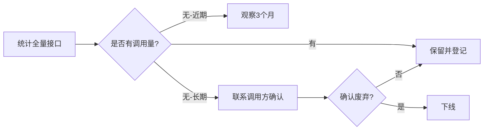
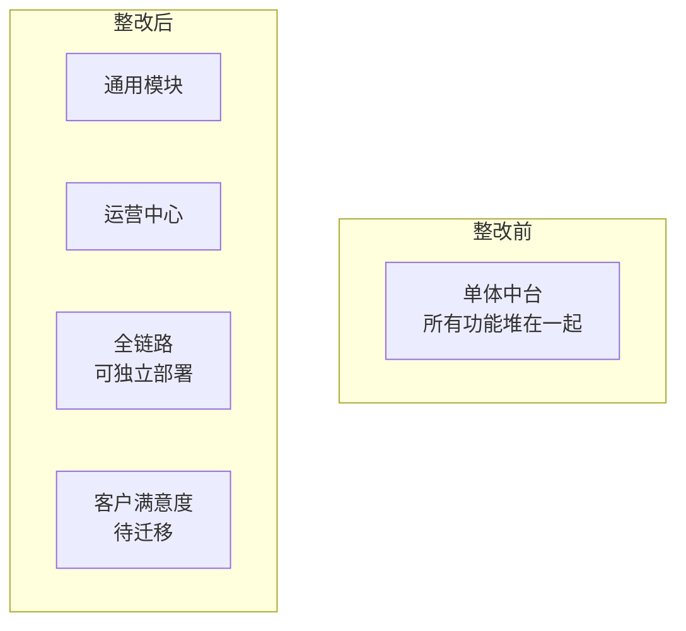

---
title: 企业数字化中台治理——服务下线与架构演进的实践
author: 布衣云水客
date: 2024-11-16 00:00:00
category:
  - 文章
tag:
  - 中台
  - 架构治理
  - 微服务
  - 技术管理
star: true
---

## 概要

中台建起来了，但更难的还在后面——**如何治理一个已经运行多年、服务数量上百、接口调用关系错综复杂的中台系统？**

服务只会越加越多、越改越乱。如果没有一套系统的治理方法，中台最终会从"赋能业务"变成"拖累业务"。

本文分享我在企业级中台治理中的实践经验：服务下线、接口清理、架构整改、跨团队协作——四个维度的实战心得。

## 背景

接手时系统的状态：

- **两套旧框架并存**：云杉（Cloundscape）和 ASP，各自有几十个在役服务
- **接口数量庞大**：Java 中台仅一个业务域就有数十个接口，其中不乏"无人认领"的历史遗留
- **调用关系不透明**：前端直调外部服务、私有服务绕过 API 中心、订阅关系缺失
- **架构腐化**：功能边界模糊，改一个模块要理解整个系统

## 维度一：旧框架下线

这是中台治理中最常见也最头疼的问题——旧的框架已经不再维护，但上面还跑着大量业务。

### 云杉服务下线

云杉（Cloundscape）是一套老的数据服务框架，需要迁移到新的 BIDS 平台。

**策略：分批次、内外有别**

| 分类 | 策略 | 说明 |
|------|------|------|
| 应用内数据消费 | 逐个迁移到 BIDS | 最优先，直接影响日常业务 |
| 应用内数据定制 | 按表安排迁移 | 定制逻辑多，需要逐个评估 |
| 应用外服务 | 等业务方下线后删代码 | 如客户满意度模块计划自主下线 |

关键原则：**不与业务方抢时间**——对方已经计划下线了，就不浪费人力做迁移。

### ASP 服务下线

ASP 是老的应用服务框架。迁移策略类似：

1. **先完成应用内服务迁移**——如管道态势模块，迁移后观察一段时间确认无问题
2. **推动业务方自主迁移**——如产销协同、客户满意度由炯润团队负责
3. **定位"幽灵调用源"**——几个没有注册到 API 中心的服务，需要深入排查找到调用方

> 教训：服务的"出生证明"（谁创建、谁调用、生命周期）必须从一开始就记录，否则几年后清理时就是噩梦。

## 维度二：接口清理

中台接口的熵增法则：**没有下线机制的接口只会越来越多**。

清理流程：

成果：一个业务域就清理了几十个无用接口，剩下接口建立了全量清单——全链路、运营中心、端到端、客户满意度——每个接口都有明确的归属。

## 维度三：架构整改

DDD 四层架构改造（详见前文），这里补充治理视角的心得：

### 模块拆分后的效果

全链路模块因为功能逻辑不复杂，**优先完成了新架构整改**，实现独立部署。这个"先摘低垂的果实"的策略很重要——团队能快速看到成果，积累经验后再啃运营中心的硬骨头。

### 新老并行的纪律

存量功能多的模块，采用渐进式策略：
- **新功能必须用新架构**——这是铁律，不允许在旧架构上加新代码
- **存量功能按模块逐步迁移**——不改就不动，迁移一个、验证一个、上线一个

## 维度四：跨团队协作

中台治理不是中台团队一家的事，涉及多个业务团队：

| 团队 | 角色 | 协作要点 |
|------|------|----------|
| 炯润团队 | 产销协同、客户满意度模块负责人 | 推动他们自主完成 ASP 迁移 |
| AI 平台团队 | 印章鉴伪功能承接方 | 迁移后下线印章模块的大部分接口 |
| 特价系统团队 | 调用方 | 确认历史调用是否仍需保留 |
| 预警中心 | 管道态势和客户满意度使用方 | 因无实际业务流量，计划整体下线 |

协作中的几个经验：
1. **给业务方明确的截止时间和迁移方案**——不能只说"请你迁移"，要说"我们提供了 BIDS 适配方法，你只需要改 3 个文件"
2. **先建新路再拆旧桥**——新接口跑稳定了再下线旧接口
3. **记录每一次沟通决策**——某个接口为什么保留、为什么下线，日后翻旧账时有据可查

## 治理的痛点

坦诚地说，中台治理中最难的不是技术，而是这些：

- **存量功能维护成本高**：功能边界不清、前端直调外部服务、私有服务未注册——这些都是历史债
- **中台开发成本高**：一个简单的 BIDS 透传服务也要单独开发、测试、部署，重复工作多
- **知识点孤岛**：开发人员不熟悉公共平台和框架，遇到问题才多方打听，效率低
- **发布节奏慢**：中台版本发布流程繁琐，无法及时响应业务诉求

这些痛点的根源是**组织和技术架构的不匹配**——技术中台化了，但组织流程没有中台化。

## 小结

企业级中台治理是一项"慢活"——它不是一个大版本上线就完事，而是持续数年、涉及多个团队的系统工程。

核心经验三条：
1. **服务下线优先于功能开发**——删代码比写代码更有价值
2. **新功能强制新架构**——断了在旧代码上加新功能的念想
3. **跨团队协作需要明确的角色和截止时间**——不能指望别人主动配合

如果你的中台也正在经历治理阵痛，希望这些经验能帮你少走弯路。

---

> 本文内容来源于华为数字化运营中台和企业风控中台的实际治理经验。