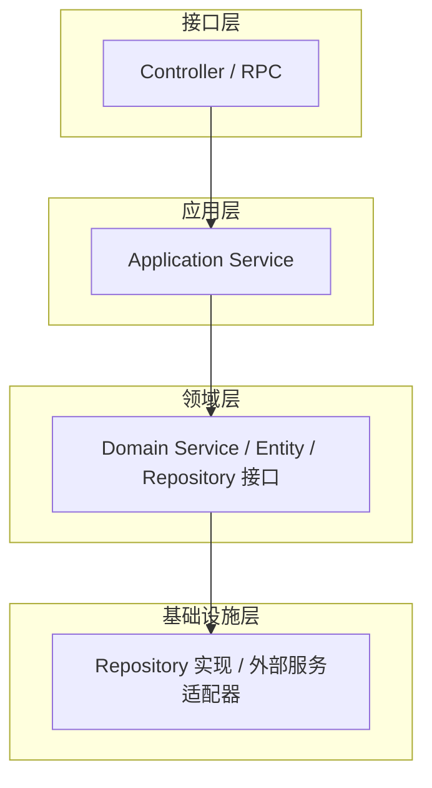

---
title: 企业级中台 DDD 架构整改实战
author: 布衣云水客
date: 2025-04-07 00:00:00
category:
  - 文章
tag:
  - DDD
  - 架构设计
  - 微服务
  - Java
  - 中台
star: true
---

## 概要

接手一个运行多年的企业级中台系统，面对的问题是：**代码耦合严重、模块边界模糊、改一个功能需要理解整个系统**。

经过半年的渐进式改造，我们完成了 DDD（领域驱动设计）四层架构的搭建，将"大泥球"拆分为通用模块、运营中心、全链路三个独立模块。本文记录了这个过程中的关键决策和实践经验。

## 改造前的状况

中台系统经过多年迭代，积累了大量技术债：

- **功能边界不清**：不同应用间通过私有服务直接调用，没有登记到 API 中心，没有订阅关系，溯源困难
- **前端直调外部服务**：绕过了中台网关，鉴权和限流形同虚设
- **存量功能维护成本高**：改一行代码需要理解几千行上下文
- **技术架构不统一**：开发人员不熟悉公共平台和框架，重复造轮

总结成一句话：**能跑，但不敢动。**

## DDD 四层架构设计

我们选择了经典的 DDD 四层架构作为目标：



| 层 | 职责 | 关键约束 |
|-----|------|----------|
| **接口层** | 接收请求、参数校验、响应封装 | 不包含业务逻辑 |
| **应用层** | 编排领域服务、事务管理 | 不包含领域逻辑，只是调度 |
| **领域层** | 核心业务逻辑、领域模型 | 不依赖外部框架和基础设施 |
| **基础设施层** | 数据库访问、外部 API 调用、消息队列 | 实现领域层定义的接口 |

关键在于 **依赖方向是单向的**——上层依赖下层，下层绝不依赖上层。

## 模块拆分策略

一个中台系统通常包含多个业务领域，一刀切地全部重构不现实。我们的策略是：

### 第一步：通用模块

先把所有模块都需要的**基础能力**抽出来：

```
common/
├── util/           # 基础工具类
├── bids/           # BIDS 数据服务抽象
├── external/       # 外部服务调用封装
└── error/          # 统一错误码
```

通用模块没有业务逻辑，是所有模块的**共享地基**。

### 第二步：独立模块

将可以独立运行的部分先拆分：

```
jia-platform/
├── common/         # 通用模块
├── full-chain/     # 全链路模块（独立部署）
├── operation/      # 运营中心模块
└── api-gateway/    # API 网关
```

全链路模块因为功能逻辑相对简单，**优先完成了整改**——旧代码全部按新架构重写，与运营中心代码彻底分离，支持独立部署。

### 第三步：存量渐进式迁移

运营中心是"重灾区"——功能多、逻辑乱、历史包袱重。对此我们采用**绞杀者模式**：

1. 新功能**必须**使用新架构开发
2. 存量功能按模块逐步迁移，不改就不动
3. 迁移一个、验证一个、上线一个

## 基础设施层的关键抽象

基础设施层最容易被忽略但最影响架构质量。我们做了两个重要抽象：

### BIDS 服务抽象

企业内部的 BIDS 数据服务调用方式各不相同，我们统一抽象为：

```java
public interface BidsService {
    <T> T query(BidsRequest request, Class<T> responseType);
    <T> List<T> queryList(BidsRequest request, Class<T> elementType);
}
```

上层代码不需要知道底层是 HTTP 调用还是 RPC 调用，只需要依赖这个接口。

### 外部服务适配器

对接外部系统（如 CRM、ERP）的代码也通过适配器模式隔离：

```java
public interface ExternalServiceAdapter<TReq, TResp> {
    TResp call(TReq request);
}
```

好处是：外部系统换了、接口变了，只需要改适配器实现，业务代码丝毫不动。

## 成果与数据

整改前后的对比：

| 维度 | 整改前 | 整改后 |
|------|--------|--------|
| 模块耦合 | 所有功能在一个模块 | 通用 / 全链路 / 运营中心独立 |
| 部署方式 | 整体部署 | 全链路支持独立部署 |
| 新增功能开发 | 需要理解全局 | 只需关注本模块 |
| BIDS 服务调用 | 每个功能各自实现 | 统一抽象，一行代码搞定 |
| 外部服务对接 | 散落在各个 Service | 统一适配器管理 |

中台接口清理方面也取得了明显成效：**清理了大量无用接口**，厘清了 API 订阅关系，不再"不知道这个接口还有没有人用"。

## 经验总结

1. **不要追求一步到位。** DDD 架构整改最怕"全量重构"——周期长、风险大、业务等不起。绞杀者模式才是正解。
2. **通用模块先行。** 工具类、错误码、服务抽象这些基础设施先整理好，后续迁移会顺畅很多。
3. **新功能强制新架构。** 这是最重要的纪律——如果不坚持，存量会越改越多。
4. **独立部署是架构质量的试金石。** 一个模块能不能独立部署、独立运行，直接反映了它的边界是否清晰。
5. **中台接口要建立生命周期管理。** 接口的上线、变更、下线都应该有流程和记录，否则几年后又是一团乱麻。

## 小结

DDD 不是银弹，但它提供了一套**让团队达成共识的语言和结构**。对于一个多人维护、多业务线交叉的中台系统来说，清晰的边界远比精巧的设计更重要。

改造还在继续，但方向已经明确了。

---

> 本文内容来源于真实的企业中台架构整改项目，相关设计文档见 `D:\workspace\career\德科\CRM\`。