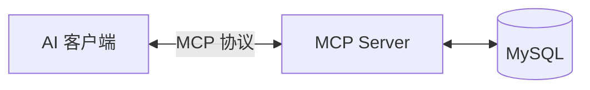

---
title: Spring AI MCP Server —— 让 AI 直接操作数据库
author: 布衣云水客
date: 2025-04-23 00:00:00
category:
  - 文章
tag:
  - Spring AI
  - MCP
  - AI
  - Java
  - Spring Boot
star: true
---

## 概要

2024-2025 年 AI 领域最火的关键词，除了大模型本身，**MCP（Model Context Protocol）**一定排在前列。Anthropic 提出的这套协议，让 AI 模型能够以标准化的方式调用外部工具和数据源，一夜之间成了 AI Agent 的事实标准。

Spring 社区反应极快——Spring AI 1.0.0-M7 已经内置了完整的 MCP Server 支持。本文将带你从零搭建一个 **MCP Database Server**，让 AI 助手能够直接查询你的数据库。

## 为什么需要 MCP？

在没有 MCP 之前，如果想让 AI 访问数据库，通常的做法是：

1. 自己写一个 HTTP API 包装数据库查询
2. 实现 OpenAI Function Calling 格式
3. 处理认证、错误、流式返回……

每个项目都要重复造轮子，而且各家 AI 平台的 Tool 格式还不统一。

MCP 的出现改变了这一切：



**一次实现，所有支持 MCP 的 AI 客户端都能直接使用。**

## 项目搭建

使用 Spring Initializr 创建项目，核心依赖：

```groovy
plugins {
    id 'java'
    id 'org.springframework.boot' version '3.4.4'
    id 'io.spring.dependency-management' version '1.1.7'
}

ext {
    set('springAiVersion', "1.0.0-M7")
}

dependencies {
    implementation 'org.springframework.ai:spring-ai-starter-mcp-server'
    implementation 'org.springframework.boot:spring-boot-starter-jdbc'
    implementation 'mysql:mysql-connector-java:8.0.33'
}

dependencyManagement {
    imports {
        mavenBom "org.springframework.ai:spring-ai-bom:${springAiVersion}"
    }
}
```

三个依赖就搞定——`spring-ai-starter-mcp-server` 负责 MCP 协议层，`spring-boot-starter-jdbc` 负责数据库访问，`mysql-connector-java` 是数据库驱动。

## 实现 DatabaseTool

核心代码只有一个类，用 `@Tool` 注解声明 AI 可调用的方法：

```java
@Component
public class DatabaseTool {
    private final JdbcTemplate jdbcTemplate;

    public DatabaseTool(JdbcTemplate jdbcTemplate) {
        this.jdbcTemplate = jdbcTemplate;
    }

    @Tool(
        name = "execute_sql",
        description = "执行SQL语句并返回结果"
    )
    public List<Map<String, Object>> executeSql(
        @ToolParam(description = "需要执行的SQL语句") String sql
    ) {
        if (sql.trim().toLowerCase().startsWith("select")) {
            return jdbcTemplate.queryForList(sql);
        } else {
            jdbcTemplate.execute(sql);
            return List.of(Map.of(
                "status", "success",
                "rowsAffected",
                jdbcTemplate.queryForObject("SELECT ROW_COUNT()", Integer.class)
            ));
        }
    }
}
```

关键注解说明：

| 注解 | 作用 |
|------|------|
| `@Tool` | 标记这个方法为 AI 可调用的工具，`name` 是工具名，`description` 会传给 AI 帮助它理解何时调用 |
| `@ToolParam` | 标记方法参数，`description` 帮助 AI 正确构造参数值 |

工具内部做了安全区分：`SELECT` 语句返回查询结果，其他语句执行后返回影响行数。

## 注册为 MCP Server

在启动类中将 Tool 注册为 MCP 服务：

```java
@SpringBootApplication
public class JiaAiApplication {

    public static void main(String[] args) {
        SpringApplication.run(JiaAiApplication.class, args);
    }

    @Bean
    public ToolCallbackProvider databaseTools(DatabaseTool databaseTool) {
        return MethodToolCallbackProvider.builder()
            .toolObjects(databaseTool)
            .build();
    }
}
```

`MethodToolCallbackProvider` 会自动扫描 `@Tool` 注解的方法，生成符合 MCP 协议的工具描述。

配置文件中声明 MCP Server 的基本信息：

```properties
spring.application.name=jia-ai-mcp
spring.main.web-application-type=none
spring.ai.mcp.server.name=jia-mcp-database-tool
spring.ai.mcp.server.version=1.0.0

# MySQL 连接配置
spring.datasource.url=jdbc:mysql://host:3306/db?useUnicode=true
spring.datasource.username=xxx
spring.datasource.password=xxx
```

注意 `spring.main.web-application-type=none`——MCP Server 不需要启动 Web 容器，它通过标准输入输出或 SSE 与客户端通信。

## 接入 AI 客户端

MCP Server 启动后，在支持 MCP 的 AI 客户端（如 Claude Desktop、Codex CLI、Continue 等）中添加配置：

```json
{
  "mcpServers": {
    "jia-database": {
      "command": "java",
      "args": ["-jar", "jia-ai-0.0.1-SNAPSHOT.jar"]
    }
  }
}
```

配置完成后，AI 助手就能理解你的数据库结构，并自主调用 `execute_sql` 工具进行查询。

典型对话场景：

- 用户："帮我统计上个月每个品类的订单数量"
- AI 自动生成 SQL → 调用 `execute_sql` → 获得数据 → 分析并回答

## 安全性考量

给 AI 开放数据库执行权限需要谨慎，几个安全建议：

1. **使用只读账号**——给 MCP Server 配置一个有 `SELECT` 权限的数据库用户
2. **SQL 注入防护**——虽然 AI 不太可能恶意注入，但可以在 Tool 内部做 SQL 校验
3. **查询限制**——可以添加 `LIMIT` 强制限制，防止 AI 执行全表扫描
4. **审计日志**——记录所有通过 MCP 执行的 SQL，方便事后审查

```java
@Tool(name = "execute_sql", description = "执行SQL语句并返回结果")
public List<Map<String, Object>> executeSql(@ToolParam(description = "SQL") String sql) {
    // 只允许 SELECT 语句
    if (!sql.trim().toLowerCase().startsWith("select")) {
        throw new IllegalArgumentException("仅允许 SELECT 查询");
    }
    // 强制限制返回行数
    if (!sql.toLowerCase().contains("limit")) {
        sql = sql + " LIMIT 100";
    }
    log.info("MCP SQL: {}", sql);
    return jdbcTemplate.queryForList(sql);
}
```

## 小结

Spring AI 让构建 MCP Server 变得异常简单——只需一个 `@Tool` 注解和几行配置。通过 MCP 协议，你的 AI 助手真正拥有了"动手"能力，而不只是"动嘴"。

这个项目的扩展方向也很多：
- 添加更多 Tool：文件操作、API 调用、定时任务……
- 接入向量数据库，实现 RAG
- 多数据源支持

MCP + Spring AI 的组合还处于早期，但方向已经非常清晰了。

---

> 完整代码见 `D:\workspace\project\spring-ai`，可直接编译运行。