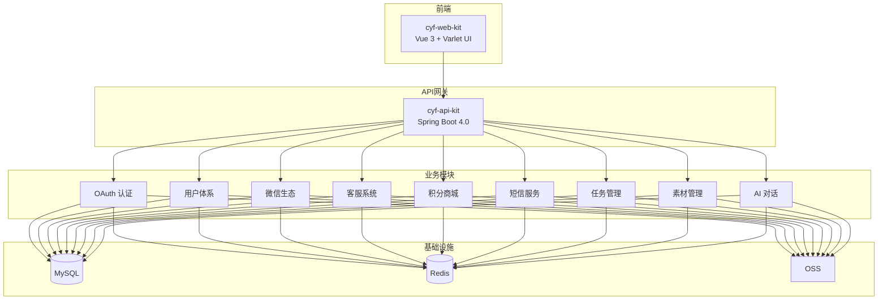

---
title: 超有范——一个全栈微服务平台的架构设计与技术选型
author: 布衣云水客
date: 2026-05-31 00:00:00
category:
  - 文章
tag:
  - 全栈
  - Spring Boot
  - Vue
  - 微信生态
  - 架构设计
star: true
---

## 概要

"超有范"（Jia）是一个面向中小企业的全栈微服务平台。它集成了用户体系、OAuth 认证、微信生态（公众号/支付）、客服系统、短信服务、积分商城、任务管理等模块，前后端分离，支持 GraalVM Native Image 编译。

本文将拆解这套系统从零到一的架构设计和关键技术决策。

## 项目全景



## 后端架构

基于 Spring Boot 4.0 + Gradle 的多模块 Maven 依赖管理：

```groovy
// cyf-api-kit 的核心依赖
dependencies {
    implementation "cn.jia:jia-common-starter:$jiaVersion"     // 通用模块
    implementation "cn.jia:jia-oauth-mapper:$jiaVersion"       // OAuth2 认证
    implementation "cn.jia:jia-oauth-resource:$jiaVersion"     // 资源服务器
    implementation "cn.jia:jia-wx-mapper:$jiaVersion"          // 微信生态
    implementation "cn.jia:jia-kefu-mapper:$jiaVersion"        // 客服系统
    implementation "cn.jia:jia-point-mapper:$jiaVersion"       // 积分系统
    implementation "cn.jia:jia-sms-mapper:$jiaVersion"         // 短信服务
    implementation "cn.jia:jia-task-mapper:$jiaVersion"        // 任务管理
    implementation "cn.jia:jia-chat-mapper:$jiaVersion"        // AI 对话
    implementation "cn.jia:jia-material-mapper:$jiaVersion"    // 素材管理
    implementation "cn.jia:jia-dwz-mapper:$jiaVersion"         // 短链接
}
```

### 模块化设计的关键原则

每个模块只暴露 Mapper 接口和领域对象，不暴露实现细节：

| 模块 | 核心能力 | 典型场景 |
|------|----------|----------|
| **jia-oauth** | OAuth2 认证 + 资源鉴权 | 用户登录、API 鉴权 |
| **jia-wx** | 微信公众号 + 微信支付 | 消息推送、支付回调 |
| **jia-kefu** | 在线客服消息管理 | 用户咨询、自动回复 |
| **jia-point** | 积分获取/消费体系 | 签到奖励、积分兑换 |
| **jia-chat** | AI 对话管理 | 智能客服、AI 助手 |
| **jia-task** | 任务发布/领取/完成 | 活动运营 |

每个环境独立配置文件：
```
application-dev.properties   # 开发环境
application-grey.properties  # 灰度环境
application-prod.properties  # 生产环境
```

## GraalVM Native Image 支持

项目配置了 Native Image 编译所需的元数据：

```
native-image.properties   # GraalVM 编译器配置
reflect-config.json       # 反射类注册
resource-config.json      # 资源文件注册
serialization-config.json # 序列化类注册
proxy-config.json         # 动态代理类注册
jni-config.json           # JNI 调用注册
```

这意味着整个 Spring Boot 应用可以直接编译为原生可执行文件——启动时间从秒级降低到毫秒级，内存占用大幅降低。

## 前端架构

Vue 3 + Varlet UI（移动端优先的组件库）+ Vite 构建：

```
cyf-web-kit/src/
├── components/
│   ├── agent/         # AI Agent 相关组件
│   │   ├── AgentList.vue
│   │   ├── AgentCard.vue
│   │   └── AgentDetail.vue
│   ├── Chat.vue       # 聊天组件
│   ├── ChatCapabilities.vue
│   ├── GiftList.vue   # 礼品列表
│   ├── GiftPay.vue    # 礼品支付
│   ├── OrderList.vue  # 订单管理
│   ├── TaskList.vue   # 任务列表
│   ├── VoteTick.vue   # 投票组件
│   └── ...
├── composables/       # 组合式 API Hooks
├── router/            # 路由配置
└── stores/            # Pinia 状态管理
```

前端使用 Mocha 做单元测试，mochawesome 生成测试报告。测试覆盖了核心交互流程。

## 微信生态集成

一个值得展开的模块是微信集成——它是整个平台最复杂的外部对接：

| 子模块 | 功能 | 技术难点 |
|--------|------|----------|
| 公众号 | 消息推送、菜单管理、用户绑定 | access_token 刷新、消息去重 |
| 微信支付 | JSAPI 支付、回调处理 | 签名验证、幂等性保证 |
| 小程序 | 获取 openid、用户信息 | 前后端认证链 |
| 开放平台 | 网站扫码登录 | unionid 关联、多应用共享 |

微信支付的证书（`wxpay_apiclient_cert.p12`）和 SSL 证书（`localhost_ssl_cert.p12`）都有对应的配置管理。

## AI 对话模块

最新的模块，集成了 AI 聊天能力，前端有独立的 Chat 和 Agent 组件：

```vue
<!-- AgentList.vue - AI 助手选择 -->
<!-- AgentDetail.vue - AI 助手详情 -->
<!-- Chat.vue - 聊天界面 -->
<!-- ChatCapabilities.vue - AI 能力展示 -->
```

后端 `jia-chat-mapper` 负责对话数据的持久化——这部分和前面 ES→MySQL 迁移的文章是同一套体系。

## 技术栈总结

| 层级 | 技术选型 | 版本 |
|------|----------|------|
| 后端框架 | Spring Boot | 4.0.1 |
| 认证授权 | Spring Security OAuth2 | 自研封装 |
| ORM | MyBatis | - |
| 缓存 | Redis + Redisson | - |
| 数据库 | MySQL | - |
| 前端框架 | Vue 3 | - |
| UI 库 | Varlet UI (移动端) | ^3.10 |
| 构建工具 | Vite | - |
| 测试 | Mocha | - |
| 编译优化 | GraalVM Native Image | - |

## 小结

"超有范"是一个典型的中小企业全栈平台——它不追求技术上的标新立异，而是把成熟技术组合好、工程化做扎实。

几个值得借鉴的点：
1. **模块化拆分足够细**——每个业务域独立 Mapper，互不干扰
2. **多环境配置清晰**——dev/grey/prod 三级，灰度发布有支撑
3. **GraalVM 原生编译**——启动快、内存省，适合边缘部署
4. **微信生态深度集成**——支付、公众号、小程序全覆盖

如果你也在做类似的全栈平台，这套架构可以直接复用。

---

> 超有范前端源码见 `D:\workspace\chaoyoufan\project\cyf-web-kit\`，后端见 `D:\workspace\chaoyoufan\project\cyf-api-kit\`。
