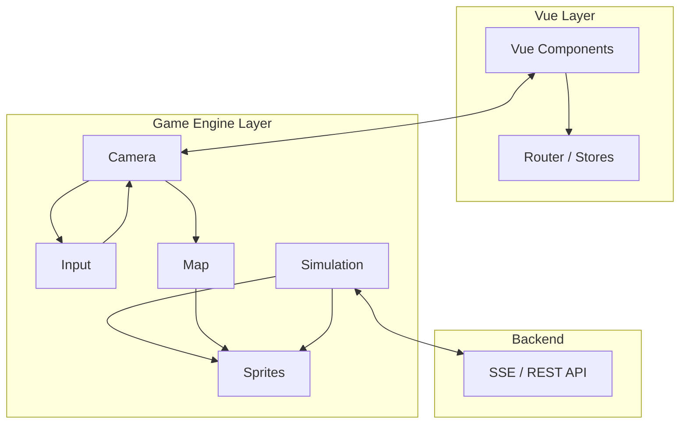

---
title: 用游戏引擎做 Web 应用——Juyiting 前端架构揭秘
author: 布衣云水客
date: 2026-07-22 00:00:00
category:
  - 文章
tag:
  - 前端
  - TypeScript
  - 游戏引擎
  - melonJS
  - 架构设计
star: true
---

## 概要

当大多数 Web 前端还在用 Vue/React 写表单和列表时，我们做了一个大胆的决定：**用游戏引擎来驱动一个策略管理类 Web 应用的前端**。

Juyiting（聚义厅）是一个基于 melonJS 游戏引擎 + Vue 3 混合架构的项目。它不是游戏，但它用了游戏的渲染管线、摄像机系统、寻路算法和动画引擎——因为业务场景本身就长着一张"地图"的脸。

本文将解析这套架构的核心设计，以及为什么游戏引擎比传统前端框架更适合某些场景。

## 为什么用游戏引擎？

业务场景是这样的：一张大厅地图，上面有多个角色（Agent），它们需要在大厅中自主移动、到达指定位置、执行行为。这不就是 RTS 游戏的基本操作吗？

传统前端方案会遇到的问题：

| 问题 | 传统方案 | 游戏引擎方案 |
|------|---------|------------|
| 地图渲染 | Canvas 手绘或 DOM 拼接 | TMX 瓦片地图，原生支持 |
| 角色动画 | CSS animation / Lottie | Sprite sheet + 帧动画 |
| 路径移动 | 自己实现 A* | 内置寻路 + 插值移动 |
| 摄像机控制 | 手动计算视口 | 内置 Camera + Zoom |
| 移动端适配 | 各种 hack | 游戏引擎天然处理 |

**结论：当你的 UI 长得像游戏时，用游戏引擎比用 UI 框架更合理。**

## 架构总览



核心思想是**双线程协作**：
- Vue 负责 UI 层（菜单、弹窗、表单）
- Game Engine 负责世界渲染（地图、角色、动画、移动）

两者通过共享状态和事件总线通信。

## 地图系统：TMX + 运行时数据

地图使用标准的 **TMX（Tile Map XML）** 格式，由 Tiled 编辑器制作。但我们不仅仅是渲染一张静态地图——我们需要运行时数据结构来驱动模拟：

```typescript
export interface MapRuntimeData {
  sceneId: string
  width: number
  height: number
  regions: Region[]       // 区域（带容量、风险等级）
  nodes: NavNode[]         // 导航节点
  edges: NavEdge[]         // 导航边
  slots: Slot[]            // 可站立位置
  obstacles: MapPolygon[]  // 障碍物
}
```

每个概念都有明确的运行时语义：

| 元素 | 含义 | 运行时作用 |
|------|------|-----------|
| **Region** | 逻辑区域（如"聚义厅"、"兵器库"） | 角色目标位置、容量控制 |
| **NavNode** | 导航网格节点 | A* 寻路的顶点 |
| **NavEdge** | 导航网格边 | A* 寻路的连接 |
| **Slot** | 角色站立位置 | 分配角色在区域内的具体坐标 |
| **Obstacle** | 障碍物多边形 | 寻路避障、点击检测 |

## 摄像机系统：适配一切屏幕

移动端适配是整个项目最头疼的问题。软键盘弹出、屏幕旋转、横屏竖屏——每一种变化都会改变可视区域。

```typescript
export const classifyViewportResize = (resize: ViewportResize): ViewportResizeKind => {
  // 键盘弹出检测：宽度几乎不变，视觉高度大幅减小
  const isKeyboard = oldWidth === newWidth && visualHeightDelta >= 120
  
  // 屏幕旋转检测：宽高对调
  const orientationChanged = (oldW > oldH) !== (newW > newH)
  
  if (isKeyboard) return 'keyboard'
  if (orientationChanged) return 'orientation'
  return 'layout'
}
```

三种 resize 类型对应不同的处理策略：
- **keyboard**：保持游戏画面不动，避免闪烁
- **orientation**：重新计算缩放比例和视口
- **layout**：响应浏览器窗口变化

核心策略是 `scaleMethod: 'fit'`——保持地图完整可见，上下或左右留黑边。未来计划加入"摄像机覆盖"方案消除黑边。

## 移动引擎：不只画出来，还要"演"出来

角色的移动不是简单的 CSS transition，而是一个完整的模拟引擎：

```typescript
export type MovementEngine = {
  enqueue(command: MovementCommand): MovementCommandPushResult
  cancel(agentId: string, stateVersion?: number): boolean
  setLocalPatrols(patrols: readonly LocalPatrolAssignment[]): void
  update(deltaMs: number): void
  snapshots(): AgentSnapshot[]
  drainPhaseEvents(): SimulationPhaseEvent[]
}
```

关键设计：

- **命令队列**：所有移动请求排队执行，支持取消和替换
- **A\* 寻路**：基于导航网格的最短路径计算
- **槽位分配**：多个角色到达同一区域时自动分配不重叠的站立位置
- **时间驱动**：`update(deltaMs)` 每帧调用，基于时间戳插值计算位置
- **后端状态同步**：通过 SSE 接收服务端的角色状态指令，前端做**进度恢复**（recover movement progress），确保刷新页面后角色仍在正确位置

## 后端状态恢复

这是最精巧的部分。后端通过 SSE 推送角色的移动指令，包含开始时间和预计到达时间。前端断线重连后，根据时间戳反算出角色应该走到哪里：

```typescript
export function normalizedProgress(
  startedAt: BackendTimestamp,
  expectedArrivalAt: BackendTimestamp | undefined,
  nowMs: number,
): number {
  const start = timestampMs(startedAt)
  const end = timestampMs(expectedArrivalAt)
  if (end === start) return nowMs <= start ? 0 : 1
  return clamp((nowMs - start) / (end - start), 0, 1)
}
```

这样既保证了**服务端是权威状态源**，又实现了**前端流畅的动画表现**——不需要每秒轮询位置，只需要在状态变更时收到通知。

## 输入系统：鼠标和手指一视同仁

```typescript
// pointerGesture.ts —— 统一的指针手势抽象
export type PointerGesture = {
  onPointerDown(point: MapPoint): void
  onPointerMove(point: MapPoint): void
  onPointerUp(point: MapPoint): void
}
```

无论是鼠标点击还是手指触摸，最终都映射为"地图上的一个点"。点击检测通过 `hitTest.ts` 完成，判断点击落在了哪个区域、哪个角色上。

## 小结

这套架构的几个核心原则值得复用：

1. **用对的工具做对的事**——地图和角色用游戏引擎，表单和菜单用 Vue
2. **时间戳驱动，而非帧驱动**——用时间戳做动画插值，保证不同帧率下表现一致
3. **后端权威 + 前端恢复**——SSE 保证状态一致性，前端做平滑过渡
4. **移动端优先考虑 resize**——键盘、旋转、窗口变化都要分类处理

如果你面对的场景也"长得像游戏"——有地图、有角色、有移动——不妨考虑跳出传统前端的盒子，试试游戏引擎这个选项。

---

> Juyiting 源码见 `D:\workspace\chcbz\project\jia\web\jia-web-kit\src\game\`。