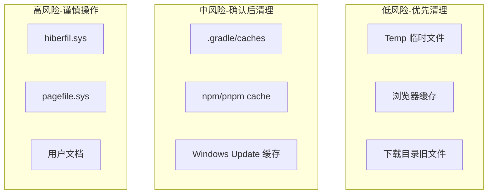

---
title: Windows 开发者工作环境优化——磁盘清理与进程管理实战
author: 布衣云水客
date: 2026-07-25 00:00:00
category:
  - 文章
tag:
  - Windows
  - 运维
  - 开发工具
  - PowerShell
star: true
---

## 概要

程序员的 Windows 主机，通常同时跑着 IDE、Docker、Gradle、Node、Maven、数据库、浏览器几十个标签页……各种东西都在蚕食 C 盘空间和系统资源。

某天突然发现 C 盘红了怎么办？系统盘满了怎么清理？进程锁定了文件怎么删？

本文整理了一套经过实践的 Windows 工作环境优化策略——不重装、不关休眠、不丢数据。

## C 盘空间治理：风险分级策略

清理 C 盘最忌讳的就是"看到大的就删"。我用一套风险分级体系：



### Tier 1：低风险——直接清理

**系统临时文件**是第一优先级——安全、量大、不影响任何功能：

```powershell
# PowerShell 清理 Temp
Remove-Item -Path "$env:TEMP\*" -Recurse -Force -ErrorAction SilentlyContinue

# CMD 方式（有时权限更彻底）
cmd /c "del /f /s /q %TEMP%\*"
```

实测从 `%TEMP%` 回收了约 8GB 空间。

**浏览器缓存**也很可观：
```
C:\Users\Think\AppData\Local\Google\Chrome\User Data\Default\Cache
```

### Tier 2：中风险——确认服务状态后清理

**Windows Update 缓存**（`C:\Windows\SoftwareDistribution\Download`）可以安全清理，但需要先停更新服务：

```powershell
Stop-Service wuauserv -Force
Remove-Item "C:\Windows\SoftwareDistribution\Download\*" -Recurse -Force
Start-Service wuauserv
```

> ⚠️ 如果 `wuauserv` 处于 Running 状态，删除可能不完整——先确认服务已停止。

**Gradle 缓存**（`.gradle\caches`）可以安全删除，下次构建会自动重新下载：

```powershell
# 先看有多大
Get-ChildItem "$env:USERPROFILE\.gradle\caches" -Recurse -File -ErrorAction SilentlyContinue |
    Measure-Object Length -Sum |
    Select-Object Count, @{Name='SizeGB';Expression={[math]::Round($_.Sum/1GB,2)}}

# 确认后清理
Remove-Item "$env:USERPROFILE\.gradle\caches\*" -Recurse -Force
```

同样适用于 `node_modules`、`pip cache` 等。

### Tier 3：高风险——不轻易动

- **`hiberfil.sys`**：休眠文件，通常几个 GB。关闭休眠可以删除（`powercfg -h off`），但你如果常用休眠就别动
- **`pagefile.sys`**：虚拟内存文件，不建议动
- **用户文档/微信数据/Ollama 模型**：这些是"你的数据"而非"垃圾"，不要随意删除

## 进程锁定：找到谁在占用

Windows 上最常见的问题："无法删除，文件被另一个程序占用。"

排查方法：

```powershell
# 方法1：查找占用指定路径的进程
Get-Process | Where-Object {
    $_.Modules.FileName -like "*your-path*"
}

# 方法2：用 handle.exe（Sysinternals）
handle.exe "D:\workspace\locked-file"

# 方法3：查看端口占用
netstat -ano | findstr ":8080"
# 拿到 PID 后
Get-Process -Id <PID>
```

找到进程后，按优先级处理：
1. 正常关闭应用
2. `taskkill /PID <pid>`
3. `taskkill /F /PID <pid>`（强制）

记住一个原则：**先确认是什么在跑，再决定杀不杀**——曾经有过不小心杀了正在运行的数据库服务的教训。

## 大文件扫描：不要全盘递归

Windows 的 `Get-ChildItem -Recurse` 在 C 盘根目录运行几乎必超时。正确做法是**分块扫描**：

```powershell
# 扫已知大目录，不要全盘递归
$dirs = @(
    "$env:USERPROFILE\.gradle",
    "$env:USERPROFILE\.m2",
    "$env:USERPROFILE\AppData\Local\Temp",
    "$env:USERPROFILE\AppData\Local\npm-cache",
    "$env:LOCALAPPDATA\Docker"
)

foreach ($dir in $dirs) {
    if (Test-Path $dir) {
        $size = (Get-ChildItem $dir -Recurse -File -ErrorAction SilentlyContinue |
            Measure-Object Length -Sum).Sum
        [PSCustomObject]@{Path=$dir; SizeGB=[math]::Round($size/1GB,2)}
    }
}
```

## Robocopy：Windows 的文件迁移神器

当需要把大量文件从一个盘迁移到另一个盘时，`robocopy` 是首选：

```powershell
robocopy "D:\source" "E:\backup\source" /E /R:2 /W:1 /MT:4 /NP
```

关键参数：

| 参数 | 含义 | 建议值 |
|------|------|--------|
| `/E` | 包含所有子目录（含空目录） | 必选 |
| `/R:n` | 失败重试次数 | 2（默认100万次太离谱）|
| `/W:n` | 重试等待秒数 | 1 |
| `/MT:n` | 多线程数 | 4-8 |
| `/NP` | 不显示进度百分比 | 减少日志量 |

注意事项：
- **先做 `/L` 干跑**：`/L` 参数让你看到会复制什么，实际不执行
- **注意 `/MOV` vs `/COPY`**：`/MOV` 会删除源文件，安全起见先用 `/COPY`
- **drive letter 可能变化**：在不同电脑上操作时，盘符可能不同——用 `vol` 命令验证卷标
- **检查日志而非退出码**：Robocopy 的退出码含义很复杂，直接读日志中的 `FAILED` 计数更直观

## 日常维护清单

做一个"程序员 Windows 体检"的好习惯：

```powershell
# 每月运行一次
# 1. 检查 C 盘剩余空间
Get-PSDrive C | Select-Object Used,Free

# 2. 列出用户目录最大的 10 个文件夹
Get-ChildItem $env:USERPROFILE -Directory |
    ForEach-Object {
        $size = (Get-ChildItem $_.FullName -Recurse -File -ErrorAction SilentlyContinue |
            Measure-Object Length -Sum).Sum
        [PSCustomObject]@{Name=$_.Name; SizeGB=[math]::Round($size/1GB,2)}
    } | Sort-Object SizeGB -Descending | Select-Object -First 10

# 3. 清理临时文件
cmd /c "del /f /s /q %TEMP%\*" 2>$null
```

## 小结

Windows 开发的痛点往往不是代码，而是环境。磁盘满了、进程卡了、文件锁了——这些"非技术问题"其实消耗了最多的耐心。

三点最重要：
1. **清理有风险分级**——Temp 随便删，hiberfil 别乱动
2. **扫描要分块**——别在 C 盘根目录 `-Recurse`
3. **文件迁移用 Robocopy**——但先 `/L` 干跑看看

保持 C 盘 20% 以上的剩余空间，你的开发体验会好很多。