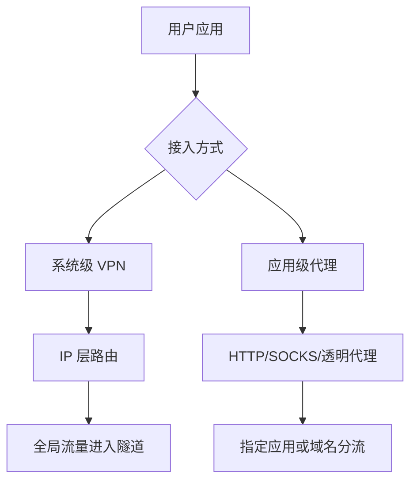
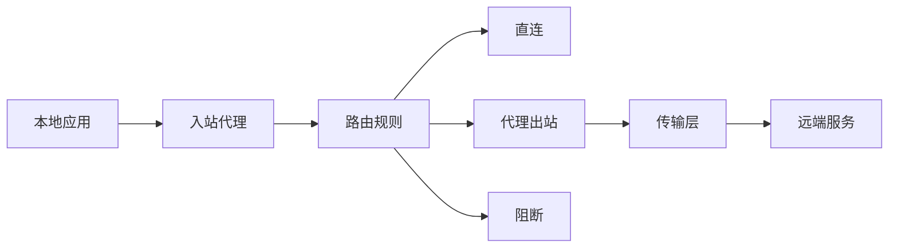
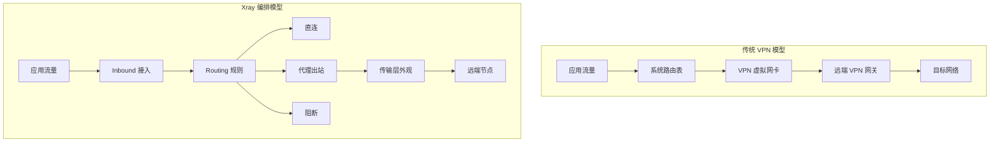
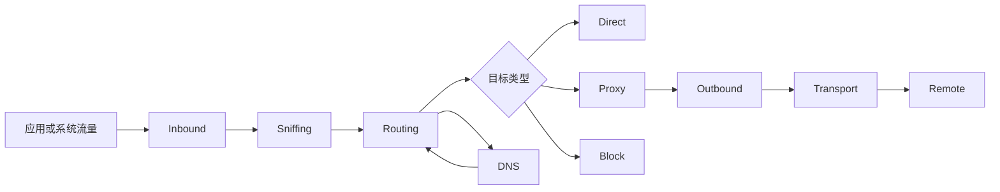
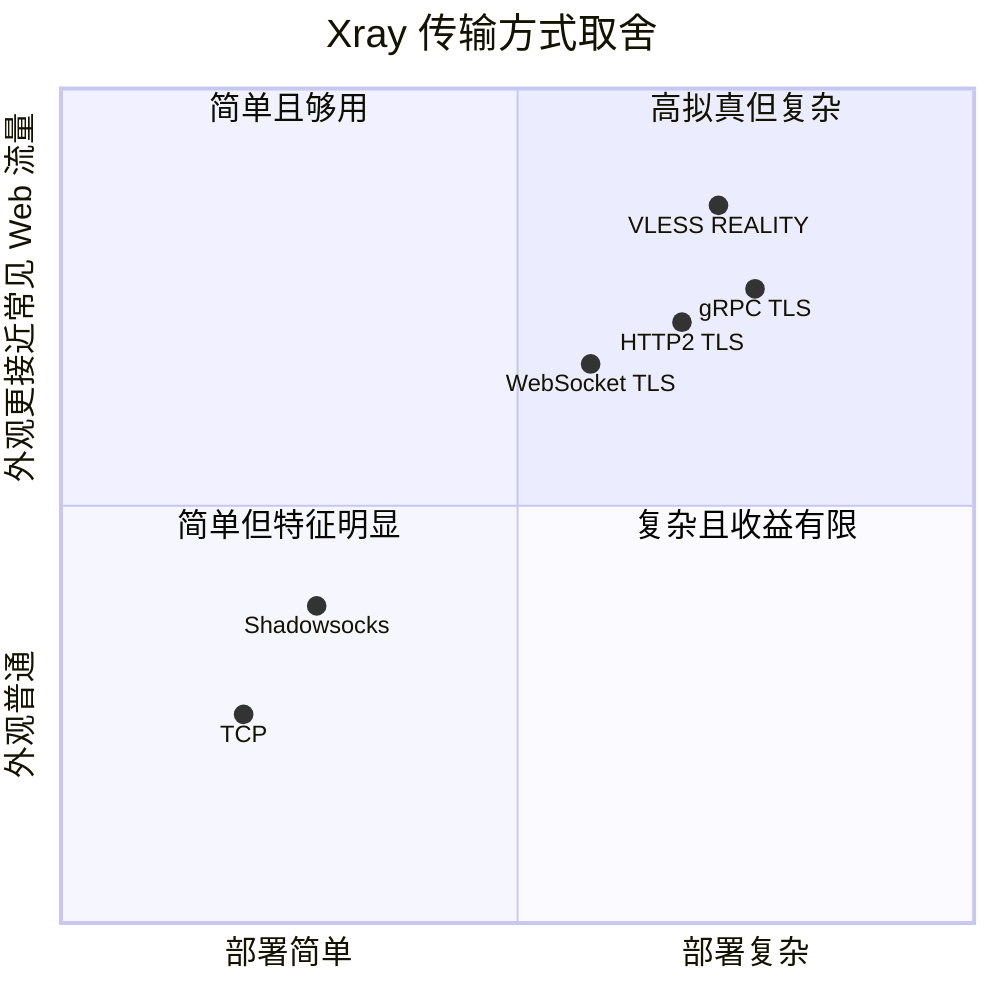
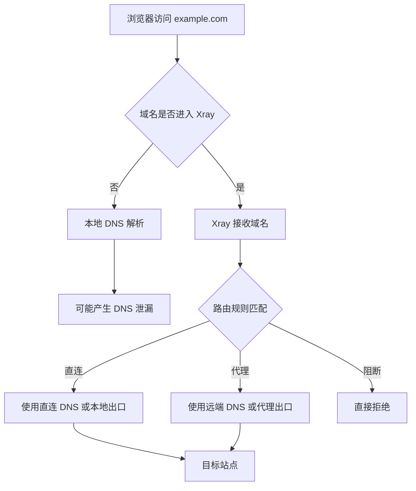
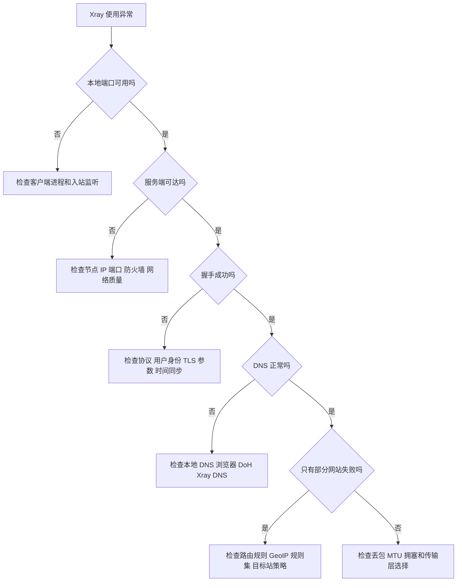
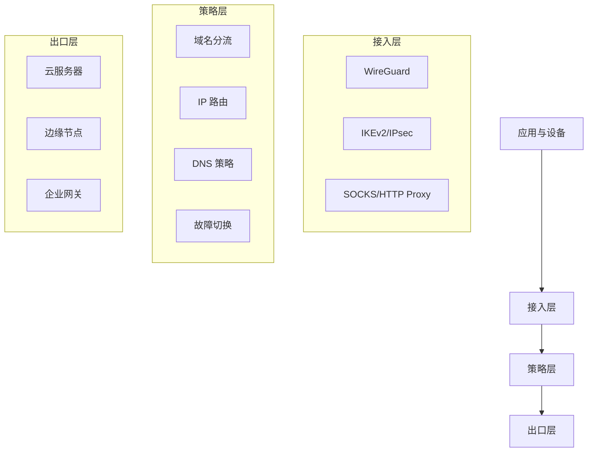

## 概要

抗审查网络不是单一软件，也不是某个神奇协议。它更像一套工程系统：**传输协议、加密握手、流量特征、身份认证、路由策略、运维监控、风险模型**共同决定了可用性。

本文从工程视角梳理几类常见技术：

- **IPsec / IKEv2 / strongSwan**：标准化、企业级、系统原生支持好
- **L2TP / XL2TPD**：历史包袱重，常与 IPsec 组合使用
- **WireGuard**：现代、简洁、高性能，但流量特征相对明显
- **Shadowsocks**：轻量代理，适合应用层分流
- **Xray**：多协议代理框架，强调传输层伪装与灵活编排

文章不讨论规避当地法律或滥用网络的做法。这里关注的是网络工程、隐私保护、跨地域访问、企业远程接入和受限网络环境下的可靠通信设计。

## 先区分两个问题：VPN 与代理

很多讨论会把 VPN、代理、隧道、混淆混成一团。实际设计时，第一步应该先分层。



**VPN** 通常工作在 IP 层或二层隧道层，对系统来说像一张新的网卡。它适合全局接入、企业内网、移动办公、跨云组网。

**代理** 通常工作在应用层或传输层，只处理被显式转发的连接。它适合按域名、按应用、按规则分流，也更容易与浏览器、网关、旁路由组合。

抗审查场景里，真正的难点通常不是"能不能加密"，而是：

- 握手是否容易被识别
- 流量形态是否异常
- 连接是否稳定穿越 NAT、防火墙和弱网
- DNS 是否泄漏
- 节点、证书、密钥、路由规则是否可持续运维

## IPsec：标准化的重型选手

**IPsec** 是一套工作在网络层的安全协议族，常见组合是 **IKEv2 + ESP**。它的优势非常明显：

| 维度 | 特点 |
|------|------|
| 标准化 | RFC 体系成熟，厂商支持广 |
| 客户端 | iOS、macOS、Windows、Android 通常有原生或准原生支持 |
| 认证 | 支持证书、PSK、EAP、用户名密码等多种方式 |
| 场景 | 企业远程接入、站点到站点 VPN、移动办公 |

Linux 世界里最常见的实现之一是 **strongSwan**。它实现 IKEv1/IKEv2，适合构建标准 IPsec VPN。

IPsec 的问题也同样典型：

- 配置项多，排错成本高
- NAT-T、MTU、路由表、策略路由容易互相影响
- ESP 或 UDP 500/4500 在某些网络里会被限制
- 协议特征明显，"这是一个 IPsec VPN"并不难识别

所以 IPsec 更像是**合规、标准、企业友好**的方案，而不是天然适合高强度审查对抗的方案。

## L2TP / XL2TPD：历史兼容方案

**L2TP** 本身不提供加密，它只是二层隧道协议。实际使用中常见的是：

```text
L2TP over IPsec
```

在 Linux 上，常见组件是 **xl2tpd** 负责 L2TP 隧道，strongSwan 或 libreswan 负责 IPsec 加密。

这种组合曾经非常流行，因为很多系统都内置支持 L2TP/IPsec。但从今天的角度看，它有几个明显缺点：

- 协议栈复杂：PPP、L2TP、IPsec 多层叠加
- 性能一般，封装开销较大
- NAT 和 MTU 问题常见
- 在受限网络中识别度较高

如果目标是兼容老设备，L2TP/IPsec 仍然有价值。如果是新系统、新客户端、新架构，通常会优先考虑 IKEv2/IPsec 或 WireGuard。

## WireGuard：简单、高效、现代

**WireGuard** 的设计目标非常清晰：少代码、强加密、低复杂度、高性能。它使用现代密码套件，配置模型也很简单：每个节点都有公私钥，通过 peer 建立点对点隧道。

它的工程优势很突出：

| 优点 | 说明 |
|------|------|
| 性能好 | 内核集成广泛，吞吐和延迟表现优秀 |
| 配置少 | 相比 IPsec，概念和参数少很多 |
| 漫游好 | 客户端网络切换后恢复较快 |
| 组网清晰 | 适合点对点、Hub-Spoke、跨云内网 |

但在抗审查场景里，WireGuard 也有短板：

- UDP 流量特征较固定
- 默认没有伪装成常见 Web 流量的能力
- 在严格限制 UDP 的网络中可用性下降
- 公钥身份稳定，节点暴露后需要及时轮换

所以 WireGuard 很适合**可信节点之间的高速安全组网**。如果面对的是强审查环境，通常需要额外的传输封装、入口保护或备用链路。

## Shadowsocks：轻量代理的经典模型

**Shadowsocks** 的核心思路是加密 SOCKS5 代理。它不试图接管整个系统网络，而是提供一个轻量的代理通道。

它的优势在于：

- 架构简单，部署轻
- 客户端生态成熟
- 适合域名分流和按应用代理
- 对移动设备、电量、性能要求较友好

但 Shadowsocks 的"轻"也意味着边界清楚：

- 它不是完整 VPN，不天然处理所有系统流量
- DNS、UDP、透明代理需要额外设计
- 单一协议长期暴露后可能被识别和干扰
- 服务端安全依赖密码、加密方法、入口隐藏和运维习惯

工程上，Shadowsocks 更适合作为**个人或小规模场景的应用层代理基础件**，而不是复杂企业组网方案。

## Xray：多协议与传输编排框架

如果当前已经在使用 Xray，那么它应该是这篇文章最值得展开的部分。

**Xray** 不是单一代理协议，而是一个代理内核和流量编排框架。它真正有价值的地方不只是"能代理"，而是把入站、路由、DNS、出站、传输层、安全层拆成了可组合模块。



这个模型决定了 Xray 的使用方式：不要把它当成"一个端口转发工具"，而要当成**流量策略引擎**。

### 传统 VPN 与 Xray 的路径差异

传统 VPN 更像一条系统级隧道，接管范围大，路径清晰；Xray 更像一个可编排网关，先识别流量，再决定直连、代理还是阻断。



这张图能看出两者的核心差异：VPN 强在统一接管，Xray 强在细粒度策略。

### Xray 的核心抽象

Xray 配置里最重要的是五类对象：

| 模块 | 作用 | 设计关注点 |
|------|------|------------|
| Inbound | 接收本机或局域网流量 | SOCKS、HTTP、透明代理、TUN 等入口形态 |
| Routing | 决定流量走向 | 域名、IP、端口、协议、地理规则、私有网段 |
| DNS | 负责解析策略 | 远端解析、本地解析、防泄漏、分流一致性 |
| Outbound | 连接目标或远端节点 | 直连、代理、阻断、备用出口 |
| Transport | 决定网络外观 | TCP、WebSocket、gRPC、HTTP/2、TLS 等 |

这几个模块组合起来，才是一个完整 Xray 系统。很多"连得上但不好用"的问题，本质不是协议错了，而是路由、DNS、出站策略之间不一致。

从配置依赖关系看，可以把 Xray 拆成下面这张图：



其中 `Sniffing` 和 `DNS` 很容易被忽略。前者影响 Xray 能不能识别域名，后者影响域名最终会被解析到哪里。

### 协议不是全部：VMess、VLESS、Trojan、Shadowsocks

Xray 支持多种代理协议。讨论这些协议时，容易陷入"哪个最强"的误区。更合理的看法是：协议只解决身份认证和数据封装的一部分问题，最终效果还取决于外层传输和部署方式。

| 协议 | 大致定位 | 适合场景 |
|------|----------|----------|
| VMess | 较早期的加密代理协议 | 存量配置、兼容旧客户端 |
| VLESS | 更轻量的协议框架 | 与 TLS、REALITY 等组合 |
| Trojan | 形态接近 TLS 服务 | 希望行为靠近 HTTPS 的场景 |
| Shadowsocks | 简洁加密代理 | 轻量分流、低复杂度环境 |

从架构角度看，今天更常见的思路是：**协议层保持简洁，把真实性和抗识别能力交给传输层与安全层设计**。这也是 VLESS、Trojan 这类组合经常被讨论的原因。

### 传输层决定"看起来像什么"

在抗审查讨论中，Xray 常被关注的不是"加密"本身，而是**传输层外观**：流量看起来像什么、握手是否突兀、证书链是否自然、连接行为是否接近真实业务。

常见传输方式可以这样理解：

| 传输 | 特点 | 风险点 |
|------|------|--------|
| TCP | 简单直接 | 特征明显，缺少外观保护 |
| WebSocket | 易与 Web 服务共存 | 需要真实 Web 行为支撑 |
| HTTP/2 | 支持多路复用 | 配置和代理链路更复杂 |
| gRPC | 适合长连接与云原生网关 | 中间层兼容性需要验证 |
| TLS | Web 生态基础设施成熟 | 证书、SNI、指纹不自然会暴露问题 |
| REALITY | 强调降低证书依赖和握手伪装 | 客户端支持、参数管理和版本一致性更重要 |

这里有一个很重要的工程判断：**传输层不是越复杂越好**。复杂传输会带来更多中间件、CDN、反向代理、证书、超时、流控问题。稳定性和隐蔽性之间经常需要取舍。

可以把传输方式按"部署复杂度"和"外观拟真度"粗略放在一张选型图里：



这不是绝对排名，而是帮助做工程判断：个人节点通常优先稳定和可维护；多用户网关才更需要复杂传输和备用链路。

### Xray 的路由能力：比协议更影响体验

Xray 的路由规则决定一条连接最终是直连、代理还是阻断。实际使用体验里，路由往往比协议更重要。

常见路由策略包括：

- 私有网段、局域网地址直连
- 国内站点或低风险站点直连
- 特定域名、特定应用走代理
- 广告、跟踪、恶意域名阻断
- 不同出口按目标区域或服务类型分流

这类分流可以降低代理链路压力，也能减少异常流量特征。所有流量都走同一个远端出口，看似简单，长期看反而不利于稳定性。

### DNS 是 Xray 配置里的高风险区

Xray 使用中最容易被忽视的是 DNS。

如果浏览器请求走代理，但 DNS 解析走本地网络，就会出现典型 DNS 泄漏：连接内容虽然加密，访问意图却在解析阶段暴露。

更糟糕的是，DNS 和路由不一致会造成"规则看起来正确，但实际走错出口"：

- 域名先被本地 DNS 解析成错误 IP
- Xray 路由阶段只看到 IP，看不到原始域名
- GeoIP 规则命中异常
- CDN 域名被解析到不合适的区域
- 直连和代理在同一域名上来回抖动

因此 Xray 的 DNS 设计要和路由设计一起看。重点不是堆很多 DNS 服务器，而是保证解析路径、分流规则和出站策略一致。

DNS 与路由的关系可以用下面这张图概括：



核心原则是：代理流量尽量不要提前在本地解析；直连流量也不要无意义地绕到远端解析。

### 客户端形态：本机代理、透明代理、TUN

Xray 可以被不同客户端包装成不同使用形态。

| 形态 | 说明 | 适合对象 |
|------|------|----------|
| SOCKS/HTTP 本机代理 | 应用显式设置代理 | 浏览器、开发工具、命令行 |
| 系统代理 | 操作系统转发部分应用流量 | 桌面日常使用 |
| 透明代理 | 网关或旁路由自动接管流量 | 家庭网络、小团队网络 |
| TUN 模式 | 虚拟网卡接管 IP 流量 | 需要接近 VPN 体验的场景 |

本机代理最简单，也最容易排错。透明代理和 TUN 体验更像 VPN，但会引入更多系统网络问题，比如路由优先级、DNS 接管、局域网访问、IPv6 泄漏、UDP 支持等。

所以排查 Xray 时，要先问一个问题：**流量到底是怎么进入 Xray 的？** 入口形态不同，排错路径完全不同。

### Xray 的运维重点

Xray 的长期稳定性不是只看配置文件是否能启动，还要看这些指标：

- 节点延迟和丢包是否稳定
- DNS 解析是否命中预期出口
- TLS 证书是否临近过期
- 客户端和服务端内核版本是否兼容
- 规则集是否长期未更新
- 失败是发生在 DNS、TCP 建连、TLS 握手、代理认证还是目标站点响应阶段
- 是否有备用出站和降级策略

建议把 Xray 当成一个小型网关服务来维护：有版本管理、有变更记录、有健康检查、有回滚方案。不要在生产使用的节点上频繁试验新传输和新参数。

### 常见故障的判断方式

Xray 故障通常可以按层次拆开：

| 现象 | 优先怀疑 |
|------|----------|
| 所有网站都失败 | 入站未接管、服务端不可达、认证失败 |
| 只有部分域名失败 | 路由规则、DNS 解析、目标站点策略 |
| 能连但很慢 | 丢包、MTU、拥塞、传输层选择不合适 |
| 浏览器正常，命令行失败 | 系统代理环境变量未配置 |
| 命令行正常，浏览器失败 | 浏览器 DNS、DoH、扩展代理规则 |
| 局域网设备异常 | 透明代理、旁路由、私有网段绕行规则 |

这种分层排查比反复更换协议更有效。很多时候问题不在 Xray 内核，而在客户端接管方式、系统 DNS、浏览器策略或中间网络。

也可以按决策树来排：



这张图的意义在于把问题逐层定位：入口、远端、握手、DNS、路由、网络质量，不要一上来就重装客户端或换协议。

### 为什么 Xray 比传统 VPN 更适合复杂环境？

传统 VPN 的思路是：先建立一条系统级隧道，再把流量导进去。这种方式简单直接，但不够细。

Xray 的思路更像网关：

- 可以让不同域名走不同出口
- 可以让局域网和内网地址保持直连
- 可以对 DNS 做细粒度控制
- 可以保留多个出站作为备用
- 可以按应用选择是否接入
- 可以把代理协议和传输外观拆开组合

这也是 Xray 和传统 VPN 的最大差异：传统 VPN 更关心标准化安全隧道，Xray 这类框架更关心代理协议和传输伪装的组合能力。

但也要承认，Xray 不是越复杂越强。一个优秀的 Xray 配置，通常应该满足三个条件：

- **可解释**：每条规则为什么存在都说得清
- **可观测**：失败时能判断卡在哪一层
- **可替换**：节点、协议、DNS、规则集可以独立替换

如果配置复杂到自己都无法解释，后续维护一定会变成负担。

## strongSwan：IPsec 的工程化实现

**strongSwan** 不是一种协议，而是 IPsec/IKE 的实现。它适合这些场景：

- 企业 IKEv2 VPN
- 云上 VPC 到 IDC 的站点互联
- 移动端证书认证接入
- 与防火墙、路由器、商业 VPN 网关对接

strongSwan 的关键价值在于成熟和可控：

- 支持证书体系，便于企业权限管理
- 支持多种 EAP 认证方式
- 日志和状态查询能力强
- 能与 Linux 路由、iptables/nftables、策略路由配合

但它不是"开箱即用的抗审查工具"。如果网络会主动识别和干扰 IPsec，strongSwan 本身并不会隐藏 IPsec 的协议特征。

## 技术对比

| 技术 | 工作层级 | 典型用途 | 优势 | 短板 |
|------|----------|----------|------|------|
| IPsec/IKEv2 | 网络层 | 企业 VPN、站点互联 | 标准成熟、系统支持好 | 配置复杂、特征明显 |
| L2TP/IPsec | 二层隧道 + 网络层 | 老设备兼容 | 客户端兼容性好 | 性能和可维护性一般 |
| WireGuard | 网络层 | 高性能组网 | 简洁、高效、漫游好 | UDP 特征明显 |
| Shadowsocks | 应用层代理 | 轻量代理、分流 | 简单、生态成熟 | 不是完整 VPN |
| Xray | 代理框架 | 多协议编排、复杂分流 | 灵活、传输形态多 | 配置和运维复杂 |
| strongSwan | IPsec 实现 | IKEv2/IPsec 服务端 | 成熟、可控、企业友好 | 不解决流量伪装问题 |

## 审查对抗看什么？

从防火墙或审查系统的角度，判断一条连接是否可疑，通常不只看内容。因为内容已经加密，更多会看元数据和行为特征。

### 1. IP 与端口

最直接的方式是封禁目标 IP、端口或自治系统。任何单节点方案都怕这个问题。

工程应对思路不是迷信某个协议，而是提高节点治理能力：健康检查、快速替换、入口分层、故障切换。

### 2. 握手指纹

TLS、QUIC、WireGuard、IPsec、代理协议都有握手特征。即便 payload 加密，握手过程也可能暴露协议类型。

这就是为什么很多现代代理工具会强调 TLS 指纹、真实证书链、常见传输封装和连接行为。

### 3. 流量形态

真实 Web 流量通常有明显的请求-响应节奏、域名访问模式、连接复用行为。隧道流量则可能表现为长连接、大量上行、持续心跳。

抗审查设计里，"像不像正常业务"有时比"加密强不强"更关键。

### 4. DNS 泄漏

很多系统把代理做好了，但 DNS 仍然走本地运营商解析，结果域名意图直接暴露。

无论使用 VPN 还是代理，都应该检查 DNS 路径：系统 DNS、浏览器 DoH、代理 DNS、远端解析策略是否一致。

### 5. 端到端运维

节点失效、证书过期、密钥泄漏、客户端版本不一致、路由规则过期，都会导致可用性下降。抗审查网络不是一次性配置，而是持续运维。

## 选型建议

如果是**企业远程办公**，优先考虑 IKEv2/IPsec、WireGuard 或商业零信任网络。重点是身份认证、设备管理、审计、权限分组。

如果是**跨云内网互联**，WireGuard 往往是性价比最高的方案；需要对接传统设备时，再考虑 strongSwan/IPsec。

如果是**个人应用层分流**，Shadowsocks 或 Xray 更灵活。前者简单，后者适合更复杂的路由和传输编排。

如果是**高干扰网络环境**，不要只问"哪个协议最好"。更重要的是组合设计：

- 至少准备两类不同传输形态
- 区分主链路和备用链路
- 做好 DNS 路径控制
- 定期轮换证书、密钥和入口
- 用监控判断是节点故障、DNS 问题、路由问题还是协议被干扰

## 一个实用的分层架构

比较稳妥的设计是把网络能力分成三层：



这样做的好处是：协议可以替换，策略可以独立演进，出口可以按需扩容。不要把所有逻辑都绑死在某一个客户端配置里。

## 安全与运维清单

无论采用哪种技术，都建议检查这些基础项：

- **密钥管理**：不要多人共用同一密钥；离职、设备丢失、节点泄漏后及时吊销
- **最小权限**：企业 VPN 不应默认打通所有内网网段
- **日志边界**：记录必要的连接状态和错误，避免记录敏感访问内容
- **DNS 策略**：确认解析路径与代理/VPN 路由一致
- **MTU 调整**：隧道叠加时优先排查 MTU，很多"能连但很慢"都与它有关
- **健康检查**：区分服务进程存活、端口可达、真实链路可用
- **证书续期**：TLS、IKEv2 证书都要有自动续期或到期告警
- **客户端升级**：代理/VPN 客户端长期不升级会带来兼容性和安全问题

## 总结

抗审查网络技术的核心不是某个工具的名字，而是对网络分层和对抗模型的理解。

**IPsec/strongSwan** 代表标准化企业 VPN，成熟可靠但协议特征明显。**L2TP/XL2TPD** 更偏历史兼容，新项目慎用。**WireGuard** 简洁高效，是现代组网的优秀选择，但默认不解决伪装问题。**Shadowsocks** 轻量，适合应用层代理和分流。**Xray** 灵活，适合复杂协议编排，但需要更强的运维能力。

最终方案应当由场景决定：企业办公重认证和权限，跨云组网重稳定和性能，受限网络重传输形态和可替换性。把协议、路由、DNS、监控、密钥管理拆开看，才是长期可维护的设计方式。
