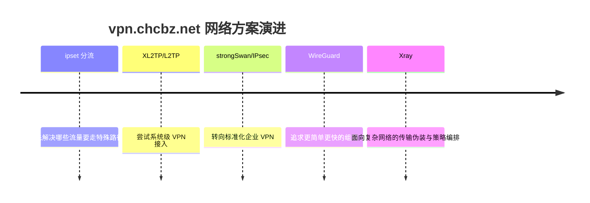
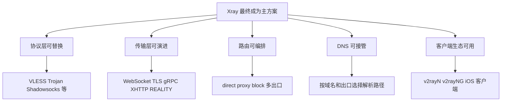
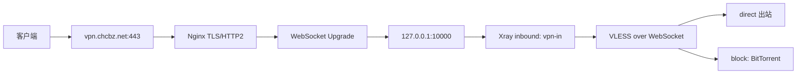
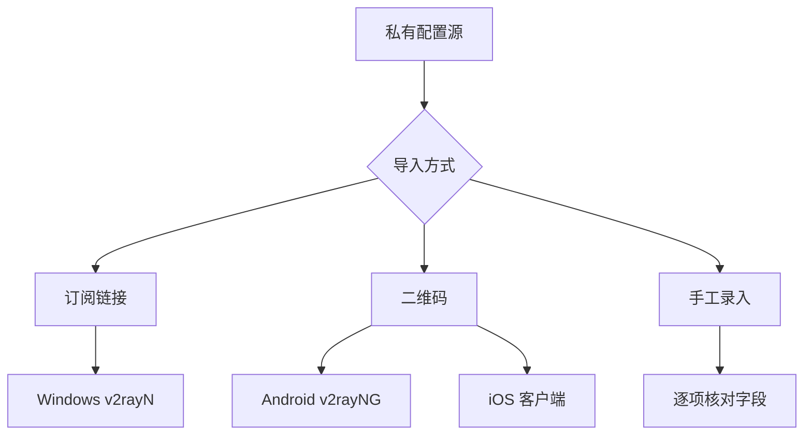
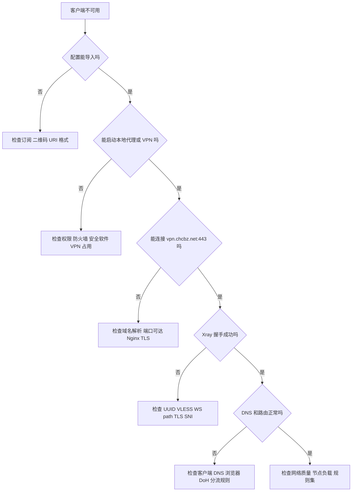
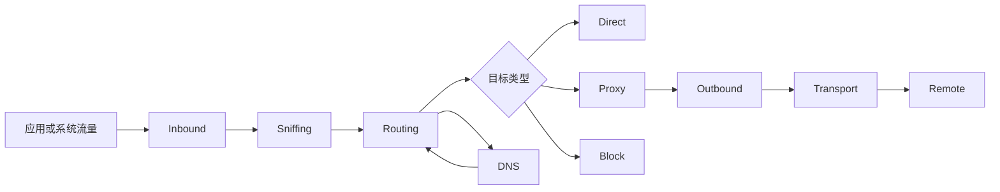
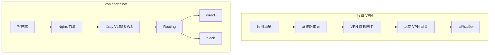
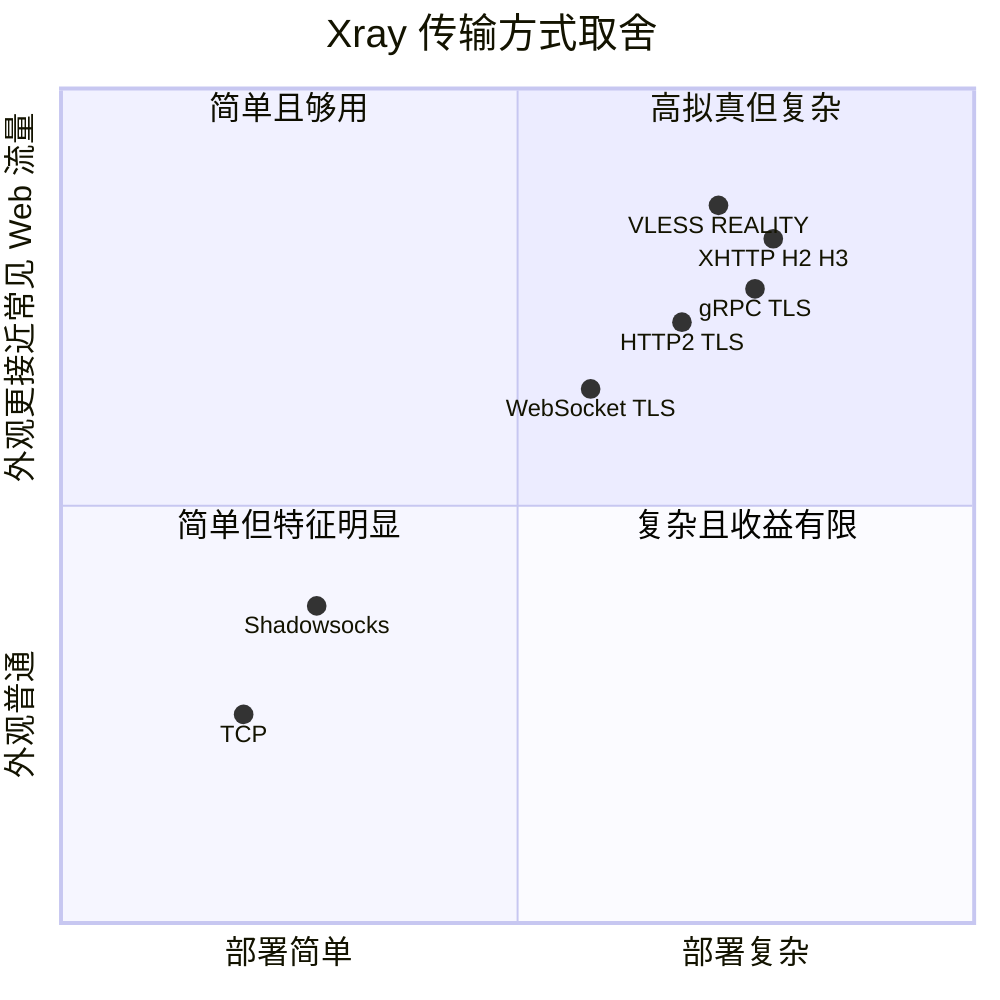
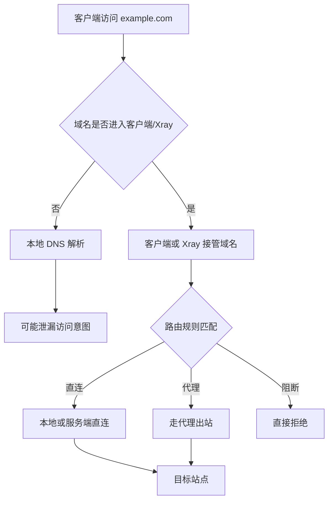
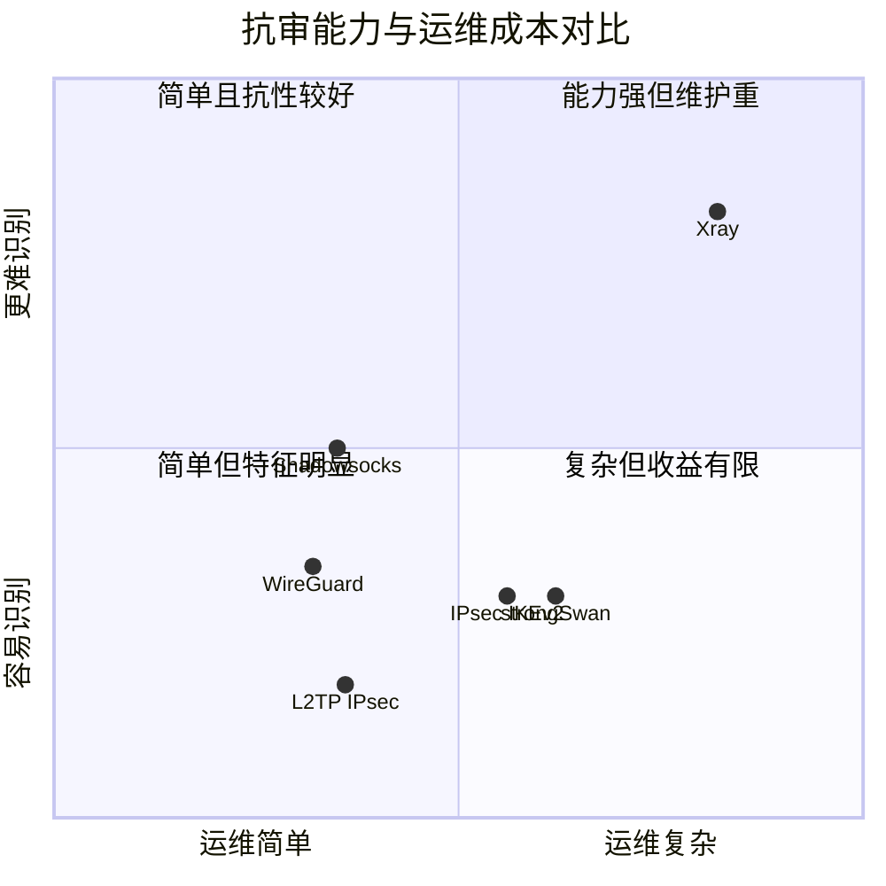

## 概要

抗审查网络不是某一个软件，也不是某一个"最强协议"。它更像一套持续演进的网络系统：**域名、TLS、反向代理、Xray Core、传输层、客户端、DNS、路由规则、日志和密钥管理**共同决定可用性。

这套系统不是一开始就长成现在这样。`vpn.chcbz.net` 这条链路，经历过一轮很典型的技术演进：

```text
ipset 分流 -> XL2TP/L2TP -> strongSwan/IPsec -> WireGuard -> Xray
```

每一步都不是推翻重来，而是对上一阶段问题的回应：从"能不能分流"，到"能不能全局接入"，再到"能不能标准化认证"，然后到"能不能更简单更快"，最后落到"能不能在复杂网络里长期稳定"。

本文以这条演进路径为主线，梳理当前基于 **Xray + VLESS + WebSocket + TLS + Nginx** 的实际部署，并横向比较 IPsec、L2TP、WireGuard、Shadowsocks、strongSwan 等方案。

文章重点是工程实践：

- 从 ipset、XL2TP、strongSwan、WireGuard 到 Xray 的演进原因
- 当前 `vpn.chcbz.net` 的服务端拓扑
- Windows、Android、iOS 客户端怎么配置
- Xray 的入站、路由、DNS、出站和传输层怎么理解
- 为什么 Xray 比传统 VPN 更适合复杂受限网络
- 和 IPsec、WireGuard、Shadowsocks 的抗审能力横向对比
- 日常排障、升级和安全运维清单

本文不讨论规避当地法律或滥用网络的做法。这里关注的是网络工程、隐私保护、远程接入和受限网络环境下的可靠通信设计。

## 演进主线

回头看这条技术路线，会发现每一代方案都解决了一个具体问题，也暴露出新的边界。



这不是"新技术一定比旧技术好"。更准确地说，是目标变了：

| 阶段 | 主要目标 | 主要收获 | 暴露的问题 |
|------|----------|----------|------------|
| ipset | 让特定流量走特定路径 | 分流意识建立起来 | 规则维护重，接入体验弱 |
| XL2TP/L2TP | 获得系统级 VPN 体验 | 客户端兼容性好 | 协议栈重，NAT/MTU 问题多 |
| strongSwan/IPsec | 标准化、安全、企业友好 | 认证体系和服务端控制力强 | 协议特征明显，配置复杂 |
| WireGuard | 简化组网，提高性能 | 配置少、速度快、漫游好 | UDP 特征明显，伪装能力弱 |
| Xray | 适应复杂受限网络 | 协议、传输、路由、DNS 可组合 | 运维复杂度上升 |

最终落到 Xray，不是因为它在所有指标上都"赢"，而是因为当前场景最需要的是：**看起来像正常 Web 入口、客户端生态可用、DNS 和路由可控、节点和传输可演进**。

### 第一阶段：ipset 分流

最早的问题其实不是 VPN，而是分流：哪些目标需要走特殊路径，哪些目标应该保持直连。

`ipset` 的价值在于把大量 IP 规则从 iptables 规则链里抽出来，用集合维护。它适合做：

- 国内外 IP 分流
- 黑白名单
- 大规模地址集合匹配
- 和 iptables/nftables 配合做策略路由

这个阶段最大的收获是：**抗干扰网络不能只有一条全局隧道，必须有分流意识。**

但 ipset 也很快暴露出边界：

- IP 列表维护成本高
- CDN 地址变化频繁
- 域名到 IP 的映射不稳定
- 移动端和桌面端难以统一体验
- 只能解决路由，不能解决客户端接入和传输外观

所以 ipset 更像底层能力，而不是完整方案。它让系统知道"怎么分"，但没有解决"怎么连"。

### 第二阶段：XL2TP/L2TP

下一步自然会想到传统 VPN：既然应用层和路由层太麻烦，那就让客户端接入一个系统级隧道。

L2TP 常见组合是：

```text
L2TP over IPsec
```

Linux 上通常由 xl2tpd 负责 L2TP，IPsec 负责加密。它的优点很现实：很多系统都支持，特别是老设备、老客户端。

这个阶段解决了几个问题：

- 客户端不用逐个应用设置代理
- 系统级流量可以统一进隧道
- 移动设备上使用门槛较低
- 兼容性比很多新协议更好

但代价也明显：

- PPP、L2TP、IPsec 多层叠加，排错复杂
- NAT-T 和 MTU 问题常见
- 性能一般
- 协议特征明显
- 配置项多，服务端状态不好维护

L2TP/IPsec 的定位逐渐变成"兼容老设备"，而不是主力方案。

### 第三阶段：strongSwan/IPsec

从 L2TP 继续往前走，就会回到更标准的 IKEv2/IPsec。strongSwan 是 Linux 上成熟的 IPsec/IKE 实现，适合做企业远程接入和站点互联。

这个阶段的目标是标准化：

- 用证书、EAP、PSK 等方式管理身份
- 对接系统原生 VPN 客户端
- 建立更可靠的站点到站点隧道
- 让服务端日志、状态、认证更可控

strongSwan 的工程质量是可靠的，它适合企业 VPN。但它不是为"隐藏自己是 VPN"而设计的。

主要问题：

- IKE/IPsec 协议特征明显
- UDP 500/4500、ESP、NAT-T 在一些网络里容易被识别或限制
- 配置复杂，出问题时需要理解证书、proposal、路由、策略、NAT、MTU
- 客户端虽然原生支持较好，但不同系统细节差异不少

strongSwan 让系统更"正规"，但也让问题更清楚：**标准 VPN 的强项是安全接入，不是流量外观。**

### 第四阶段：WireGuard

WireGuard 的出现解决了传统 VPN 的另一个痛点：复杂。

它的模型非常干净：公私钥、peer、AllowedIPs、UDP 传输。相比 IPsec，它少了大量历史包袱。

这个阶段的收益很明显：

- 配置少，认知负担低
- 性能好，延迟低
- 漫游体验好，网络切换恢复快
- 很适合跨云、内网互联、个人设备组网

如果只是做可信节点之间的高速安全组网，WireGuard 非常优秀。

但当前场景仍然有两个关键问题：

- 默认 UDP，遇到限制 UDP 的网络会比较被动
- 默认不伪装成常见 Web 流量，协议外观相对固定

所以 WireGuard 更适合做底层可信组网，而不是最终的复杂受限网络入口。

### 第五阶段：Xray

最后落到 Xray，是因为它解决的问题已经不只是"VPN 能不能连上"，而是：

- 入口能否统一走 `443`
- 流量能否承载在常见 Web 形态之上
- 客户端是否足够普及
- DNS 和路由能否细粒度控制
- 传输层是否可以后续替换
- 服务端是否能和现有 Nginx、证书、日志体系结合

Xray 的关键价值是可组合：



当前 `vpn.chcbz.net` 选择的是一条相对保守、容易维护的路径：

```text
Nginx TLS -> WebSocket -> Xray VLESS -> direct/block
```

这不是 Xray 能力的终点，而是当前阶段的稳定落点。它保留了后续迁移空间：WebSocket 可以迁移到 XHTTP H2/H3，路由可以从简单 direct/block 扩展到更复杂的 DNS 和多出口策略。

## 当前服务：vpn.chcbz.net

这台机器上的 Xray 服务由 `isp-install` 安装和维护，不是一个临时手工配置。

管理脚本：

```bash
/home/isp/bin/xray.sh
```

安装脚本：

```bash
/home/isp/wsps/isp-install/shell/xray_install.sh
```

安装脚本会完成这些事情：

- 下载并校验 Xray Core
- 安装 Xray 二进制文件、GeoIP、GeoSite
- 从模板生成 `config.json`
- 安装 systemd 服务
- 安装 `/home/isp/bin/xray.sh` 管理脚本
- 安装 `vpn.chcbz.net` 的 Nginx vhost
- 输出客户端连接摘要

当前安装脚本输出的客户端摘要是：

```text
客户端地址: vpn.chcbz.net:443
传输协议: VLESS + WebSocket + TLS
路径: /
```

### 服务端路径

| 项目 | 路径 |
|------|------|
| 安装脚本 | `/home/isp/wsps/isp-install/shell/xray_install.sh` |
| 配置模板 | `/home/isp/wsps/isp-install/conf/xray/config.json.template` |
| Nginx vhost 模板 | `/home/isp/wsps/isp-install/conf/nginx/conf/vhost/vpn.chcbz.net.conf` |
| systemd 模板 | `/home/isp/wsps/isp-install/systemd/xray.service` |
| Xray Home | `/home/isp/apps/xray` |
| Xray Core | `/home/isp/apps/xray/bin/xray` |
| 实际配置 | `/home/isp/apps/xray/etc/config.json` |
| 访问日志 | `/home/isp/apps/xray/logs/access.log` |
| 错误日志 | `/home/isp/apps/xray/logs/error.log` |
| Nginx vhost | `/home/isp/apps/nginx/conf/vhost/vpn.chcbz.net.conf` |
| Nginx 访问日志 | `/home/isp/apps/nginx/logs/vpn.chcbz.net.access.log` |
| Nginx 错误日志 | `/home/isp/apps/nginx/logs/vpn.chcbz.net.error.log` |

`install.chcbz.net` 也在同一套安装体系里，Nginx vhost 指向 `/home/isp/wsps/isp-install`，用于发布安装脚本。

### 当前拓扑

`vpn.chcbz.net` 的入口由 Nginx 接收 HTTPS 请求，再通过 WebSocket Upgrade 转发到本机 Xray：



当前服务端关键字段：

| 字段 | 当前值 |
|------|--------|
| 域名 | `vpn.chcbz.net` |
| 外部端口 | `443` |
| TLS | 开启，由 Nginx 终止 TLS |
| Xray 本机监听 | `127.0.0.1:10000` |
| 入站 tag | `vpn-in` |
| 协议 | `VLESS` |
| 传输 | `WebSocket` |
| WebSocket path | `/` |
| VLESS decryption | `none` |
| 出站 | `direct`、`block` |
| 路由策略 | BitTorrent 阻断，其余默认直连 |
| systemd 用户 | `isp` |
| systemd 重启策略 | `on-failure` |

UUID 是客户端接入凭据，不应该写进公开文章。`xray_install.sh` 默认调用 `xray uuid` 生成 UUID，并替换模板里的 `__XRAY_UUID__`。

### 管理命令

日常管理优先用 `/home/isp/bin/xray.sh`：

```bash
# 查看服务状态
/home/isp/bin/xray.sh status

# 测试配置文件
/home/isp/bin/xray.sh test

# 重启服务
/home/isp/bin/xray.sh restart

# 查看 Xray 版本
/home/isp/bin/xray.sh version

# 生成新 UUID
/home/isp/bin/xray.sh uuid
```

当前测试结果为 `Configuration OK`。不过 Xray 26.3.27 会提示 WebSocket transport 已不推荐，后续可以规划从 WebSocket 迁移到 XHTTP H2/H3。

## 客户端配置

客户端不需要知道服务端内部的 `127.0.0.1:10000`，只需要连接公开入口 `vpn.chcbz.net:443`。

手工录入时字段如下：

| 客户端字段 | 填写值 |
|------------|--------|
| 地址 / Address | `vpn.chcbz.net` |
| 端口 / Port | `443` |
| 协议 / Protocol | `VLESS` |
| 用户 ID / UUID | 从私密配置获取，不写入公开文章 |
| 加密 / Encryption | `none` |
| 传输 / Network | `ws` / `WebSocket` |
| Path | `/` |
| TLS | 开启 |
| SNI / Server Name | `vpn.chcbz.net` |
| Allow insecure | 关闭 |
| Flow | 留空 |

最推荐的方式是生成**私有订阅链接或私有二维码**。手工录入容易因为大小写、path、TLS、SNI、UUID、传输类型不一致导致连接失败。



### Windows：v2rayN

Windows 上常用 **v2rayN**。它是桌面 GUI 客户端，支持 Xray、sing-box 等内核。

推荐流程：

1. 从 v2rayN GitHub Releases 下载最新版，优先选择包含 Core 的发行包
2. 解压到固定目录，不要放在临时下载目录
3. 启动 v2rayN，导入私有订阅、二维码或手工添加 VLESS 节点
4. 手工添加时填写 `vpn.chcbz.net`、`443`、`VLESS`、`WebSocket`、`TLS`、path `/`
5. 开启系统代理，或只复制本地 SOCKS/HTTP 端口给指定应用使用
6. 打开日志窗口，确认失败发生在 DNS、握手、TLS 还是远端连接阶段

Windows 上要特别注意：

- 命令行工具不一定跟随系统代理，Git、npm、pip、Docker、IDE 可能要单独配置
- 浏览器如果启用了自己的 DNS over HTTPS，客户端 DNS 规则可能不生效
- 安全软件可能拦截本地监听端口或 TUN 模式
- 如果允许局域网设备接入本机代理，要确认防火墙和访问范围

### Android：v2rayNG

Android 上常用 **v2rayNG**。它支持 Xray core 和 v2fly core。

推荐流程：

1. 从 v2rayNG GitHub Releases 或可信应用商店安装
2. 导入私有订阅、二维码或剪贴板配置
3. 更新订阅并选择 `vpn.chcbz.net` 节点
4. 首次连接时授予 Android VPN 权限
5. 手工添加时选择 VLESS，地址 `vpn.chcbz.net`，端口 `443`，传输 WebSocket，TLS 开启，path `/`
6. 连接失败时先看日志，再检查时间同步、DNS、网络切换和订阅是否过期

Android 上要特别注意：

- VPN 权限同一时间通常只能被一个应用占用
- 省电策略可能杀后台，导致息屏断连
- 移动网络和 Wi-Fi 的 IPv6、DNS、MTU 表现可能不同
- 规则文件、GeoIP、GeoSite 要定期更新，否则分流会越来越不准

### iOS：按客户端能力选择

iOS 没有事实上的官方 Xray 客户端，选择比 Windows 和 Android 分散。核心要求是：客户端必须支持 **VLESS + WebSocket + TLS**。

常见选择：

| 客户端 | 说明 |
|--------|------|
| Shadowrocket | 老牌 iOS 网络代理工具，App Store 页面显示支持 VLESS 等能力 |
| Streisand | App Store 页面显示支持 VLESS Reality、VMess、Trojan、Shadowsocks、WireGuard 等 |
| V2Box | App Store 页面显示支持 VLESS、VMess、Trojan、Reality、WireGuard、自定义 DNS 和路由 |
| Hiddify | 开源多平台代理客户端，项目说明支持 Android、iOS、Windows、macOS、Linux 以及 Xray 等协议 |

iOS 推荐流程：

1. 从 App Store 安装客户端，不要安装来路不明的描述文件
2. 使用私有订阅链接或二维码导入节点
3. 首次连接时允许添加 VPN 配置
4. 检查 DNS、路由、按需连接、局域网绕行等选项
5. 如果手工添加，确认支持 VLESS + WebSocket + TLS，服务端地址 `vpn.chcbz.net`，端口 `443`，path `/`

iOS 上要特别注意：

- 同名或相似名称 App 很多，要确认开发者、评价和更新记录
- 免费客户端可能有广告、内置节点或隐私策略问题
- iOS 对后台、VPN、网络扩展限制更严格，复杂分流不一定和桌面端一致
- 订阅链接包含敏感凭据，不要发给不可信 App 或网页转换工具

### 客户端排障

客户端异常时，不要一上来就换协议。先按层次排查：



大多数问题可以归成四类：

- 配置导入失败
- VPN/代理权限失败
- 节点握手失败
- DNS/路由不一致

## Xray 的核心模型

Xray 不是单一代理协议，而是一个代理内核和流量编排框架。它真正有价值的地方不只是"能代理"，而是把入站、路由、DNS、出站、传输层、安全层拆成了可组合模块。



| 模块 | 作用 | 当前服务中的体现 |
|------|------|------------------|
| Inbound | 接收客户端流量 | `vpn-in`，监听 `127.0.0.1:10000` |
| Routing | 决定流量走向 | BitTorrent 走 `block`，其他默认直连 |
| DNS | 负责解析策略 | 当前配置较简单，后续可按分流扩展 |
| Outbound | 连接目标或阻断 | `direct`、`block` |
| Transport | 决定网络外观 | WebSocket，经 Nginx TLS 暴露 |

当前配置简单、可解释、容易排错。它没有堆复杂规则，核心目标是让客户端通过 `vpn.chcbz.net:443` 进入 Xray，再由服务端直连目标网络。

## 为什么用 Nginx + Xray

传统 VPN 的思路是建立一条系统级隧道，然后把流量导进去；Xray 的思路更像网关：流量进来后，按规则决定直连、代理还是阻断。



Nginx + Xray 的好处：

- 外部入口统一走 `443`
- TLS 证书由 Nginx 管理，便于复用现有证书体系
- Xray 只监听本机 `127.0.0.1:10000`，减少暴露面
- Nginx 日志和 Xray 日志可以交叉排查
- 后续可在 Nginx 层调整 TLS、HTTP/2、证书和反代策略
- Xray 侧继续负责 VLESS、路由、DNS、出站策略

风险也很清楚：

- WebSocket 已被 Xray 提示为不推荐传输，后续需要评估迁移
- path 使用 `/`，行为上更直白，缺少额外站点伪装
- 目前路由规则很少，适合简单场景，不适合复杂分流
- UUID 是核心凭据，一旦泄漏必须轮换

## 传输方式取舍

Xray 的抗审能力不是来自某一个神奇协议，而是来自协议层、传输层、安全层和路由层的组合。

| 传输 | 特点 | 风险点 |
|------|------|--------|
| TCP | 简单直接 | 特征明显，缺少外观保护 |
| WebSocket | 易与 Web 服务共存 | 新版 Xray 已提示不推荐，需关注迁移 |
| HTTP/2 | 支持多路复用 | 配置和反代链路更复杂 |
| gRPC | 适合长连接和云原生网关 | 中间层兼容性需要验证 |
| TLS | Web 生态基础设施成熟 | 证书、SNI、指纹不自然会暴露问题 |
| REALITY | 强调降低证书依赖和握手伪装 | 客户端支持、参数管理和版本一致性更重要 |
| XHTTP H2/H3 | Xray 当前推荐迁移方向之一 | 需要重新验证客户端支持和 Nginx/入口架构 |

粗略放到一张选型图里：



对 `vpn.chcbz.net` 来说，短期重点是保持当前 VLESS + WebSocket + TLS 稳定；中期重点是评估 XHTTP H2/H3 迁移，不要在生产节点上直接试验复杂参数。

## DNS 与路由

很多代理问题表面是"连不上"，本质是 DNS 和路由不一致。



当前服务端路由很克制：

- `domainStrategy` 为 `IPIfNonMatch`
- BitTorrent 协议走 `block`
- 其他流量默认走 `direct`

这意味着复杂分流主要在客户端侧完成，服务端承担稳定出口的角色。这样做排错简单，但对客户端规则质量依赖更高。

如果后续要增强服务端侧分流，可以逐步加入：

- 私有网段直连
- 明确阻断高风险协议
- 按域名或 GeoIP 区分出口
- 按目标服务选择 DNS
- 服务端规则集版本管理

## 横向对比

Xray 是当前主方案，但不是所有场景都应该用 Xray。不同技术的定位不同。

| 技术 | 工作层级 | 典型用途 | 优势 | 短板 |
|------|----------|----------|------|------|
| L2TP/IPsec | 二层隧道 + 网络层 | 老设备兼容 | 客户端兼容性好 | 性能和可维护性一般 |
| IPsec/IKEv2 | 网络层 | 企业 VPN、站点互联 | 标准成熟、系统支持好 | 配置复杂、特征明显 |
| strongSwan | IPsec 实现 | IKEv2/IPsec 服务端 | 成熟、可控、企业友好 | 不解决流量伪装问题 |
| WireGuard | 网络层 | 高性能组网 | 简洁、高效、漫游好 | UDP 特征明显 |
| Shadowsocks | 应用层代理 | 轻量代理、分流 | 简单、生态成熟 | 不是完整 VPN |
| Xray | 代理框架 | 多协议编排、复杂分流 | 灵活、传输形态多 | 配置和运维复杂 |

### 抗审能力评分

这里用 1-5 做工程化评分。分数越高，表示在该维度上越有优势；不是绝对安全等级。

| 技术 | 协议隐蔽性 | 流量伪装 | DNS 控制 | 分流能力 | 节点可替换性 | 运维复杂度 |
|------|------------|----------|----------|----------|--------------|------------|
| L2TP/IPsec | 1 | 1 | 2 | 2 | 2 | 3 |
| IPsec/IKEv2 | 2 | 1 | 3 | 2 | 3 | 4 |
| strongSwan | 2 | 1 | 3 | 2 | 3 | 4 |
| WireGuard | 2 | 1 | 3 | 3 | 4 | 2 |
| Shadowsocks | 3 | 2 | 3 | 4 | 4 | 2 |
| Xray | 4 | 5 | 5 | 5 | 5 | 5 |



结论：

- **L2TP/IPsec**：兼容性尚可，但抗识别能力弱
- **IPsec/strongSwan**：企业可控性好，但协议外观明显
- **WireGuard**：性能和维护体验优秀，但默认不做伪装
- **Shadowsocks**：轻量、好维护，适合简单分流
- **Xray**：抗干扰能力上限最高，但需要认真运维

### 分场景选择

| 场景 | 优先方案 | 原因 |
|------|----------|------|
| 企业内网接入 | IKEv2/IPsec、WireGuard | 身份认证、设备管理、内网路由更重要 |
| 跨云组网 | WireGuard | 性能好、配置少、链路稳定 |
| 老设备兼容 | L2TP/IPsec | 客户端支持广，但不建议作为新架构首选 |
| 个人轻量代理 | Shadowsocks | 简单、低资源、分流方便 |
| 高干扰网络 | Xray | 传输形态多、DNS 和路由控制细 |
| 多出口网关 | Xray + WireGuard | Xray 负责策略，WireGuard 负责可信组网 |

所以不能简单说"Xray 一定最好"。如果只是企业远程办公，标准 VPN 往往更合适；但如果核心问题是网络干扰、协议识别、DNS 泄漏和多出口切换，Xray 的系统能力会更强。

## 复盘：每一代留下了什么

虽然最终主方案落在 Xray，但前面几代并不是"废弃技术"。它们分别留下了不同的工程经验。

| 阶段 | 留下的经验 | 今天仍然有用的地方 |
|------|------------|--------------------|
| ipset | 不要全局一刀切，先建立分流意识 | 黑白名单、旁路网关、策略路由 |
| XL2TP/L2TP | 系统级 VPN 的体验确实重要 | 老设备兼容、临时接入 |
| strongSwan/IPsec | 身份认证、证书、标准协议很重要 | 企业接入、站点互联、合规场景 |
| WireGuard | 简单和高性能本身就是可靠性 | 跨云组网、内网互联、可信节点隧道 |
| Xray | 复杂网络里需要协议、传输、DNS、路由可组合 | 当前 `vpn.chcbz.net` 主方案 |

这条路线的真正结论不是"只用 Xray"，而是：

- 做底层组网时，WireGuard 仍然很合适
- 做企业标准 VPN 时，strongSwan/IPsec 仍然稳
- 做轻量应用代理时，Shadowsocks 仍然简单
- 做复杂受限网络入口时，Xray 更有弹性
- 做网关策略时，ipset/nftables 这类底层能力仍然有价值

`vpn.chcbz.net` 当前选择 Xray，是因为它最符合现在的主矛盾：入口要像 Web，客户端要好用，传输要能演进，DNS 和路由要能被纳入同一个运维模型。

## 运维与安全清单

对 `vpn.chcbz.net` 这种自维护服务，长期稳定性靠运维纪律。

### 服务端检查

- `/home/isp/bin/xray.sh test`：确认 Xray 配置有效
- `/home/isp/bin/xray.sh status`：确认 systemd 服务运行
- `/home/isp/bin/xray.sh version`：记录当前 Xray 版本
- `/home/isp/bin/nginx.sh test`：确认 Nginx 配置有效
- `/home/isp/bin/nginx.sh reload`：修改 vhost 后重载
- 检查 `/home/isp/apps/xray/logs/error.log`
- 检查 `/home/isp/apps/nginx/logs/vpn.chcbz.net.error.log`
- 检查证书是否临近过期

### 凭据管理

- UUID 不写入公开仓库、公开博客、截图或聊天记录
- 客户端丢失或订阅泄漏后立即轮换 UUID
- 轮换 UUID 前先准备新配置，避免所有客户端同时失效
- 私有订阅链接要和普通网页链接区分管理

### 日志边界

- access log 有排障价值，但也包含访问目标元数据
- 不要长期无限保留详细日志
- 共享日志前要脱敏 IP、域名和用户标识
- Nginx 日志和 Xray 日志要一起看，单边日志容易误判

### 升级策略

- 不在生产节点上直接试验新传输
- 升级前备份 `config.json` 和 Nginx vhost
- 先用 `/home/isp/bin/xray.sh test` 验证配置
- 关注 Xray 对 WebSocket 的弃用提示，规划 XHTTP H2/H3 迁移
- 客户端和服务端升级要分批，不要同时大改

## 总结

从 ipset 到 XL2TP，再到 strongSwan、WireGuard，最后落到 Xray，`vpn.chcbz.net` 的演进过程其实是目标不断收敛的过程：先要能分流，再要能全局接入，再要标准化和高性能，最后才是复杂网络下的可用性和可维护性。

现在的 `vpn.chcbz.net` 是一套清晰、可维护的 Xray 服务：

- 对外入口：`vpn.chcbz.net:443`
- 入口层：Nginx TLS
- 传输层：WebSocket
- 协议层：VLESS
- 本机 Xray：`127.0.0.1:10000`
- 出站策略：默认 direct，BitTorrent block
- 运维来源：`isp-install` 的 `xray_install.sh`

这套架构的优点是路径简单、证书复用、暴露面小、日志可查、客户端生态成熟。它的主要技术债是 WebSocket 传输后续需要迁移，以及当前服务端路由较简单，复杂分流依赖客户端。

从横向对比看，IPsec/strongSwan 更适合企业标准 VPN，WireGuard 更适合高性能组网，Shadowsocks 更适合轻量代理；而 Xray 的优势在于可组合、可分流、可演进。只要密钥、DNS、路由、日志和升级流程管住，它就是一套长期可维护的抗干扰网络基础设施。

## 参考资料

- [Xray 官方配置文档](https://xtls.github.io/en/config/)
- [Xray 官方运行说明](https://xtls.github.io/en/document/config.html)
- [Xray-core GitHub](https://github.com/XTLS/Xray-core)
- [v2rayN GitHub](https://github.com/2dust/v2rayN)
- [v2rayNG GitHub](https://github.com/2dust/v2rayNG)
- [Shadowrocket App Store](https://apps.apple.com/us/app/shadowrocket/id932747118)
- [Streisand App Store](https://apps.apple.com/tr/app/streisand/id6450534064)
- [V2Box App Store](https://apps.apple.com/kg/app/v2box-v2ray-client/id6446814690)
- [Hiddify App GitHub](https://github.com/hiddify/hiddify-app)
