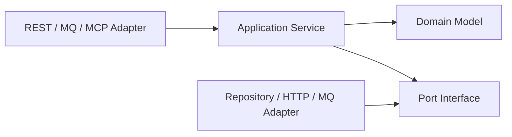

# 高级 Java 与 AI 应用工程（一）：Java、Spring Boot 与微服务底座

## 技术定位

Java 提供稳定的运行时、并发模型和生态；Spring Boot 解决应用装配与生产化能力；微服务体系解决多团队、多服务环境下的治理问题。三者不能混为一谈：Spring Boot 应用并不天然是微服务，微服务也不等于“把单体拆成更多进程”。

高级工程师的判断标准是：服务是否具备清晰边界、可预测的失败行为、可观测性和安全控制，以及拆分后是否真正获得独立演进或独立伸缩的收益。

## 1. Java 基础：服务端真正依赖的能力

### 1.1 并发不是“多开线程”

服务端并发的核心是控制共享状态、任务生命周期和资源上限。

- 使用不可变对象传递请求上下文；`record` 很适合 DTO 和事件。
- CPU 密集任务受核心数约束；I/O 密集任务受连接池、下游容量与超时约束。
- 不要在 Web 请求线程里执行长耗时任务；交给消息队列、任务系统或有界线程池。
- 线程池必须显式配置队列、拒绝策略、线程名和指标；无界队列会把流量高峰变成内存故障。
- `CompletableFuture` 适合组合少量异步 I/O；不要用它隐藏无边界的并发。

一个实用的超时预算：若入口 SLA 为 800ms，网关、业务、数据库和外部调用都应从这 800ms 中分配预算；下游超时不能大于上游剩余时间。

### 1.2 API 契约与错误语义

接口先定义，再实现。每个写接口应有请求 ID、调用方身份、幂等键和清晰的错误码。

```java
public record ApiError(
    String code,
    String message,
    String traceId,
    Map<String, Object> details
) {}

@RestControllerAdvice
class ApiExceptionHandler {
  @ExceptionHandler(DomainException.class)
  ResponseEntity<ApiError> handle(DomainException exception) {
    return ResponseEntity.unprocessableEntity().body(
        new ApiError(exception.code(), exception.getMessage(), TraceId.current(), Map.of())
    );
  }
}
```

建议区分：参数错误（400）、未认证（401）、无权限（403）、资源不存在（404）、业务规则不满足（422）、限流（429）和系统故障（500/503）。不要把所有异常包装成“操作失败”。

### 1.3 数据访问的边界

MyBatis/JPA 都只是持久化工具。领域层不应依赖 ORM 实体的懒加载、副作用或数据库方言。

- 查询使用投影 DTO，只取需要的列。
- 事务边界围绕一个业务不变量；不要把远程 HTTP 调用包在数据库事务中。
- 为每一个高频查询准备索引解释和分页策略；深翻页使用游标而非 `offset`。
- 乐观锁适用于低冲突更新；热点计数、库存扣减要评估原子更新或串行化方案。

## 2. Spring Boot 服务的分层

推荐依赖方向：`adapter/controller -> application -> domain <- infrastructure`。Controller 负责协议，Application 编排用例，Domain 维护规则，Infrastructure 对接数据库、消息和外部系统。



一个“创建诊断任务”的应用服务只做：校验命令、加载聚合、调用领域行为、持久化、发布领域事件。它不拼 SQL、不写 HTTP 响应，也不直接决定前端展示文案。

## 3. Spring Cloud：先理解模式，再选择组件

Eureka、Ribbon、Hystrix、Zuul 是经典体系，许多存量系统仍在使用；新项目可选 Spring Cloud LoadBalancer、Gateway、Resilience4j、Kubernetes Service 或服务网格。组件会迭代，模式不会过时。

| 问题 | 模式 | 关键检查 |
| --- | --- | --- |
| 找到实例 | 服务发现 | 健康检查、实例上下线、一致性 |
| 分摊流量 | 客户端/服务端负载均衡 | 重试是否放大流量 |
| 下游变慢 | 超时、隔离、熔断 | 超时预算、降级数据、恢复条件 |
| 入口治理 | API 网关 | 鉴权、限流、灰度、审计 |
| 配置变更 | 配置中心 | 加密、版本、回滚、刷新范围 |

### 3.1 韧性调用的顺序

1. 设置连接、读取和总预算超时。
2. 只对可安全重试的错误做有限重试，并加入退避和抖动。
3. 按依赖隔离并发量，避免一个慢下游耗尽全局线程。
4. 连续失败后熔断，返回明确且可用的降级结果。
5. 将失败率、耗时、熔断状态暴露为指标并告警。

重试不是可靠性的默认答案。对于“创建订单”“调用扣款”这类操作，必须先建立幂等键和去重记录，再讨论重试。

## 4. 身份认证与授权

### 4.1 OAuth2/OIDC 的最小心智模型

- 身份提供方负责认证并签发 Token。
- 资源服务器验证 Token 的签名、过期时间、发行者、受众和 scope。
- 客户端不应自行解析后信任未验证的 JWT。
- 授权以最小权限为原则：角色适合粗粒度，scope/权限点适合 API；数据权限还需要业务条件。

LDAP 常用于企业目录和统一身份源；应用仍要把认证结果映射为本地权限、组织和审计上下文。

```java
@PreAuthorize("hasAuthority('diagnosis:report:read')")
ReportView getReport(UUID reportId) { ... }
```

权限判断不能只停留在 URL。读取某区域报表时，应在应用层验证该用户对目标区域的数据权限。

## 5. 实战：构建“报告任务服务”

### 5.1 用例

`POST /diagnosis-reports` 接收区域、期间和指标；创建一个待处理任务，异步生成报告，客户端可查询状态。

| 项目 | 设计 |
| --- | --- |
| 幂等 | `Idempotency-Key` 与请求摘要绑定，重复请求返回原任务 |
| 状态 | `PENDING -> RUNNING -> SUCCEEDED/FAILED` |
| 权限 | 需要 `diagnosis:report:create` 且拥有区域数据权限 |
| 异步 | 提交事务后发布任务事件，不在 HTTP 请求中调用模型 |
| 追踪 | 贯穿 `traceId`、任务 ID、调用方 ID |

### 5.2 最小验收清单

- [ ] OpenAPI/接口文档说明了输入、输出、状态码和错误码。
- [ ] 认证、权限和数据范围均有自动化测试。
- [ ] 同一个幂等键不会创建两条任务。
- [ ] 数据库故障、消息投递失败、模型服务超时都有明确行为。
- [ ] 日志不记录密码、Token、完整提示词中的敏感数据。
- [ ] `/actuator/health`、指标和请求链路可用。

## 6. 常见误区

1. **为了微服务而微服务**：团队、部署、调用链和数据一致性复杂度会快速增加。先模块化，再按独立变化和独立伸缩的边界拆分。
2. **把 DTO 当领域模型**：接口字段变化会污染业务规则。命令、领域对象、持久化对象应有明确职责。
3. **全局事务包住一切**：数据库事务解决不了远程系统一致性；应使用 Outbox、补偿和状态机。
4. **只在故障后加监控**：没有指标就没有容量判断，也无法证明优化有效。

## 7. 面试表达与高频追问

**如何判断该不该拆微服务？** 先看业务边界是否稳定、团队是否需要独立发布、负载是否有明显的独立伸缩差异，以及是否能承受调用链、数据一致性和运维复杂度。若只是代码复杂，优先模块化单体和清晰依赖边界；拆分不是性能优化的默认手段。

**超时、重试、熔断分别解决什么？** 超时限制单次等待；重试处理短暂故障但必须有限且幂等；熔断在连续故障时快速失败，防止资源被坏依赖耗尽。三者要围绕同一端到端超时预算配置，不能各自独立拉长请求时间。

**OAuth2 与 JWT 是什么关系？** OAuth2/OIDC 是授权和身份协议；JWT 是一种 Token 表达格式。可以用 JWT 实现 OAuth2 Access Token，也可以使用不透明 Token。资源服务真正应验证的是签名、发行者、受众、过期时间与权限声明，而不是“能解码就信任”。

**幂等如何跨实例实现？** 幂等键必须保存在共享的强一致存储中，例如带唯一约束的数据库表；键与请求摘要、调用方和处理结果绑定。只用本机内存或本地锁在多实例部署时无效。
