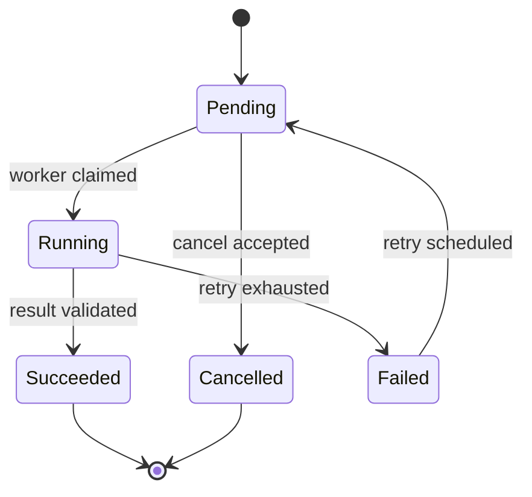
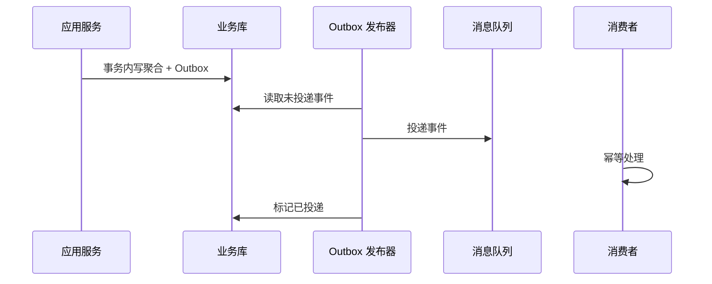

# 高级 Java 与 AI 应用工程（二）：DDD、事件与分布式一致性

## 技术定位

DDD 不是将项目机械分为四个包，而是用统一语言和边界控制复杂性；分布式设计不是追求“最终一致”，而是在不能使用单一事务的地方，明确哪些结果必须立即一致、哪些结果可恢复地异步收敛。

## 1. DDD 解决的不是“代码分层”

DDD 的价值在于让业务概念和软件模型一致，降低规则散落在 Controller、SQL、定时任务和前端中的风险。先找业务语言，再决定类和表。

### 1.1 三个必须回答的问题

1. 这个系统的核心业务结果是什么？例如“报告已生成”而不是“数据库插入一行”。
2. 哪些规则必须始终同时成立？这决定聚合边界和事务。
3. 哪些变化可以接受最终一致？这决定事件、任务和补偿的边界。

### 1.2 限界上下文

“客户”“订单”“指标”在不同子域可能含义不同。将模型按职责分隔：订单上下文负责履约约束，指标上下文负责口径和数据质量，AI 诊断上下文负责推理过程与引用。上下文之间通过 API 或事件协作，不共享数据库表作为集成方式。


## 2. 四层模型如何落地

| 层 | 负责什么 | 不应该负责什么 |
| --- | --- | --- |
| Interface/Adapter | HTTP、MQ、MCP、协议转换 | 业务规则和事务编排 |
| Application | 用例编排、授权、事务、调用端口 | 复杂领域判断、SQL 细节 |
| Domain | 聚合、实体、值对象、领域服务、规则 | 框架注解、网络请求 |
| Infrastructure | Repository、MQ、搜索、第三方 SDK | 决定业务状态流转 |

### 2.1 聚合：一致性的最小单元

聚合内部的不变量在一次事务内保证。比如“报告任务不能在已取消后开始运行”属于 `ReportJob` 聚合；“所有用户当天的调用额度”通常不应被放进同一个巨大聚合，而应使用原子计数或独立配额模型。

```java
public final class ReportJob {
  private ReportStatus status;

  public void start(Instant now) {
    if (status != ReportStatus.PENDING) {
      throw new DomainException("REPORT_NOT_STARTABLE", "报告任务当前不可启动");
    }
    status = ReportStatus.RUNNING;
    record(new ReportStarted(id, now));
  }
}
```

聚合引用其他聚合时通常保存其 ID，不直接持有对象图。这样可以避免一次操作锁住无关数据。

### 2.2 值对象和领域事件

值对象表达“是什么”，应不可变且可按值比较，例如 `Money`、`Period`、`RegionCode`、`MetricDefinition`。领域事件表达“已经发生了什么”，例如 `OrderConfirmed`、`ReportStarted`。事件名称使用过去时，事件内容应足够让下游独立处理。

## 3. 状态机：将流程从 if-else 中解放出来

复杂流程需要显式状态、触发条件、允许迁移和副作用。



状态机设计清单：

- 状态是有限且可观测的；不要用多个 Boolean 拼出隐含状态。
- 每条迁移有操作者、前置条件、时间和原因。
- 终态不可被普通命令修改；重试应是新的明确迁移。
- 外部副作用（发消息、调用模型）与状态落库分离，并可重放。

## 4. 事件驱动与可靠投递

### 4.1 为什么“先写库再发 MQ”仍会丢消息

数据库提交成功后，进程可能在发消息前崩溃；先发消息又可能导致消费者读到尚未提交的数据。Outbox 模式将业务变更和待投递事件写进同一个数据库事务，再由独立发布器投递。



Outbox 也不是“恰好一次”。投递和消费都可能重复，因此消费者必须基于事件 ID 或业务幂等键去重。推荐记录 `processed_event`，并让“处理结果写库”和“记录已处理”处在同一事务。

### 4.2 事件版本与演进

- 事件不可随意改语义；添加字段提供默认值，删除字段经历兼容窗口。
- 事件包含 `eventId`、`occurredAt`、`aggregateId`、`schemaVersion` 和 `traceId`。
- 不用事件承载完整数据库快照或敏感字段；数据消费者应最小化获取。

## 5. 延迟任务、重试与补偿

延迟任务适合“30 分钟后检查支付”“模型结果未返回则超时关闭”。它必须持久化调度时间、目标、幂等键和执行状态；不能只依赖进程内 `ScheduledExecutorService`。

重试策略需要回答四件事：什么错误可以重试、最多几次、间隔多久、用尽后如何处置。网络暂时故障可能重试，参数校验失败不应重试，资金和库存操作必须先保证幂等。

补偿不是数据库回滚：它是在已提交的现实世界中发起反向业务动作，例如“预留失败后释放额度”“报告失败后撤销通知”。每个补偿也需要状态和审计。

## 6. 分库分表与读写模型

只有在单库的容量、热点或隔离明确成为瓶颈时才引入分片。先做索引、归档、读副本、分区和缓存。分片后，跨分片事务、全局分页、唯一约束、二级索引和运维成本都会上升。

对于读多写少、查询视图复杂的系统，可使用 CQRS：命令模型维护一致性，事件异步更新查询模型。不要为了“看起来高级”把每个 CRUD 都拆成 CQRS。

## 7. 面试表达与高频追问

**聚合边界如何确定？** 以一次事务内必须同时成立的不变量为依据，而不是按表或对象关系图划分。聚合外部保存 ID 并通过事件或应用服务协作，避免一个请求加载和锁定过大的对象图。

**Outbox 为什么能提升可靠性？** 它让业务状态变更和“待发布事件”在同一数据库事务内提交，消除了“写库成功但进程在发消息前崩溃”的窗口。随后仍需要至少一次投递、消费者幂等和监控，因此它提供可靠事件交接而非神奇的全局恰好一次。

**Saga、补偿和事务回滚有什么区别？** 本地事务回滚的是尚未提交的数据；补偿是在多个步骤已经提交后，发起反向业务动作恢复可接受状态。Saga 协调一组可补偿的本地事务，并需要显式设计失败与人工介入路径。

**什么时候使用状态机？** 状态有限、迁移规则严格、生命周期长或需要审计时，例如订单、审批、异步报告任务。它让允许的迁移、触发者、重试和终态可被测试与观测，而不是散落在条件分支中。

## 8. 常见反模式

- 贫血模型：所有规则都在 Service，实体只剩 getter/setter。
- 巨型聚合：一次修改加载几百个对象，锁竞争和性能一起失控。
- 事件当 RPC：发布事件后立刻等待所有消费者返回，失去了松耦合。
- “最终一致”不设计查询体验：用户不知道任务是否完成、是否失败、何时重试。
