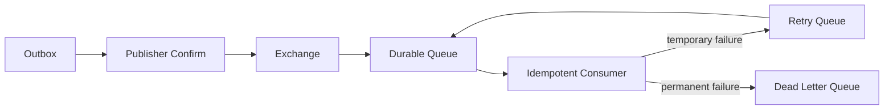

# 高级 Java 与 AI 应用工程（三）：数据库、中间件与流程编排

## 技术定位

关系型数据库保存业务事实与事务约束；Redis 处理低延迟的临时状态；RabbitMQ 负责异步传递与削峰；Elasticsearch 提供搜索、聚合与向量召回；工作流引擎管理长生命周期的人机流程。它们各自解决不同问题，不能互相替代。

## 1. 关系型数据库：事实与事务的来源

MySQL、PostgreSQL、GaussDB、Oracle 的 SQL 细节不同，但设计原则一致：以约束保护数据，以索引支撑访问路径，以执行计划证明性能。

### 1.1 建模和索引

- 用主键、唯一键、外键或应用层校验维护明确的不变量；分布式场景也要保留本地约束。
- 索引顺序取决于过滤条件、选择性、排序和覆盖需求；不要只按字段“看起来重要”建索引。
- `EXPLAIN` 关注扫描行数、索引使用、排序、回表和估算偏差。
- 长事务会占用连接、锁和 MVCC 版本；将外部调用、文件处理和人工等待移出事务。

### 1.2 查询服务与数据口径

运营分析中，指标的口径比 SQL 技巧更重要。将“期间、区域、币种、统计粒度、是否含税”等定义版本化；查询路由 SDK 只负责组合已批准的维度、过滤器和数据源，不允许任意 SQL 拼接。

## 2. Redis：加速器，不是第二主库

| 场景 | 适合的数据结构 | 关键风险 |
| --- | --- | --- |
| 热点查询缓存 | String/Hash | 穿透、击穿、雪崩、失效一致性 |
| 排行榜 | Sorted Set | 规则变更、分数精度、分页 |
| 限流 | String + Lua | 时钟、原子性、降级策略 |
| 分布式锁 | SET NX PX | 过期、续租、误释放、主从切换 |
| 延迟队列 | ZSet/Stream | 到期扫描、重复投递、持久化 |

缓存设计先回答：谁是数据真相、缓存何时失效、读到旧值是否可接受、Redis 不可用时系统如何退化。常用 Cache-Aside：读时未命中加载并写缓存，写时先更新数据库，再删除缓存；对重要写入可结合消息和订阅失效。

分布式锁只用于短小、可幂等的临界区。持锁期间调用慢接口或执行大事务会放大故障。解锁必须校验随机 token，不能用“先 GET 再 DEL”。

## 3. RabbitMQ：异步、削峰和解耦

### 3.1 可靠消息的端到端模型

生产者确认只说明 Broker 收到消息；消费者 ACK 才说明处理完成。要实现业务可靠性，还需要 Outbox、消费者幂等、失败重试和死信处理。

不要无限重回原队列：毒消息会占满消费能力。使用有限次数、指数退避或 TTL 重试队列；死信队列必须有人监控、分类和补偿。

### 3.2 顺序与吞吐的取舍

全局顺序意味着单分区或单消费者，吞吐会下降。多数场景只需要“同一订单/任务内顺序”，可按业务键分区。消费者并发时，对同一聚合的并发更新要靠版本号、串行键或状态机保护。

## 4. Elasticsearch 与向量检索

ES 适合全文检索、聚合分析和向量近邻检索，不应替代交易数据库。

### 4.1 文本检索

- mapping 在建索引前设计；`text` 用于分词检索，`keyword` 用于精确过滤、聚合和排序。
- 文档更新不是行级事务；通过业务 ID、版本和异步索引保障一致性。
- 搜索结果要提供高亮、过滤、排序以及数据新鲜度说明。

### 4.2 RAG 中的向量索引

向量检索的质量不只取决于 embedding 模型，还取决于切分、元数据过滤、混合检索和重排。

1. 按语义和结构切分文档，保留标题、来源、版本、权限和时间。
2. 先用租户、部门、文档类型、有效期过滤，再做向量或 BM25 检索。
3. 合并关键词与向量结果，必要时用 reranker 重排。
4. 将引用片段、分数和来源返回给上层，用于回答可追溯性与评测。

## 5. WebSocket、SSE 与实时状态

WebSocket 适用于双向实时交互；SSE 更适合服务端单向推送和流式模型输出。两者都要处理断线重连、心跳、序列号、权限刷新和背压。

一个可恢复的事件流至少包含递增 `eventId`、事件时间、实体版本和幂等语义。客户端重连时携带最后已处理 ID，服务端从可回放存储补发；不能只依赖内存广播。

## 6. Camunda/工作流：编排人与系统

工作流适合长生命周期、可视化、含审批或补偿的流程，例如报告生成后人工复核再发送。它不替代领域模型：业务规则仍应在领域服务中，流程引擎负责“何时调用谁”。

| 判断 | 更适合 |
| --- | --- |
| 单次同步业务规则 | 领域模型/应用服务 |
| 多状态、多人审批、长等待 | BPMN 工作流 |
| 高吞吐异步处理 | MQ + 状态机 |
| LLM 多步骤工具选择 | AI 工作流/Agent 编排 |

流程变量中避免放大对象和敏感原文；保存业务 ID，通过服务查询详情。为每个外部 Service Task 设置超时、重试和补偿。

## 7. 面试表达与高频追问

**缓存与数据库如何保持一致？** 数据库仍是事实来源。常用 Cache-Aside 在写成功后删除缓存，让后续读回源重建；重要场景结合 Outbox 做可靠失效。必须声明可接受的短暂旧数据窗口，并防护缓存穿透、击穿和雪崩。

**消息如何避免重复消费？** 消费者按事件 ID 或业务幂等键去重，将业务结果和已处理记录放入同一事务；失败按可重试性进入延迟重试或死信队列。不要假设 Broker 提供的“至少一次”会自动变成业务恰好一次。

**ES 为什么不做主库？** ES 的索引更新、事务语义、关联约束和一致性模型不适合承载交易事实；它擅长面向检索的冗余读模型。正确做法是以关系库为主，通过可靠事件同步索引。

**WebSocket、SSE 如何选择？** 只需要服务端单向流式推送时 SSE 更简单，天然兼容 HTTP；需要客户端与服务端高频双向实时消息时选 WebSocket。两者都要处理鉴权、心跳、重连、序列号与背压。

## 8. 生产检查清单

- [ ] 每种中间件都有容量、可用性、备份和恢复方案。
- [ ] 所有消费者可重复处理，死信有告警和处理流程。
- [ ] 缓存命中率、队列积压、检索延迟、索引失败数均有指标。
- [ ] 向量库的权限过滤发生在检索前或检索时，而不是模型回答后。
