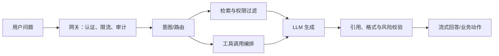
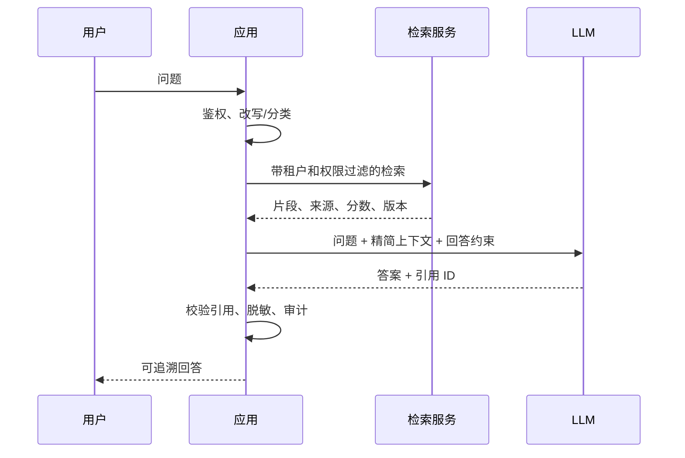

# 高级 Java 与 AI 应用工程（四）：LLM、RAG、Function Calling 与 MCP

## 技术定位

企业 AI 应用的本质是将概率模型嵌入确定性系统：程序负责身份、权限、数据、工具与审计，模型负责语言理解、归纳和受约束的决策。RAG 解决知识与事实来源，Function Calling/Skill 解决受控动作，MCP 解决工具互操作，评测与观测解决持续可信。

## 1. 从“聊天”到“业务系统”

LLM 擅长语言理解、信息抽取、归纳与受约束的决策；它不天然可靠、不了解实时数据，也不具备权限。生产系统应把模型放在受控流程中：模型负责推理，程序负责权限、数据、动作和校验。



### 1.1 Java、Python、Spring AI 与多模型编排

Java 适合承载企业服务的鉴权、事务、领域模型、审计、并发控制与长期运行；Python 适合快速试验数据处理、评测脚本、文档解析和模型能力验证。两者应通过稳定 API、消息或任务协议协作，而不是共享临时文件或把 Python 逻辑嵌进 Web 请求线程。

Spring AI 的价值在于为 Chat Model、Embedding、Vector Store、Prompt、结构化输出和 Tool Calling 提供统一的 Java 抽象，从而降低替换模型提供方的应用改造成本。抽象不意味着抹平差异：上下文窗口、工具调用格式、速率限制、价格、推理质量和数据合规仍必须按模型记录与评测。

多模型编排应由可解释的路由规则驱动，例如按数据分级、任务类型、延迟预算、成本和离线评测结果选择智谱、DeepSeek、Ollama 或其他已批准服务。FlowChain 一类工作流编排适合将“意图识别 → 槽位解析 → 检索 → 工具调用 → 结果校验”显式化；稳定步骤不需要交给自主 Agent 决策。

## 2. Prompt 工程：把不确定性装进边界

高质量提示词是一份清晰的任务契约，不是堆砌角色扮演。

### 2.1 推荐结构

1. **角色与任务**：你要完成什么，不要假设什么。
2. **输入数据**：明确以什么为准，区分事实、规则和用户偏好。
3. **约束**：权限、时间范围、不可编造、敏感信息限制。
4. **输出模式**：JSON Schema 或固定 Markdown 结构。
5. **示例与反例**：覆盖容易混淆的边界。
6. **失败策略**：证据不足时如何提问或拒答。

例如诊断摘要要求：只能引用提供的指标快照；每个结论附 `evidenceIds`；数据不足时输出 `NEED_MORE_DATA`。这样程序可验证结果，而非把自然语言当成稳定接口。

### 2.2 结构化输出

优先使用模型/SDK 支持的 JSON Schema 或工具参数约束；收到结果后仍要做 JSON 反序列化、字段范围、权限和业务规则校验。模型输出的 JSON 只是“不可信输入”。

## 3. RAG：检索增强而非“把文档塞进上下文”

### 3.1 端到端链路



### 3.2 切分、检索、重排

- 文档按标题、段落、表格和语义边界切分，避免机械固定长度把定义与结论拆开。
- 每个 chunk 继承 `sourceId`、标题路径、更新时间、版本、权限标签和有效期。
- 先过滤权限和时间，再做 BM25、向量或混合检索。
- 对 top-k 使用重排；上下文只保留足够回答的问题片段。
- 答案必须引用来源；无法找到充分证据时明确说明。

不要将用户问题、检索片段或网页正文直接拼进系统指令。它们都是不可信数据，可能携带提示注入文本；应通过明确分隔、工具结果格式和指令优先级隔离。

## 4. Function Calling 与 Skill 系统

工具调用将模型的“计划”连接到真实系统。工具定义应像公开 API 一样严格：名称表达业务动作，参数有 schema，返回值可被审计和验证。

```json
{
  "name": "query_metric_snapshot",
  "description": "读取已授权区域在指定期间的指标快照；不得查询明细个人数据。",
  "parameters": {
    "type": "object",
    "properties": {
      "regionCode": { "type": "string" },
      "period": { "type": "string", "pattern": "^[0-9]{4}-[0-9]{2}$" },
      "metricCodes": { "type": "array", "items": { "type": "string" } }
    },
    "required": ["regionCode", "period", "metricCodes"],
    "additionalProperties": false
  }
}
```

工具调用循环建议限制最大轮数、最大并发、预算和允许工具集合。对写操作采用“计划 → 展示影响 → 显式确认 → 执行”的双阶段模式；模型不能自行绕过用户确认或权限系统。

Skill 是面向业务能力的封装，例如“查询指标”“生成图表”“创建报告草稿”。每个 Skill 要说明输入、输出、权限、成本、超时、幂等键和失败语义。

## 5. MCP：标准化模型与工具的连接

MCP（Model Context Protocol）提供 Client 与 Server 之间发现工具、读取资源、调用工具的协议。它解决互操作问题，不替你解决身份、授权、网络隔离和业务审计。

### 5.1 服务端设计

- 工具按最小权限暴露；只读查询与有副作用命令分离。
- 在服务端重新做身份验证和数据权限判断，不能只信任客户端传来的声明。
- 参数做 schema 与业务校验，结果做脱敏和大小限制。
- 将调用者、工具名、参数摘要、结果摘要、耗时、traceId 写入审计。
- 只允许受信任的 transport 与来源；企业场景避免把内部数据库工具裸露到公网。

### 5.2 客户端设计

客户端维护工具注册表、版本兼容、超时、重试、调用预算与用户确认。多个模型（例如云端模型与本地 Ollama）可按任务路由：敏感数据优先本地，强推理任务走已批准云模型，失败时做清晰降级而非静默换模型。

## 6. 工作流与 Agent 的边界

确定步骤优先使用工作流：意图识别 → 解析维度 → 检索卡片 → 筛选页签 → 输出结果。只有当路径确实不确定、需要在多个工具中选择时才引入 Agent。每多一层自主性，就多一层成本、不可预测性和安全面。

一个企业级 NL2Card 例子：

1. 规则拦截无效或敏感请求。
2. 模型分类意图，提取期间、区域、口径、赛道等槽位。
3. 程序校验槽位并根据权限检索卡片知识库。
4. 模型只在候选卡片内做匹配和解释。
5. 返回卡片、页签定位和置信度；低置信度要求澄清。

## 7. 评测、观测与成本

### 7.1 离线评测集

评测集应来自真实、脱敏的典型问题和 Bad Case，标注期望意图、关键字段、允许卡片、必要引用和不可接受答案。按版本记录模型、提示词、检索配置和结果；不要只看一个“总体通过率”。

| 指标 | 含义 |
| --- | --- |
| Intent accuracy | 意图识别是否正确 |
| Slot accuracy | 期间、区域、指标等字段是否正确 |
| Retrieval recall@k | 正确证据是否进入候选集 |
| Groundedness | 结论是否能由引用支持 |
| Tool success rate | 工具调用是否成功且参数正确 |
| P95 latency / cost | 体验和单位请求成本 |

### 7.2 线上观测

记录模型、提示词版本、token、延迟、检索文档 ID、工具调用、拒答和用户反馈。日志中保存摘要和哈希，敏感原文进入受控审计系统或不保存。对提示词、模型、检索策略使用灰度和回滚。

## 8. 面试表达与高频追问

**RAG 如何降低幻觉？** RAG 不能消灭幻觉，但能把回答约束在可检索、可引用的证据范围内。质量取决于文档切分、元数据与权限过滤、混合召回、重排、上下文组装以及对引用的服务端校验；检索不到证据时应澄清或拒答。

**Function Calling 是否等于 Agent？** 不等于。Function Calling 是模型按 schema 提出工具调用的一种机制；Agent 通常还包含循环规划、工具选择和记忆。生产系统更应从固定工作流和有限工具循环开始，只有步骤不确定时才增加 Agent 自主性。

**MCP 的价值和安全边界是什么？** MCP 标准化了模型客户端发现、读取和调用外部能力的方式，降低集成成本；但它不替代认证授权。MCP Server 必须独立验证调用者、校验参数、最小化返回数据并审计工具调用，不能因为“来自模型”就信任请求。

**如何评估 AI 应用？** 将链路拆成意图、槽位、召回、重排、工具调用、引用一致性和端到端任务成功率，并按模型、提示词、检索配置版本回归。只看主观满意度或单一总体通过率无法定位问题。

## 9. 常见误区

1. 把 RAG 当作权限系统：向量相似度不能替代 ACL。
2. 让模型直接执行写数据库或生产操作：必须经过服务端鉴权和确认。
3. 只调 Prompt 不测检索：大量“模型幻觉”根因是召回错误或上下文缺失。
4. 追求全自动 Agent：高价值业务更需要可解释的半自动工作流。
