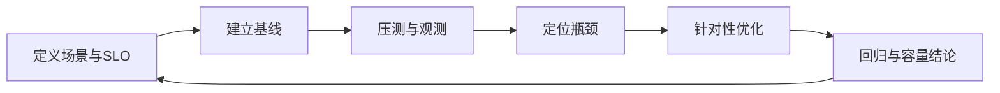

# 高级 Java 与 AI 应用工程（五）：性能、DevOps 与生产可信

## 技术定位

性能工程回答系统在给定负载下能否满足 SLO；DevOps 将构建、测试、发布和回滚变成可重复流程；安全与可信研发限制身份、数据、依赖和操作风险。它们共同决定代码能否在生产环境长期运行，而不只是“功能能否演示”。

## 1. 性能工程的闭环

性能优化不是“把 TPS 跑高”，而是明确业务场景下的容量边界和服务质量。

### 1.1 先定义测什么

每个场景写清：业务动作、数据规模、并发模型、读写比例、依赖模拟方式、成功标准和失败阈值。核心指标至少包括吞吐（TPS/QPS）、P50/P95/P99 延迟、错误率、CPU、内存、GC、线程池、连接池、数据库负载和消息积压。

不要用平均响应时间掩盖尾延迟；P99 恶化往往才是用户感受到的故障。压测环境、数据分布、缓存预热和下游行为要尽量接近生产，否则结果没有决策价值。

## 2. JVM 调优：从证据开始

### 2.1 常见症状与证据

| 症状 | 优先检查 | 常见根因 |
| --- | --- | --- |
| 延迟周期性尖刺 | GC 日志、堆使用、分配率 | 大对象、对象 churn、堆设置不匹配 |
| CPU 持续高 | 火焰图、线程栈、系统 CPU | 热循环、序列化、锁竞争、频繁 GC |
| 吞吐下降 | 线程池、连接池、下游延迟 | 排队、依赖慢、锁、资源耗尽 |
| 内存增长 | Heap dump、缓存、集合引用 | 泄漏、无界缓存、ThreadLocal |
| 请求卡死 | Thread dump、锁、I/O | 死锁、阻塞 I/O、锁等待 |

调优顺序：复现 → 采集证据 → 提出假设 → 小范围修改 → 回归压测。不要先凭经验改堆大小、GC 参数或线程数。

### 2.2 线程池与连接池

线程池大小必须由任务类型和下游容量决定。增加线程会降低排队，但也可能提高上下文切换、数据库连接竞争和垃圾生成。连接池设置要小于数据库可承受连接数，并预留给管理和其他服务的余量。

## 3. SQL、事务和缓存性能

慢 SQL 治理先收集 Top N，再按影响和频率排序。通过执行计划确认是否索引失效、扫描行数过大、排序/临时表、N+1 查询或错误的 Join 顺序。索引不是免费午餐：写入、存储、统计信息维护都会增加成本。

长事务治理关注：事务持续时间、锁等待、未提交连接、批量大小、隔离级别与重试冲突。报表和批处理应使用分页/游标、批提交和可恢复检查点，避免一次装载全部数据。

缓存优化不是只看命中率。还要看热点 key、缓存 value 大小、序列化开销、失效风暴、穿透攻击和回源数据库是否被保护。

## 4. 测试策略与质量门禁

测试金字塔不是要求单元测试越多越好，而是在反馈速度和真实度之间分层。

| 层级 | 验证对象 | 工具示例 |
| --- | --- | --- |
| 单元测试 | 领域规则、状态迁移、参数校验 | JUnit、Mockito |
| 集成测试 | 数据库、MQ、缓存、Repository | Testcontainers |
| 契约测试 | 服务间接口兼容性 | OpenAPI、Pact |
| 端到端测试 | 核心用户路径 | Playwright、API 测试 |
| 性能/混沌测试 | 容量与故障恢复 | k6、JMeter、故障注入 |

覆盖率是信号而非目标。行、分支、方法覆盖率可以发现盲区，但不能证明断言质量。质量门禁应组合：编译、单测、静态扫描、依赖漏洞、密钥扫描、镜像扫描、覆盖率阈值和关键场景回归。

## 5. CI/CD 与容器化

一条可审计流水线的典型阶段：

1. 拉取不可变提交并生成版本号。
2. 编译、单元测试、静态检查和依赖安全扫描。
3. 构建镜像，生成 SBOM，签名并推送到可信仓库。
4. 部署到测试环境，运行集成/契约/冒烟测试。
5. 按审批、灰度或自动策略进入生产。
6. 验证指标；失败则自动或人工回滚到上一不可变版本。

Docker 镜像使用多阶段构建、非 root 用户、固定基础镜像摘要和最小运行时。配置、密钥、运行时环境不要打进镜像。

Kubernetes/EKS 部署要设置资源 requests/limits、readiness/liveness/startup probes、滚动更新策略、HPA、PodDisruptionBudget 和 NetworkPolicy。探针失败不等于业务正确：readiness 应反映是否能接流量，避免把短暂依赖抖动变成全量重启。

## 6. 可观测性：日志、指标、链路

三个支柱回答不同问题：日志解释一次请求发生了什么；指标告诉系统整体是否异常；链路追踪定位跨服务的耗时与失败。

- 所有入口生成或传播 `traceId`；日志采用 JSON 并带服务、版本、租户（脱敏）、请求和错误码。
- RED 指标：Rate、Errors、Duration；资源层补充 CPU、内存、GC、线程、连接、队列。
- AI 应用额外监控模型延迟、token、调用成本、工具成功率、检索命中、拒答率和评测回归。
- 告警要面向用户影响（SLO/错误预算），而不只是机器阈值。

## 7. 安全与可信研发

### 7.1 基础控制

- 密钥放入受控 Secret 管理系统，通过短期凭据或工作负载身份获取。
- 依赖、镜像和 IaC 都进行漏洞扫描；建立修复 SLA 和例外审计。
- 最小权限、职责分离、生产操作审计、数据分类分级是基本线。
- 输入校验、输出编码、参数化 SQL、限流和文件类型校验防御常见攻击。

### 7.2 AI 特有风险

提示注入、数据外泄、越权工具调用、模型供应链、训练/检索数据污染和成本滥用需要单独建模。将系统提示、用户输入、检索上下文和工具输出明确分隔；工具服务端重复鉴权；对敏感字段脱敏；设置 token/并发/预算限额；记录可审计的调用摘要。

## 8. 面试表达与高频追问

**如何做一次性能优化？** 先定义场景和 SLO，建立包含 P95/P99、错误率和资源使用的基线；压测后用执行计划、火焰图、GC 日志、线程栈和依赖指标定位瓶颈；做单一假设驱动的优化，再回归验证吞吐、尾延迟和资源成本。不能只报一个 TPS 数字。

**JVM 调优从哪里开始？** 先根据症状取证：GC 尖刺看 GC 日志和分配率，CPU 高看火焰图，卡顿看线程栈，内存增长看 heap dump。堆大小和 GC 参数是最后的手段，根因常是无界缓存、大对象、锁竞争或下游排队。

**readiness 与 liveness 的区别？** liveness 表示进程是否需要重启；readiness 表示实例现在是否应该接收流量。将短暂依赖故障直接视为 liveness 失败，可能导致所有实例同时重启，反而扩大故障。

**为什么覆盖率高还会出生产事故？** 覆盖率只能说明代码被执行，不说明断言质量、并发时序、配置差异、依赖故障或真实数据分布被验证。质量门禁要结合集成测试、契约测试、扫描、发布验证与可观测性。
