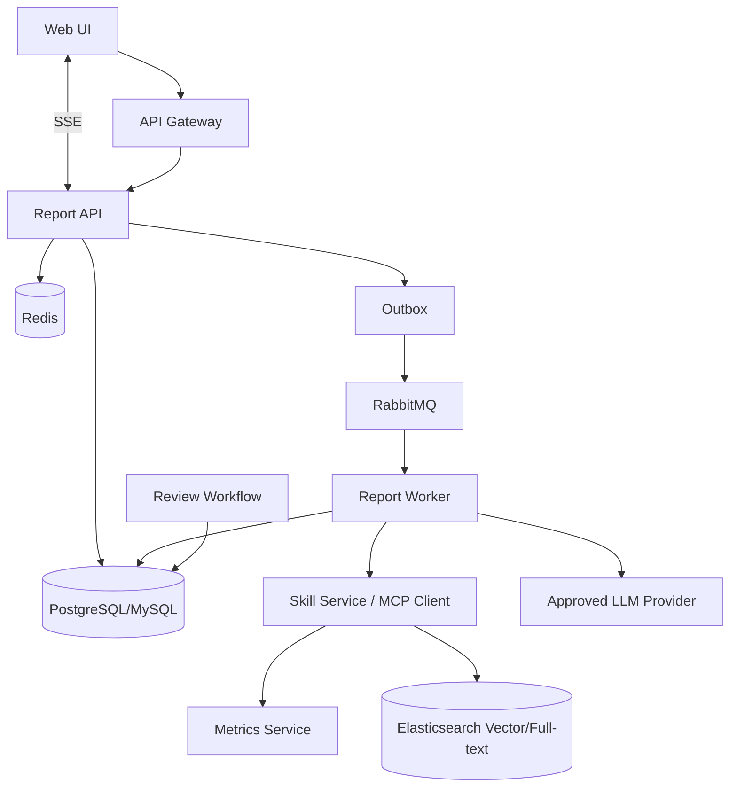

# 高级 Java 与 AI 应用工程（六）：企业运营诊断 AI Copilot 架构

## 架构定位

本章以企业运营诊断 AI Copilot 为例，展示 Java 服务、DDD、消息、检索、LLM 工具调用、实时推送、工作流与 DevOps 如何形成一个完整系统。它不是特定业务的唯一实现，而是一份可用于架构设计和面试阐述的参考蓝图。

这个项目将 Java、Spring、DDD、Redis、RabbitMQ、Elasticsearch、工作流、LLM Function Calling、MCP、SSE、性能与 DevOps 串成一条完整链路。

## 1. 范围与非目标

### MVP 范围

- 选择区域、期间和诊断主题，异步创建报告任务。
- 查询指标快照、知识卡片和图表数据。
- 模型以受控工具调用生成结构化报告，附带证据引用。
- 支持 SSE 展示任务进度和流式结果。
- 报告进入人工复核流程，批准后可对授权用户可见。

### 非目标

- 不让模型直连生产数据库。
- 不让模型自动对外发送或修改经营数据。
- 不追求通用自主 Agent；MVP 使用确定性工作流加有限工具循环。

## 2. 用例与领域语言

| 名词 | 含义 |
| --- | --- |
| 指标快照 | 某区域、期间和口径下的不可变指标数据 |
| 知识卡片 | 描述指标含义、分析规则和建议的版本化内容 |
| 报告任务 | 一次诊断生成请求及其运行状态 |
| 报告草稿 | 模型生成、尚待人工复核的结构化内容 |
| 证据 | 支撑一条结论的指标、卡片或图表引用 |
| Skill | 受控的业务工具，如查询指标、绘制图表 |

核心不变量：报告只能读取用户被授权的数据；任何已发布报告都必须有通过校验的证据；同一业务请求重复提交不会重复创建任务。

## 3. 架构设计



### 服务职责

| 服务 | 责任 |
| --- | --- |
| Report API | 鉴权、幂等、任务查询、SSE 订阅、审计 |
| Report Worker | 状态机、工具循环、结构化输出校验、重试 |
| Metrics Service | 指标口径、权限过滤、数据快照查询 |
| Knowledge Service | 卡片版本、ES 索引、混合检索、引用定位 |
| Skill/MCP Service | 受控工具注册与服务端鉴权 |
| Review Workflow | 审批、驳回、发布、通知 |

## 4. 数据与状态设计

### 4.1 核心表（概念）

- `report_job`：任务 ID、请求摘要、状态、重试次数、发起者、版本、时间。
- `report_draft`：结构化报告 JSON、模型/提示词版本、token、成本、生成时间。
- `report_evidence`：报告结论与指标快照/卡片版本的关联。
- `outbox_event`：业务事件、载荷摘要、投递状态、重试时间。
- `processed_event`：消费者去重记录。
- `audit_log`：用户动作、工具调用摘要、审批和发布记录。

报告任务状态：`PENDING → RUNNING → GENERATED → IN_REVIEW → PUBLISHED`；失败路径为 `RUNNING → RETRY_SCHEDULED/FAILED`，取消路径为 `PENDING/RUNNING → CANCELLED`。每次状态迁移记录原因、操作者和时间。

## 5. 报告生成工作流

1. API 验证用户身份、区域数据权限、输入格式与幂等键。
2. 在同一事务创建 `ReportJob` 与 `ReportRequested` Outbox 事件。
3. Worker 消费事件并原子地把任务领取为 `RUNNING`。
4. 查询允许的指标快照；根据主题检索已授权的知识卡片。
5. 调用模型进行受限的工具循环；最大轮数、超时、token 和成本均有限额。
6. 校验报告 JSON：必填字段、数值范围、证据 ID、敏感词与权限。
7. 保存草稿、证据关系，发布 `ReportGenerated` 事件，推送 SSE 进度。
8. 工作流创建复核任务；批准后才标记为 `PUBLISHED`。

模型工具只读示例：`query_metric_snapshot`、`search_knowledge_cards`、`render_chart`。任何写工具（例如创建工单）都要在 UI 展示影响，并经用户或审批者明确确认。

## 6. 输出契约

```json
{
  "summary": "本期收入较上期下降 8.2%，主要受 A 产品在华南区域影响。",
  "findings": [
    {
      "title": "A 产品收入下降",
      "severity": "high",
      "analysis": "...",
      "evidenceIds": ["metric:revenue:2026-08:cn-south", "card:revenue-analysis:v3"],
      "recommendations": ["核查重点客户续约与渠道库存"]
    }
  ],
  "limitations": ["本报告不包含尚未完成结算的订单"],
  "confidence": "medium"
}
```

服务端验证所有 `evidenceIds` 属于本次授权检索结果；找不到足够证据时不允许生成确定性结论。图表必须从指标服务返回的已授权数据生成。

## 7. API、事件与实时体验

| 接口/事件 | 语义 |
| --- | --- |
| `POST /report-jobs` | 创建任务，要求 `Idempotency-Key` |
| `GET /report-jobs/{id}` | 查询状态、进度、失败原因摘要 |
| `GET /report-jobs/{id}/events` | SSE，支持 `Last-Event-ID` 重连 |
| `GET /reports/{id}` | 读取已授权且可见的报告 |
| `ReportRequested` | 异步启动生成 |
| `ReportGenerated` | 草稿与证据已保存，进入复核 |
| `ReportPublished` | 审批完成，可通知订阅者 |

SSE 事件使用递增 ID，并保留可回放窗口；页面重连携带最后 ID。仅推送状态、进度和脱敏摘要，完整报告仍经授权接口读取。

## 8. 评测与架构验收

### 8.1 质量评测集

至少准备 50 条脱敏样本，覆盖：指标解释、区域/期间解析、数据不足、跨权限请求、相近卡片混淆、提示注入、工具超时和不一致数据。每条标注预期意图、必需证据、允许结论和拒答条件。

### 8.2 架构验收门槛

- [ ] 任务创建、消息消费和工具调用均幂等。
- [ ] 100% 报告结论携带有效证据，越权数据召回率为 0。
- [ ] 关键评测集端到端通过率达到团队约定门槛，并可按版本回归。
- [ ] P95 任务状态查询满足既定 SLO；生成链路有明确异步进度。
- [ ] 模型、检索、MQ、Redis 任一依赖不可用时有降级、重试或人工处理路径。
- [ ] 审计可回答“谁在何时用什么版本的模型和证据生成了这份报告”。

## 9. 发布与运行清单

1. 使用环境变量或 Secret 注入模型、数据库和 MQ 凭据。
2. 容器镜像经过测试、漏洞扫描和签名；部署使用不可变版本。
3. 建立任务成功率、队列积压、模型成本、工具错误率、检索延迟和 SLO 仪表盘。
4. 演练 Worker 崩溃、重复消息、模型超时、ES 不可用、权限变更和发布回滚。
5. 每次改动模型、提示词、检索或工具 schema 都进行评测集回归和灰度。

## 10. 面试表达与架构取舍

**为什么把报告生成设计成异步任务？** 模型和检索链路延迟不稳定，若同步等待会占住 Web 线程并受网关超时限制。异步任务通过状态机、消息和 SSE 提供可恢复进度；用户体验从“等待一个请求”变成“可追踪的业务过程”。

**为什么模型不能直接访问数据库？** 数据库查询涉及权限、口径、脱敏和审计。将数据能力收敛为 Skill/服务 API 后，可在服务端执行数据权限校验、参数约束、结果裁剪和调用审计，也能避免模型生成任意 SQL。

**系统如何保证报告可信？** 事实由版本化指标快照和知识卡片提供；模型输出结构化结果；每条结论绑定 evidenceId 并由服务端校验；高风险报告进入人工复核；模型、提示词、检索与工具版本均写入审计，支持回溯与评测回归。

**系统的主要扩展风险是什么？** 第一是数据权限与多租户隔离，第二是检索质量和成本，第三是异步任务积压，第四是模型/工具不确定性。架构中分别以服务端授权、评测与重排、队列监控与限流、schema 校验和人工复核应对。

## 11. 可扩展方向

- 增加多区域对标与趋势异常检测，但先将统计规则从模型推理中剥离。
- 增加多模型路由和本地模型，但以数据分级、成本和评测结果决定路由。
- 将图表、报告、工单等 Skill 按 MCP 标准化，但保留服务端授权和审计。
- 接入低代码编排平台时，将审批、通知等稳定流程外置；核心领域规则仍由服务维护。
