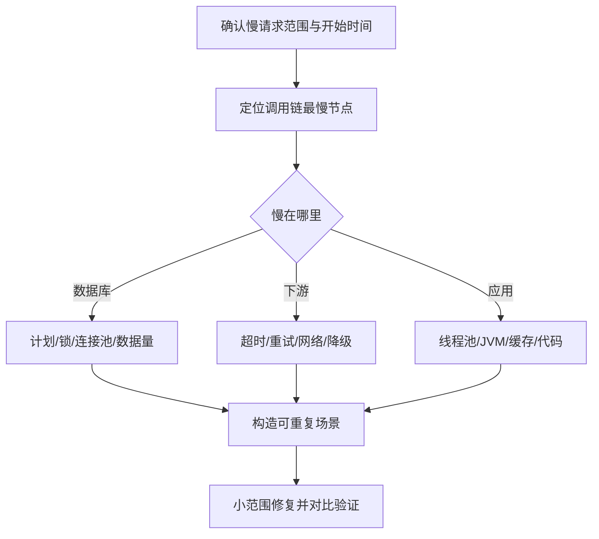

## 概要

“这个接口昨天还是 200ms，今天突然变成 5 秒。”

遇到这类问题，最危险的做法是立即改线程池、加缓存或者重启服务。它们有时能暂时缓解问题，却可能掩盖真正原因，并给系统引入新的不确定性。

我做过中台慢接口治理、性能边界压测和高并发服务调优。面对接口变慢，我通常按照“先界定范围，再沿调用链缩小问题”的方式排查，重点检查以下五个位置。

## 一、先确认“慢”发生在哪里

第一步不是看代码，而是建立事实：

- 是平均耗时变慢，还是 P95/P99 尾延迟变慢？
- 是所有请求都慢，还是某类参数、租户或数据范围慢？
- 是单个实例慢，还是所有实例慢？
- 从什么时间开始？期间是否有发布、配置、数据量或流量变化？
- 服务端处理慢，还是网关排队、客户端网络或重试造成的慢？

至少把一次请求拆成：

```text
客户端耗时
  = 网络与网关
  + 应用排队
  + 业务计算
  + 数据库/缓存
  + 下游调用
  + 序列化与响应传输
```

如果系统已有 Trace，先找到慢请求的完整 Span；如果没有，至少通过网关日志、应用访问日志和业务关键节点日志对齐同一个请求 ID。

## 二、检查数据库：最常见，但不能只看“有没有慢 SQL”

数据库问题通常包括四类。

### 1. 执行计划发生变化

相同 SQL 可能因为数据分布、统计信息、参数或索引变化，突然选择了不同的执行计划。重点关注：

- 是否从索引扫描退化为全表扫描；
- 联表顺序是否改变；
- 估算行数与实际行数是否严重偏离；
- 排序、临时表和回表次数是否异常。

### 2. 查询范围悄悄扩大

代码没有变化，但数据量在增长。例如默认查询最近 30 天，某个条件失效后变成查询全量；分页仍然存在，但为了计算总数执行了一次昂贵的 `count`。

### 3. 锁等待和长事务

SQL 本身执行很快，不代表请求不会慢。事务中夹杂远程调用、批量循环或大量业务计算，可能长时间占用连接和锁。

### 4. 连接池排队

应用监控中数据库耗时不高，但获取连接已经等待了几秒。需要同时观察连接池活跃数、等待线程、超时数和数据库连接上限。

## 三、检查下游调用：一次变慢可能被重试放大

一个接口经常要调用多个微服务、第三方接口或消息组件。某个下游偶发超时后，如果上游配置了多层重试，实际耗时可能变成：

```text
3 次客户端重试 × 2 次网关重试 × 单次 1 秒超时
```

最终用户看到的就不再是 1 秒，而可能是数秒甚至更长。

排查时重点看：

- DNS、连接建立、TLS、首包和响应读取分别耗时多少；
- 超时设置是否分层且合理；
- 是否存在客户端、网关和业务代码重复重试；
- 熔断、限流和降级是否真正生效；
- 并行调用是否因为一个慢节点退化成整体等待。

重试不是免费的可靠性。对非幂等操作，错误重试还可能造成重复写入。

## 四、检查 JVM 和线程池：CPU 不高也可能严重阻塞

很多人只看 CPU 和内存使用率。实际上，即使 CPU 不高，请求也可能因为线程排队、锁竞争或 GC 停顿而变慢。

### 线程池

需要观察：

- 活跃线程数与最大线程数；
- 队列长度和拒绝次数；
- 任务平均执行时间；
- 是否把阻塞 I/O 和 CPU 计算混在同一个池中；
- 是否出现线程池之间相互等待。

线程池不是越大越好。线程增加可能带来更多上下文切换、数据库连接争抢和下游压力。

### JVM

重点关注：

- Young GC、Full GC 的频率与停顿；
- 堆内存增长是否与流量匹配；
- 大对象、缓存和集合是否异常增长；
- 是否存在大量锁等待、死锁或 Safepoint 停顿；
- 日志、JSON 序列化、正则表达式等 CPU 热点。

在生产环境抓取线程栈或堆信息前，应先评估开销，优先使用低风险的监控和采样手段。

## 五、检查应用自身：缓存、日志、数据结构和发布变化

最后回到应用内部，但不要直接通读全部代码，而是围绕慢 Trace 检查：

- 缓存是否失效、击穿或集中到期；
- 是否出现 N+1 查询；
- 循环中是否调用数据库或远程接口；
- 日志级别是否被调整，是否同步输出大量内容；
- 返回对象是否突然增大；
- 新增切面、鉴权、审计或序列化逻辑是否进入主链路；
- 配置中心是否下发了不同于发布包的配置。

一次发布包含几十个改动时，优先做版本、配置和实例之间的差异对比，比“凭经验猜代码”更有效。

## 我的排查顺序



修复后至少对比吞吐量、P95/P99、错误率、资源使用和下游压力。只看到平均耗时下降，并不能说明问题已经解决。

## 结语

性能排查的本质不是记住几十条 JVM 参数，而是快速建立证据链：**哪里慢、为什么慢、改动是否真正消除了瓶颈、系统边界是否发生转移。**

我目前接受少量 Java/Spring Boot 系统的远程性能诊断、架构体检和疑难问题分析。可以先从单个慢接口或一次短期诊断开始，交付问题证据、风险优先级和整改建议。
