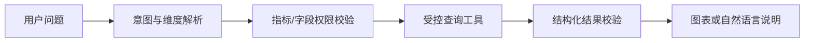

## 概要

提到企业大模型应用，很多方案的第一反应都是：把资料放进向量数据库，搭一套 RAG，再做一个聊天页面。

RAG 很有价值，但它解决的是“从非结构化知识中找到相关证据，并辅助模型生成回答”。如果业务真正需要的是精确计算、实时查询、流程执行或规则判断，先上 RAG 反而可能绕远路。

在企业智能问数、知识检索和自动诊断报告的实践中，我越来越倾向于先判断任务类型，再决定使用 RAG、工具调用、规则引擎还是普通软件功能。

## 场景一：答案必须来自实时结构化数据

例如：

- 查询本月某区域销售额；
- 统计当前库存、订单和告警数量；
- 对比两个时间段的转化率；
- 按组织、产品和客户层级聚合数据。

这些问题的核心不是寻找“意思相近的文本”，而是把自然语言转换为受控的数据查询。

更合适的架构通常是：

可以用大模型理解表达，但真正的数据获取应由经过约束的 API、查询模板或语义层完成。把数据库内容切成文本再做向量检索，既不实时，也很难保证数字精确。

## 场景二：用户需要系统执行动作

当用户说“生成报告”“创建工单”“发送通知”“查询后导出”时，目标不是获得一段知识，而是让系统完成动作。

这类场景更适合 Function Calling 或工作流编排：

1. 模型识别用户意图；
2. 选择允许调用的工具；
3. 生成符合 Schema 的参数；
4. 应用校验权限和参数；
5. 执行工具并返回结果；
6. 模型根据结果继续判断或生成说明。

RAG 可以提供操作说明或背景知识，但它不是执行引擎。

## 场景三：规则明确且错误成本很高

审批条件、费用计算、资格判断、风控拦截等业务，往往已有明确规则。如果将最终判断交给生成式模型，会带来可解释性、稳定性和审计问题。

更合理的组合是：

- 规则引擎负责确定性判断；
- 普通代码负责计算和状态流转；
- 大模型负责理解非结构化输入、补充材料摘要和结果解释；
- RAG 负责查找制度依据，并给出原文引用。

**能用确定性程序解决的问题，不要仅仅为了“AI 化”而改成概率式生成。**

## 场景四：知识本身还没有治理

如果企业资料存在以下情况，直接做 RAG 通常不会得到好结果：

- 大量重复、失效和相互冲突的文档；
- 文件没有版本、有效期和责任人；
- 权限边界不清楚；
- 扫描件质量差，表格和图片无法正确解析；
- 同一个指标在不同团队中含义不同。

RAG 不会自动解决知识治理问题。它可能只是让混乱的资料以更自然的语言输出。

这时应该先建立最小知识治理：确认权威来源、版本状态、元数据、权限和更新流程，再考虑检索链路。

## 场景五：需求只是固定入口和简单搜索

有些需求被包装成“智能助手”，实际只有十几个固定问题，答案变化很少。这时 FAQ、站内搜索、表单向导甚至一个清晰的菜单，可能比 RAG 更便宜、更稳定。

判断标准很简单：

- 用户表达是否真的高度多样？
- 内容是否多到无法维护固定入口？
- 语义检索是否明显优于关键词搜索？
- 模型带来的收益是否覆盖成本和风险？

如果答案都是否定的，就没有必要为了技术标签引入复杂链路。

## 如何选择技术路线

| 任务类型 | 优先方案 | RAG 的角色 |
|---|---|---|
| 查制度、案例、说明文档 | RAG + 引用 | 核心能力 |
| 查实时业务数据 | 语义层/API/SQL 工具 | 补充指标解释 |
| 创建、修改或触发业务动作 | Function Calling/工作流 | 提供操作依据 |
| 确定性计算与审批 | 代码/规则引擎 | 提供规则原文 |
| 固定少量问答 | FAQ/搜索/表单 | 通常不需要 |
| 综合诊断报告 | 工具调用 + 工作流 + RAG | 提供背景和证据 |

在复杂企业应用中，最终方案经常不是“RAG 或 Function Calling”二选一，而是把它们放在正确的位置。

## 一个更稳妥的 PoC 顺序

1. 选定一个高频且结果可验证的业务任务；
2. 明确输入、输出、权限和验收指标；
3. 区分知识检索、实时查询、规则判断和动作执行；
4. 只为必要环节引入大模型；
5. 用真实问题建立评测集；
6. 验证收益后再扩展知识范围和工具数量。

这样的 PoC 可能没有“万能聊天机器人”看起来炫酷，但更容易形成真实业务价值。

## 结语

企业做 AI 应用，首先应该问的不是“怎么搭 RAG”，而是：**这个任务究竟需要知识、数据、规则还是动作？**

我目前接受少量企业 AI 场景评估、技术路线设计和 PoC 交付合作，可以针对已有业务判断应该采用 RAG、Function Calling、工作流还是传统系统能力，避免一开始就堆叠不必要的技术组件。
