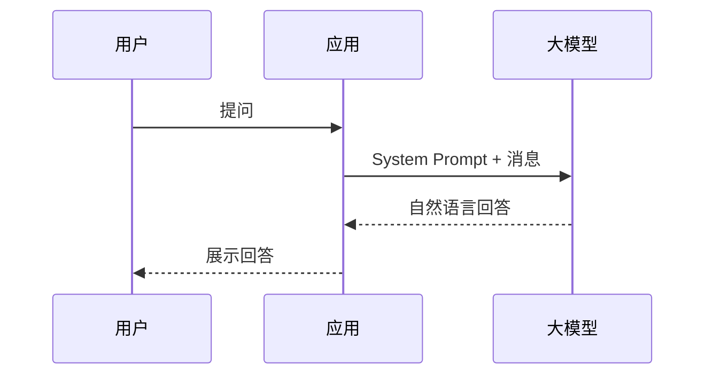
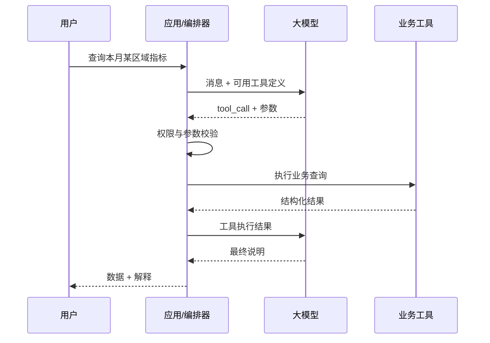

## 概要

普通聊天接口让大模型“回答问题”，Function Calling 则让大模型参与“选择并调用系统能力”。

两者表面上都接收消息并返回结果，但工程目标完全不同：普通聊天主要生成自然语言；Function Calling 需要模型、工具、权限、状态和错误处理共同组成一个执行闭环。

我在企业诊断报告类 AI 项目中设计过兼容 OpenAI Function Calling 格式的轻量工具调用框架，也做过 MCP 客户端与服务端集成。本文从工程角度说明两者的区别，以及什么时候值得引入工具调用。

## 普通聊天：输入消息，输出文本

最简单的聊天链路如下：



这种方式适合：

- 内容总结与改写；
- 开放式问答；
- 创意生成；
- 基于上下文的解释；
- 不需要访问外部系统的任务。

它的输出本质上是文本。即使 Prompt 要求模型输出 JSON，也只是“让模型生成看起来像 JSON 的文本”，应用仍然需要解析、校验和处理异常。

## Function Calling：模型决定调用什么，应用负责真正执行

Function Calling 会把可用工具及其参数结构提供给模型。例如：

```json
{
  "name": "query_sales_metric",
  "description": "查询指定区域和会计期的销售指标",
  "parameters": {
    "type": "object",
    "properties": {
      "region": { "type": "string" },
      "period": { "type": "string" },
      "metric": { "type": "string" }
    },
    "required": ["region", "period", "metric"]
  }
}
```

当用户询问某区域本月指标时，模型不直接编造答案，而是返回一个工具调用意图及参数。应用完成校验和执行后，再把结果交回模型组织最终回答。



关键点是：**模型只提出调用建议，真正的执行权始终在应用程序。**

## 两者的核心差异

| 对比项 | 普通聊天 | Function Calling |
|---|---|---|
| 主要输出 | 自然语言 | 工具调用意图、参数及最终回答 |
| 外部数据 | 依赖输入上下文 | 可实时查询 API、数据库或服务 |
| 执行动作 | 通常不执行 | 可触发受控业务动作 |
| 准确性来源 | 模型与上下文 | 工具的真实执行结果 |
| 工程复杂度 | 较低 | 需要编排、校验、权限和错误处理 |
| 典型场景 | 总结、问答、创作 | 查询、报告、工单、流程和 Agent |

Function Calling 并不会让模型自动变得更聪明。它只是为模型建立了一条访问真实系统的受控通道。

## 为什么不能让模型直接执行

模型生成的参数可能缺失、格式错误或不符合业务规则，也可能选择了不恰当的工具。因此应用层必须保留完整控制：

1. **工具白名单**：只向当前用户暴露允许使用的工具；
2. **参数校验**：Schema 校验之外，还要验证日期、范围和业务口径；
3. **权限校验**：不能因为模型提出调用就绕过用户权限；
4. **幂等控制**：创建、修改、发送等动作要防止重复执行；
5. **高风险确认**：删除、付款、发布等操作必须二次确认；
6. **审计记录**：保存调用人、工具、参数、结果和耗时；
7. **超时与降级**：工具失败时给出可理解的反馈，而不是无限循环。

尤其要避免将数据库任意 SQL、Shell 命令或内部管理接口直接暴露给模型。

## 多轮工具调用才是真正的难点

简单 Demo 通常只调用一次天气或计算器工具。企业任务往往需要多轮编排，例如生成诊断报告：

1. 获取用户选择的区域和周期；
2. 查询多个业务指标；
3. 对异常指标继续查询明细；
4. 获取指标口径和历史背景；
5. 生成图表；
6. 汇总为结构化报告。

编排器需要处理：

- 一轮中多个工具能否并行；
- 工具结果过大时如何裁剪；
- 调用次数和 Token 成本上限；
- 部分工具失败是否允许继续；
- 如何防止模型反复调用同一个工具；
- 中间状态如何持久化和恢复。

这也是普通聊天封装与可生产 Agent 框架之间的主要差距。

## Function Calling、RAG 和 MCP 的关系

三者解决的问题不同：

- **RAG**：从知识中检索证据；
- **Function Calling**：让模型选择结构化工具并生成参数；
- **MCP**：用相对统一的协议向模型应用提供工具、资源等上下文能力。

一个企业应用可以通过 MCP 接入工具，在模型侧使用 Function Calling 选择工具，同时用 RAG 补充制度或文档证据。它们不是互相替代的概念。

## 什么时候值得使用 Function Calling

适合：

- 答案必须来自实时业务数据；
- 用户希望查询后继续生成图表或报告；
- 需要创建工单、发送通知或触发流程；
- 多个系统能力需要通过自然语言统一入口调用；
- 任务可以被拆成明确、可验证的工具步骤。

不适合：

- 只是简单聊天、总结和文案生成；
- 工具没有稳定 API 或权限模型；
- 操作风险高但无法提供确认与审计；
- 需求用普通页面和固定流程就能更稳定地完成。

## 结语

普通聊天解决的是“模型怎么说”，Function Calling 解决的是“模型建议系统做什么”。从聊天升级到工具调用，增加的不只是一个 API 参数，而是一整套执行控制、权限、审计和容错机制。

我目前接受少量企业 AI 工具调用、MCP 接入、自动报告和 Agent 工作流的远程技术评估与 PoC 合作，也可以针对已有聊天应用评估是否有必要升级为可执行的工具调用架构。
