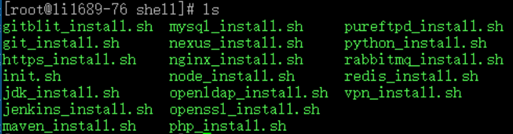

​



It is a tedious and painful thing to configure a new server every time, and you have to remember various commands. Lazy people always have a lazy way. Let’s write the installation process of commonly used tools as an automated script. Just copy and paste, and the rest is time for coffee.

Premise: All the scripts below are based on centos7. Other distributions of Linux have not been tested and may not be successful. First, the environment initialization script must be executed. By default, an isp user will be created, and all tools will be installed in the /home/isp/apps directory.

Usage: Copy the script directly and execute it on any path of the shell.

1.Environment initialization

```shell
bash <(curl -s -S -L http://install.chcbz.net/shell/init.sh)
```

2.Upgrade openssl

```shell
bash <(curl -s -S -L http://install.chcbz.net/shell/openssl_install.sh)
```

3.Install nginx

```shell
bash <(curl -s -S -L http://install.chcbz.net/shell/nginx_install.sh)
```

4.Install mysql

```shell
bash <(curl -s -S -L http://install.chcbz.net/shell/mysql_install.sh)
```

5.Install rabbitmq

```shell
bash <(curl -s -S -L http://install.chcbz.net/shell/rabbitmq_install.sh)
```

6.Install JDK

```shell
bash <(curl -s -S -L http://install.chcbz.net/shell/jdk_install.sh)
```

7.Install maven

```shell
bash <(curl -s -S -L http://install.chcbz.net/shell/maven_install.sh)
```

8.Install redis

```shell
bash <(curl -s -S -L http://install.chcbz.net/shell/redis_install.sh)
```

9.Install git

```shell
bash <(curl -s -S -L http://install.chcbz.net/shell/git_install.sh)
```

10.Install jenkins

```shell
bash <(curl -s -S -L http://install.chcbz.net/shell/jenkins_install.sh)
```

11.Install pureftpd

```shell
bash <(curl -s -S -L http://install.chcbz.net/shell/pureftpd_install.sh)
```

12.Install gitblit

```shell
bash <(curl -s -S -L http://install.chcbz.net/shell/gitblit_install.sh)
```

13.Install php

```shell
bash <(curl -s -S -L http://install.chcbz.net/shell/php_install.sh)
```

14.Install openldap

```shell
bash <(curl -s -S -L http://install.chcbz.net/shell/openldap_install.sh)
```

15.Install node

```shell
bash <(curl -s -S -L http://install.chcbz.net/shell/node_install.sh)
```

16.Install python

```shell
bash <(curl -s -S -L http://install.chcbz.net/shell/python_install.sh)
```

17.Install nexus

```shell
bash <(curl -s -S -L http://install.chcbz.net/shell/nexus_install.sh)
```
