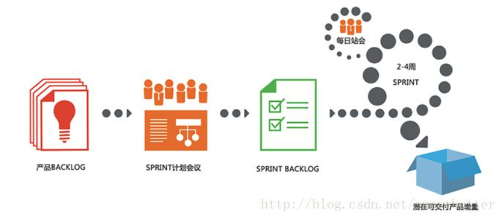
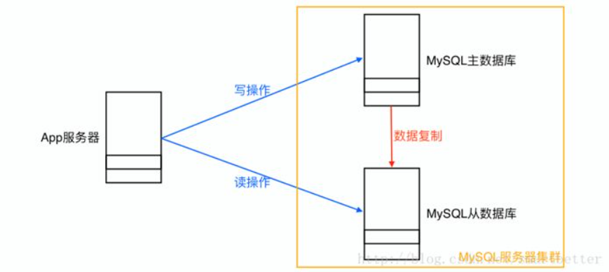
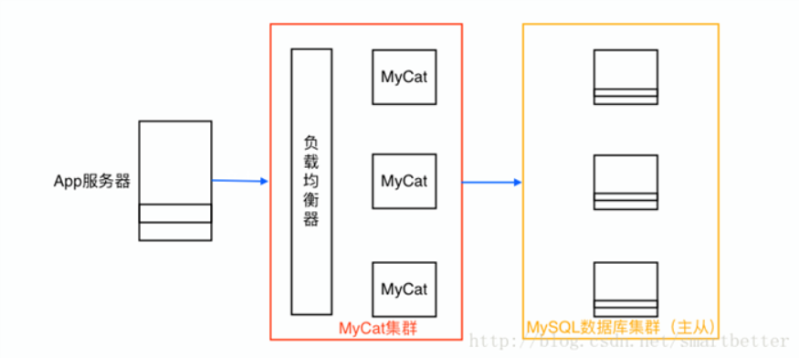
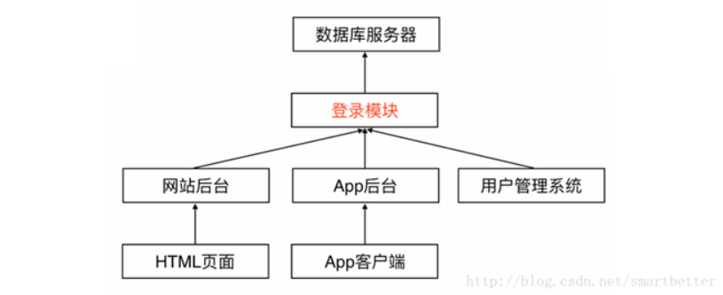
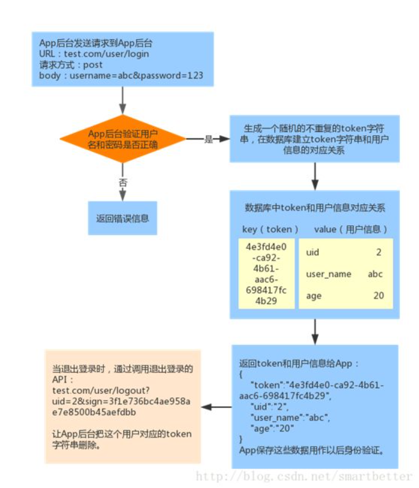
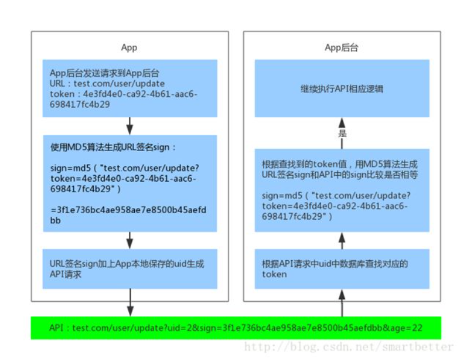
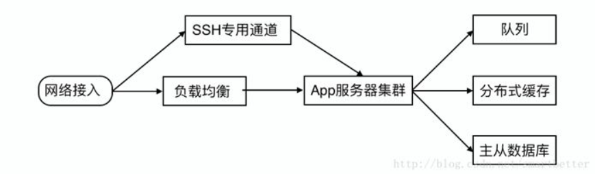
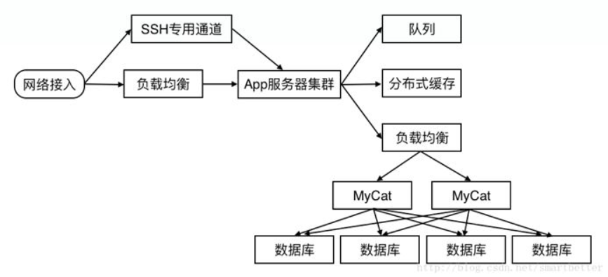
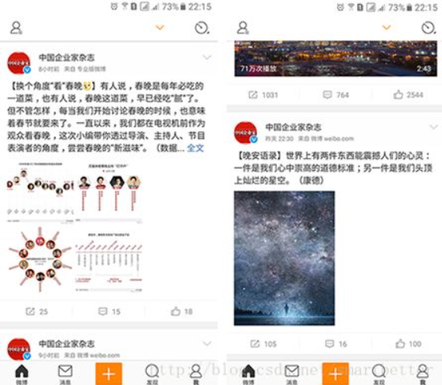
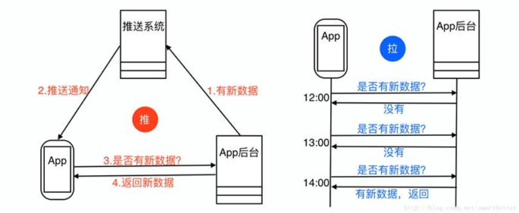

​

## Preface

Speaking of architecture, let’s first look at what architecture is. Baidu Encyclopedia says this: architecture, also known as software architecture, is an abstract description of the overall structure and components of software, and is used to guide the design of all aspects of large-scale software systems. Then we can also see that the architecture is closely related to the business and driven by the business.

Due to the characteristics of the App client, the technical implementation of the App background is different from the general Web background. First look at a development model suitable for App development:

## Agile development model

Scrum, an agile development framework, is recommended here. For details, you can check the Scrum official website to learn and use it. This is just an introduction.

The Scrum process is as follows:

## Select the appropriate database product and server system

There are many database products. Here I will explain Redis, MongoDB, MySQL and MariaDB, a branch of MySQL:

### 1. Database products

Database | Data storage location | Find the difference between data
--- | --- | ---
Redis | memory | based on key-value pair storage, fast read and write speed
MongoDB | uses hard disk and memory at the same time | each data has an id (index), knowing the id (index) query speed is fast, not knowing the id (index) is inefficient
MySQL (MongoDB) | hard disk | each data has an id (index), knowing the id (index) query speed is fast, not knowing the id (index) is inefficient

Then choose the appropriate database product according to different product requirements. If there is no special requirement, Redis as the cache system, MySQL or MariaDB as the database (the common setting is the database default character set utf8, the default sort utf8_general_ci) will be a good choice .

Software optimization:

- Correct use of MyISAM and InnoDB storage engines
- Correct use of indexes
- Avoid using select *
- Fields are set to non-NULL as much as possible

Hardware optimization:

- increase physical memory
- Increase application cache
- Use SSD hard disk

Architecture optimization:

- sub-table
- Read and write separation

- Sub-database (store the data of a table in different databases, which can be realized by MyCat, MyCat, relational database distributed processing software).

MyCat is located between the App server and the background database in the form of a proxy server. The open interface is the MySQL communication protocol. It disassembles and forwards the sql statements transmitted from the App server to different background databases according to the routing rules, and summarizes the results and returns them. .

The MyCat deployment model is as follows:

### 2. Server system

CentOS is a good choice. Regarding the deployment of the server, I have introduced it before, and the address is as follows:

[Nginx + Tomcat reverse proxy load balancing cluster deployment guide](http://blog.csdn.net/smartbetter/article/details/53535435)
[How Nginx + Tomcat reverse proxy efficiently deploys multiple sites on one server](http://blog.csdn.net/smartbetter/article/details/53615313)

Two common Linux commands are added below:

top displays system resources
netstat view network related information

## Select the appropriate message queue software

When the background system finds that it takes a lot of time to complete some small tasks, and the late completion does not affect the completion progress of the entire task, it will hand over these small tasks to the message queue. For example, tasks such as sending emails, text messages, and push messages are very suitable for processing in the message queue.

Putting these tasks in the message queue can speed up the response time of App background requests. At the same time, the message queue can also turn a large number of concurrent requests into serial requests to reduce the burden on the server.

  Common message queue software includes:

Message Queuing Software | Description
--- | ---
RabbitMQ | Heavyweight, suitable for enterprise-level development, with its own web monitoring interface, easy to monitor the status of the queue
Redis | Lightweight, it is a key-value system, but it also supports the data structure of message queue, and Redis is widely used in the App background
ZeroMQ | Known as the fastest, especially for high-throughput demand scenarios
ActiveMQ | A sub-project of Apache that implements queues with broker and peer-to-peer technologies

## Use distributed services to realize business reuse

With the continuous increase of business, the background system has expanded from a single application to a giant system. A large number of applications and services are aggregated in the system, and many functions are repeatedly implemented among various modules (such as the login module). Difficulty in maintenance and deployment.

Repeated modules in a large number of applications will bring a large number of accesses, and the connection between each application and the database generally uses the connection pool of the database. The resources of this connection pool are generally not released and are always reserved. Assuming that there are 10 connections in the connection pool, in a server cluster of hundreds, 1000 connections are occupied in the database. Each connection in the database is a very precious resource. In the case of limited resources, if it is occupied here, other available resources will be less.

The solution to these problems is to independently deploy the repeatedly implemented modules as remote services, and the newly added business calls the functions provided by the remote service to realize related businesses, independent of the specific code implementation inside.

To implement remote services, you can refer to the REST design principles and the RPC remote call protocol.

Open source RPC libraries include:

Open source RPC library | Description
--- | ---
Hprose | Lightweight, cross-language, cross-platform, non-intrusive, high-performance dynamic remote object call engine library
Dubbo | Distributed service framework, dedicated to providing high-performance and transparent RPC remote call services and SOA service governance solutions

## Best practices for user authentication schemes

App operations often involve user login operations, and login requires the use of user names and passwords. For security reasons, the fewer times the password is leaked during the login process, the better.

### 1. Use HTTPS protocol

The HTTPS protocol is a combination of the HTTP protocol and the SSL/TLS protocol. It is a secure communication channel, developed based on HTTP, for exchanging information between the client computer and the App background. It uses Secure Sockets Layer (SSL) for information exchange, which is simply a secure version of HTTP.

HTTPS actually applies the Secure Sockets Layer (SSL) as a sublayer of the HTTP application layer.

Model of HTTPS:

| HTTP |
| :-: |
| SSL/TLS (Secure Sockets Layer/Transport Layer Security) |
| TCP |
| IP |
| Network Transmission |

To avoid information leakage, the most basic solution is that all API requests involving security must use the HTTPS protocol.

### 2. Choose JSON as the data exchange format

JSON is a lightweight data exchange format. It adopts a completely language-independent text format. It is easy to write, easy to parse and generate by machine, and saves traffic compared to XML. These features make JSON an ideal data exchange language.

### 3. Basic user authentication scheme

Traditional Web sites use Cookie+Session to maintain the user's login status, while the App background uses tokens for verification. The process is as follows:

At this point, the app has obtained the token value. For security reasons, we do not transmit the token on the network, but use signature verification (URL signature is used here). The API request plus the URL signature sign and user id is as follows:

`test.com/user/update?uid=2&sign=3f1e736bc4ae958ae7e8500b45aefdbb&age=22`

This way, the token doesn't need to be attached to the URL. The App background signature verification process is as follows:

Some children's shoes like to set a timestamp, so that the URL will become invalid after a long time, which is also a good further optimization solution.

*Suggestion: In order to ensure data security, it is recommended to use HTTPS and signature verification at the same time. ***

## The evolution principle of App background architecture

The architecture of the App background is driven by the business scale and evolves. The App background serves the business. The value of the App background is that it can provide the functions required by the business and should not be over-designed.

From the perspective of the project, when the number of app visits is not large, the app background should be built quickly, so that the app can be launched as soon as possible to provide services to users, verify the correctness of the business model, and rapidly iterate products.

When the number of app visits continues to increase, it is necessary to take into account high performance and high availability while ensuring rapid iteration.

When the number of app visits reaches a certain stage, the growth curve will slow down, but the business becomes more complex, and the requirements for high performance and high availability are also higher. Performance problems, coupling between modules, and code complexity will become more prominent And obviously, at this time, issues such as business splitting, distributed service invocation, and even technological transformation must be used.

### 1. When the project starts - stand-alone deployment

Let's look at the simplified architecture of an App background:

Benefits of using Redis from the start:

It can be used not only as a cache, but also as a queue service, and has high concurrency performance, which can cope with business pressure for a long time, and is very suitable for initial projects.

Here, Redis is used to verify user information and act as a message queue.

In the early stage of file service, you can choose file cloud storage service, or build a resource server yourself.

### 2. When the project is of a certain scale - distributed deployment

Let's look at a million-level to tens of millions-level architecture:

Here, an external network channel specially used to connect to the SSH service of the internal server is added to ensure that SSH operations are available at any time, and a server cluster is added to provide load capacity.

With the development of business, the scale of some data tables will increase geometrically. When the data reaches a certain scale, the query and read performance will drop sharply. The database master-slave architecture cannot cope with the read and write pressure of the business. At this time In terms of architecture, table splitting (horizontal splitting/vertical splitting) should be considered.

When the business continues to develop, the read and write performance of the database table partition may not be able to meet the business needs. At this time, only a further split strategy - database partitioning can be adopted. After using a distributed processing system such as Cobar or MyCat for relational data, the structure of the sub-database is as follows:

Let's take a look at the background architecture scheme adopted by a real social app project.

## Social App background architecture design plan sharing

Scenario: Similar to Weibo, there are two types of relationships between users: follower/follower. When a user publishes new content, users who follow him can also receive the latest news on their personal homepage. A scene similar to Weibo:

The core function of social networking is Feed (referring to the information service that users aggregate the latest content of followed users by following them, and also include their own content for their own browsing).

### 1. Feed basic table structure

The common feed architecture is to store data in MySQL, and store hot data (usually in the last 3 days) in the cache (Redis/Memcached), ensuring that most requests are returned directly through the cache, and only a small number of requests penetrate the cache and fall to the database.

Let's take a look at the simplest feed table structure:

- send_content: send content table, storing content published by users:

   field | description
   --- | ---
   feed_id | The id of the published feed, the primary key is auto-incremented
   author_id | The id of the user who published the feed
   content | the content of the feed

- reveive_content: receive content table, used to store the content received by the user in push mode:

   field | description
   --- | ---
   feed_id | The id of the published feed, the primary key is auto-incremented
   author_id | The id of the user who published the feed
   reveive_id | The id of the user who received the feed
   content | the content of the feed

-followings: Follow table, which stores the people the user follows:

   field | description
   --- | ---
   id | primary key auto-increment
   uid | user id
   following_id | other user ids followed by this user

- followers: fans table, which stores users' fans:

   field | description
   --- | ---
   id | primary key auto-increment
   uid | user id
   follower_id | follow the user's user id

### 2. Feed push-pull mode - the process of a push mode user posting a piece of content

- The user with uid 1 publishes a "HelloWorld" message.
- After this content is written into the sending content table "send_content", the content is as follows:

   feed_id | author_id | content
   --- | --- | ---
   1 | 1 | Hello World

- Find fans whose uid is 1 in the fan table "followers". The content of the fan table "followers" is as follows:

   id | uid | follower_id
   --- | --- | ---
   1 | 1 | 2

   It can be seen that the fan of the user with id 1 is the user with id 2.

- Because this content needs to be displayed in the feed of the user whose id is 2, write the content into the receiving content table "reveive_content". After writing, the content of the receiving content table "reveive_content" is as follows:

   feed_id | author_id | reveive_id | content
   --- | --- | --- | ---
   1 | 1 | 2 | Hello World

- When the user whose id is 2 displays the feed, the data that the user needs to display can be queried through the SQL statement "select * from reveive_content where reveive_id=2".

The disadvantages of push mode are:

There will be a delay when the number of pushers is too large, and it will waste storage space;

The update operation is expensive, not only changing the "send_content" table, but also needing to change the "reveive_content" table synchronously.

### 3. Feed push-pull mode - the process of posting a piece of content by a user in pull mode

- The user with uid 5 publishes a message with the content "Thinks".
- After this content is written into the sending content table "send_content", the content is as follows:

   feed_id | author_id | content
   --- | --- | ---
   1 | 1 | Hello World
   2 | 5 | Thinks

- When the user whose uid is 10 displays the feed, look for the user who is followed by uid 10 in the following table "followings". The following table is as follows:

   id | uid | following_id
   --- | --- | ---
   1 | 10 | 5

   It can be seen that the user with uid 10 follows the user with uid 5, so it is necessary to obtain the content published by the user with uid 5.

- The user whose uid is 5 uses the sql statement "select * from send_content where author_id in (5)" to query the content that needs to be displayed.

It can be seen from the above that the pull mode adopts the strategy of exchanging time for space, and the user pushes content with high efficiency, but when the user displays the feed, it takes a lot of time for aggregation operations.

  Summarize:

- | Post Content | Show Feed | Change Notification
--- | --- | --- | ---
Push mode | Push to all fans | One sql statement can complete | High cost of change
Pull mode | No push | Requires a lot of aggregation operations | No change cost

The public Weibo in "Weibo" adopts the pull mode, and the private Weibo adopts the push mode.

The biggest problem of the pull mode is a large number of aggregation operations, and the response time of the request may be long. The cache strategy can be used to make the response time of most requests reach 2 to 3 milliseconds.

## Some other experience

### 1. Efficiently update data - push and pull content

In normal App design, if the App needs to know whether there is content update on the home page, access the data acquisition API through a polling mechanism, and know whether there is content update from whether the API returns updated data. Polling is a typical pull mode, but it consumes electricity, flow rate.

How to reduce polling? The solution given here is the push mode, as shown in the figure below:

Of course, you can’t just use the push mode. Due to the complexity of the mobile phone environment, there is no guarantee that the notification of the data update will reach the App. Therefore, the polling method should be used to regularly pull the data. The time interval can be set relatively longer. Through this combination of push and pull This mode can greatly reduce the frequency of App access to the App background and the amount of data transmitted.

### 2. Some techniques for dealing with expressions

Emoticons are stored in MySQL. Some emoticon UTF-8 encodings are 3 bytes, and some are 4 bytes. Therefore, general UTF encoding (3 bytes) cannot store emoticon data. The common solution is:

Upgrade MySQL to above 5.5, and then change the character encoding to utf8mb4_general_ci.

### 3. Mature and stable open source software to choose from

Features | Alternative Open Source Software
--- | ---
Project Management Software | Mantis, BugFree
Code Management Software | SVN, Git
Programming languages | Java, PHP, Python, etc.
Server system | CentOS, Ubuntu
HTTP/HTTPS server | Nginx, Tomcat, Apache
Load balancing | Nginx, LVS, HAProxy
Mail Services | Postfix, Sendmail
Message Queue | RabbitMQ, ZeroMQ, Redis
Filesystem | Fastdfs, mogileFS, TFS
Android push | Androidpn, gopush
IOS push | Javapns, Pyapns
Geolocation query LBS | MongoDB
Chat | Openfire, ejobberd
Monitoring | ngos, zabbix
Cache | Memcache, Redis
Relational Database | MySQL, MariaDB, PostgreSQL
NoSQL database | Redis, MongoDB, Cassandra
Search | Coreseek, Solr, ElasticSearch
Image processing | GraphicsMagick, ImageMagick
Distributed access service | dubbo, dubbox

### 3. Available mature and reliable cloud services

For start-up companies, it is recommended to use mature and reliable cloud services and open source software as much as possible, and only focus on business logic.

Features | Available Cloud Services
--- | ---
Project Management Tools | Teambition, Tower
Code hosting platform | GitHub, Gitlab, Bitbucket, CSDN CODE, Coding
Load Balancing | Alibaba Cloud SLB, Tencent Cloud CLB
Mail Service | SendCloud, MailGun
Message Queue | Alibaba Cloud MNS, Tencent Cloud CMQ
File system, image processing | Qiniu Cloud, Alibaba Cloud Object Storage OSS, Tencent Cloud Object Storage COS
Android Push | Aurora, Getui, Baidu Push
IOS Push | Aurora, Getui, Baidu Push
Chat | Rongyun, Huanxin
Monitoring | monitoring service that comes with monitoring treasure and cloud server
Cache | Alibaba Cloud Cache Service, Tencent Cloud Elastic Cache
Relational database | Alibaba Cloud RDS, Tencent Cloud CDB
NoSQL database | Alibaba Cloud NoSQL products, Tencent Cloud NoSQL products
Search | Alibaba Cloud Open Search, Tencent Cloud Search TCS
Distributed Access Service | Alibaba Cloud EDAS
Firewall | Alibaba Cloud Shield, Tencent Cloud Security
SMS sending | shareSDK, bmob, Luosimao
Social login share | shareSDK

Finally, in mobile Internet projects, product development requires small steps and quick iterations. The design of the architecture can also follow the same idea. If you like this article, remember to give it a thumbs up!

---
Original link: <http://blog.csdn.net/smartbetter/article/details/53933096>
