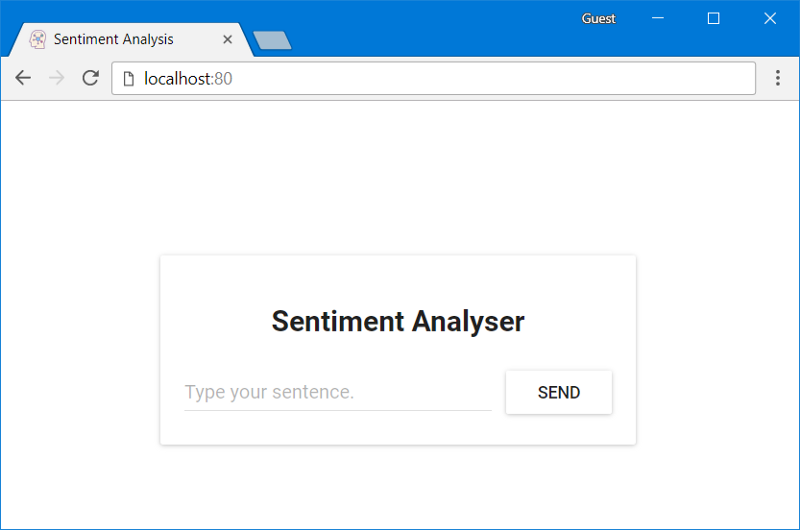
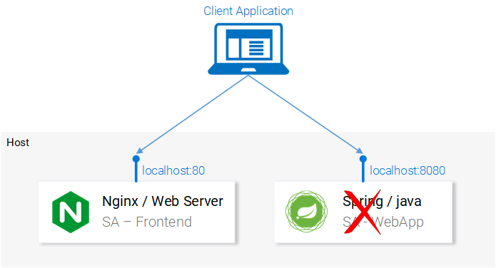
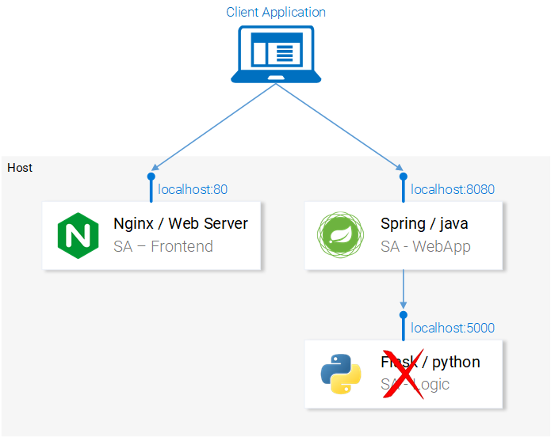
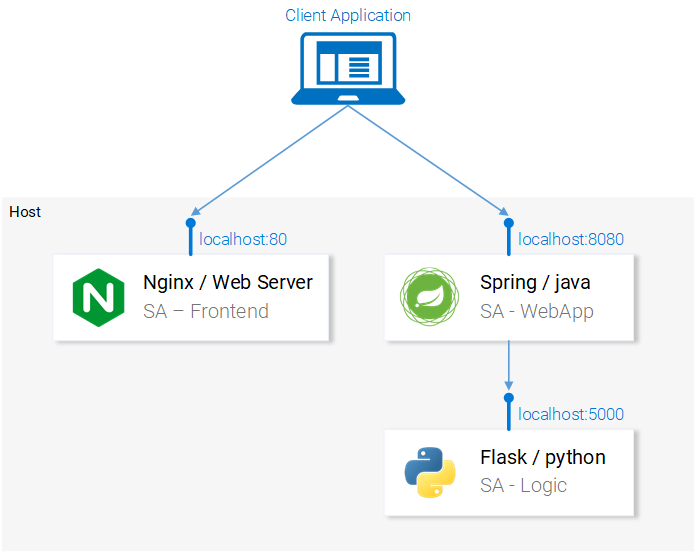
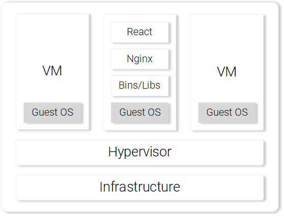
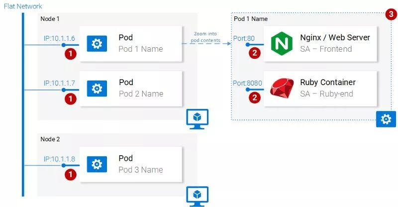
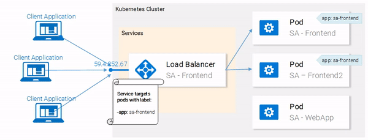

​

## Preface

I promise this is the most exhaustive Kubernetes technical documentation I can tell from the amount of time I've been working behind the scenes. Not much nonsense - the importance of Kubernetes, which firmly occupies the dominant position of container technology, must be self-evident.


The following is the translation:

Why would a bank pay me a fortune to do something so simple in Kubernetes? - I've always wondered about this because I thought anyone could learn this technique in 3 hours.

If you doubt what I say, come and challenge it! **After reading this article, you can definitely learn how to run microservices-based applications on a Kubernetes cluster.**I promise you can do it because that's how I introduce Kubernetes to my clients.

How are the tutorials in this article different from other resources? with large differences. Most tutorials start with the simplest: Kubernetes concepts and kubectl commands. This article is based on the reader's understanding of application development, microservices, and Docker containers.

In this article, we will cover the following:

- Running microservices-based applications on computers;

- Build a container image for each service of the microservice application;

- Basic introduction to Kubernetes;

- Deploy microservices-based applications inside a Kubernetes-managed cluster.

Through step-by-step in-depth study, everyone can understand the simplicity and ease of use of Kubernetes. Kubernetes is easy to master only if you understand the context in which it will be used. Without further ado, let's get started.

## Application Demo

The following application has a function: it accepts one sentence per input; using text analysis, calculates the sentiment expressed by the sentence.


From a technical point of view, the application consists of 3 microservices, each with specific functionality:

- SA-Frontend: Frontend, Nginx web server, serving ReactJS static files;

- SA-WebAp: web application, a Java web application that handles requests from the front end;

- SA-Logic: Logic processing, Python application to perform sentiment analysis.

You need to understand that microservices cannot work independently, they introduce a "separation of concerns" (separation of concerns), but they still need to interact with each other.


We can describe this interaction in terms of data flow between microservices:

- the client application requests the initial page index.html (the index.html page will in turn load the script of the ReactJS application);

- User interaction with the application triggers a request to the Spring web application;

- The Spring web application sends the request to the Python application for sentiment analysis;

- The Python application calculates the sentiment value and returns the result;

- The Spring web app returns the result to the React app (which then displays the result to the user).

Click here to download the code for these applications: `https://github.com/rinormaloku/k8s-mastery`. Now you can clone this code repository, and then we will do more exciting things.

## Run the microservice-based application on the computer

We need to start the 3 required services. Let's start with the most interesting part - the front-end application.

### Setting up a local deployment of React

In order to run a React application, first you need to have NodeJS and NPM installed on your computer. Once these are installed, navigate to the directory sa-frontend in a terminal. Then run the following command:

```shell
npm install
```

This command will download all the Javascript dependencies of the React application into the folder node_modules (all dependencies are defined in the package.json file). After all dependencies are resolved, run the following command:

```shell
npm start
```

that's it! We have our React application running and can now access it on the default port localhost:3000. You can modify the code freely and observe the immediate effect from the browser. The technology of hot module replacement (that is, replacing modules at runtime to reduce the number of page refreshes) is used here, which can reduce the work of front-end development.

### Prepare a production environment for React applications

In order to build a production environment, we need to create a static web page of the application and serve it through a web server.

To build a React application, first navigate to the directory sa-frontend in a terminal. Then run the following command:

```shell
npm run build
```

This command will generate a folder called "build" in the project's file directory. This folder contains all the static files required by the ReactJS application.

### Serving static files with Nginx

First install and start the Nginx web server. Then move the files inside the sa-frontend/build directory to [nginx installation directory]/html.

In this way, we can access the index.html file through [nginx installation directory]/html/index.html, which is the default file of Nginx service.

By default, the Nginx web server listens on port 80. You can specify a different port by modifying the server.listen field in the [nginx installation directory]/conf/nginx.conf file.

Open a browser and access port 80 to see that the ReactJS application loaded successfully.



Type your sentence in the input box "Type your sentence" and click the SEND button, but the page returns an error 404 (you can check your browser's console). Why? Let's examine the code.

### Check code

We can see in the App.js file that clicking the "SEND" button triggers analyzeSentence. The code of this method is as follows (we have numbered each piece of code "# number", and the specific explanation is as follows):

```JavaScript
analyzeSentence() {
     fetch('http://localhost:8080/sentiment', { // #1
         method: 'POST',
         headers: {
             'Content-Type': 'application/json'
         },
         body: JSON.stringify({
                        sentence: this.textField.getValue()})// #2
     })
         .then(response => response.json())
         .then(data => this.setState(data)); // #3
}
```

> #1: The URL for the POST method call (the application should listen for access on this URL);
> #2: The request body sent to the application looks like this:

```txt
{
     sentence: “I like Yogobella!”
}
```

> #3: The return value will update the state of the component, and the state change will re-render the component. If we receive data (i.e. a JSON object containing the sentence entered by the user and the polarity), then we display the component polarityComponent because the condition is met and we can define the component as follows:

```JavaScript
const polarityComponent = this.state.polarity !== undefined ?
     <Polarity sentence={this.state.sentence}
               polarity={this.state.polarity}/> :
     null;
```

Everything looks fine. But what are we missing? You may have noticed that we didn't set anything on localhost:8080! We must start the Spring web application listening on this port!



## Building a Spring web application

In order to set up a Spring web application, you must install JDK8 and Maven, and set their environment variables. Once set, we move on to the next section.

### Package the application into a Jar file

Enter the sa-webapp directory in the terminal and run the following command:

```shell
mvn install
```

This command will generate a folder called target in the directory sa-webapp. There is a packaged Java application package in the target folder: 'sentiment-analysis-web-0.0.1-SNAPSHOT.jar'.

### Start the application

Enter the target directory and start the application with the following command:

```shell
java -jar sentiment-analysis-web-0.0.1-SNAPSHOT.jar
```

Wait... something went wrong. The application fails to start, and we can see the following exception information:

> Error creating bean with name 'sentimentController': Injection of autowired dependencies failed; nested exception is java.lang.IllegalArgumentException: Could not resolve placeholder 'sa.logic.api.url' in value "${sa.logic.api.url }"

The important information shown here is sa.logic.api.url in the SentimentController. Let's examine this code.

### Check for error codes

```Java
@CrossOrigin(origins = "*")
@RestController
public class SentimentController {
@Value("${sa.logic.api.url}") // #1
     private String saLogicApiUrl;
@PostMapping("/sentiment")
     public SentimentDto sentimentAnalysis(
                             @RequestBody SentenceDto sentenceDto) {
         RestTemplate restTemplate = new RestTemplate();
return restTemplate. postForEntity(
                 saLogicApiUrl + "/analyse/sentiment", // #2
                 sentenceDto, SentimentDto.class)
                 .getBody();
     }
}
```

> #1: SentimentController has a field called saLogicApiUrl. The assignment of this field is defined by the sa.logic.api.url property.
> #2: The saLogicApiUrl is concatenated with the value "/analyse/sentiment" to form the URL for the Sentiment Analysis request.

### Define attributes

The default property resource in Spring is application.properties (the specific location is in sa-webapp/src/main/resources). But this is not the only way to define properties, we can complete the property definition through the previous command:

```shell
java -jar sentiment-analysis-web-0.0.1-SNAPSHOT.jar
      --sa.logic.api.url=WHAT.IS.THE.SA.LOGIC.API.URL
```

This property should be initialized with a value defined by the Python application at runtime, so that the Spring web application knows where to pass the information at runtime.

For simplicity, let's assume the Python application is running on localhost:5000. Please remember!

Run the following command, and then we look at the last service: the Python application.

```shell
java -jar sentiment-analysis-web-0.0.1-SNAPSHOT.jar
      --sa.logic.api.url=http://localhost:5000
```



## Building the Python application

In order to start the Python application, first we need to install Python3 and Pip, and set their environment variables.

### Install dependencies

Go to sa-logic/sa (code repository) in a terminal and run the following command:

```shell
python -m pip install -r requirements.txt
python -m textblob.download_corpora
```

### Start application

After installing the dependencies with Pip, we can start the application by running the following command:

```shell
python sentiment_analysis.py
* Running on http://0.0.0.0:5000/ (Press CTRL+C to quit)
```

This means the application is started and listening for HTTP requests on port 5000 of localhost.

### Check python code

Let's examine the code and see what the Python application that handles the logic part is doing:

```python
from textblob import TextBlob
from flask import Flask, request, jsonify
app = Flask(__name__) #1
@app. route("/analyse/sentiment", methods=['POST']) #2
def analyze_sentiment():
     sentence = request. get_json()['sentence'] #3
     polarity = TextBlob(sentence). sentences[0]. polarity #4
     return jsonify(#5
         sentence=sentence,
         polarity=polarity
     )
if __name__ == '__main__':
     app.run(host='0.0.0.0', port=5000) #6
```

> #1: Instantiate a Flask object;
> #2: Define the access path for POST requests;
> #3: Extract the "sentence" attribute from the request body;
> #4: Initialize an anonymous TextBlob object and get the polarity from the first sentence (we only have one);
> #5: return sentence and polarity in corresponding body;
> #6: Run the flask object application to listen for requests on localhost:5000.

All the services are set up to talk to each other. Try reopening localhost:80 on the frontend.



In the following sections, we will describe how to start these services inside Docker containers, as this is a prerequisite for running these services inside a Kubernetes cluster.

## Create container images for each service

Kubernetes is a container management platform. It is conceivable that we need containers to manage them. But what is a container? The best answer from the official Docker documentation is as follows:

> A container image is a lightweight, self-contained, executable package that contains everything to run: code, runtime, system tools, system libraries, settings. For Linux- and Windows-based applications, containerized software can run regardless of the environment.

This means that containers can run on any computer, even a production server, without any difference.

To illustrate this more visually, let's compare a React application running on a virtual machine versus a container.

### Serving React static files through a virtual machine

Disadvantages of using virtual machines include:

- Resource inefficient, requiring a fully fledged operating system for each virtual machine;

- There is a dependency on the platform. Features that work well on a local machine may not work properly on a production server;

- Heavier and slower to scale than containers.



### Serving React static files through the container

Advantages of using containers include:

- Very resource efficient, using the host OS with the help of Docker;

- No dependency on platform. A container that works on a local machine will work fine on any machine;

- Provide lightweight services through the image layer.


The above are the most prominent features and advantages of using containers. For more information, please refer to the official Docker documentation: `https://www.docker.com/what-container`.

### Building Container Images for React Apps (Introduction to Docker)

The most basic component of a Docker container is the .dockerfile. The most basic component of the Dockerfile is a container image. We will introduce how to create a container image that meets the application requirements through the following series of instructions.

Before we start defining the Dockerfile, let's recall the steps to serve React static files with Nginx:

- create static files (npm run build);

- Start the Nginx server;

- Copy the contents of the build folder of the frontend project into the nginx/html directory.

In the next section, you'll notice that creating a container is very similar to building React natively.

### Define the Dockerfile for the frontend

There are only two steps to build the front-end Dockerfile. This is because the Nginx team provides us with a basic Nginx image that we can leverage out of the box. The two steps are as follows:

- Boot the base Nginx image;

- Copy the sa-frontend/build directory into the container's nginx/html.

The converted Dockerfile looks like this:

```docker
FROM nginx
COPY build /usr/share/nginx/html
```

Surprised? This file is readable and we can generalize it as:

Start with the Nginx image (whatever is inside). Copy the build directory into the nginx/html directory of the image. Then just fine!

You may be thinking, where do I copy the build files from? For example: /usr/share/nginx/html. Very simple: documented in the Nginx image documentation on Docker Hub.

### Build and push container

Before pushing the image, we need a container registry to host the image. Docker Hub is a free cloud container service that we will use for this demonstration. There are 3 tasks to complete next:

- Install Docker CE;

- Register with Docker Hub;

- Run the following command in the terminal to log in:

```shell
docker login -u="$DOCKER_USERNAME" -p="$DOCKER_PASSWORD"
```

After doing any of the above, go into the directory sa-frontend. Then run the following command (please replace $DOCKER username with your docker hub username, for example: rinormaloku/sentiment-analysis-frontend).

```shell
docker build -f Dockerfile -t $DOCKER_USER_ID/sentiment-analysis-frontend .
```

Now we can remove the -f Dockerfile since we are already in the directory containing the Dockerfile.

We can push the image using the docker push command:

```shell
docker push $DOCKER_USER_ID/sentiment-analysis-frontend
```

Please confirm that the image was successfully pushed to the docker hub repository.

### Run the container

Now anyone can grab the image in $DOCKER_USER_ID/sentiment-analysis-frontend and run:

```shell
docker pull $DOCKER_USER_ID/sentiment-analysis-frontend
docker run -d -p 80:80 $DOCKER_USER_ID/sentiment-analysis-frontend
```

The Docker container is already running!

Before going to the next step, let's explain 80:80, which is confusing to many people:

- the first 80 is the port number of the host machine (eg: my computer);

- The second 80 is the port number of the container, requests will be forwarded here.


This is matched from `<host port>` to `<container port>`. That is to say, every request sent to port 80 of the host will be matched to port 80 of the container, as shown in Figure 9.

Because the port running on port 80 on the host machine (your computer) can access localhost:80. If Docker is not supported locally, then you can open the application on `<docker machine ip>:80`. Run the docker-machine ip command to find the IP of the Docker machine.

try it! You should now have access to your React application.

### Dockerignore file

Just now we saw that building the image of SA-Frontend is very slow, sorry, it should be super slow. This is because we have to send the environment files during the build to the Docker service. More specifically, the environment file in the build process refers to all the data in the Dockerfile directory that will be used when building the image.

In our example, the SA-Frontend file includes the following folders:

```folder
sa-frontend:
|.dockerignore
| Dockerfile
| package.json
| README.md
+---build
+---node_modules
+---public
\---src
```

But we only need the build folder. Uploading other files would be a waste of time. We can save time by deleting other directories. This requires the use of .dockerignore. You may think this is very similar to .gitignore, for example, you can add all directories you want to ignore to .dockerignore, like this:

```txt
node_modules
src
public
```

This .dockerignore file should be in the same folder as the Dockerfile. Creating an image file now only takes a few seconds.

Let's move on to the Java application.

### Building a container image for a Java application

do you know? You've pretty much learned all there is to know about creating container images! That's why this subsection is so short.

Open the Dockerfile in sa-webapp and you will see only two new keywords:

```txt
ENV SA_LOGIC_API_URL http://localhost:5000
…
EXPOSE 8080
```

The keyword ENV declares environment variables inside a Docker container. This allows us to provide the sentiment analysis API URL when starting the container.

Also, the keyword EXPOSE provides a port for us to access later. But wait, we didn't do this step in SA-Frontend, quite rightly so! This port is for documentation only, in other words this port is used to provide information to someone reading the Dockerfile.

You should have mastered creating and pushing container images. If you encounter any difficulties, you can read the README.md file in sa-webapp.

### Create a container image for a Python application

There are no new keywords in the Dockerfile for sa-logic. You are now a Docker guru.

For how to build and push container images, please read the README.md file in the sa-logic directory.

## Test the containerized application

Can you trust something that hasn't been tested? I don't believe it either. So let's test these containers.

1.Run the sa-logic container and configure the listening port 5050:

```shell
docker run -d -p 5050:5000 $DOCKER_USER_ID/sentiment-analysis-logic
```

2.Run the sa-webapp container and configure the listening port 8080 (because we changed the listening port of the Python application, we need to rewrite the environment variable SA_LOGIC_API_URL):

```shell
docker run -d -p 8080:8080 -e SA_LOGIC_API_URL='http://<container_ip or docker machine ip>:5000' $DOCKER_USER_ID/sentiment-analysis-web-app
```

3.Run the sa-frontend container:

```shell
docker run -d -p 80:80 $DOCKER_USER_ID/sentiment-analysis-frontend
```

Then it will work. Open localhost:80 in your browser.

Please note: If you change the port of sa-webapp, or use the IP of the docker machine, then you need to update App.js in sa-frontend to let analyzeSentence get the URL from the new IP or port. Then you need to build and use the updated image.


### Trivia Questions - Why Kubernetes?

In this section, we learned about the Dockerfile, how to use it to create an image, and the commands to push the image to the Docker registry directory. Additionally, we explored how to reduce the build environment files that need to be sent by ignoring unused files. Finally we ran the application from the container.

Next, we introduce why use Kubernetes? We'll be covering Kubernetes in depth below, and here I want to leave you with a quiz.

If our sentiment analysis web application is done well, and suddenly the traffic soars to millions of requests per minute, then our sa-webapp and sa-logic will face huge load pressure. How can we scale up the container, please?

## Introduction to Kubernetes

I assure you I am not exaggerating, after reading this you will be asking "why don't we call it Supernetes?"


### What is Kubernetes?

After starting the microservice from the container, we have a problem, let us describe this problem in the form of the following question and answer:

> Q: How do we expand or shrink the container?
> Answer: We start another container.
> Q: How do we share the load among containers? If the current server is maxed out, do we need another server? How can we maximize hardware usage?
> A: Uh...uh... (Let me search)
> Q: If the update patch is applied, all services will not be affected? If something goes wrong with the service, how do I go back to a version that was working before?

Kubernetes can solve all of the above problems (and more!). I can sum up Kubernetes in one sentence: "Kubernetes is a container control platform that can abstract all the underlying infrastructure (the infrastructure used by containers to run)."

We have a vague idea of a container control platform. Later in this article, we'll look at this in action, but this is the first time we've mentioned "abstraction of the underlying infrastructure", so let's take a closer look at the concept.

### Abstraction of underlying infrastructure

Kubernetes provides an abstraction of the underlying infrastructure through a simple API that we can send requests to. These requests allow Kubernetes to handle them to the best of its ability. For example, you can simply ask "Kubernetes add 4 containers for image x." Kubernetes will then figure out which nodes are in use and add the new containers there (as shown in Figure 12).


What does this mean for developers? Meaning developers don't need to care about the number of nodes, where they run their containers from and how they talk to them. Developers don't need to manage hardware optimizations, or worry about node shutdowns (they will follow Murphy's Law), as new nodes are added to the Kubernetes cluster. At the same time Kubernetes will add containers to other running nodes. Kubernetes will play the biggest role.

In Figure 2 we see something new:

- API server: the only way to interact with the cluster. Responsible for starting or stopping another container, or checking current status, logs, etc.;

- Kubelet: monitors the containers in the node and communicates with the master node;

- Pod: In the initial stage, we can regard pod as a container.

That's all for the introduction, and the in-depth introduction will distract us, we can wait until a little later, there are some useful resources, such as official documents, or read the book "Kubernetes in Action" by Marko Lukša, and Sébastien Goasguen & Michael The Kubernetes Cookbook by Hausenblas.

### Standardized cloud service provider

Another popular point of Kubernetes is that it standardizes cloud service providers. This is a very bold declaration. Let's take a look at it through the following examples:

For example, there is an expert in Azure, Google Cloud Platform, or another cloud service provider who takes on a project built on a brand new cloud service provider. This may cause many consequences, for example: he may not be able to meet the deadline; the company may need to recruit more relevant personnel, and so on.

In contrast, Kubernetes does not have this problem. Because no matter which cloud service provider, you can run the same command on it. You can send requests to the API server in the established way. Kubernetes will be responsible for abstracting and implementing this cloud service provider.

Stop for a second and think about it, this is an extremely powerful feature. For companies, this means they don't need to be tied to a single cloud provider. They can calculate the cost of other cloud service providers, and then transfer to another. They can still keep the original experts, keep the original personnel, and they can spend less money.

Having said all that, in the next section let's get to work with Kubernetes in practice.

## Kubernetes Practice - Pod

We built microservices to run on containers, and it was bumpy, but it worked. We also mentioned that this solution is not scalable and elastic, and Kubernetes can solve these problems. In subsequent sections of this article, we will move individual services into containers managed by Kubernetes, as shown in Figure 13.


In this article, we will use Minikube for local debugging, although everything is running in Azure and Google Cloud Platform.

### Install and start Minikube

See the official documentation for installing Minikube:

> `https://kubernetes.io/docs/tasks/tools/install-minikube/`

When installing Minikube, you can piggyback install Kubectl. Kubectl is the client that sends requests to the Kubernetes API server.

You can start Minikube by running the minikube start command. After starting, run the kubectl get nodes command to get the following results:

```shell
kubectl get nodes
NAME STATUS ROLES AGE VERSION
minikube Ready <none> 11m v1.9.0
```

The Kubernetes cluster provided to us by Minikube has only one node, but remember that we don't care how many nodes there are, Kubernetes will take care of the abstraction, and it is not important for us to have a deep understanding of Kubernetes.

In the next section, we'll introduce Kubernetes' first resource: Pods.

### Pods

I love containers, and I'm sure by now you love them too. So why does Kubernetes give us the Pod, the smallest deployable computing unit? What are pods for? Pods consisting of one or a group of containers can share the same runtime environment.

But do we really need to run two containers inside a Pod? Uh... Normally, only one container will run, and that's the case in our case. But in some cases, for example, two containers need to share volumes, or they communicate through cross-process communication, or they are bound together, then Pod can be used. Another feature of Pod is that if we want to use other technologies such as Rke, we can do it without relying on Docker containers.



In general, the main attributes of a Pod include (as shown in Figure 14):

- Each Pod can have a unique IP address within the Kubernetes cluster;

- Pods can have multiple containers. These containers share the same port space, so they can communicate through localhost (it is conceivable that they cannot use the same port), and the communication with containers in other Pods can be done by combining the Pod's IP;

- Containers in a Pod share the same volume, same IP, port space, and IPC namespace.

Note: Containers have their own independent file system, although they can share data through Kubernetes resource volumes.

For more details, please refer to the relevant official documents:

> `https://kubernetes.io/docs/concepts/workloads/pods/pod/`

### Pod definition

The following is the manifest file of our first pod sa-frontend, and we will explain the contents of the file one by one.

```shell
apiVersion: v1
kind: Pod # 1
metadata:
   name: sa-frontend # 2
spec: #3
   containers:
     - image: rinormaloku/sentiment-analysis-frontend # 4
       name: sa-frontend # 5
       ports:
         - containerPort: 80 # 6
```

> #1 kind: Specifies the type of Kubernetes resource we want to create. Here are Pods.
> #2 name: Define the name of the resource. We named it sa-frontend here.
> #3 spec: This object defines the state that the resource should have. The most important property in a Pod Spec is the array of containers.
> #4 image: refers to the image of the container we want to start in this Pod.
> #5 name: The unique name of the container in the Pod.
> #6 containerPort: refers to the port number that the container listens to. This is for documentation information only (access is not affected even without this port).

### Create a Pod for SA Frontend

You can find the above Pod definitions in resource-manifests/sa-frontend-pod.yaml. You can enter this folder in the terminal, or enter the full path on the command line. Then execute the following command:

```shell
kubectl create -f sa-frontend-pod.yaml
pod "sa-frontend" created
```

Pods can be confirmed with the following command:

```shell
kubectl get pods
NAME READY STATUS RESTARTS AGE
sa-frontend 1/1 Running 0 7s
```

If the Pod is still in the state of container generation, you can add the parameter --watch when running the command. When the Pod enters the running state, the terminal will display information.

### Accessing the application externally

In order to access the application from the outside, we need to create a Kubernetes resource of the service type. We will explain the specific content in the following chapters. Although it is more appropriate to support external access through the resource of the service type, here for quick debugging, we also have Another way is to forward the port:

```shell
kubectl port-forward sa-frontend-pod 88:80
Forwarding from 127.0.0.1:88 -> 80
```

Visit 127.0.0.1:88 in your browser to open the React application.

### The Wrong Way to Scale

We said that one of the main features of Kubernetes is scalability, to prove it, let's run another pod. We create another Pod resource with the following definition:

```shell
apiVersion: v1
kind: Pod
metadata:
   name: sa-frontend2 # The only change
spec:
   containers:
     - image: rinormaloku/sentiment-analysis-frontend
       name: sa-frontend
       ports:
         - containerPort: 80
```

Then, create a new Pod with the following command:

```shell
kubectl create -f sa-frontend-pod2.yaml
pod "sa-frontend2" created
```

The second Pod can be confirmed with the following command:

```shell
kubectl get pods
NAME READY STATUS RESTARTS AGE
sa-frontend 1/1 Running 0 7s
sa-frontend2 1/1 Running 0 7s
```

We now have two Pods running.

Please note: this is not a final solution, there are many flaws. We'll improve on this solution in the Deployment of another Kubernetes resource section.

### Summary Pods

The Nginx web server serving static files runs in a different Pod. Now we have two problems:

- How do you expose these services to the outside world so that users can access them through URLs?

- How to balance the load between Pods?


Kubernetes provides resources of type service. We'll go into detail in the next section.

## Kubernetes Practice - Service

A Kubernetes Service resource can serve as an entry point for a group of Pods that provide the same service. This resource is responsible for discovering services and balancing load among Pods, as shown in Figure 16.


Inside the Kubernetes cluster we have Pods that provide different services (frontend, Spring web application and Flask Python application). So the question here is: how does a service know which pod to process? For example: how does it generate a list of endpoints for these Pods?

This problem can be solved with labels, in two steps:

- Label all object Pods handled by the service;

- Use a selector in the service that defines all object Pods that are labeled.

The following view looks clearer:


We can see that the Pods are all labeled "app: sa-frontend", and the service uses this label to find the target Pod.

### Label

Labels provide an easy way to manage Kubernetes resources. They are represented by a key-value pair and can be used for all resources. Following the example in Figure 17, modify the manifest file.

Save the file after making modifications, and apply the changes with the following command:

```shell
kubectl apply -f sa-frontend-pod.yaml
Warning: kubectl apply should be used on resource created by either kubectl create --save-config or kubectl apply
pod "sa-frontend" configured
kubectl apply -f sa-frontend-pod2.yaml
Warning: kubectl apply should be used on resource created by either kubectl create --save-config or kubectl apply
pod "sa-frontend2" configured
```

We see a warning (when applying, not creating, got it). On the second line we see pods "sa-frontend" and "sa-frontend2" deployed. We can filter the Pods we want to see:

```shell
kubectl get pod -l app=sa-frontend
NAME READY STATUS RESTARTS AGE
sa-frontend 1/1 Running 0 2h
sa-frontend2 1/1 Running 0 2h
```

Another way to verify the pods with labels is to add the flag --show-labels to the above command, then all labels of each pod will be displayed in the result.

very good! The pods are already labeled and we are ready to find them through the service. Let's define a service of type LoadBalancer as shown in Figure 18.



### Service definition

The YAML definition for the LoadBalancer service looks like this:

```shell
apiVersion: v1
kind: Service # 1
metadata:
   name: sa-frontend-lb
spec:
   type: LoadBalancer # 2
   ports:
   - port: 80 # 3
     protocol: TCP # 4
     targetPort: 80 # 5
   selector: # 6
     app: sa-frontend # 7
```

> #1 kind: service;
> #2 type: Specify the type, we choose LoadBalancer because we want to balance the load between Pods;
> #3 ports: Specify the port for the service to obtain the request;
> #4 protocol: define communication;
> #5 targetPort: The incoming request can be forwarded to this port;
> #6 selector: an object containing the selected pod properties;
> #7 app: sa-frontend defines which is the target Pod, and only the one with the label "app: sa-frontend" is the target Pod.

Create the service by running the following command:

```shell
kubectl create -f service-sa-frontend-lb.yaml
service "sa-frontend-lb" created
```

The status of the service can be checked by running the following command:

```shell
kubectl get svc
NAME TYPE CLUSTER-IP EXTERNAL-IP PORT(S) AGE
sa-frontend-lb LoadBalancer 10.101.244.40 <pending> 80:30708/TCP 7m
```

External-IP is in pending state (don't wait any longer, this state will not change). This is because we are using Minikube. If we run on Azure or Google cloud services, then we can get a public IP, then the whole world can access our service.

Nevertheless, Minikube will not leave us alone, and it provides a very useful local debugging command, as follows:

```shell
minikube service sa-frontend-lb
Opening kubernetes service default/sa-frontend-lb in default browser...
```

This opens a browser pointing to the service's IP. When a service receives a request, it forwards the request to one of the Pods (it doesn't matter which). This abstraction allows us to see and interact with multiple Pods as if they were one, by using services as access points.

### Summary of Services

In this section, we introduced labeling resources, using labels as selectors in services, and we also defined and created a LoadBalancer service. This satisfies our need to scale the application (just add new labeled pods) and load balance across pods by using services as access points.

## Kubernetes Practice - Deployment

Kubernetes deployments help keep the life of every application the same: change. In addition, only dead applications will remain unchanged, otherwise, new requirements will continue to emerge, and more code will be developed, packaged, and deployed. Every step in the process has the potential to go wrong.

Deployment resources can automate the process of upgrading an application from one version to another without interrupting service, and if something unexpected happens, it allows us to quickly roll back to the previous version.

### Deployment practice

Now we have two pods and one service open with load balancing between them (as shown in Figure 19). We mentioned that existing Pods are far from perfect. Each Pod needs to be managed separately (create, update, delete and monitor their condition). Quick updates and quick rollbacks are simply not possible! This is not OK, deploying Kubernetes resources can solve every problem here.


Before moving on, let's restate our goals and give an overview to better understand the definition of a manifest file for deploying resources. What we want is:

- two Pods of the image rinormaloku/sentiment-analysis-frontend;

- Uninterrupted service during deployment;

- Pods are labeled app: sa-frontend, so we can find individual services via the sa-frontend-lb service.

In the next section, we can reflect these requirements into the definition of a deployment.

### Deployment definition

The YAML file defined by the following resources can achieve all the points mentioned above:

```shell
apiVersion: extensions/v1beta1
kind: Deployment # 1
metadata:
   name: sa-frontend
spec:
   replicas: 2 # 2
   minReadySeconds: 15
   strategy:
     type: RollingUpdate # 3
     rollingUpdate:
       maxUnavailable: 1 # 4
       maxSurge: 1 # 5
   template: # 6
     metadata:
       labels:
         app: sa-frontend # 7
     spec:
       containers:
         - image: rinormaloku/sentiment-analysis-frontend
           imagePullPolicy: Always # 8
           name: sa-frontend
           ports:
             - containerPort: 80
```

> #1 kind: deployment;
> #2 replicas: It is an attribute of the deployment Spec object, which defines how many Pods we want to run. So it is 2;
> #3 type: Specify the deployment strategy when upgrading from the current version to the next version. The strategy RollingUpdate here can ensure uninterrupted service during deployment;
> #4 maxUnavailable: It is an attribute of the RollingUpdate object, which defines the maximum number of pods allowed to stop when upgrading (compared to the desired state). For our deployment, we have 2 replicas, which means that after one Pod stops, we will have another Pod running, so the application can be guaranteed to be accessible;
> #5 maxSurge: is another property of the RollingUpdate object that defines the maximum number of Pods to add to the deployment (compared to the desired state). For our deployment, this means that when migrating to a new version, we can add a Pod, then we can have 3 Pods at the same time;
> #6 template: Specifies the template of the Pod, which will be used when deploying to create a new Pod. Chances are this very similar Pod will appeal to you immediately;
> #7 app: sa-frontend: Pods created according to the template will be labeled with this label;
> #8 imagePullPolicy: When set to Always, every new deployment will re-fetch the container image.

Frankly, this pile of text confuses me even more, so let's look at an example:

```shell
kubectl apply -f sa-frontend-deployment.yaml
deployment "sa-frontend" created
```

As usual let's check if everything went as promised:

```shell
kubectl get pods
NAME READY STATUS RESTARTS AGE
sa-frontend 1/1 Running 0 2d
sa-frontend-5d5987746c-ml6m4 1/1 Running 0 1m
sa-frontend-5d5987746c-mzsgg 1/1 Running 0 1m
sa-frontend2 1/1 Running 0 2d
```

Now we have 4 running pods, two were created by deployment and two we created manually. Delete one of the manually created Pods with the kubectl delete pod `<pod-name>` command.

Exercise: Delete the Pods created by one of the deployments and see what happens. Before reading the explanation below, please think about why.

Explanation: After deleting a Pod, the deployment notices the current state (only 1 Pod is running) and the desired state (2 Pods are running), so it starts another Pod.

So what's the benefit of using deployments other than maintaining the desired state? Let's look at the benefits first.

### Benefit 1: Adopt zero-downtime deployment (Zero-downtime)

The product manager came to us with a new requirement, saying that the customer wanted to add a green button on the front end. After the developer has written the code, they only need to provide us with one of the necessary things, the container image rinormaloku/sentiment-analysis-frontend:green. Then it's up to us, we need to deploy with zero downtime, is it hard? Let's try it out!

Edit the deploy-frontend-pods.yaml file and change the container image to the new image: rinormaloku/sentiment-analysis-frontend:green. Save the changes and run the following command:

```shell
kubectl apply -f deploy-frontend-green-pods.yaml --record
deployment "sa-frontend" configured
```

Let's check the status of the online with the following command:

```shell
kubectl rollout status deployment sa-frontend
Waiting for rollout to finish: 1 old replicas are pending termination...  
Waiting for rollout to finish: 1 old replicas are pending termination...  
Waiting for rollout to finish: 1 old replicas are pending termination...  
Waiting for rollout to finish: 1 old replicas are pending termination...  
Waiting for rollout to finish: 1 old replicas are pending termination...  
Waiting for rollout to finish: 1 of 2 updated replicas are available...  
deployment "sa-frontend" successfully rolled out
```

From the perspective of deployment, the launch has been successful. The copies are replaced one by one during this process. Means the application is always online. Before continuing, let's make sure that the update actually worked.

### Confirm Deployment

Let's confirm the updated result in the browser. Run the command minikube service sa-frontend-lb that we used before, it will open the browser. We can see that the button SEND has been updated.


### Situation behind "RollingUpdate"

After we apply the new deployment, Kubernetes compares the new state with the old one. In our case, the new state requires two Pods of the rinormaloku/sentiment-analysis-frontend:green image. This is different from the current running state, so Kubernetes will perform a RollingUpdate.


The RollingUpdate here will be executed according to the specifications we specified, that is, "maxUnavailable: 1" and "maxSurge: 1". This means that a deployment needs to terminate a Pod and only a new Pod can be run. This process is repeated until all Pods are replaced (as shown in Figure 21).

We move on to the second benefit.

Disclaimer: For the purpose of entertainment, I wrote the following part in the form of a novel.

### Benefit 2: Roll back to the previous state

> The product manager comes into the office and says he has a big problem!
> The product manager yells: "Application in production environment has a critical bug!! Need to rollback to previous version immediately".
> You looked at him calmly, without even blinking, you turned to your beloved terminal, and started typing:

```shell
kubectl rollout history deployment sa-frontend
deployments "sa-frontend"
REVISION CHANGE-CAUSE
1 <none>
2 kubectl.exe apply --filename=sa-frontend-deployment-green.yaml --record=true
```

> You take a look at the previous deployment and ask the product manager: "The last version had a lot of bugs, so did the previous version work flawlessly?"
> The product manager yelled: "Yeah, didn't you hear me?!"
> You ignore him, you know what to do, so you start typing:

```shell
kubectl rollout undo deployment sa-frontend --to-revision=1
deployment "sa-frontend" rolled back
```

> Then, you lightly refresh the page, and all previous changes are gone!
> The product manager looks at you dumbfounded.
> You saved everyone!
> end

I know...it's a boring story. Before Kubernetes, the story was good, more dramatic, high tension, and it stayed that way for a long time. The old days are still good!

Most commands come with their own instructions, but there are some details that you need to figure out yourself. Why is the value of field CHANGE-CAUSE in the first version `<none>`, while in the second revision, the value of CHANGE-CAUSE is "kubectl.exe apply –filename=sa-frontend-deployment-green. yaml --record=true".

You should be able to spot this because we used the flag --record when applying the new image.

In the next section, we will use all the previous concepts to complete the entire architecture.

## Kubernetes and everything else in action

Now we have learned all the necessary resources to complete the architecture, so this section will be very fast. The gray areas in Figure 22 are things that need to be done. Let's start from the bottom: deploy sa-logic's deployment.


### Deploy SA-Logic

Enter the directory where the resource manifest file is located in the terminal, and then run the following command:

```shell
kubectl apply -f sa-logic-deployment.yaml --record
deployment "sa-logic" created
```

The deployment of SA-Logic creates three Pods (on which our Python application is running). The command also labels the Pod app: sa-logic . With this label, we can use selectors from the SA-Logic service to select these Pods. Please take a moment to open sa-logic-deployment.yaml and review its contents.

The concepts are the same here, so we can move on to the next resource: the SA-Logic service.

### SA Logic Service

First, let's explain why this service is needed. Our Java application (running in a Pod deployed by SA-WebApp) relies on the sentiment analysis provided by the Python application. But now, unlike when we were running everything locally, we don't have a single Python application listening to a port, we only have two Pods, and we can have more if needed.

That's why a "service" is needed to provide access to a group of pods that provide the same functionality. That is, we can use the SA-Logic service as an access point for all SA-Logic Pods.

Run the following command:

```shell
kubectl apply -f service-sa-logic.yaml
service "sa-logic" created
```

Updated application status: Now we have two pods running (containing the Python application) and the SA-Logic service provides access that will be used in the SA-WebApp's pod.


Now we need to deploy the SA-WebApp Pod, we need to use the deployment resources.

### SA-WebApp deployment

We have already learned about deployment, although this deployment will use more features. Open the sa-web-app-deployment.yaml file, and you will find the following new content:

```shell
- image: rinormaloku/sentiment-analysis-web-app
   imagePullPolicy: Always
   name: sa-web-app
   env:
     - name: SA_LOGIC_API_URL
       value: "http://sa-logic"
   ports:
     - containerPort: 8080
```

The first thing we're interested in is the env property. We guess it defines the environment variable SA_LOGIC_API_URl with the value `http://sa-logic` inside the Pod. But why initialize it to `http://sa-logic`, what exactly is `sa-logic`?

Let's introduce kube-dns first.

### KUBE-DNS

Kubernetes has a special Pod called kube-dns. By default, all Pods use it as a DNS server. An important property of kube-dns is that it creates a DNS record for each established access.

This means that when we create the sa-logic service, it gets an IP address. Its name will be added to kube-dns (along with its IP address). In this way, all Pods can translate sa-logic into the IP address of the SA-Logic service.

OK, now you can continue:

### SA WebApp Deployment (continued)

Run the following command:

```shell
kubectl apply -f sa-web-app-deployment.yaml --record
deployment "sa-web-app" created
```

It's over. All that remains is to expose the SA-WebApp Pod to the outside world via the LoadBalancer service. The LoadBalancer service provides access to the SA-WebApp Pod so that the React application can send HTTP requests.

### SA-WebApp Service

Open the service-sa-web-app-lb.yaml file, you can see that the content is quite familiar.

So we can run the following command:

```shell
kubectl apply -f service-sa-web-app-lb.yaml
service "sa-web-app-lb" created
```

This completes the architecture. But there is still a little imperfection. After deploying the SA-Frontend Pod, the container image points to the SA-WebApp at `http://localhost:8080/sentiment`. But now we need to update it to the IP address of the SA-WebApp LoadBalancer (which acts as the access point for the SA-WebApp Pod).

Fixing that imperfection is a great opportunity to quickly review everything (even better if you can do it on your own without following the guide below). Here we start:

- Execute the following command to get the IP of the SA-WebApp LoadBalancer:

   ```shell
   minikube service list
   |--------------|----------------------|------------ -----------------|
   | NAMESPACE | NAME | URL |
   |--------------|----------------------|------------ -----------------|
   | default | kubernetes | No node port |
   | default | sa-frontend-lb | http://192.168.99.100:30708 |
   | default | sa-logic | No node port |
   | default | sa-web-app-lb | http://192.168.99.100:31691 |
   | kube-system | kube-dns | No node port |
   | kube-system | kubernetes-dashboard | http://192.168.99.100:30000 |
   |--------------|----------------------|------------ -----------------|
   ```

- Use the IP of SA-WebApp LoadBalancer in sa-frontend/src/App.js as follows:

   ```shell
   analyzeSentence() {
           fetch('http://192.168.99.100:31691/sentiment', { /* shortened for brevity */})
               .then(response => response.json())
               .then(data => this.setState(data));
       }
   ```

   Build static files npm build (need to switch to sa-front-end directory first);

   Build the container image:

   ```shell
   docker build -f Dockerfile -t $DOCKER_USER_ID/sentiment-analysis-frontend:minikube .
   ```

- Push the image to Docker hub:

   ```shell
   docker push $DOCKER_USER_ID/sentiment-analysis-frontend:minikube
   ```

- edit sa-frontend-deployment.yaml and use the new image;

- Execute the kubectl apply -f sa-frontend-deployment.yaml command.

Refresh your browser (or minikube service sa-frontend-lb if you closed your browser). Type a sentence and try it out!


## Full text summary

Kubernetes is good for teams and projects. It simplifies deployment, provides scalability, flexibility, and allows us to use any underlying infrastructure. Let's call it Supernetes from now on!

### Covered in this article

- /package/run ReactJS, Java and Python applications;

- Docker container, how to use Dockerfile to define and build a container;

- Container registration directory, we use Docker Hub as the code base of the container;

- Introduces the most important content of Kubernetes;

- Pods;

- Serve;

- deployment;

- New concepts such as zero downtime deployment;

- Create scalable applications;

- In terms of process, we converted the entire microservice application into a Kubernetes cluster.

This article provides you with a solid foundation for you to use in real projects and helps you learn more new concepts more easily.

---
The author of this article: Rinor Maloku, translator: Wan Yue, editor in charge: Guo Rui, reprinted for self-study only.
Original link: <https://medium.freecodecamp.org/learn-kubernetes-in-under-3-hours-a-detailed-guide-to-orchestrating-containers-114ff420e882>
