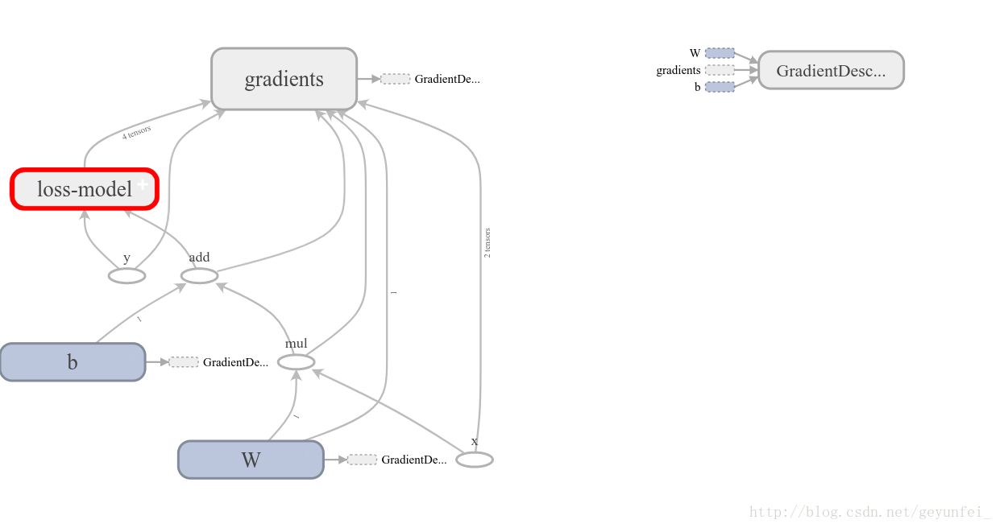

​

## Preface

This article mainly introduces how to use the TensorFlow primary API through a simple demo. Because I am also a beginner, the purpose of this article is to guide students who are new to TensorFlow or machine learning to learn TensorFlow from the first step. After reading this article, first confirm that you have the following basic skills:

- Can use Python programming (beginner is OK, in fact, TensorFlow also supports Java, C++, Go)

- Some knowledge related to arrays (as long as linear algebra is not forgotten)

- It is better to know some knowledge related to machine learning (Temporary Baidu, Google also have time)

## Basics

### Tensor

The calculations inside TensorFlow are all based on tensors, so we need to have an understanding of tensors first. Tensors are defined on top of scalars and vectors that we are familiar with. The detailed definition is more complicated. We can simply understand it as a multidimensional array:

```txt
3 # This 0-rank tensor is a scalar, shape=[]
[1., 2., 3.] # This rank 1 tensor is a vector, shape=[3]
[[1., 2., 3.], [4., 5., 6.]] # This rank 2 tensor is a two-dimensional array, shape=[2, 3]
[[[1., 2., 3.]], [[7., 8., 9.]]] # This third-order tensor is a three-dimensional array, shape=[2, 1, 3]
```

TensorFlow internally uses instances of the `tf.Tensor` class to represent tensors, and each `tf.Tensor` has two attributes:

- *dtype* The type of data stored by Tensor, which can be `tf.float32`, `tf.int32`, `tf.string`…

- *shape* The number of elements in each dimension of the multidimensional array stored by Tensor, such as shape in the above example

We can now take a look at Tensor with a few lines of code. Enter python or python3 in the command terminal to start a Python session, then enter the following code:

```python
# import tensorflow module
import tensorflow as tf

# Create an integer constant, a Tensor of order 0
t0 = tf.constant(3, dtype=tf.int32)

# Create a one-dimensional array of floating point numbers, that is, a rank 1 Tensor
t1 = tf.constant([3., 4.1, 5.2], dtype=tf.float32)

# Create a 2x2 array of strings, i.e. a rank 2 Tensor
t2 = tf.constant([['Apple', 'Orange'], ['Potato', 'Tomato']], dtype=tf.string)

# Create a 2x3x1 array, that is, a rank 3 tensor, and the default data type is integer
t3 = tf.constant([[[5], [6], [7]], [[4], [3], [2]]])

# Print several Tensors created above
print(t0)
print(t1)
print(t2)
print(t3)
```

The output of the above code is, pay attention to the type of `shape`:

```python
>>> print(t0)
Tensor("Const:0", shape=(), dtype=int32)
>>> print(t1)
Tensor("Const_1:0", shape=(3,), dtype=float32)
>>> print(t2)
Tensor("Const_2:0", shape=(2, 2), dtype=string)
>>> print(t3)
Tensor("Const_3:0", shape=(2, 3, 1), dtype=int32)
```

print a Tensor can only print out its attribute definition, but not its value. To view the value in a Tensor, you need to run it through the Session:

```python
>>> sess = tf.Session()
>>> print(sess. run(t0))
3
>>> print(sess. run(t1))
[ 3. 4.0999999 5.19999981]
>>> print(sess. run(t2))
[[b'Apple' b'Orange']
  [b'Potato' b'Tomato']]
>>> print(sess. run(t3))
[[[5]
   [6]
   [7]]
 
  [[4]
   [3]
   [2]]]
>>>
```

### Dataflow Graph

Data flow is a commonly used parallel computing programming model. The data flow graph is a directed graph composed of `nodes` and `edges`:

- **nodes(nodes)** represent computing units, which can also be the starting point of input or the end point of output

- **lines(edges)** represent input/output relationships between nodes

In TensorFlow, each node is represented by an instance of `tf.Tensor`, that is, the input and output of each node are Tensor, as shown in the figure below, the flow of Tensor in the Graph vividly shows the origin of the name TensorFlow


Dataflow graphs in TensorFlow have several advantages:

- **Parallel** Computing nodes are connected by clear lines, and the system can easily determine which computing operations can be executed in parallel

- **Distributable** Each node in the graph can be distributed in different computing units (CPU, GPU, TPU, etc.) or different machines, and the data generated by each node can be sent to the next node through a clear line

- **Optimizable** The XLA compiler in TensorFlow can optimize the code according to the data flow graph to speed up the operation

- **Portable** The information of the data flow graph can be saved without relying on the code, such as a graph created with Python, which can be used in C++ or Java after saving

### Sesssion

When we need to do some calculation operations in Python, we generally use NumPy. When NumPy does complex calculations such as matrix operations, it uses other languages ​​(C/C++) to implement these calculation logics to ensure the efficiency of calculations. However, frequent switching between multiple programming languages will also consume a certain amount of time. If it is only a stand-alone operation, the time-consuming may be negligible, but in distributed parallel computing, computing operations may be distributed in different CPUs, GPUs or even In different machines, these time-consuming may be more serious.
The underlying layer of TensorFlow is implemented in C++ to ensure computational efficiency, and the `tf.Session` class is used to connect the client program with the C++ runtime. The upper-level Python, Java and other codes are used to design and define the model, build the Graph, and finally pass it to the bottom layer for execution through the `tf.Session.run()` method.

### Build a computational graph

The above is the concept of TensorFlow and Graph, and the following describes how to use Tensor to build Graph.
Tensor can represent input and output endpoints, and can also represent computing units. The following code creates a Tensor that performs + operations on two Tensors:

```python
import tensorflow as tf

# Create two constant nodes
node1 = tf.constant(3.2)
node2 = tf.constant(4.8)

# Create an adder node and perform + operation on the above two nodes
adder = node1 + node2

# print the adder node
print(adder)

# Print the result of adder running
sess = tf.Session()
print(sess. run(adder))
```

The output of `print` above is:

> Tensor("add:0", shape=(), dtype=float32)
> 8.0

The Tensors created above using `tf.constant()` are all constants, and once created, the values in them cannot be changed. Sometimes we also need to input data from the outside. At this time, we can use `tf.placeholder` to create a placeholder Tensor, and the value of the placeholder Tensor can be input at runtime. The following is an example of creating a placeholder Tensor:

```python
import tensorflow as tf

# Create two placeholder Tensor nodes
a = tf.placeholder(tf.float32)
b = tf.placeholder(tf.float32)

# Create an adder node and perform + operation on the above two nodes
adder_node = a + b

# print three nodes
print(a)
print(b)
print(adder)

# Run it, the following dict parameter is to provide input data for the placeholder Tensor
sess = tf.Session()
print(sess. run(adder, {a: 3, b: 4.5}))
print(sess.run(adder, {a: [1, 3], b: [2, 4]}))
```

The output of the above code is:

> Tensor("Placeholder:0", dtype=float32)
> Tensor("Placeholder_1:0", dtype=float32)
> Tensor("add:0", dtype=float32)
> 7.5
> [ 3. 7.]

We can also add other operations to build complex Graphs

```python
# Add × operation
add_and_triple = adder * 3.
print(sess. run(add_and_triple, {a: 3, b: 4.5}))
```

The output of the above is

> 22.5

## TensorFlow application example

The above introduces some basic concepts in TensorFlow. Let's use a small example to understand how to use TensorFlow for machine learning.

### Build a model (Model)

The following are some experimental data we obtained from an experiment:

input | output
--- | ---
1 | 4.8
2 | 8.5
3 | 10.4
6 | 21
8 | 25.3

We can see these data more intuitively by putting them on a two-dimensional graph, as follows, these data are represented as some discrete points in the graph:


We need to derive a general model based on the existing data, through which we can predict the output value produced by other input values.
As shown in the figure below, the model we choose can be either a curve model represented by the red line that ghosts cannot understand, or a linear model represented by the blue line. In the analysis of probability statistics theory, the probability that these two models conform to the real model is the same.


According to **Occam's razor principle - if there are multiple assumptions consistent with observations, choose the simplest one**, the linear model represented by the blue line is more in line with our intuitive expectations.
If x represents the input and y represents the output, the linear model can be represented by the following equation:

> $y = W \times x + b$

Even if we choose the linear model, there are many models to choose from. The three straight lines in the figure below all seem to be a reasonable model, but they are different from the parameters. At this time, we need to design a loss model (loss model) to evaluate which model is more reasonable and find the most accurate model.


Each yellow line in the figure below represents the difference between the value calculated by the linear model and the actual output value:


We use $y\prime$ to represent the actual output obtained from the experiment, and use the following equation to represent our loss model:

> $loss=\displaystyle\sum_{n=1}^N(y_n−y\prime_n)^2$

Obviously, the smaller the loss model is, the more accurate our linear model is.

### Implement the model using TensorFlow

Above we established a linear model based on the experimental data, and designed a loss model for this linear model. The following describes how to implement the model we designed in TensorFlow.
In our linear model $y = W \times x + b$, the input $x$ can be represented by a placeholder Tensor, and the output $y$ can be represented by the output of the linear model. We need to constantly change $W$ and $ b$, to find a value that minimizes it. Here $W$ and $b$ can be represented by variable Tensor. Use `tf.Variable()` to create a variable Tensor, the following is the implementation code of our model:

```python
import tensorflow as tf

# Create variable W and b nodes, and set initial values
W = tf.Variable([.1], dtype=tf.float32)
b = tf.Variable([-.1], dtype=tf.float32)

# create x node for input data in experiment
x = tf.placeholder(tf.float32)

# Create a linear model
linear_model = W*x + b

# Create a y node to input the output data obtained in the experiment for loss model calculation
y = tf.placeholder(tf.float32)

# create loss model
loss = tf.reduce_sum(tf.square(linear_model - y))

# Create a Session to calculate the model
sess = tf.Session()
```

When creating a variable Tensor through `tf.Variable()`, you need to set an initial value, but this initial value cannot be used immediately. For example, in the above code, we use `print(sess.run(W))` to try to print `W`The value will get the following uninitialized exception

> tensorflow.python.framework.errors_impl.FailedPreconditionError: Attempting to use uninitialized value Variable

The variable Tensor needs to go through the following `init` process before it can be used:

```python
# Initialize variables
init = tf.global_variables_initializer()
sess. run(init)
```

After that, use `print(sess.run(W))` to print and you can see the initial value we assigned before:

> [0.1]

After the variables are initialized, we can run our linear model with the initial values `0.1` and `-0.1` set above for `W` and `b` to see the results:

```python
print(sess.run(linear_model, {x: [1, 2, 3, 6, 8]}))
```

The output is:

> [ 0. 0.1 0.20000002 0.5 0.69999999]

It seems that there is a big gap with the actual output of our experiment, let's run the loss model again:

```python
print(sess.run(loss, {x: [1, 2, 3, 6, 8], y: [4.8, 8.5, 10.4, 21.0, 25.3]}))
```

The loss value obtained is also large

> 1223.05

We can use `tf.assign()` to reassign `W` and `b` variables and check again:

```python
# assign new values to W and b
fixW = tf. assign(W, [2.])
fixb = tf. assign(b, [1.])

# The new value will take effect after run
sess. run([fixW, fixb])

# Revalidate the loss value
print(sess.run(loss, {x: [1, 2, 3, 6, 8], y: [4.8, 8.5, 10.4, 21.0, 25.3]}))
```

The output loss value is much smaller than before:

> 159.94

We need to constantly adjust the values ​​of the variables `W` and `b` to find `W` and `b` that minimize the loss value. This is definitely a very boring process, so TensorFlow provides a way to train the model, automatically helping us with these tedious training tasks.

### Use TensorFlow to train the model

TensorFlow provides many optimization algorithms to help us train the model. The simplest optimization algorithm is the **Gradient Descent** algorithm, which finds the minimum loss value by continuously changing the values ​​of the variables in the model.
The following code is to use the gradient descent optimization algorithm to help us train the model:

```python
# Create a gradient descent optimizer with a learning rate of 0.001
optimizer = tf.train.GradientDescentOptimizer(0.001)
train = optimizer. minimize(loss)

# Use two arrays to save the training data
x_train = [1, 2, 3, 6, 8]
y_train = [4.8, 8.5, 10.4, 21.0, 25.3]

# train 10000 times
for i in range(10000):
     sess.run(train, {x: x_train, y: y_train})

# print the training result
print('W: %s b: %s loss: %s' % (sess.run(W), sess.run(b), sess.run(loss, {x: x_train , y: y_train})))
```

The printed training results are as follows, and it can be seen that the loss value is already very small:

> W: [ 2.98236108] b: [ 2.07054377] loss: 2.12941

Let's sort out the previous code. The complete demo code is as follows. Save the following code in a demo.py file and execute it through `python3 demo.py` to see the training results:

```python
import tensorflow as tf

# Create variable W and b nodes, and set initial values
W = tf.Variable([.1], dtype=tf.float32)
b = tf.Variable([-.1], dtype=tf.float32)

# create x node for input data in experiment
x = tf.placeholder(tf.float32)

# Create a linear model
linear_model = W * x + b

# Create a y node to input the output data obtained in the experiment for loss model calculation
y = tf.placeholder(tf.float32)

# create loss model
loss = tf.reduce_sum(tf.square(linear_model - y))

# Create a Session to calculate the model
sess = tf.Session()

# Initialize variables
init = tf.global_variables_initializer()
sess. run(init)

# Create a gradient descent optimizer with a learning rate of 0.001
optimizer = tf.train.GradientDescentOptimizer(0.001)
train = optimizer. minimize(loss)

# Use two arrays to save the training data
x_train = [1, 2, 3, 6, 8]
y_train = [4.8, 8.5, 10.4, 21.0, 25.3]

# train 10000 times
for i in range(10000):
     sess.run(train, {x: x_train, y: y_train})

# print the training result
print('W: %s b: %s loss: %s' % (sess.run(W), sess.run(
     b), sess.run(loss, {x: x_train, y: y_train})))
```

## TensorFlow advanced training model

`tf.estimator` is an advanced library provided by TensorFlow, which provides many commonly used training models, which can simplify many training processes in machine learning, such as:

- run the training loop

- run evaluation loop

- Manage training datasets

### Evaluate the model

In the previous demo, we built a linear model. By using a set of experimental data to train our linear model, we obtained an optimal model that we think has the smallest loss. According to the training results, our optimal model can be expressed as the following equation :

> $y=2.98x+2.07$

But will this model we think is optimal always be optimal? We need to **assess (evaluate)** the **generalization performance** of the model through some new experimental data. If the new experimental data is applied to this model, the loss value is smaller, then the model The better the generalization performance is, the worse it will be. In the following demo we will also see how to evaluate the model.

### Using LinearRegressor

Earlier we built a linear model and obtained a linear regression equation through training. The linear regression training model `tf.estimator.LinearRegressor` is also provided in `tf.estimator`. The following code is the method of using `LinearRegressor` to train and evaluate the model:

```python
# We will use NumPy to process various training data
import numpy as np
import tensorflow as tf

# Create a list of eigenvectors with only one eigenvector in the feature list,
# The feature vector is a real vector, an array with only one element, and the element name is x,
# We can also create other more complex feature lists
feature_columns = [tf.feature_column.numeric_column("x", shape=[1])]

# Create a LinearRegressor trainer and pass in a list of feature vectors
estimator = tf.estimator.LinearRegressor(feature_columns=feature_columns)

# save training data
x_train = np.array([1., 2., 3., 6., 8.])
y_train = np.array([4.8, 8.5, 10.4, 21.0, 25.3])

# save data for evaluation
x_eavl = np.array([2., 5., 7., 9.])
y_eavl = np.array([7.6, 17.2, 23.6, 28.8])

# Create an input model with training data for subsequent model training
# The first parameter is used as the input data of the linear regression model
# The second parameter is used as the input of the linear regression model loss model
# The third parameter batch_size indicates the number of each batch of training data
# The fourth parameter num_epochs is the number of epochs, and all the data in the training set are trained once for 1 epoch
# The lower five parameters shuffle is to take the training data sequentially or randomly
train_input_fn = tf.estimator.inputs.numpy_input_fn(
     {"x": x_train}, y_train, batch_size=2, num_epochs=None, shuffle=True)

# Then use the training data to create an input model for later model evaluation
train_input_fn_2 = tf.estimator.inputs.numpy_input_fn(
     {"x": x_train}, y_train, batch_size=2, num_epochs=1000, shuffle=False)

# Create an input model with evaluation data for later model evaluation
eval_input_fn = tf.estimator.inputs.numpy_input_fn(
     {"x": x_eavl}, y_eavl, batch_size=2, num_epochs=1000, shuffle=False)

# Use the training data to train 1000 times
estimator. train(input_fn=train_input_fn, steps=1000)

# Use the original training data to evaluate the model, the purpose is to view the training results
train_metrics = estimator.evaluate(input_fn=train_input_fn_2)
print("train metrics: %r" % train_metrics)

# Use the evaluation data to evaluate the model, the purpose is to verify the generalization performance of the model
eval_metrics = estimator.evaluate(input_fn=eval_input_fn)
print("eval metrics: %s" % eval_metrics)
```

Running the above code outputs:

> train metrics: \{'loss': 1.0493528, 'average_loss': 0.52467638, 'global_step': 1000\}
> eval metrics: \{'loss': 0.72186172, 'average_loss': 0.36093086, 'global_step': 1000\}

The loss of the evaluation data is smaller than that of the training data, indicating that our model generalization performance is very good.

### Custom Estimator model

The `tf.estimator` library provides many predefined training models, but it is possible that these training models cannot meet our needs, and we need to use our own built models.
We can build our own training model by implementing a subclass of `tf.estimator.Estimator`, `LinearRegressor` is a subclass of `Estimator`. In addition, we can also only provide a `model_fn` implementation for the `Estimator` base class, defining our own model training, evaluation methods and methods for calculating losses.
The following code is an example of implementing a custom `Estimator` using the linear model we first built.

```python
import numpy as np
import tensorflow as tf

# Define the model training function, and also define the feature vector
def model_fn(features, labels, mode):
     # Build a linear model
     W = tf.get_variable("W", [1], dtype=tf.float64)
     b = tf.get_variable("b", [1], dtype=tf.float64)
     y = W * features['x'] + b
     # build loss model
     loss = tf.reduce_sum(tf.square(y - labels))
     # training model subgraph
     global_step = tf. train. get_global_step()
     optimizer = tf.train.GradientDescentOptimizer(0.01)
     train = tf.group(optimizer.minimize(loss),
                      tf. assign_add(global_step, 1))
     # Specify our training subgraph positive loss model via EstimatorSpec
     return tf.estimator.EstimatorSpec(
         mode=mode,
         predictions=y,
         loss=loss,
         train_op=train)
    
# Create a custom training model
estimator = tf.estimator.Estimator(model_fn=model_fn)

# The following training logic is the same as using LinearRegressor
x_train = np.array([1., 2., 3., 6., 8.])
y_train = np.array([4.8, 8.5, 10.4, 21.0, 25.3])

x_eavl = np.array([2., 5., 7., 9.])
y_eavl = np.array([7.6, 17.2, 23.6, 28.8])

train_input_fn = tf.estimator.inputs.numpy_input_fn(
     {"x": x_train}, y_train, batch_size=2, num_epochs=None, shuffle=True)

train_input_fn_2 = tf.estimator.inputs.numpy_input_fn(
     {"x": x_train}, y_train, batch_size=2, num_epochs=1000, shuffle=False)

eval_input_fn = tf.estimator.inputs.numpy_input_fn(
     {"x": x_eavl}, y_eavl, batch_size=2, num_epochs=1000, shuffle=False)

estimator. train(input_fn=train_input_fn, steps=1000)

train_metrics = estimator.evaluate(input_fn=train_input_fn_2)
print("train metrics: %r" % train_metrics)

eval_metrics = estimator.evaluate(input_fn=eval_input_fn)
print("eval metrics: %s" % eval_metrics)
```

The output of the above code is

> train metrics: \{'loss': 0.8984344, 'global_step': 1000\}
> eval metrics: \{'loss': 0.48776609, 'global_step': 1000\}

### TensorBoard

In order to facilitate the modeling and tuning of TensorFlow, Google has also developed a visual tool for TensorFlow: TensorBoard. After slightly modifying the code of our first Demo, we can use TensorBoard to understand the training process of TensorFlow more intuitively.

```python
import tensorflow as tf

# Set the name when creating a node for easy identification in the graph
W = tf.Variable([0], dtype=tf.float32, name='W')
b = tf.Variable([0], dtype=tf.float32, name='b')

# Set the name when creating a node for easy identification in the graph
x = tf.placeholder(tf.float32, name='x')
y = tf.placeholder(tf.float32, name='y')

# linear model
linear_model = W * x + b

# The loss model is hidden in the loss-model module
with tf.name_scope("loss-model"):
     loss = tf.reduce_sum(tf.square(linear_model - y))
     # Add scalar to the output of the loss model to observe the convergence curve of loss
     tf.summary.scalar("loss", loss)

optmizer = tf.train.GradientDescentOptimizer(0.001)

train = optmizer. minimize(loss)

x_train = [1, 2, 3, 6, 8]
y_train = [4.8, 8.5, 10.4, 21.0, 25.3]

sess = tf.Session()
init = tf.global_variables_initializer()
sess. run(init)

# Call merge_all() to collect all operation data
merged = tf.summary.merge_all()

# All data generated by model running is saved to /tmp/tensorflow folder for TensorBoard to use
writer = tf.summary.FileWriter('/tmp/tensorflow', sess.graph)

# train 10000 times
for i in range(10000):
     # Pass in merge during training
     summary, _ = sess. run([merged, train], {x: x_train, y: y_train})
     # Collect the data generated by each training
     writer. add_summary(summary, i)

curr_W, curr_b, curr_loss = sess.run(
     [W, b, loss], {x: x_train, y: y_train})

print("After train W: %s b %s loss: %s" % (curr_W, curr_b, curr_loss))
```

After running the above code, the data generated during the training process will be saved in the /tmp/tensorflow folder. We can run the following command on the command line terminal to start TensorBoard:

```shell
# Set the directory where we store the training data via the --logdir parameter
$ tensorboard --logdir /tmp/tensorflow
```

Then open the `http://localhost:6006` page in the browser to see our model data.
First, on the **SCALARS** page, we can see the loss convergence curve we set through `tf.summary.scalar("loss", loss)`. From the graph, we can see that the loss is about 2000 times after training. It has almost converged.


On the **GRAPHS** page, you can see the data flow diagram of the model we built:



Among them, the loss model is folded into the loss-model module. Double-click the module to expand the content of the loss model:


– end –

The above is the introductory demo when I first learned TensorFlow. If you want to have a deeper understanding of TensorFlow, you can refer to the following website:

- [Official Website](https://www.tensorflow.org/)

- [Official Chinese website](https://tensorflow.google.cn/)

- [Chinese document translated by domestic enthusiasts](http://wiki.jikexueyuan.com/project/tensorflow-zh/)

---
This article is the original article of CSDN blogger "Ge Yunfei", and the reprint is only for self-study.
Original link: <https://blog.csdn.net/geyunfei_/article/details/78782804>
