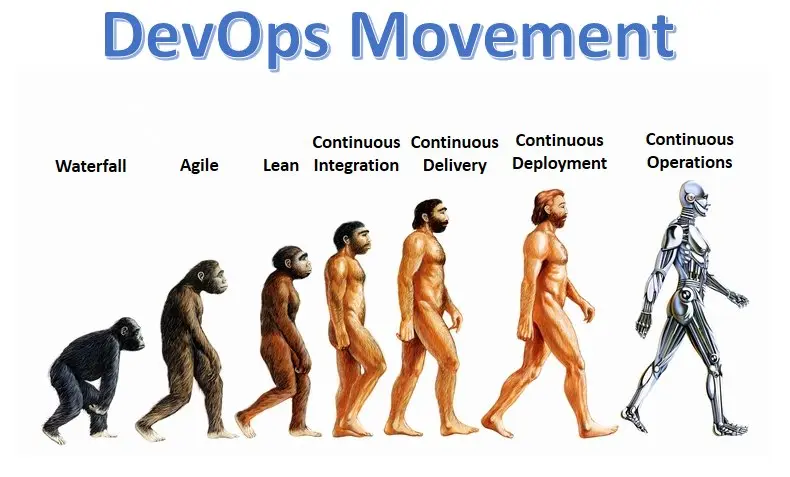
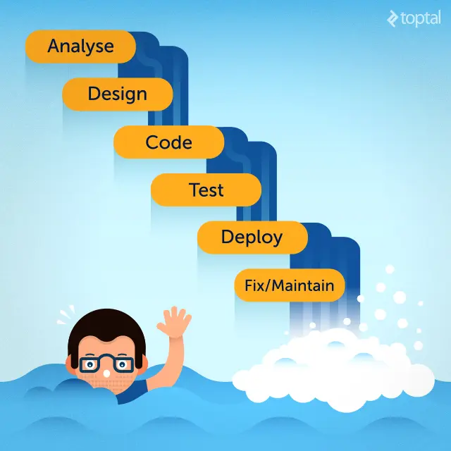
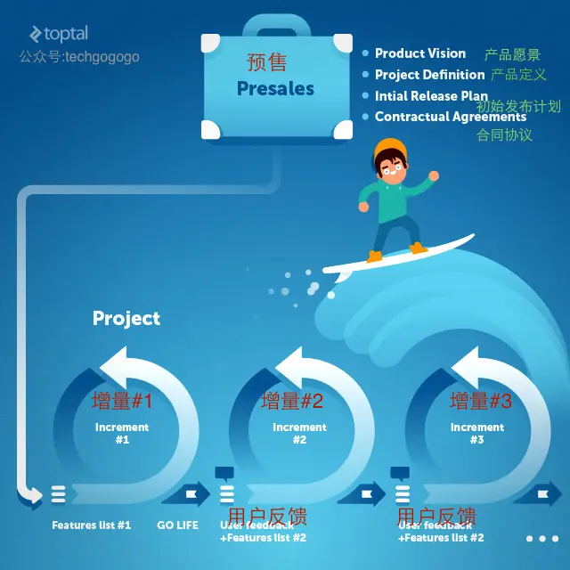

​

## Recap history

In order to better understand what `DevOps` is, it is very necessary for us to review the history of the existence of the title of programmer (*no developer, front-end engineer, back-end engineer, etc.*) at that time.

As stated in **The Way of Programming**:

The older generation of programmers was mysterious and esoteric. We cannot fathom their thoughts, all we can do is describe their appearance.

- awake like a fox swimming across the water

- Be vigilant like a general on the battlefield

- Friendly like a hostess serving guests

- Pure as a piece of raw wood

- as deep as a dark pool of water in a deep cave

> Programmers developed machine language, machine language produced assembly language, assembly language produced compilers, and today there are countless languages. Each language has its own humble use. Every language expresses the yin and yang of software. Every language has its place in the Tao.

Back then, most offices of software programmers were still called laboratories, and programmers were still called scientists. In order to develop a good set of software, programmers must have a deep understanding of all the issues related to the application they need. They must clearly know where the software is applied and what system the software must run on. Essentially, programmers have a thorough understanding of all aspects of the software to be developed, from specification writing, to software development, to testing, to deployment, to technical support.

After a while, the greedy nature of humans (clients) kicks in and they start asking for more. More speed, more features, more users, more of everything.

As humble, humble, and calm creatures, our older generation of programmers will have a hard time surviving this explosive demand-seeking. The best way to win is to evolve into different new species in different directions. Soon, the title of programmer began to disappear in the rivers and lakes, and more new species called developers, software engineers, network administrators, database developers, web developers, system architects, test engineers, etc. began to be born. . Rapid evolution and quick adaptation to the challenges of the outside world became part of their DNA. These new races can evolve in a matter of weeks. Web developers can quickly evolve into back-end developers, front-end developers, PHP developers, Ruby developers, Angular developers... there are so many that make people look sideways.

Soon they all forgot the fact that they all originated from the common ancestor of programmers, and that there was such a simple and peaceful scientist who wanted to make the world a better place. Then they began to keep their swords at arm's length, claiming that they were the pure-blood heirs of the "programmer".

As time passed, various schools and factions began to monopolize the hilltops, rarely communicating and interacting, and only communicating when they had to. They began to no longer cheer for the success of their distant siblings of the same origin, and they no longer even sent a postcard from time to time to greet each other.

But when they look up at the starry sky in the middle of the night, they will still find that the programmer genes deep in their hearts are still flickering, hoping that this flickering spark can illuminate the entire galaxy and bring peace.

In this selfish and self-centered race to conquer the world, the children and grandchildren of programmers have long forgotten their real work goals-**solving problems for customers**. Faced with delayed project delivery dates, expensive development costs, and even failed projects, customers began to hate this situation.

Occasionally, a shining star will step forward and offer a way to try to end the chaos and bring peace. So the waterfall development process came into being. This is a really cool idea because it takes advantage of the fact that developers on different teams only communicate when they have to. When a team completes their work, it communicates with the downstream team and passes the task down, so that it is passed down one level after another, never looking back.

This worked for a while, but soon, as always, greedy people (clients) started asking for more. They hope to be able to participate more in the entire software development process, put forward their suggestions from time to time, and even put forward such crazy things as changing requirements at a very late stage.

As a result, it has become accepted as an industry standard that software projects are prone to failure, as everyone has seen. Statistics show that more than 50% of projects end in failure. What's even more tragic is that, at the time, it seemed that there was nothing people could do about the situation.

Fortunately, in every era, there are always a few open-minded heroes who emerge like fireflies in the dark. They knew that these different teams of developers had to find a way to work together, communicate, and flexibly assure customers that each other would get the best solution. This kind of attempt can be traced back to 1957, the efforts of the great John von Neumann and colleagues. But in the end, we did not reap the fruits of the revolution until 2001, when more than a dozen elites in the industry created the now world-famous "**Agile Manifesto**".

The Agile Manifesto is based on the following twelve principles:

- Our top priority is to satisfy customers through early and continuous delivery of measurable software.

- Be open to changing requirements, even late in development. Agile processes are able to harness change to gain a competitive advantage for customers.

- Deliver working software frequently, with as short an interval as possible, which can range from a few weeks to a few months.

- Business people and developers have to work together day and night throughout the project development period.

- Build projects around motivated people. Give them the environment and support they need, and trust them to get the job done.

- The fastest and most efficient way to convey information to and within the development team is through face-to-face conversations.

- Working software is the main measure of progress.

- Agile process promotes sustainable development. Contributors, developers, and users should always work together to maintain a steady pace of development.

- To enhance agility, there should be a constant focus on technical excellence and good design.

- Simplicity - the art of maximizing unnecessary effort - is critical.

- The best architectures, requirements, and designs emerge from self-organizing teams.

- Teams should periodically reflect on how they can become more effective, and then shift and adjust their behavior accordingly.

The Agile Manifesto is an important first step in bringing peace to the galaxy and maintaining the balance of each. For a long time, compared to the previous process-based and mechanized methods, this is the first time that different key project stakeholders are connected based on culture and "humanity". People started talking to each other, had basic meet-and-greet meetings, and started exchanging opinions and perspectives constantly. They began to realize that they had more in common than they imagined, and customers began to become one of them, instead of just throwing money at the project and praying to God and Buddha to pray for everything to go well. .

Although there are still many obstacles to overcome, the future is much brighter. Agile means being open and embracing (requirements) change. However, if there are too many changes, it becomes difficult for people to focus on the end goal and delivery. This is when lean software development began to break ground.

Because of the fascination with lean software development and in order to achieve exile and drive away risks, some descendants of programmers began to look out the window and began to learn from industries other than software. They found salvation in a major automaker. The achievements of the Toyota Production System in lean are incredible, and their **lean production** experience is easily applied to software development.

Lean has the following 7 principles:

- Eliminate waste

- Built-in quality

- Create Knowledge (Amplified Learning)

- Delay decision (delay decision as much as possible)

- fast delivery

- Respect people (team empowerment)

- Global optimization

Putting this into Agile, Lean principles can allow people to mentally focus on doing the right thing, while also allowing the entire development process to be flexible enough.

Once agile and lean software development has been adopted by software development teams, the next step is to apply this set of principles to IT teams. Incorporate IT into the overall strategy, and then we come to DevOps!

## Entering DevOps - The Three Lanes of the Highway

Old school software development team members would include business analysts, system architects, front-end developers, back-end developers, testers, and so on. It is in these places that optimization of software development processes such as Agile and Lean principles is concerned. For example, once the software reaches the level of "production", it will be sent to the hands of "operation and maintenance personnel" such as system engineers, release engineers, DBAs, network engineers, and security experts. How to bridge the gap between Dev (development) and Ops (operation and maintenance) here is the main focus of DevOps.

> DevOps is the result of implementing Lean principles throughout the IT value stream. The IT value stream extends development to production, uniting all descendants of the distant ancestor of the programmer.

This is the best analysis of DevOps from Gene Kim, if you haven't read his "Phoenix Project" book, I suggest you really take the time to read it.

You shouldn't be rehiring DevOps engineers, and DevOps shouldn't be a new department of IT. DevOps is a culture, a concept, and it is integrated with IT. There is no tool in the world that can turn your IT into a DevOps organization, and there is no automated way to guide you how to maximize the benefits for your customers.

DevOps is usually known as the following three ways, but in my eyes I see them as three lanes on a highway. You start in the first lane, accelerate into the second lane, and end up in the third lane at high speed.

- **Lane 1** – Overall efficiency considerations at the system level are the primary focus, over any individual element of the system

- **Lane 2** – Make sure there is a continuous feedback loop that doesn't go unnoticed.

- **Lane 3** – Continuous learning and learning, continuous improvement, and fast failure.

### Lane 1 - get speed

To adopt the principles of DevOps, understanding the importance of the entire operating system and properly prioritizing work items is the first thing organizations must learn. No one can be allowed to create a bottleneck in the entire value stream and slow down the entire workflow.

Ensuring uninterruptible workflow is the ultimate goal of all members involved in the process. Regardless of a member or team's role, they must strive to develop a deep understanding of the system as a whole. This way of thinking has a direct impact on quality, since defects are never sent "downstream", doing so would cause bottlenecks.

Ensuring that the entire workflow is not bottlenecked is not enough. A productive organization should always consider how to improve the entire workflow. There are many methodologies to do this, you might want to look at "Theory of Constraints", "Six Sigma", Lean, or the Toyota Production System.

DevOps principles don't care what team you're on, whether you're a system architect, DBA, QA, or network administrator. The same rules cover all members, and each member should follow two simple principles:

- Keep system operation process uninterrupted

- Improve and optimize workflow at any time

### Lane 2 - Shift to Accelerate

Uninterruptible system flow is directed and expected to flow from development to operations. In an ideal world, this means quickly developing high-quality software, deploying it, and delivering value to customers.

However, DevOps is not a utopian ideal country. If unidirectional delivery was possible, our waterfall model would have been up to the task. Evaluating the deliverable and communication throughout the process is critical to ensuring quality. The first "upstream facing" communication channel that must be implemented here is from Ops to Dev.

It's very easy for us to masturbate on our own, but getting feedback from others and giving feedback to others is the right way to find out the truth. Every downstream step (feedback) must be followed by an upstream determination.

It doesn't matter how you set up the feedback loop. You can invite developers to join meetings with the technical support team, or put network administrators in sprint planning meetings. Once you have a feedback mechanism in place and feedback is received and processed, you can be said to be on the DevOps highway.

### Lane 3 – Fast forward

The DevOps fast track is not for the faint of heart. In order to enter this lane, your organization must be sufficiently mature. It is full of adventure and learning from failures, continuous attempts, and the recognition that repeated failures and continuous practice are the prerequisites for the road to success. You should hear the word "routine" a lot here, and there's a reason for that. Constant practice and repetition produces masters because it routineizes complex movements.

But before you can connect these complex movements, it is very necessary for you to master each individual step.

> "A movement suitable for a master is not suitable for a novice. Before reborn, you must first understand the true meaning of Tao."

The third way/fast lane of DevOps involves allocating time each day to continuously experiment, rewarding teams for taking risks from time to time, and intentionally introducing bugs into operational systems to increase the system's resilience.

In order to ensure that your organization can absorb these methods, you must establish frequent feedback loops between each team, and at the same time, you need to ensure that all bottlenecks can be cleaned up in a timely manner, and ensure that the operation of the entire system is uninterruptible. of.

Implementing these measures can keep your organization vigilant and able to respond to challenges quickly and efficiently.

## Summary - DevOps Checklist

Below is a checklist you can use to examine your organization's adoption of DevOps. Of course, you can also give your point of view in the comments of the article.

- There is no barrier between the development team and the operation and maintenance team. Both are part of a unified DevOps process.

- Work that flows from one team to another can be verified with high quality

- There is no backlog of work, all bottlenecks have been taken care of.

- The development team does not occupy the time of the operation and maintenance team, because deployment and maintenance are in the same time box.

- The development team will not deliver the code for deployment after 5 pm on Friday, and the operation and maintenance team will work overtime on weekends to wipe their ass

- The development environment is standardized, and operation and maintenance personnel can easily expand and deploy it

- The development team can find a suitable way to deliver new versions, and the operation and maintenance team can easily deploy.

- Clear lines of communication between each team

- All team members have time to experiment and practice to improve the system

- Routinely introduce (or simulate) defects into the system and get them resolved. Every learning experience should be documented and shared with relevant personnel. Incident handling becomes part of the routine and the handling is known

## Summarize

Using modern DevOps tools such as Chef, Docker, Ansible, Packer, Troposphere, Consul, Jenkins, SonarQube, AWS, etc. does not mean that you are applying DevOps principles correctly. DevOps is a way of thinking. All of us are part of the process of the system, we share a common time and deliver value together. Each member participating in this software delivery process can speed up or slow down the operation speed of the whole system. A single flaw in the system, and a misconfigured "firewall" between teams, can bring down the entire system,

All people are part of DevOps, and once your organization understands this, the tools and technology stacks that can help you manage this will naturally appear in front of you.

---
Original link: <https://www.cnblogs.com/jetzhang/p/6068773.html>
