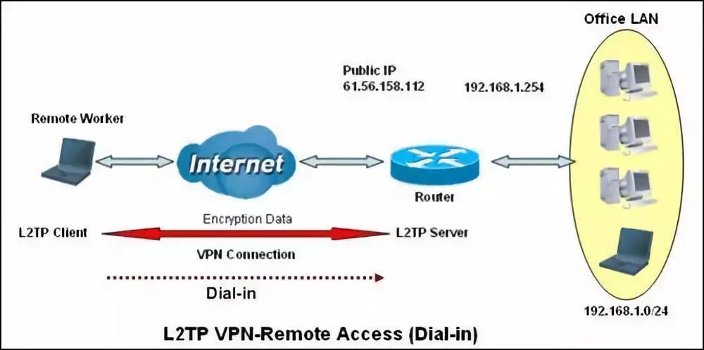

​

I bought a vps in linode's Japanese computer room very early on, and set up an l2tp vpn service on the server. It is normal to connect with a mobile phone, but win10 can't connect.

After searching on Baidu on the Internet, I still couldn't connect to various settings, and then shelved it. Today, Chrome reminded me to upgrade. I remembered this again, but I still didn’t give up. After searching again, I finally tried it out. In fact, it’s very simple. The steps are as follows:

1. Click Start, click Run, type "regedit" and click OK

2. Locate and click the following registry subkey: HKEY_LOCAL_MACHINE\System\CurrentControlSet\Services\Rasman\Parameters

3. On the Edit menu, click New -> DWORD Value

4. In the Name box, type "ProhibitIpSec"

5. In the Value data box, type "1" and click OK

    

6. Locate and click the following registry subkey: HKEY_LOCAL_MACHINE\SYSTEM\CurrentControlSet\Services\PolicyAgent

7. On the Edit menu, click New -> DWORD Value

8. In the Name box, type "AssumeUDPEncapsulationContextOnSendRule"

9. In the Value data box, type 2 and click OK

    

10. Exit the Registry Editor and restart the computer

**Note: Only the local test passed, not guaranteed to be effective for everyone, good luck to everyone!**

Let's popularize VPN knowledge by the way (mainly because the number of words is too small to apply for originality)

- VPN: A Virtual Private Network is a method of establishing a secure communication tunnel between the Internet and an institution's network. BiPAC 6402R3 supports three types of VPN: IPSec, PPTP and L2TP.

- IPSec VPN refers to a VPN technology that uses the IPSec protocol to achieve remote access. IPSec is a security standard framework defined by the Internet Engineering Task Force (IETF) to provide end-to-end encryption and authentication services for public and private networks . The IPsec protocol is not a separate protocol. It provides a complete set of architecture for network data security on the IP layer, including network authentication protocols AH, ESP, IKE, and some algorithms for network authentication and encryption.

- PPTP refers to encapsulating PPP (Point-to-Point Protocol) frames into IP packets and sending them through IP networks, such as the Internet or other enterprise-specific intranets. The PPTP protocol assumes that there is a connected and available IP network between the two peers of PPTP, that is to say, PPTP VPN is a functional network based on the established basic network. If the PPTP client itself is already part of an IP network, it can be connected to the PPTP server through the IP network.

- L2TP (Layer Two Tunneling Protocol, Layer Two Channel Protocol) is a kind of VPDN (Virtual Private Dial-up Network) technology, which is specially used for the channel transmission of the second layer data, that is, the second layer data frame, such as point-to-point Protocol (PPP) data frames are encapsulated in IP or UDP payloads to smoothly pass through packet-switched networks (such as the Internet) and reach their destinations, thereby logically connecting two separated physical networks directly.
