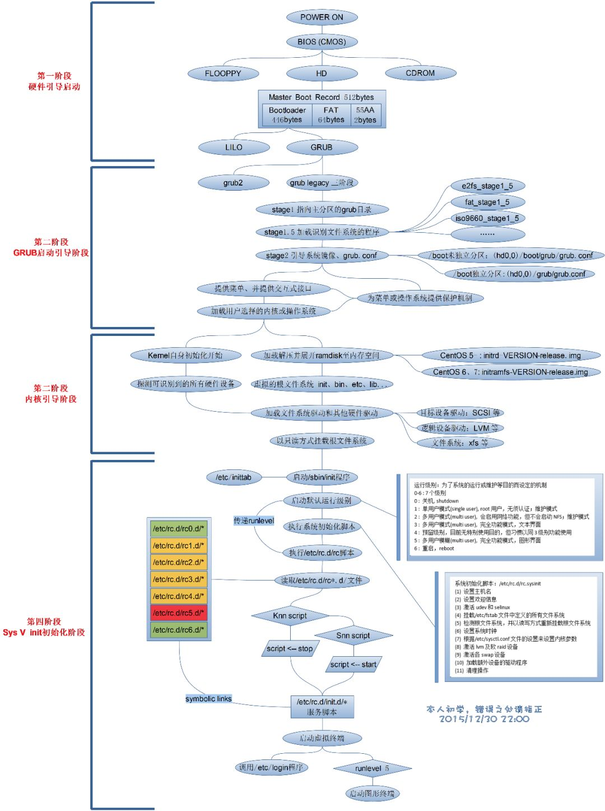

​



The main process of Centos booting is as follows:

1. Find the system boot partition, execute the boot program, and load the kernel

2. Execute the init program

    a. /etc/rc.d/rc.sysinit # The first script executed by init

    b. /etc/rc.d/rc \$RUNLEVEL # $RUNLEVEL is the default running mode, and the running level of the server is 3

    c. /etc/rc.d/rc.local #After the corresponding level of service is started, execute the file (in fact, you can also write the commands that need to be executed into the file)

    d. /sbin/mingetty # Wait for user login

In Redhat/Centos, /etc/rc.d/rc.sysinit mainly does the same initialization work in each operating mode, including:

- Import keymap and system fonts

- start swapping

- set hostname

- Set NIS domain name

- Check (fsck) and mount the file system

- open quota

- Load sound card modules, set system clock, etc.

/etc/rc.d/rc executes the scripts in the corresponding directory according to the operation mode specified by its parameters (operation level, which you can set in the inittab file). Those starting with Kxx are called with stop as a parameter; all things starting with Sxx are called with start as a parameter. The order of calling is executed according to xx from small to large. (where xx is a number, indicating the startup sequence) For example, assuming that the default operating mode is 3, /etc/rc.d/rc will call the /etc/rc.d/rc3.d/ under the above method script.

It is worth mentioning that the running modes 2, 3, and 5 in Redhat/Centos all use /etc/rc.d/rc.local as the last one in the initialization script, so users can add some required After other initialization work, log the command executed before. (This question is raised, see the following: rc.local is not necessarily the last executed script)

> rwxrwxrwx 1 root root 11 Apr 12 14:26 S99local -> ../rc.local

After init waits for /etc/rc.d/rc to be executed (because the action of /etc/rc.d/rc in /etc/inittab is wait), it will run /sbin/mingetty on each specified virtual terminal, Wait for the user to log in. At this point, the startup of LINUX is over.

The Linux system has 7 operating levels, and their respective meanings are:

- Level 0 shut down the system

- Level 1 single user mode

- Level 2 multi-user mode without network

- Level 3 with networked multi-user mode

- Level 4 System Reserved

- Level 5 multi-user mode with network and graphics

- Level 6 reboot system

In centos, rc.local should not be the last startup script.

The centos operation level is 3, and there are two files, S99local and S99smartd, in /etc/rc3.d.

```shell
lrwxrwxrwx 1 root root 11 Apr 12 14:26 S99local -> ../rc.local
lrwxrwxrwx 1 root root 16 Apr 12 14:26 S99smartd -> ../init.d/smartd
```

According to the startup rules (the sequence of startup is related to the number after the file name S, the larger the number, the later the startup sequence), rc.local is executed before smartd. In order to verify this conjecture, add the following to the two scripts respectively the two statements of

```shell
echo "rc.local" `date` >> /test
echo "smartd" `date`>> /test
```

/test results are:

```shell
smartdThu Jun 20 17:43:56 CST 2013
rc.localThu Jun 20 17:45:21 CST 2013
smartdThu Jun 20 17:45:21 CST 2013
```

It can be found that smartd is executed twice, once when shutting down, and once after rc.local is executed. rc.local is not necessarily the last executed script, although the following comments are given in rc.local:

```shell
#!/bin/sh

#
# This script will be executed *after* all the other init scripts.
# You can put your own initialization stuff in here if you don't
# want to do the full Sys V style init stuff.

touch /var/lock/subsys/local
```

When the file name in rc3.d starts with S, the startup parameter passed in is start; when the file name in rc3.d starts with S, the startup parameter passed in is stop. The system executes the kill script (starting with S) first, and then executes the start script (starting with S).
