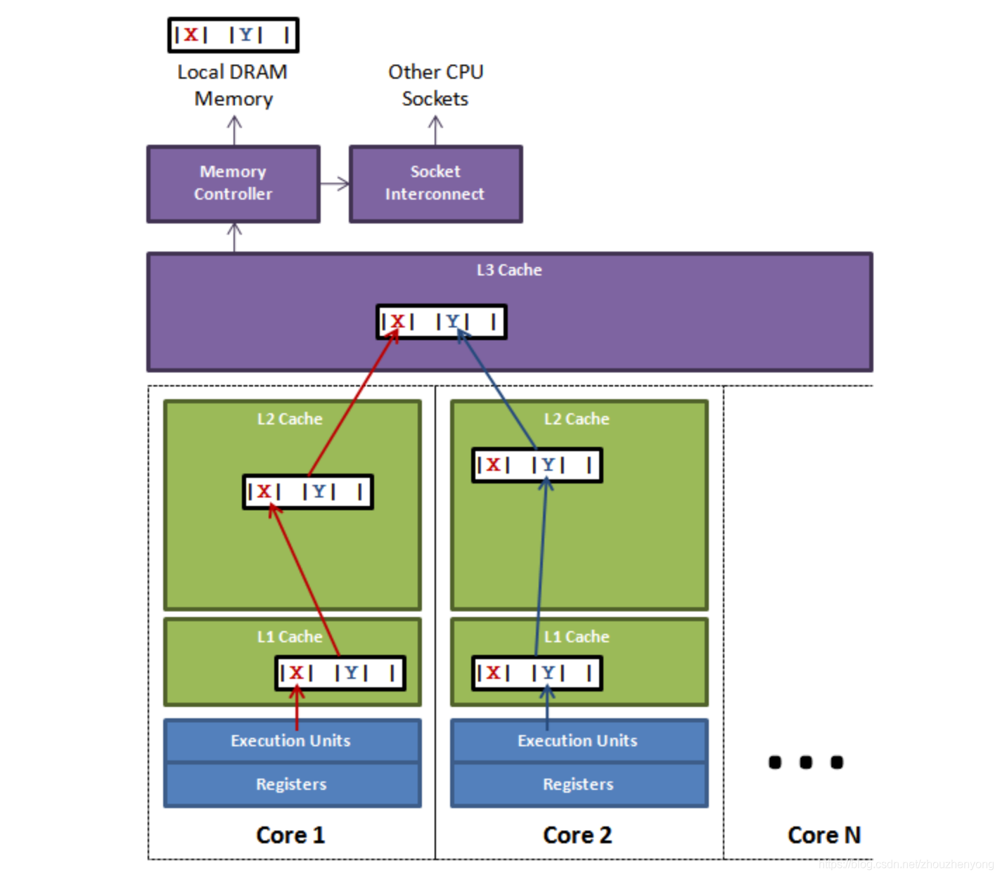
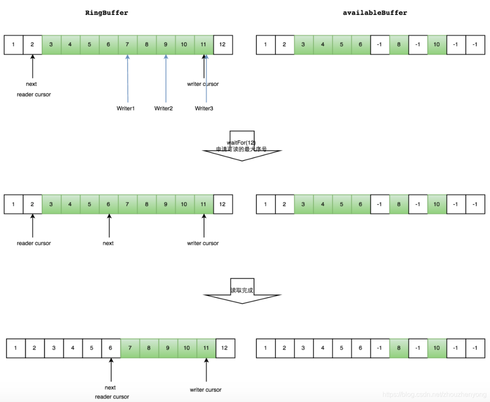

​

## 1. Background

### 1. Source

Disruptor is a high-performance queue developed by LMAX, a British foreign exchange trading company. The original intention of the research and development is to solve the delay problem of the internal memory queue, rather than the distributed queue. The single thread of the system developed based on Disruptor can support 6 million orders per second. After giving a speech at QCon in 2010, it gained the attention of the industry.

### 2. Application background and introduction

According to the current data, the well-known projects using Disruptor include the following: Storm, Camel, Log4j2, and the current Meituan Dianping technical team also has many applications, or some of them borrowed from its design mechanism.
Disruptor is a high-performance framework for asynchronous communication between threads, that is, message passing between multiple threads in the same JVM process.

## 2. Traditional queue problem

First of all, the queue mentioned here is also limited to the message queue inside Java

Queues | Boundedness | Locks | Structures | Queue Types
--- | --- | --- | --- | ---
ArrayBlockingQueue | Bounded | Locked | Array | Blocked
LinkedBlockingQueue | optional | locking | linked list | blocking
ConcurrentLinkedQueue | unbounded | lock-free | linked list | non-blocking
LinkedTransferQueue | unbounded | lock-free | linked list | blocking
PriorityBlockingQueue | Unbounded | Locked | Heap | Blocked
DelayQueue | Unbounded | Locked | Heap | Blocked

The underlying data structure of the queue is generally divided into three types: array, linked list and heap. Among them, the heap here is to implement a queue with priority characteristics, which is not considered for the time being.
In a system with particularly high stability and performance requirements, in order to prevent the producer from being too fast and causing memory overflow, only bounded queues can be selected; at the same time, in order to reduce the impact of Java garbage collection on system performance, array/ Data structure in heap format. After filtering in this way, only ArrayBlockingQueue is the eligible queue. However, ArrayBlockingQueue guarantees thread safety by locking, and ArrayBlockingQueue also has false sharing problems. These two problems seriously affect performance.
Among them, we will first introduce the two ways that affect performance: locking and false sharing. The locking method and the non-locking CAS method will not be introduced here. We will first explain the pseudo-sharing problem here.

### 1. False sharing concept

#### share

Computers have long supported multi-core, and more and more software supports multi-core operation. In fact, it can also be called multi-processing operation. One processor corresponds to one physical socket. One of the slots corresponds to one L3 Cache, and one slot contains multiple cpus. A cpu includes registers, L1 Cache, and L2 Cache, as shown in the following figure:


The closer to the cpu, the faster the speed and the smaller the capacity. Among them, L1 and L2 can only be shared by one CPU, but L3 can be shared by CPUs in the same slot, and the main memory can be shared by all CPUs, which is memory sharing.
The process of the cpu performing calculations is as follows: first go back to L1 to find the corresponding data, if not, then go to L2, L3, if not, then go to the main memory to get it, the longer the road, the longer it will take, The performance will be lower.
It should be noted that when sharing data between threads, the data needs to be written back to the main memory, and another thread obtains new data by accessing the main memory.
Some people will ask, will there be some non-main memory caches shared between multiple threads, then will another thread directly access the memory before modification? The answer is yes, but one thing is that we can set the cache invalidation strategy for this kind of data to ensure that the cache is up-to-date. This instruction is to prohibit the reordering of the cpu. The data before the barrier cannot appear after the barrier, and the processing after the barrier cannot appear before the barrier, that is, the data obtained after the barrier is the latest). Corresponding to the application level is a keyword volatile, There will be some introductions below.

#### cache line

The cache invalidation just mentioned actually refers to the invalidation of the Cache line, that is, the cache line. The Cache is composed of many Cache lines, and the size of each cache line is 32~128 bytes (usually 64 bytes). We assume here that the cache line is 64 bytes, and a Java Long type is 8 bytes. In this case, a cache line can store 8 Long type variables, as shown in the following figure:


Every time the CPU fetches data from main memory, it stores adjacent data into the same cache line. Assuming that when we access an array corresponding to a Long memory, if one of them is loaded into the memory, then the corresponding next 7 data will also be loaded into the corresponding cache line, so that the data will be accessed very quickly.

#### Pseudo-Sharing

Just now we said that the invalidation of the cache is actually the invalidation of the cache line. What is the principle of the invalidation of the cache line? This also involves a MESI protocol (cache consistency protocol). We will not introduce this here. We only need to know that this will be in a When the data in the cache changes, all other caches (actually cache lines) that store the cache will be invalidated. If you are interested, you can read the appendix. First, let’s use the very classic diagram in Disruptor to explain pseudo-sharing. :



The figure above shows a slot with multiple cpus inside. If the thread on cpu1 updates the variable X, according to the MESI protocol, all the cache lines corresponding to the variable X will be invalidated (note: although the change is X, But X and Y are put into the same cache line, and they are invalid together), at this time, if the thread in cpu2 reads the variable Y and finds that the cache line is invalid, it will search up according to the cache search strategy if it wants to get Y. During this period, the thread corresponding to cpu1 does not access X after updating X (that is, the cache line is not refreshed), and the thread of cpu2 can only obtain data from the main memory, which will have a great impact on performance. This is false sharing.
On the surface, both X and Y are operated by independent threads, and there is no relationship between the two operations. It's just that they share a cache line, but all contention conflicts come from sharing.

### 2. The false sharing problem of ArrayBlockingQueue

We have just talked about the problem of false sharing, so where does the false sharing problem of ArrayBlockingQueue exist? Let’s analyze some of the core source code

```java
public void put(E e) throws InterruptedException {
     checkNotNull(e);
     final ReentrantLock lock = this. lock;
     // Get the current object lock
     lock. lockInterruptibly();
     try {
         while (count == items. length)
             //Block and release the lock, waiting for notFull.signal() notification
             notFull. await();
         // put data into array
         enqueue(e);
     } finally {
         lock. unlock();
     }
}
```

```java
private void enqueue(E x) {
     final Object[] items = this.items;
     //putIndex is the subscript of the queue
     items[putIndex] = x;
     if (++putIndex == items. length)
         putIndex = 0;
     count++;
     notEmpty. signal();
}
```

```java
public E take() throws InterruptedException {
     final ReentrantLock lock = this. lock;
     // lock
     lock. lockInterruptibly();
     try {
         while (count == 0)
             //Block and release the object lock, and wait for notEmpty.signal() notification
             notEmpty. await();
         //if the data is not empty
         return dequeue();
     } finally {
         lock. unlock();
     }
}
```

```java
private E dequeue() {
     final Object[] items = this.items;
     //takeIndex is the subscript of the queue
     E x = (E) items[takeIndex];
     items[takeIndex] = null;
     if (++takeIndex == items. length)
         takeIndex = 0;
     count--;
     if (itrs != null)
         itrs. elementDequeued();
     notFull. signal();
     return x;
}
```

The three core member variables are

- **putIndex**: Enter the subscript
- **takeIndex**: Subscript out of the team
- **count**: the number of elements in the queue

And the positions of the three members are as follows:


These three variables are easy to put in the same cache line. For this reason, a false sharing detection tool is specially used for detection. At present, the only tool for detecting false sharing is Intel's Intel Vtune. It has just been found that there is a mac os version, but after testing, it is found that This tool cannot analyze the processor configuration of macOs. When using it, I found the following error "Unable to detect the supported processor configuration". This can be left to other students. For the installation and use of the tool, you can check another link in the appendix .

## Three, high performance principle

I just talked about the two performance problems of the above queue: one is locking and the other is false sharing, so how does the disruptor solve these two problems, and besides solving these two problems, what other advanced things have been introduced? performance-enhancing.
Here is a brief list:

- **Introduce a circular array structure**: Array elements will not be recycled, avoiding frequent GC,
- **Lock-free design**: CAS lock-free method is adopted to ensure the safety of threads
- **Attribute padding**: By adding extra useless information, avoid false sharing problems
- **Element Position Positioning**: Use the same method as consistent hashing, an index, for self-increment

### 1. Ring array structure

The ring array structure is the core of the entire Disruptor.
First of all, because it is an array, it is faster than a linked list, and according to our explanation of the above cache line, we know that when an element in the array is loaded, the adjacent array elements will also be preloaded, so in such a structure, the CPU does not need From time to time, go to main memory to load the next element in the array. Moreover, you can pre-allocate memory for the array, so that the array object will always exist (unless the program terminates). This means that there is no need to spend a lot of time on garbage collection. In addition, unlike a linked list, a node object needs to be created for each object added to it—correspondingly, when a node is deleted, a corresponding memory cleanup operation needs to be performed. The elements in the ring array are overwritten to avoid jvm GC.
Secondly, the structure is a ring, and the size of the array is 2 to the nth power, so that element positioning can be done more efficiently through bit operations, which is somewhat similar to the ring strategy in consistent hashing. In the disruptor, this awesome ring structure is RingBuffer. Since it is an array, it has a size, and the size must be 2 to the nth power. The structure is as follows:


Its essence is just an ordinary array, but when the data is placed to fill the queue (that is, reach the 2^n-1 position), and then fill the data, it will start from 0 and overwrite the previous data, so it is equivalent to a ring.

### 2. Production and consumption modes

According to the above ring structure, let's analyze the working principle of the Disruptor in detail.
Disruptor is not like a traditional queue, which is divided into a queue head pointer and a queue tail pointer, but has only one subscript (seq above), so how does this ensure that the produced messages will not overwrite the unconsumed messages.
In Disruptor, producers are divided into single producer and multi-producer, while consumers are not distinguished. In the case of a single producer, ordinary producers place data in the RingBuffer, and consumers obtain the maximum consumable position and consume. When there are multiple producers, there is an additional Buffer of the same size as the RingBuffer, called AvailableBuffer. In multi-producers, each producer first obtains the writable space through CAS competition, and then slowly puts data in it. If consumers want to consume data at this time, then each consumer needs to obtain the maximum available space. Consumption subscript, this subscript is the longest continuous sequence subscript obtained from AvailableBuffer.

#### Multi-producer --produce

Assume that two more producers start writing data, and through CAS competition, w1 gets 34 spaces, and w2 gets 78 spaces, of which 6 represents data that has been written or not consumed.


Green represents the data that has been written OK

#### Multi-Producer-Consumer

Assuming that the three producers are writing and have not set the AvailableBuffer, then the consumption subscript that the consumer can obtain can only obtain 6, and then after the producer writes OK, the consumer is notified, and the consumer continues to repeat the above step. As shown below



#### Common waits for consumers

- **BusySpinWaitStrategy**: Spin wait, similar to the spin lock used by the Linux Kernel. Low latency but at the same time it takes up a lot of CPU resources.
- BlockingWaitStrategy: Use locks and condition variables. The CPU resource usage is small, the delay is large, and the default waiting strategy is used.
- **SleepingWaitStrategy**: After several unsuccessful loop attempts, choose to give up the CPU and wait for the next scheduling. If it is still unsuccessful after multiple scheduling, sleep for a nanosecond before trying again. This strategy balances latency and CPU resource usage, but the latency is uneven.
- **YieldingWaitStrategy**: After several unsuccessful loop attempts, choose to yield the CPU and wait for the next adjustment. The delay and CPU resource usage are balanced, but the delay is also relatively uniform.
- **PhasedBackoffWaitStrategy**: A combination of the above strategies, with less CPU resource usage and greater delay

### 3. Awesome subscript pointer

The pointer (Sequence) of RingBuffer belongs to a volatile variable, and it is also one of the reasons why we can implement Disruptor without lock operation, and it avoids the false sharing problem by supplementing the cache line. The so-called pointer is to obtain the next writable or readable data by means of continuous self-increment. The data is of Long type, so there is no need to worry about it will explode. Someone has calculated: [The range of long can reach up to 9223372036854775807, 365*24*60*60 = 31536000 seconds a year, 1W pieces of data are generated per second, and can also be used for 292 years](https://link.jianshu.com/?t=https://github.com/LMAX-Exchange/disruptor/issues/154#event-671348970).

```java
class LhsPadding{
     //Complete the cache line to improve the cache hit rate
     protected long p1, p2, p3, p4, p5, p6, p7;
}

class Value extends LhsPadding{
     protected volatile long value;
}

class RhsPadding extends Value{
     //Complete the cache line to improve the cache hit rate
     protected long p9, p10, p11, p12, p13, p14, p15;
}

public class Sequence extends RhsPadding{
     ...
}
```

## 4. Usage

The usage is very simple, there are three roles in total: producer, consumer, disruptor object

### 1. Simple usage

#### disruptor object

The disruptor has two construction methods

```java
public Disruptor(
         final EventFactory<T> eventFactory, // data entity construction factory
         final int ringBufferSize, // queue size, must be a power of 2
         final ThreadFactory threadFactory, // thread factory
         final ProducerType producerType, // producer type, single producer or multiple
         final WaitStrategy waitStrategy){ // consumer waiting strategy
     ...
}

public Disruptor(
     final EventFactory<T> eventFactory,
     final int ringBufferSize,
     final ThreadFactory threadFactory){
     ...
}
```

#### Production Processing

The producer has no fixed object here, just needs to get the location where the data is placed, and then publish

```java
public void send(String data){
     RingBuffer<MsgEvent> ringBuffer = this.disruptor.getRingBuffer();
     //Get the next position to place data
     long next = ringBuffer. next();
     try {
         MsgEvent event = ringBuffer. get(next);
         event. setValue(data);
     } finally {
         //Publish event
         ringBuffer. publish(next);
     }
}
```

#### Consumption Processing

Consumption processing can be as follows

```java
public EventHandlerGroup<T> handleEventsWith(final EventHandler<? super T>... handlers){
     ...
}
public EventHandlerGroup<T> handleEventsWith(final EventProcessor...processors){
     ...
}
public EventHandlerGroup<T> handleEventsWith(final EventProcessorFactory<T>... eventProcessorFactories){
     ...
}
public EventHandlerGroup<T> handleEventsWithWorkerPool(final WorkHandler<T>... workHandlers){
     ...
}
```

#### Simple use case

```java
//consumer
public class MsgConsumer implements EventHandler<MsgEvent>{
     private String name;
     public MsgConsumer(String name){
         this.name = name;
     }
     @Override
     public void onEvent(MsgEvent msgEvent, long l, boolean b) throws Exception {
         System.out.println(this.name+" -> received message: "+msgEvent.getValue());
     }
}

//producer processing
public class MsgProducer {
     private Disruptor disruptor;
     public MsgProducer(Disruptor disruptor){
         this. disruptor = disruptor;
     }

     public void send(String data){
         RingBuffer<MsgEvent> ringBuffer = this.disruptor.getRingBuffer();
         long next = ringBuffer. next();
         try {
             MsgEvent event = ringBuffer. get(next);
             event. setValue(data);
         } finally {
             ringBuffer. publish(next);
         }
     }

     public void send(List<String> dataList){
         dataList.stream().forEach(data -> this.send(data));
     }
}

//trigger test
public class DisruptorDemo {
     @Test
     public void test(){
         Disruptor<MsgEvent> disruptor = new Disruptor<>(MsgEvent::new, 1024, Executors. defaultThreadFactory());

         //Define the consumer
         MsgConsumer msg1 = new MsgConsumer("1");
         MsgConsumer msg2 = new MsgConsumer("2");
         MsgConsumer msg3 = new MsgConsumer("3");

         //Binding configuration relationship
         disruptor. handleEventsWith(msg1, msg2, msg3);
         disruptor. start();

         // Define the data to send
         MsgProducer msgProducer = new MsgProducer(disruptor);
         msgProducer.send(Arrays.asList("nihao","hah"));
     }
}
```

Output (consumed in no fixed order):

```java
1 -> received message: nihao
3 -> Received message: nihao
3 -> Message received: hah
2 -> received message: nihao
2 -> Message received: hah
1 -> Message received: hah
```

### 2. Other usages

The above mainly introduces multi-consumption unified consumption, but there are many types in the producer model, as follows, one-to-one, one-to-many, many-to-many, many-to-one


1. A single producer produces data and a single consumer consumes data, which is generally used in the business logic of background processing.
2. A single producer produces data, and multiple consumers consume data (there are two situations: the same message can be consumed by multiple consumers separately. Or multiple consumers form a group, and one consumer consumes one data ).
3. Multiple producers produce data, and a single consumer consumes data, which can be used in scenarios such as current limiting or queuing for processing by a single resource.
4. Multiple producers produce data separately, and multiple consumers consume data (there are two situations: the same message can be consumed by multiple consumers separately. Or multiple consumers form a group, and one consumer consumes a data).

#### Producer configuration

Among them, the single-producer mode and multi-producer mode in the production mode are mainly distinguished by an enumeration: ProduceType. It is recommended that multiple producers use the multi-producer mode, and the performance will be better.

#### Consumer configuration

There are two types of consumer models:

- **Unified consumption**: Each consumer consumes a piece of data produced by the producer
- **Group consumption**: The data produced by each production is only consumed once

Unified consumption can be used as in the simple usage above. For group consumption, use the function handleEventsWithWorkerPool

```java
/**
  * Group processing handleEventWithWorkerPool
  */
@Test
public void test1(){
     Disruptor<MsgEvent> disruptor = new Disruptor(MsgEvent::new, 1024, Executors. defaultThreadFactory());
     disruptor. handleEventsWithWorkerPool(new MyWorkHandler("work1"), new MyWorkHandler("work2"));

     disruptor. start();

     MsgProducer msgProducer = new MsgProducer(disruptor);
     msgProducer.send(Arrays.asList("aaa","bbb"));
}
```

output:

```java
work1 : MsgEvent(value=bbb)
work2 : MsgEvent(value=aaa)
work1 : MsgEvent(value=cc)
work2 : MsgEvent(value=dd)
```

#### Consumption order configuration

In the consumption configuration, there can be many consumption methods, such as:

##### 1. Sequential consumption of consumers

```java
/**
  * Test sequential consumption
  * After consumers 1 and 3 consume each message, consumer 2 will continue to consume
  */
@Test
public void test2(){
     MsgConsumer msg1 = new MsgConsumer("1");
     MsgConsumer msg2 = new MsgConsumer("2");
     MsgConsumer msg3 = new MsgConsumer("3");

     Disruptor<MsgEvent> disruptor = new Disruptor(MsgEvent::new, 1024, Executors. defaultThreadFactory());
     disruptor.handleEventsWith(msg1, msg3).then(msg2);
     disruptor. start();

     MsgProducer msgProducer = new MsgProducer(disruptor);
     msgProducer.send(Arrays.asList("aaa", "bbb", "ccc", "ddd"));
}
```

Output (inside is according to the consumer order of each message):

```java
1 -> received message: aaa
3 -> Received message: aaa
1 -> Received message: bbb
1 -> Received message: ccc
2 -> Received message: aaa
3 -> Received message: bbb
3 -> Received message: ccc
3 -> Message received: ddd
1 -> Message received: ddd
2 -> Received message: bbb
2 -> Received message: ccc
2 -> Message received: ddd
```

##### 2. Consumption is divided into multiple branches, and there is also a problem of consumption order

```java
/**
  * Test multi-branch consumption
  * Consumer 1 and consumer 3 have a branch line, consumer 2 and consumer 4 have a branch line, after consumer 3 and consumer 4 consume, consumer 5 will continue to consume
  */
@Test
public void test3(){
     MsgConsumer msg1 = new MsgConsumer("1");
     MsgConsumer msg2 = new MsgConsumer("2");
     MsgConsumer msg3 = new MsgConsumer("3");
     MsgConsumer msg4 = new MsgConsumer("4");
     MsgConsumer msg5 = new MsgConsumer("5");

     //Branches: consumer 1 and consumer 3
     disruptor. handleEventsWith(msg1, msg3);
     //Branches: consumer 2 and consumer 4
     disruptor. handleEventsWith(msg2, msg4);
     // After consumer 3 and consumer 4 are executed, point to consumer 5
     disruptor.after(msg3, msg4).handleEventsWith(msg5);
     disruptor. start();

     MsgProducer msgProducer = new MsgProducer(disruptor);
     msgProducer.send(Arrays.asList("aaa", "bbb", "ccc", "ddd"));
}
```

```java
1 -> received message: aaa
2 -> Received message: aaa
2 -> Received message: bbb
3 -> Received message: aaa
3 -> Received message: bbb
4 -> Received message: aaa
4 -> Received message: bbb
5 -> Received message: aaa
1 -> Received message: bbb
5 -> Received message: bbb
```

## 5. Frequently Asked Questions

Below are some frequently asked questions.

**1. How should the disruptor be used to maximize its effectiveness?**

The disruptor is originally an event-driven design, and its entire architecture is very different from ordinary multi-threading. For example, in one usage, the disruptor is used as business processing with I/O processing in the middle. This method is slower than multi-threading; on the contrary, if the disruptor is used for business processing, nio asynchronous calls are used when I/O is required, and the disruptor consumption is not blocked. After the I/O asynchronous call returns, the follow-up processing will be re-stuffed into the disruptor queue in the callback method. It can be seen that this is a typical event processing architecture, and it can indeed take advantage of time. In addition, ringBuffer's inherent Several performance optimizations allow the disruptor to play its best role.

**2. What if the buffer is often full?**

One is to increase the size of the buffer, and the other is to solve the problem of the large speed difference between the producer and the consumer from the source, such as trying to divide the producer, or using multiple disruptors to make the load of each disruptor smaller.

**3. When to use disruptor?**

It can be considered if the need for latency is high.

## 6. Reference

official git
<https://github.com/LMAX-Exchange/disruptor>
<https://lmax-exchange.github.io/disruptor/>
False sharing:
<https://mechanical-sympathy.blogspot.com/2011/07/false-sharing.html>
memory barrier:
<http://in355hz.iteye.com/blog/1797829>
MESI (Cache Consistency Protocol)
<https://www.cnblogs.com/cyfonly/p/5800758.html>
ArrayBlockingQueue false sharing problem
<https://www.jianshu.com/p/71c9bc3bfe1a>
jdk itself handles false sharing
<https://www.cnblogs.com/Binhua-Liu/p/5620339.html>
Intel vtune analysis false sharing case
<https://software.intel.com/zh-cn/vtune-amplifier-cookbook-false-sharing>
Working principle of RingBuffer
<https://www.jianshu.com/p/71c9bc3bfe1a>
<http://wiki.jikexueyuan.com/project/disruptor-getting-started/the-framework.html>
<https://www.jianshu.com/p/d6375295fad4>
<http://colobu.com/2014/12/22/why-is-disruptor-faster-than-ArrayBlockingQueue/>
<https://blog.csdn.net/kobejayandy/article/details/18329583>
<https://blog.csdn.net/u014313492/article/details/42556341>
How Disruptors Work
<http://in355hz.iteye.com/blog/1797829>
Various scenarios for queues
<http://www.uml.org.cn/zjjs/2016060310.asp>
consumption order
<http://357029540.iteye.com/blog/2395677>

---
This article is the original article of CSDN blogger "Old Persimmon", and the reprint is only for self-study.
Original link: <https://blog.csdn.net/zhouzhenyong/article/details/81303011>
